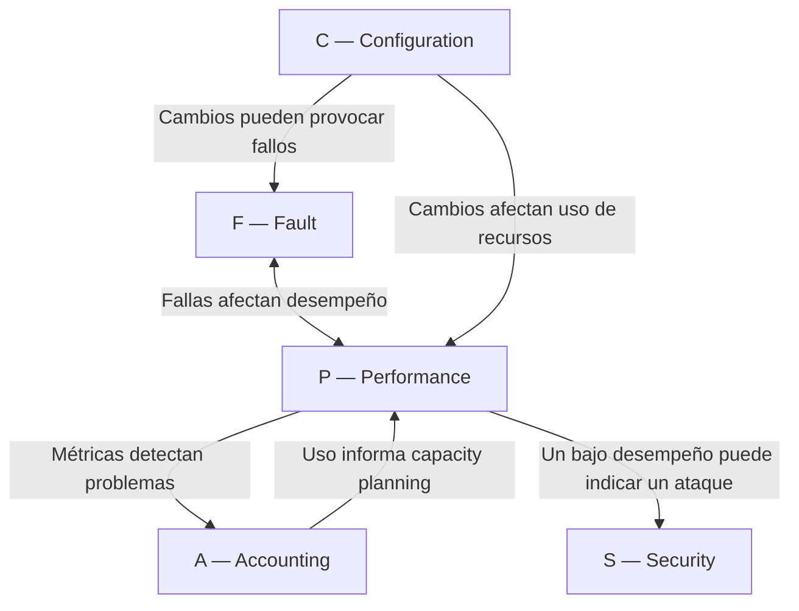

# Sinopsis: Framework FCAPS

## ¿Qué es FCAPS?

**FCAPS** es el marco de referencia estándar internacional para organizar y estructurar las funciones de administración de redes. Fue desarrollado por la **ITU-T** (Unión Internacional de Telecomunicaciones) como parte del modelo **TMN** (Telecommunications Management Network).

---

## Las 5 Áreas Funcionales

  F  │  Fault Management         
  C  │  Configuration Management 
  A  │  Accounting Management    
  P  │  Performance Management   
  S  │  Security Management      

---

### F — Fault Management (Gestión de Fallas)
**Objetivo:** Minimizar el tiempo de inactividad de la red

**Funciones clave:**
- 🔍 Detección automática de problemas
- 📍 Aislamiento del origen de la falla
- 📝 Registro de incidentes (tickets)
- 🔧 Corrección del problema
- ✅ Verificación de la solución

**Métricas:** MTBF, MTTR, Disponibilidad (99.9%+)

**Herramientas:** SNMP, Syslog, Nagios, Zabbix, PRTG, Prometheus

---

### C — Configuration Management (Gestión de Configuración)
**Objetivo:** Control total sobre dispositivos y cambios

**Funciones clave:**
- 📦 Inventario de dispositivos y software
- ⚙️ Gestión de parámetros de configuración
- 🔄 Control de versiones y cambios
- 💾 Backups automáticos
- 📊 Aprovisionamiento estandarizado

**Beneficios:** Rollback rápido, auditoría, cumplimiento normativo

**Herramientas:** Git, Ansible, Puppet, Chef, RANCID, NetBox

---

### A — Accounting Management (Gestión de Contabilidad)
**Objetivo:** Medición y control del uso de recursos

**Funciones clave:**
- 📊 Medición de ancho de banda por usuario/aplicación
- ⏱️ Registro de tiempo de conexión
- 💾 Volumen de datos transferidos
- 💰 Facturación interna (chargeback/showback)
- 📈 Capacity planning basado en tendencias

**Aplicaciones:** Costos, planificación, SLA enforcement

**Herramientas:** NetFlow, sFlow, IPFIX, ntopng, nfdump, ElasticFlow

---

### P — Performance Management (Gestión de Desempeño)
**Objetivo:** Garantizar calidad de servicio y cumplir SLAs

**Funciones clave:**
- ⚡ Monitoreo de latencia (RTT)
- 📶 Medición de throughput
- 📉 Detección de packet loss
- 🔀 Análisis de jitter
- 📊 Utilización de recursos

**Golden Signals (Google SRE):** Latency, Traffic, Errors, Saturation

**Herramientas:** ping, iperf3, mtr, Smokeping, Grafana, Prometheus

---

### S — Security Management (Gestión de Seguridad)
**Objetivo:** Proteger confidencialidad, integridad y disponibilidad

**Funciones clave:**
- 🔐 Control de acceso (autenticación/autorización)
- 🛡️ Protección perimetral (firewalls, IDS/IPS)
- 🔒 Cifrado de datos (TLS, IPsec)
- 📝 Auditoría y logs de seguridad
- 🚨 Respuesta a incidentes

**Defensa en profundidad:** Múltiples capas de seguridad

**Herramientas:** Firewalls, Snort, Suricata, OSSEC, SIEM, 802.1X

---

## Interrelación de las Áreas

---

**Ejemplo integrado:** Ante un ataque DDoS:
- **S** (Security): IDS detecta tráfico anómalo
- **F** (Fault): Sistema crea ticket automático
- **P** (Performance): Monitoreo muestra degradación
- **C** (Configuration): Aplica ACL de bloqueo
- **A** (Accounting): NetFlow identifica origen

---

## Beneficios del Framework FCAPS

✅ **Organización clara** de responsabilidades
✅ **Procesos estandarizados** y reproducibles
✅ **Visibilidad integral** de la infraestructura
✅ **Gestión proactiva** vs reactiva
✅ **Lenguaje común** entre equipos y organizaciones
✅ **Base para certificaciones** (ITIL, COBIT)

---

## Implementación Práctica

### Fases Recomendadas

**Fase 1 - Fundamentos** (Meses 1-3)
- ✅ Monitoreo básico (Fault + Performance)
- ✅ Backup de configuraciones

**Fase 2 - Optimización** (Meses 4-6)
- ✅ Automatización con Ansible/Puppet
- ✅ NetFlow/sFlow para accounting

**Fase 3 - Madurez** (Meses 7-12)
- ✅ SIEM y respuesta a incidentes
- ✅ Capacity planning avanzado
- ✅ Automatización con IA/ML

### Herramientas por Área

| Área | Open Source | Comercial |
|------|-------------|-----------|
| **F** Fault | Nagios, Zabbix, Icinga | SolarWinds, PRTG |
| **C** Configuration | Ansible, Git, RANCID | Cisco Prime, NetBox |
| **A** Accounting | ntopng, nfdump, pmacct | SolarWinds NTA, Plixer |
| **P** Performance | Prometheus, Grafana, Smokeping | AppDynamics, Dynatrace |
| **S** Security | Snort, Suricata, OSSEC | Palo Alto, Fortinet, Splunk |

---

## Evolución del Framework

### FCAPS Tradicional → FCAPS Moderno

**Limitaciones del modelo original:**
- 🕰️ Diseñado para redes tradicionales (no cloud)
- 🐌 Enfoque reactivo
- 🏢 Centrado en infraestructura (no en usuario final)
- 📊 Métricas técnicas (no de negocio)

**Nuevas tendencias:**
- ☁️ **Cloud-native**: SaaS, IaaS, contenedores
- 🤖 **AIOps**: Machine Learning para detección predictiva
- 📱 **User Experience Monitoring**: Métricas desde perspectiva del usuario
- 🔄 **DevOps/NetOps**: Automatización e infraestructura como código
- 📊 **Observability**: Traces + Logs + Metrics (más allá de monitoring)

### eTOM: FCAPS para Operadores

**eTOM** (Enhanced Telecom Operations Map) del TM Forum extiende FCAPS:
- Agrega procesos de negocio
- Incluye gestión de clientes
- Mapea Fulfillment, Assurance, Billing

---

## Relación con Estándares

**ITU-T:**
- M.3000 series - TMN Overview
- M.3010 - TMN Principles  
- M.3400 - Management Functions

**ISO/IEC:**
- ISO 7498-4 - OSI Management Framework
- ISO 10164 - Systems Management

**TM Forum:**
- eTOM - Enhanced Telecom Operations Map
- ITIL - IT Infrastructure Library (complementario)

---

## Aplicación en el Curso

Cada tema de la Unidad 1 profundiza en un área FCAPS:

| Subtema | Área FCAPS | Enfoque |
|---------|------------|---------|
| **1.1** | F - Fault | Detección, diagnóstico, resolución de fallas |
| **1.2** | C - Configuration | Inventario, versionamiento, automatización |
| **1.3** | A - Accounting | NetFlow, medición de uso, costos |
| **1.4** | P - Performance | Métricas, SLAs, capacity planning |
| **1.5** | S - Security | Controles, políticas, respuesta a incidentes |

---

## Resumen Ejecutivo

**FCAPS** es el marco de referencia estándar para administración de redes que divide las funciones en 5 áreas:

1. **Fault**: Mantener disponibilidad detectando y resolviendo fallas
2. **Configuration**: Controlar cambios y mantener consistencia
3. **Accounting**: Medir uso de recursos y optimizar costos
4. **Performance**: Garantizar calidad de servicio y cumplir SLAs
5. **Security**: Proteger la infraestructura con defensa multicapa

**Valor:** Proporciona estructura universal, lenguaje común y procesos probados para operar redes complejas de manera eficiente y profesional.

**Vigencia:** Aunque diseñado en los 90s, FCAPS sigue vigente integrándose con tecnologías modernas (cloud, IA, automatización).

---

## Conceptos Clave para Recordar

- **FCAPS = Framework, no herramienta** (es metodología)
- **Las 5 áreas están interrelacionadas** (no son silos)
- **Implementación gradual** (no todo a la vez)
- **Adaptable a cualquier escala** (desde SOHO hasta ISP)
- **Base para madurez operacional** (nivel 1 a nivel 5)
- **Complementa otros frameworks** (ITIL, COBIT, ISO 27001)

---

## Próximos Pasos

Después de comprender el framework FCAPS completo, profundizaremos en cada área:

➡️ **Siguiente:** 1.1 Gestión de Fallas (Fault Management)
- Técnicas de monitoreo
- Protocolos de detección (SNMP, ICMP)
- Sistemas de tickets
- Análisis de root cause
- Herramientas prácticas

---

**Referencias:**
- ITU-T Recommendations M.3000 series
- ISO/IEC 7498-4 OSI Management Framework
- TM Forum eTOM Framework
- Clemm, Alexander. "Network Management Fundamentals"
- Stallings, William. "SNMP, SNMPv2, SNMPv3, and RMON 1 and 2"
