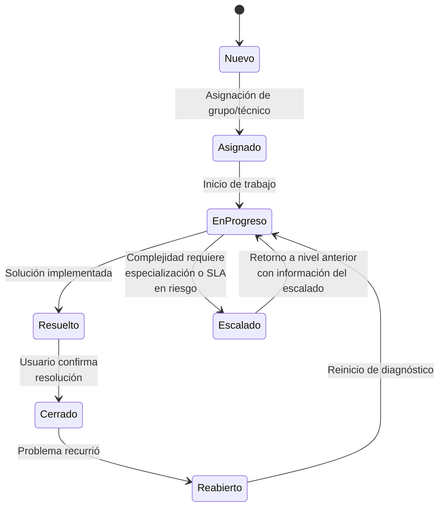

# 1.1 Administración de Fallas

La administración de fallas es un proceso fundamental en la gestión de infraestructuras de red que permite mantener los servicios operativos a los niveles de disponibilidad acordados con los usuarios y clientes. Este componente es crítico para garantizar la continuidad del negocio y minimizar el impacto de incidentes en las operaciones.

## Objetivos principales

- **Detectar incidentes** de forma temprana mediante monitoreo proactivo
- **Registrar y clasificar** fallas para establecer prioridades de resolución
- **Diagnosticar causas raíz** utilizando metodologías estructuradas
- **Resolver problemas** dentro de los tiempos acordados (SLA)
- **Prevenir recurrencia** mediante análisis y mejora continua
- **Mantener disponibilidad** según niveles de servicio comprometidos

## Componentes clave

### Detección

La **detección** es el primer y más crítico eslabón en la cadena de administración de fallas. Una detección temprana y precisa determina la velocidad de respuesta ante incidentes y puede ser la diferencia entre una interrupción menor y una falla catastrófica del servicio.

#### Conceptos Fundamentales: Error, Problema y Falla

Es esencial distinguir estos tres términos que frecuentemente se usan de manera intercambiable pero tienen significados técnicos específicos:

##### **Error (Error/Fault)**

**Definición:** Evento puntual que representa una condición anormal o inesperada en un componente de red, pero que **NO necesariamente afecta el servicio** de forma perceptible.

**Características:**
- Ocurrencia única o esporádica
- Puede ser transitorio y autocorregirse
- No siempre requiere intervención inmediata
- Puede no tener impacto visible en usuarios finales
- Se registra para análisis de tendencias

**Ejemplos prácticos:**
- Un paquete descartado por congestión temporal en un enlace
- Una retransmisión TCP ocasional debido a latencia
- Un CRC error en un frame Ethernet aislado
- Un intento fallido de autenticación RADIUS (timeout momentáneo)
- Fluctuación breve de temperatura en un switch (dentro de rangos normales)

**Gestión:** Los errores se **monitorizan** mediante contadores SNMP, syslog y herramientas de análisis. No generan alertas críticas inmediatas, pero su acumulación puede indicar problemas emergentes.

---

##### **Problema (Problem)**

**Definición:** Condición recurrente o patrón de errores relacionados que indican una **causa raíz subyacente** que requiere investigación estructurada para prevenir fallas futuras.

**Características:**
- Múltiples errores correlacionados en tiempo o ubicación
- Patrón identificable o tendencia creciente
- Impacto intermitente o degradación gradual del servicio
- Requiere análisis de causa raíz (RCA - Root Cause Analysis)
- Puede no tener solución inmediata evidente

**Ejemplos prácticos:**
- Incremento progresivo de errores CRC en un puerto específico (cable defectuoso)
- Picos recurrentes de latencia cada hora (proceso mal programado)
- Errores de autenticación repetidos desde un segmento de red (mala configuración)
- Caídas periódicas de sesiones BGP (inestabilidad de enlace WAN)
- Pérdida de paquetes creciente en horas pico (saturación de capacidad)

**Gestión:** Los problemas requieren **investigación proactiva**, análisis de tendencias, correlación de eventos y documentación en un sistema de gestión de problemas (Problem Management según ITIL).

---

##### **Falla (Failure/Outage)**

**Definición:** Evento que causa la **pérdida completa o degradación significativa** de un servicio de red, afectando directamente a usuarios finales y procesos de negocio.

**Características:**
- Impacto inmediato y visible en el servicio
- Requiere acción correctiva urgente
- Se mide en términos de disponibilidad (uptime/downtime)
- Genera tickets de incidente de alta prioridad
- Afecta acuerdos de nivel de servicio (SLA)

**Ejemplos prácticos:**
- Fallo total de un core switch que interrumpe conectividad de todo un edificio
- Caída de enlace WAN principal sin redundancia activa
- Servidor DHCP inoperativo que impide asignación de IPs
- Ataque DDoS que satura el ancho de banda y hace la red inaccesible
- Corrupción de tabla de enrutamiento que causa pérdida de alcanzabilidad

**Gestión:** Las fallas demandan **respuesta inmediata**, escalamiento según severidad, comunicación a stakeholders y registro formal de incidentes con métricas de MTTR (Mean Time To Repair) y MTBF (Mean Time Between Failures).

---

#### 📊 Tabla Comparativa: Error vs Problema vs Falla

| **Criterio** | **Error** | **Problema** | **Falla** |
|--------------|-----------|--------------|-----------|
| **Impacto en servicio** | Mínimo o nulo | Degradación gradual | Interrupción significativa |
| **Frecuencia** | Puntual/esporádico | Recurrente/patrón | Variable (único o recurrente) |
| **Visibilidad** | Solo en logs/monitoreo | Reportes de usuarios ocasionales | Evidente para usuarios |
| **Urgencia** | Baja | Media | Alta/Crítica |
| **Acción requerida** | Monitoreo pasivo | Investigación RCA | Resolución inmediata |
| **Ejemplo técnico** | 1 paquete perdido | 5% pérdida sostenida | 100% pérdida de conectividad |
| **Métrica clave** | Tasa de error | Tendencia/patrón | Tiempo de inactividad |
| **Responsable** | Monitoreo automatizado | Equipo de análisis | NOC/Incident Response |

---

#### 🛠️ Métodos de Detección

La detección efectiva combina múltiples estrategias complementarias:

##### **1. Monitoreo Activo (Active Monitoring)**

El sistema de gestión **genera tráfico de prueba** para verificar disponibilidad y rendimiento.

**Técnicas:**
- **Polling SNMP:** Consultas periódicas a dispositivos para leer contadores (CPU, memoria, interfaces)
- **ICMP Echo (Ping):** Verificación de alcanzabilidad básica
- **Synthetic Transactions:** Simulación de transacciones de usuario (ej. login web, consulta DNS)
- **Health Checks:** Pruebas de servicios específicos (HTTP GET, TCP handshake, SQL query)

**Ventajas:**
- Detección proactiva antes de que usuarios reporten
- Control total sobre parámetros medidos
- Medición precisa de métricas de rendimiento

**Desventajas:**
- Genera tráfico adicional en la red
- Puede no detectar problemas intermitentes entre intervalos de polling
- Requiere configuración y mantenimiento de umbrales

**Ejemplo:** Zabbix consulta cada 60 segundos el estado de interfaces de un router core; si la interfaz cambia a estado "down", genera alerta inmediata.

---

##### **2. Monitoreo Pasivo (Passive Monitoring)**

El sistema **escucha notificaciones** enviadas por dispositivos cuando ocurren eventos.

**Técnicas:**
- **SNMP Traps:** Notificaciones asíncronas enviadas por dispositivos al detectar eventos (link down, alta temperatura)
- **Syslog:** Mensajes de log centralizados con niveles de severidad
- **NetFlow/sFlow:** Análisis de flujos de tráfico para detectar anomalías
- **IPFIX:** Exportación de información de flujos IP

**Ventajas:**
- Mínimo overhead de red (dispositivos notifican solo cuando hay eventos)
- Detección en tiempo real de eventos críticos
- Escalable para grandes infraestructuras

**Desventajas:**
- Depende de configuración correcta en dispositivos
- Pérdida de traps/logs puede causar eventos no detectados
- Requiere correlación de eventos para análisis efectivo

**Ejemplo:** Un switch envía trap SNMP "linkDown" cuando un cable de fibra óptica es desconectado accidentalmente; el NMS recibe la notificación instantáneamente.

---

##### **3. Detección Basada en Usuarios (User-Reported)**

Los usuarios finales o equipos de soporte **reportan degradación o pérdida de servicio**.

**Métodos:**
- **Help Desk Tickets:** Usuarios abren tickets reportando problemas
- **Llamadas telefónicas:** Contact center recibe quejas
- **Monitoreo de redes sociales:** Detección de menciones de problemas
- **Encuestas de experiencia:** Feedback estructurado post-servicio

**Ventajas:**
- Detecta problemas que afectan experiencia real del usuario
- Identifica issues que monitoreo técnico puede no capturar (ej. lentitud de aplicación)

**Desventajas:**
- Detección reactiva (problema ya impactó usuarios)
- Mayor MTTR debido a retraso en notificación
- Información puede ser imprecisa o incompleta

**Ejemplo:** Usuarios reportan que el portal web corporativo "está lento"; análisis revela saturación de base de datos no detectada por monitoreo de red.

---

##### **4. Análisis de Correlación de Eventos (Event Correlation)**

Sistemas inteligentes **analizan múltiples eventos** para identificar patrones y reducir falsos positivos.

**Técnicas:**
- **Correlación temporal:** Eventos relacionados en ventana de tiempo
- **Correlación topológica:** Eventos en dispositivos relacionados (upstream/downstream)
- **Machine Learning:** Detección de anomalías mediante algoritmos de IA
- **Deduplicación:** Eliminar alertas duplicadas de mismo evento

**Ventajas:**
- Reduce ruido y fatiga de alertas
- Identifica causa raíz más rápido
- Detecta problemas complejos que requieren análisis multivariable

**Desventajas:**
- Requiere configuración avanzada
- Curva de aprendizaje para ajustar reglas
- Puede tener falsos negativos si correlación es muy restrictiva

**Ejemplo:** Si un core router falla, generará cientos de alertas de dispositivos downstream; sistema de correlación identifica el router core como causa raíz y suprime alertas secundarias.

---

#### 🔧 Herramientas Comunes de Detección

| **Herramienta** | **Tipo** | **Fortaleza Principal** | **Caso de Uso Típico** |
|-----------------|----------|-------------------------|------------------------|
| **Nagios/Icinga** | Activo | Monitoreo de disponibilidad de servicios | Verificar uptime de servidores y servicios |
| **Zabbix** | Activo/Pasivo | Monitoreo unificado con auto-descubrimiento | Infraestructuras medianas/grandes |
| **PRTG** | Activo/Pasivo | Interfaz gráfica intuitiva | Redes Windows-centric |
| **SolarWinds NPM** | Activo/Pasivo | Mapas de topología y correlación | Empresas con presupuesto |
| **ELK Stack** | Pasivo | Análisis de logs centralizado | Correlación de eventos |
| **Splunk** | Pasivo | SIEM y análisis avanzado | Seguridad y compliance |
| **Prometheus+Grafana** | Activo | Métricas de series temporales | Infraestructura cloud-native |
| **Wireshark/tcpdump** | Pasivo | Análisis profundo de paquetes | Diagnóstico detallado de problemas |

---

#### 📈 Mejores Prácticas de Detección

1. **Implementar monitoreo en capas:** Combinar activo y pasivo para cobertura completa
2. **Definir umbrales realistas:** Evitar falsos positivos que generen fatiga de alertas
3. **Automatizar respuestas básicas:** Scripts de auto-remediación para problemas comunes
4. **Establecer escalamiento inteligente:** Alertas críticas a equipos 24/7, informativas a análisis posterior
5. **Mantener documentación actualizada:** Procedimientos de respuesta ante diferentes tipos de eventos
6. **Realizar pruebas periódicas:** Simulacros de fallas para validar efectividad de detección
7. **Analizar tendencias:** No solo reaccionar ante fallas, sino predecir problemas emergentes
8. **Integrar con ITSM:** Conectar monitoreo con sistemas de ticketing para trazabilidad completa

---

### Registro y Escalado

Una vez que se ha detectado una falla o problema, el **registro y escalado** garantiza que el incidente sea documentado formalmente, asignado al personal adecuado y gestionado según su prioridad e impacto. Este proceso es fundamental para la trazabilidad, cumplimiento de SLA y mejora continua.

#### Objetivos del Registro y Escalado

- **Documentar incidentes** de forma estructurada y completa
- **Clasificar y priorizar** según impacto y urgencia
- **Asignar recursos apropiados** para resolución eficiente
- **Garantizar seguimiento** desde detección hasta cierre
- **Facilitar análisis posterior** y generación de métricas
- **Cumplir con SLA** mediante escalamiento oportuno

---

#### Componente 1: Registro de Incidentes (Incident Logging)

El registro formal de un incidente es el primer paso para su gestión estructurada.

##### **Elementos Esenciales de un Ticket de Incidente**

Un ticket completo debe contener:

**1. Información de Identificación:**
- **ID único:** Número de ticket autogenerado (ej. INC-2026-00123)
- **Fecha y hora de apertura:** Timestamp preciso del reporte
- **Origen de detección:** Monitoreo automático, usuario, NOC
- **Reportado por:** Nombre, contacto, ubicación del reportante

**2. Descripción del Incidente:**
- **Resumen breve:** Título descriptivo (ej. "Pérdida de conectividad Edificio Norte")
- **Descripción detallada:** Síntomas observados, usuarios afectados
- **Servicios impactados:** Lista de aplicaciones/servicios no disponibles
- **Alcance geográfico:** Ubicación específica o extensión del problema

**3. Clasificación y Priorización:**
- **Categoría:** Red, servidor, aplicación, seguridad, etc.
- **Subcategoría:** LAN, WAN, WiFi, routing, switching, etc.
- **Impacto:** Alto/Medio/Bajo (número de usuarios afectados)
- **Urgencia:** Crítica/Alta/Media/Baja (tiempo tolerable de inactividad)
- **Prioridad:** Combinación de impacto + urgencia (P1, P2, P3, P4)

**4. Datos Técnicos:**
- **Dispositivos afectados:** Hostnames, IPs, ubicaciones
- **Interfaces/puertos:** Identificación específica de componentes
- **Logs relevantes:** Extractos de syslog, SNMP traps
- **Métricas:** Gráficas de rendimiento, capturas de pantalla

**5. Gestión del Ticket:**
- **Estado:** Nuevo, Asignado, En progreso, Resuelto, Cerrado
- **Asignado a:** Grupo/técnico responsable
- **SLA objetivo:** Tiempo comprometido de resolución
- **Tiempo de respuesta:** Cuándo se inició el trabajo
- **Actualizaciones:** Registro cronológico de acciones realizadas

---

##### **Niveles de Prioridad según Matriz Impacto-Urgencia**

La priorización determina el orden de atención de incidentes:

| **Impacto ↓ / Urgencia →** | **Urgencia Crítica** | **Urgencia Alta** | **Urgencia Media** | **Urgencia Baja** |
|----------------------------|----------------------|-------------------|-------------------|-------------------|
| **Impacto Alto** (>50% usuarios) | **P1 - Crítico** | **P1 - Crítico** | **P2 - Alto** | **P3 - Medio** |
| **Impacto Medio** (10-50% usuarios) | **P1 - Crítico** | **P2 - Alto** | **P3 - Medio** | **P4 - Bajo** |
| **Impacto Bajo** (<10% usuarios) | **P2 - Alto** | **P3 - Medio** | **P4 - Bajo** | **P4 - Bajo** |

**Ejemplos de Priorización:**

- **P1 - Crítico:** 
  - Caída total de core router (Impacto Alto + Urgencia Crítica)
  - Falla de enlace WAN principal sin redundancia (Impacto Alto + Urgencia Crítica)
  - Ataque DDoS activo (Impacto Alto + Urgencia Crítica)

- **P2 - Alto:**
  - Switch de acceso caído afectando 1 piso (Impacto Medio + Urgencia Alta)
  - Degradación significativa de velocidad WiFi (Impacto Medio + Urgencia Alta)
  - Servidor DHCP secundario inoperativo (Impacto Bajo + Urgencia Crítica - redundancia presente)

- **P3 - Medio:**
  - Puerto de switch individual sin funcionar (Impacto Bajo + Urgencia Media)
  - Incremento gradual de errores CRC (Impacto Bajo + Urgencia Media)
  - Falla de impresora de red (Impacto Bajo + Urgencia Media)

- **P4 - Bajo:**
  - Solicitud de documentación de configuración (Impacto Bajo + Urgencia Baja)
  - Warning de temperatura dentro de rangos aceptables (Impacto Bajo + Urgencia Baja)
  - Consulta sobre funcionamiento normal (Impacto Bajo + Urgencia Baja)

---

##### **Estados del Ciclo de Vida de un Ticket**


**Descripción de estados:**

1. **Nuevo:** Ticket recién creado, pendiente de asignación
2. **Asignado:** Asignado a grupo/técnico, pendiente de inicio de trabajo
3. **En Progreso:** Técnico trabajando activamente en la resolución
4. **Resuelto:** Solución implementada, pendiente de confirmación con usuario
5. **Cerrado:** Usuario confirmó resolución, ticket archivado
6. **Reabierto:** Problema recurrió después de marcarse como resuelto

---

#### 🔼 Componente 2: Escalado de Incidentes (Incident Escalation)

El **escalado** asegura que incidentes no resueltos en tiempo razonable sean elevados a niveles superiores de soporte o gestión.

##### **Tipos de Escalado**

**1. Escalado Funcional (Horizontal)**

Transferencia a equipos con **mayor especialización técnica**.

**Niveles típicos en soporte de redes:**

- **Nivel 1 (Service Desk / Help Desk):**
  - Recepción inicial de incidentes
  - Resolución de problemas básicos (reseteo de contraseñas, guía de troubleshooting básico)
  - Categorización y registro completo
  - Escalamiento de problemas complejos
  - **Ejemplo:** Usuario reporta "no tengo Internet"; Nivel 1 verifica conexión física y reinicia PC

- **Nivel 2 (Soporte Técnico Especializado):**
  - Técnicos de redes con conocimiento profundo
  - Configuración de switches, routers, firewalls
  - Análisis de logs y troubleshooting avanzado
  - Cambios de configuración estándar
  - **Ejemplo:** Diagnóstico de problemas de VLAN, configuración de ACLs, troubleshooting de routing

- **Nivel 3 (Ingeniería / Arquitectura):**
  - Ingenieros senior y arquitectos de red
  - Problemas complejos de diseño o arquitectura
  - Cambios críticos de infraestructura
  - Resolución de problemas sin precedente
  - **Ejemplo:** Rediseño de topología, troubleshooting de BGP multihomed, análisis de performance crítico

- **Nivel 4 (Vendor / Fabricante):**
  - Soporte directo del fabricante (Cisco TAC, Juniper JTAC, etc.)
  - Bugs de software/firmware
  - Problemas de hardware RMA (Return Merchandise Authorization)
  - Asesoría de ingeniería avanzada
  - **Ejemplo:** Bug en IOS/JunOS, falla de hardware confirmada, feature no documentado

**Flujo de Escalado Funcional:**
```
Usuario → Nivel 1 → Nivel 2 → Nivel 3 → Vendor (si necesario)
```

---

**2. Escalado Jerárquico (Vertical)**

Notificación a **niveles superiores de gestión** cuando SLA está en riesgo o el impacto es crítico.

**Niveles de notificación:**

- **Supervisor de NOC:** Incidentes P1 sin progreso en 30 minutos
- **Gerente de TI:** Incidentes P1 sin resolución en 2 horas
- **Director de TI:** Incidentes que afectan operaciones críticas de negocio
- **CEO/Stakeholders:** Incidentes con impacto financiero o reputacional significativo

**Criterios de escalado jerárquico:**
- Violación inminente de SLA
- Incidente P1 activo por más de tiempo definido
- Múltiples incidentes relacionados sin resolución
- Solicitud específica de stakeholder
- Impacto en procesos de negocio críticos

**Ejemplo:** Caída de enlace WAN en Black Friday (comercio electrónico) se escala inmediatamente a dirección por impacto en ventas.

---

**3. Escalado Temporal (Time-Based)**

Escalado **automático** basado en tiempo transcurrido sin resolución.

**Ejemplo de matriz de escalado temporal:**

| **Prioridad** | **Respuesta Inicial** | **Escalado L2** | **Escalado L3** | **Escalado Jerárquico** |
|---------------|----------------------|-----------------|-----------------|------------------------|
| **P1 - Crítico** | 15 minutos | 30 minutos | 1 hora | 2 horas |
| **P2 - Alto** | 30 minutos | 2 horas | 4 horas | 8 horas |
| **P3 - Medio** | 4 horas | 1 día laboral | 2 días laborales | 3 días laborales |
| **P4 - Bajo** | 1 día laboral | 3 días laborales | 5 días laborales | 10 días laborales |

**Mecanismo:**
- Sistema de ticketing monitorea tiempos automáticamente
- Alertas automáticas cuando se acercan umbrales
- Reasignación automática o notificaciones a supervisores
- Registro de todos los escalamientos para auditoría

---

##### **Mejores Prácticas de Registro y Escalado**

**Para Registro:**

1. **Estandarizar plantillas:** Usar formularios estructurados para captura completa de información
2. **Automatizar cuando sea posible:** Integrar monitoreo con sistema de tickets (SNMP trap → ticket automático)
3. **Incluir evidencia técnica:** Capturas de pantalla, logs, outputs de comandos
4. **Evitar duplicación:** Verificar tickets existentes antes de crear nuevos
5. **Actualizar continuamente:** Registrar cada acción significativa en el ticket
6. **Usar categorización consistente:** Facilita búsqueda y generación de reportes
7. **Documentar workarounds:** Si hay solución temporal, documentarla claramente

**Para Escalado:**

1. **Definir criterios claros:** Matriz de escalado publicada y conocida por todos
2. **Comunicar proactivamente:** Notificar a todas las partes afectadas
3. **Transferir conocimiento completo:** Al escalar, incluir todo el contexto y acciones previas
4. **Evitar escalado prematuro:** Agotar troubleshooting en nivel actual antes de escalar
5. **Documentar justificación:** Explicar por qué se escala (SLA, complejidad, etc.)
6. **Mantener ownership:** Nivel que escala sigue siendo responsable de seguimiento
7. **Validar cierre:** Confirmar con reportante antes de cerrar ticket

---

#### 🔧 Herramientas de Gestión de Tickets (ITSM)

| **Herramienta** | **Tipo** | **Características Destacadas** | **Ideal Para** |
|----------------|----------|--------------------------------|----------------|
| **ServiceNow** | Comercial | ITSM completo, ITIL native, workflows avanzados | Empresas grandes |
| **BMC Remedy** | Comercial | Gestión de cambios robusta, alta personalización | Entornos enterprise |
| **Jira Service Management** | Comercial | Integración con desarrollo, ágil | Equipos DevOps |
| **Freshservice** | Comercial/Cloud | Interfaz moderna, fácil implementación | PyMES |
| **osTicket** | Open Source | Gratuito, liviano, email-to-ticket | Presupuesto limitado |
| **GLPI** | Open Source | Inventario integrado, gestión de activos | Educación, PyMES |
| **Request Tracker** | Open Source | Flexible, basado en email | Equipos técnicos |
| **Zendesk** | Comercial/Cloud | Multichannel, excelente UX | Soporte a clientes |

---

#### 📊 Métricas Clave de Registro y Escalado

**Métricas de Eficiencia:**

- **Tiempo promedio de registro:** Desde detección hasta creación de ticket formal
- **Tasa de tickets escalados:** Porcentaje de tickets que requieren escalado
- **Tiempo en cada nivel:** Tiempo promedio en L1, L2, L3
- **Tasa de reaperturas:** Porcentaje de tickets cerrados que se reabren
- **Precisión de categorización:** % de tickets correctamente categorizados inicialmente

**Métricas de Calidad:**

- **Completitud de información:** % de tickets con todos los campos requeridos
- **Satisfacción del usuario:** Encuesta post-resolución
- **Cumplimiento de SLA:** % de tickets resueltos dentro de tiempo comprometido
- **First Call Resolution (FCR):** % de incidentes resueltos en primer contacto (Nivel 1)

**Ejemplo de Dashboard de NOC:**
```
┌─────────────────────────────────────────────────────┐
│ TICKETS ACTIVOS POR PRIORIDAD                       │
│ P1: 2 🔴  P2: 8 🟡  P3: 23 🟢  P4: 47 ⚪          │
├─────────────────────────────────────────────────────┤
│ SLA EN RIESGO: 3 tickets                            │
│ - INC-00145: P1 - 1h 45m (límite 2h)              │
│ - INC-00132: P2 - 7h 30m (límite 8h)              │
├─────────────────────────────────────────────────────┤
│ ESCALADOS HOY: 12                                   │
│ - L1→L2: 8  │ - L2→L3: 3  │ - L3→Vendor: 1        │
└─────────────────────────────────────────────────────┘
```

---

#### 💡 Caso de Estudio: Escalado Efectivo

**Escenario:** Universidad con 5,000 usuarios experimenta lentitud generalizada en acceso a Internet.

**Timeline de gestión:**

| **Tiempo** | **Acción** | **Responsable** |
|------------|-----------|----------------|
| 09:00 | Múltiples reportes de usuarios llegan al Service Desk | Nivel 1 |
| 09:05 | Nivel 1 crea ticket INC-2026-00234, P2 (Impacto Medio + Urgencia Alta) | Nivel 1 |
| 09:10 | Nivel 1 verifica conectividad básica, problema persiste → Escala a Nivel 2 | Nivel 1 |
| 09:15 | Técnico L2 analiza firewall y router edge, identifica 80% uso de CPU | Nivel 2 |
| 09:25 | L2 detecta ataque DDoS, actualiza ticket a **P1** → Escala a Nivel 3 | Nivel 2 |
| 09:30 | Ingeniero L3 implementa rate-limiting y blackhole routing | Nivel 3 |
| 09:45 | Tráfico se normaliza al 30% de uso | Nivel 3 |
| 10:00 | Validación con usuarios, servicio restaurado | Nivel 2 |
| 10:15 | Ticket marcado como Resuelto | Nivel 2 |
| 11:00 | Confirmación de usuarios, ticket Cerrado | Nivel 1 |

**Escalado jerárquico paralelo:**
- 09:30: Notificación automática a Gerente de TI (P1 activo)
- 09:35: Gerente coordina comunicación con Rectorado
- 09:50: Actualización a stakeholders sobre resolución

**Lecciones aprendidas:** Se implementa protección DDoS proactiva y se mejora documentación de respuesta ante ataques.

---

### Diagnóstico

El **diagnóstico** es el proceso sistemático y estructurado de investigación técnica para identificar la **causa raíz** de una falla o problema, más allá de los síntomas visibles. Un diagnóstico efectivo reduce el MTTR, evita soluciones temporales ineficaces y previene la recurrencia de incidentes.

#### 🎯 Objetivos del Diagnóstico

- **Identificar la causa raíz** del problema, no solo los síntomas superficiales
- **Minimizar tiempo de resolución** mediante análisis estructurado
- **Evitar soluciones ineficaces** que solo enmascaran el problema
- **Documentar hallazgos** para prevenir recurrencias futuras
- **Validar hipótesis** mediante pruebas y evidencia técnica
- **Optimizar uso de recursos** evitando reinicios innecesarios o cambios a ciegas

---

#### 🔬 Síntomas vs Causa Raíz

Es fundamental distinguir entre lo que **observamos** (síntomas) y lo que **realmente causa** el problema:

| **Aspecto** | **Síntoma** | **Causa Raíz** |
|-------------|-------------|----------------|
| **Definición** | Manifestación visible del problema | Condición subyacente que origina el problema |
| **Naturaleza** | Efecto observable | Origen del problema |
| **Ejemplo 1** | Usuarios reportan "Internet lento" | Cable de fibra óptica con atenuación excesiva por doblez |
| **Ejemplo 2** | Sesiones BGP caen cada hora | Script de backup mal programado consume 100% CPU |
| **Ejemplo 3** | Errores de autenticación RADIUS | Desincronización de reloj NTP entre AAA server y switch |
| **Ejemplo 4** | Alto uso de CPU en router | Loop de routing por configuración incorrecta de métrica |
| **Ejemplo 5** | Pérdida intermitente de conectividad | Fuente de poder defectuosa con caídas de voltaje |

**Peligro de tratar solo síntomas:**
- Reiniciar dispositivo → problema regresa en minutos/horas
- Aumentar ancho de banda → saturación continúa por tráfico malicioso
- Reemplazar cable → problema persiste (causa era en puerto del switch)

---

#### 🧩 Metodologías de Diagnóstico

##### **1. Divide y Vencerás (Divide and Conquer)**

Estrategia que **divide el sistema en segmentos** y prueba cada uno para aislar la ubicación de la falla.

**Proceso:**
1. Dividir la red en secciones lógicas o físicas
2. Probar cada sección sistemáticamente
3. Identificar el segmento donde ocurre el problema
4. Subdividir ese segmento y repetir hasta encontrar el componente exacto

**Ejemplo práctico:**
```
Usuario en VLAN 10 no puede acceder a servidor en VLAN 20

División 1: ¿Problema en origen o destino?
  → Ping desde otro PC en VLAN 10 → Funciona
  → Conclusión: Problema específico del PC usuario

División 2: ¿Problema de capa 2 o capa 3?
  → Ping a gateway VLAN 10 → Funciona
  → Ping a gateway VLAN 20 → Falla
  → Conclusión: Problema en routing inter-VLAN

División 3: ¿Problema en router o firewall?
  → Verificar tabla de routing → Correcta
  → Verificar firewall ACLs → VLAN 10 bloqueada
  → Causa raíz: ACL mal configurada en firewall
```

**Ventajas:**
- Rápido para aislar problemas en topologías complejas
- Reduce espacio de búsqueda exponencialmente

**Desventajas:**
- Requiere conocimiento de arquitectura de red
- Puede ser disruptivo si requiere pruebas invasivas

---

##### **2. Top-Down (Arriba hacia Abajo)**

Comienza por las **capas superiores del modelo OSI** (Aplicación) y desciende hacia las capas inferiores (Física).

**Secuencia de verificación:**
```
Capa 7 (Aplicación) → ¿Aplicación funcional? ¿Errores en logs?
Capa 6-5 (Sesión/Presentación) → ¿Sesiones establecidas? ¿Cifrado correcto?
Capa 4 (Transporte) → ¿Puertos TCP/UDP abiertos? ¿Three-way handshake OK?
Capa 3 (Red) → ¿Alcanzabilidad IP? ¿Routing correcto?
Capa 2 (Enlace) → ¿Conmutación funcional? ¿VLANs correctas?
Capa 1 (Física) → ¿Cable conectado? ¿Link up?
```

**Cuándo usar:**
- Problemas reportados por usuarios finales (experiencia de aplicación)
- Síntomas específicos de aplicación (error 500, timeout)
- Sistemas bien documentados con capas superiores más propensas a errores

**Ejemplo:**
```
Problema: Portal web corporativo no carga

Top-Down:
1. Capa 7: Verificar logs de Apache → Error de base de datos
2. Capa 4: Verificar conectividad TCP:3306 a DB → Timeout
3. Capa 3: Ping a servidor DB → No responde
4. Capa 2: Verificar switch → Puerto deshabilitado
5. Causa raíz: Puerto administrativamente down por cambio no documentado
```

---

##### **3. Bottom-Up (Abajo hacia Arriba)**

Comienza por la **capa física** y asciende hacia aplicación.

**Secuencia de verificación:**
```
Capa 1 (Física) → Cable, LED, link status
Capa 2 (Enlace) → MAC, VLAN, switching
Capa 3 (Red) → IP, routing, ICMP
Capa 4 (Transporte) → TCP/UDP, puertos
Capa 5-7 (Sesión-Aplicación) → Servicios específicos
```

**Cuándo usar:**
- Problemas de conectividad total
- Después de cambios físicos (movimiento de equipos, cableado nuevo)
- Instalaciones nuevas
- Errores evidentes de capa física (cable desconectado, puerto apagado)

**Ejemplo:**
```
Problema: Switch nuevo no se comunica con red

Bottom-Up:
1. Capa 1: Verificar cable → LED verde en ambos extremos ✓
2. Capa 2: Verificar configuración VLAN → VLAN nativa incorrecta ✗
3. Causa raíz: Trunk configurado con VLAN nativa 10 en un lado y 1 en otro
```

---

##### **4. Análisis de Síntomas (Follow the Path)**

Sigue el **flujo de tráfico** desde origen hasta destino, verificando cada salto.

**Proceso:**
1. Identificar origen y destino de la comunicación
2. Trazar ruta esperada (traceroute, documentación de red)
3. Verificar cada salto sistemáticamente
4. Identificar dónde falla el flujo

**Herramientas:**
- `traceroute` / `tracert`: Muestra saltos hasta destino
- `mtr` (My Traceroute): Traceroute continuo con estadísticas
- `pathping`: Combina ping y traceroute con pérdida de paquetes por salto

**Ejemplo:**
```bash
# Traceroute muestra pérdida en salto 4
$ traceroute 10.20.30.40
 1  192.168.1.1     1 ms
 2  10.0.0.1       10 ms
 3  10.0.1.1       15 ms
 4  * * *          (timeout)

# Diagnóstico: Router en 10.0.1.1 no puede alcanzar siguiente salto
# Verificar routing table, interfaces, ACLs en ese router
```

---

##### **5. Análisis de Cambios Recientes (Change Analysis)**

Investiga **modificaciones recientes** que puedan haber introducido el problema.

**Preguntas clave:**
- ¿Se realizaron cambios de configuración recientemente?
- ¿Se instalaron actualizaciones de firmware/software?
- ¿Se agregaron o removieron dispositivos?
- ¿Hubo movimientos físicos de equipos?
- ¿Se modificaron políticas de seguridad (ACLs, firewall)?

**Fuentes de información:**
- Sistema de gestión de cambios (Change Management)
- Logs de configuración (RANCID, Git)
- Syslog con timestamps
- Historial de comandos en dispositivos (`show archive`, `show configuration commit list`)

**Regla de oro:** Si funcionaba antes y ahora no, algo cambió.

**Ejemplo:**
```
Problema: VPN dejó de funcionar esta mañana a las 8:00 AM

Análisis de cambios:
- Revisar change tickets → Actualización de firewall a las 7:30 AM
- Revisar release notes del firmware → Cambio en manejo de IPsec phase 2
- Causa raíz: Nueva versión requiere rekey-timer más bajo
- Solución: Ajustar parámetros IPsec según nuevas especificaciones
```

---

#### 🔍 Análisis de Causa Raíz (RCA - Root Cause Analysis)

El RCA es una investigación **profunda y estructurada** para identificar el origen fundamental de problemas recurrentes o críticos.

##### **Técnicas de RCA**

**1. Los 5 Porqués (5 Whys)**

Preguntar "¿Por qué?" repetidamente hasta llegar a la causa raíz.

**Ejemplo:**
```
Problema: Servicio de correo electrónico cayó

¿Por qué cayó el servicio?
  → Porque el servidor Exchange dejó de responder

¿Por qué dejó de responder?
  → Porque se quedó sin espacio en disco

¿Por qué se quedó sin espacio?
  → Porque los logs no se rotan automáticamente

¿Por qué no se rotan los logs?
  → Porque el script de mantenimiento no está en cron

¿Por qué no está en cron?
  → Porque la documentación de instalación no lo incluía

Causa raíz: Proceso de implementación incompleto
Solución: Actualizar documentación y agregar validación post-instalación
```

---

**2. Diagrama de Ishikawa (Espina de Pescado)**

Análisis visual que categoriza causas potenciales.

**Categorías típicas en redes:**
```
                    Personas             Procesos
                       |                    |
                       |                    |
                    ---+--------------------+---
                                            |
                                       PROBLEMA
                    ---+--------------------+---
                       |                    |
                       |                    |
                    Equipos            Configuración
```

**Ejemplo aplicado:**
```
Problema: Intermitencia en red WiFi

Personas:
  - Técnico junior configuró AP sin validación
  - Falta capacitación en RF planning

Procesos:
  - No hay proceso de site survey
  - Sin validación post-instalación

Equipos:
  - APs sobrecargados (>50 clientes cada uno)
  - Interferencia con APs de edificio vecino

Configuración:
  - Canal WiFi en banda congestionada
  - Potencia de transmisión muy alta causando overlap

Causa raíz identificada: Falta de site survey profesional
```

---

**3. Análisis de Árbol de Fallas (FTA - Fault Tree Analysis)**

Diagrama lógico que muestra combinaciones de eventos que pueden causar la falla.

**Simbología:**
- **Evento principal (Top Event):** Falla a analizar
- **AND Gate:** Todos los eventos deben ocurrir
- **OR Gate:** Cualquier evento puede causar la falla
- **Evento básico:** Evento fundamental sin subdivisión

**Ejemplo simplificado:**
```
                [Pérdida Total de Conectividad]
                            |
                        [OR Gate]
                            |
        +-------------------+-------------------+
        |                   |                   |
  [Falla Core       [Falla Enlace      [Falla Power]
   Switch]           WAN Principal]          
        |                   |                   |
    [AND Gate]          [OR Gate]          [AND Gate]
        |                   |                   |
  +-----+-----+       +-----+-----+       +-----+-----+
  |           |       |           |       |           |
[HW Fault][SW Bug] [Corte   [Proveedor] [UPS    [Generator]
                     Fibra]   Caído]     Fail]    Fail]
```

---

##### **Mejores Prácticas para RCA**

1. **Documentar evidencia:** Capturas, logs, timestamps, configuraciones
2. **Involucrar al equipo:** Múltiples perspectivas enriquecen análisis
3. **Evitar blame culture:** Enfocarse en procesos, no personas
4. **Implementar acciones correctivas:** No solo identificar, sino prevenir
5. **Validar la causa raíz:** Probar que al eliminarla, el problema no recurre
6. **Comunicar hallazgos:** Compartir lecciones aprendidas con toda la organización

---

#### 🛠️ Herramientas de Diagnóstico por Capa OSI

##### **Capa 1 (Física)**

| **Herramienta** | **Función** | **Uso Típico** |
|-----------------|-------------|----------------|
| **Cable Tester** | Verificar continuidad, pinout, longitud | Validar cableado nuevo, diagnosticar cortes |
| **OTDR** (Optical Time-Domain Reflectometer) | Medir pérdidas, reflexiones en fibra | Localizar rupturas/empalmes en fibra óptica |
| **Light Meter** | Medir potencia de señal óptica | Validar niveles de transmisión/recepción |
| **Multímetro** | Medir voltaje, continuidad | Verificar PoE, fuentes de poder |
| **Analizador de espectro** | Detectar interferencia RF | Troubleshooting WiFi, microondas |

---

##### **Capa 2 (Enlace de Datos)**

| **Comando/Herramienta** | **Información Obtenida** | **Ejemplo de Uso** |
|-------------------------|--------------------------|-------------------|
| `show mac address-table` | Tabla MAC del switch | Verificar aprendizaje de MACs, detectar loops |
| `show spanning-tree` | Estado STP, rol de puertos | Diagnosticar loops, convergencia lenta |
| `show interfaces status` | Estado de puertos, VLAN, duplex | Identificar errores, mismatch duplex |
| `show interfaces counters errors` | Contadores de errores CRC, runts, giants | Detectar problemas de cableado, colisiones |
| `show vlan` | Configuración de VLANs | Validar membresía de puertos |
| **Wireshark** | Captura y análisis de frames | Análisis profundo de tráfico L2 |

**Ejemplo de diagnóstico L2:**
```cisco
SW1# show interfaces gi0/1 counters errors

Port        Align-Err    FCS-Err   Xmit-Err    Rcv-Err
Gi0/1           0       145234         0         0

# Alto número de FCS errors indica:
# - Cable defectuoso
# - Problema de NIC
# - Interferencia electromagnética
# - Mismatch duplex (half vs full)
```

---

##### **Capa 3 (Red)**

| **Comando/Herramienta** | **Información Obtenida** | **Ejemplo de Uso** |
|-------------------------|--------------------------|-------------------|
| `show ip route` | Tabla de enrutamiento | Verificar rutas aprendidas/estáticas |
| `show ip arp` | Tabla ARP | Validar resolución IP↔MAC |
| `ping` | Alcanzabilidad básica | Verificar conectividad end-to-end |
| `traceroute` | Ruta seguida por paquetes | Identificar dónde falla el routing |
| `show ip interface brief` | Resumen de interfaces IP | Validar direccionamiento, estado |
| `show ip protocols` | Protocolos de routing activos | Verificar OSPF, EIGRP, BGP status |
| `show ip bgp summary` | Estado de sesiones BGP | Diagnosticar problemas BGP |

**Ejemplo de diagnóstico L3:**
```cisco
Router# traceroute 8.8.8.8

  1  10.0.0.1      2 msec    1 msec    2 msec
  2  172.16.1.1    5 msec    4 msec    5 msec
  3  * * *
  4  * * *

# Falla en salto 3
Router# show ip route 8.8.8.8
% Network not in table

# Causa: Ruta por defecto no configurada
Router# show ip route 0.0.0.0
% Network not in table

# Solución: Configurar default route
Router(config)# ip route 0.0.0.0 0.0.0.0 172.16.1.1
```

---

##### **Capa 4 (Transporte)**

| **Herramienta** | **Función** | **Ejemplo de Uso** |
| `telnet <ip> <port>` | Probar conectividad TCP a puerto específico | Validar que servicio escucha en puerto |
| `nc` (netcat) | Probar conectividad TCP/UDP, transferencia de datos | Diagnosticar puertos bloqueados, testing de servicios |
| `netstat` / `ss` | Ver conexiones activas, puertos en escucha | Diagnosticar servicios no iniciados |
| `nmap` | Escaneo de puertos | Verificar firewall rules, servicios disponibles |
| **Wireshark** | Análisis de sesiones TCP/UDP | Ver three-way handshake, retransmisiones |

**Ejemplo:**
```bash
# Verificar si web server escucha en puerto 443
$ telnet webserver.example.com 443
Trying 192.168.1.10...
Connected to webserver.example.com.
Escape character is '^]'.

# Conexión exitosa → Servicio disponible en capa 4

# Si falla:
telnet: Unable to connect to remote host: Connection refused
# → Servicio no está escuchando (problema de aplicación)

telnet: Unable to connect to remote host: Connection timed out
# → Firewall bloqueando o problema de routing
```

---

##### **Capas 5-7 (Sesión, Presentación, Aplicación)**

| **Herramienta** | **Función** | **Ejemplo de Uso** |
|-----------------|-------------|-------------------|
| `curl` / `wget` | Probar servicios HTTP/HTTPS | Validar respuestas de web servers |
| `dig` / `nslookup` | Resolución DNS | Diagnosticar problemas de nombres |
| `openssl s_client` | Probar conexiones SSL/TLS | Verificar certificados, cifrados |
| **Logs de aplicación** | Errores específicos de apps | Identificar problemas de configuración |
| **Wireshark** | Análisis de protocolos | Ver intercambio HTTP, DNS, SMTP |

**Ejemplo diagnóstico DNS:**
```bash
$ dig www.example.com

; <<>> DiG 9.10.6 <<>> www.example.com
;; QUESTION SECTION:
;www.example.com.               IN      A

;; ANSWER SECTION:
www.example.com.        300     IN      A       93.184.216.34

;; Query time: 45 msec
;; SERVER: 8.8.8.8#53(8.8.8.8)

# Si falla:
;; connection timed out; no servers could be reached

# Diagnóstico: DNS server no alcanzable
# Verificar: Ruta a 8.8.8.8, firewall UDP 53, configuración /etc/resolv.conf
```

---

#### 📊 Matriz de Troubleshooting Rápido

| **Síntoma** | **Capa OSI** | **Verificaciones Clave** | **Causa Común** |
|-------------|--------------|--------------------------|-----------------|
| Link light apagado | 1 | Cable, puerto, duplex | Cable defectuoso/desconectado |
| Alto CRC errors | 2 | Cable, NIC, duplex mismatch | Cable o duplex mismatch |
| No puede hacer ping a gateway | 3 | IP, máscara, default GW | Configuración IP incorrecta |
| Ping OK pero servicios fallan | 4-7 | Firewall, servicio running, DNS | ACL bloqueando o servicio caído |
| Intermitencia en horas pico | 3-4 | Uso de ancho de banda, QoS | Saturación de enlace |
| Lentitud generalizada | Todas | CPU, memoria, I/O | Recurso sobrecargado |

---

#### 💡 Caso de Estudio: Diagnóstico Completo

**Escenario:** Empresa reporta que "nadie puede acceder al servidor de archivos corporativo (file-srv.corp.local)".

**Proceso de diagnóstico:**

**1. Recopilación de información inicial**
```
- Afecta a todos los usuarios (Impacto Alto)
- Comenzó hoy a las 10:00 AM
- No hubo cambios programados
- Servidor aparentemente online (luces encendidas)
```

**2. Metodología seleccionada:** Bottom-Up (problemas de conectividad total)

**3. Diagnóstico por capas:**

**Capa 1 (Física):**
```
✓ Cable conectado en servidor
✓ LED verde en puerto de switch
✓ LED de NIC en servidor encendido
→ Capa física OK
```

**Capa 2 (Enlace):**
```
Switch# show interfaces gi0/24
GigabitEthernet0/24 is up, line protocol is up
  Hardware is Gigabit Ethernet, address is 0023.ac45.67ab
  Full-duplex, 1000Mb/s, media type is 10/100/1000BaseTX
  
Switch# show mac address-table interface gi0/24
          Mac Address Table
-------------------------------------------
Vlan    Mac Address       Type        Ports
----    -----------       --------    -----
 10     0050.5694.1234    DYNAMIC     Gi0/24

→ Switch aprende MAC del servidor, capa 2 OK
```

**Capa 3 (Red):**
```bash
# Desde PC de administración
$ ping 10.10.10.50 (IP del file-srv)
Request timeout for icmp_seq 0
Request timeout for icmp_seq 1
Request timeout for icmp_seq 2

# Ping a gateway VLAN 10
$ ping 10.10.10.1
64 bytes from 10.10.10.1: icmp_seq=0 ttl=255 time=2.1 ms
→ Gateway OK, problema específico del servidor

# Desde el servidor (acceso por consola)
srv$ ip addr show eth0
eth0: inet 10.10.10.99/24  ← IP INCORRECTA (debería ser .50)

# Verificar configuración de red
srv$ cat /etc/network/interfaces
auto eth0
iface eth0 inet static
    address 10.10.10.99  ← Configuración cambiada
    netmask 255.255.255.0
    gateway 10.10.10.1
```

**4. Análisis de cambios recientes:**
```
srv$ tail -100 /var/log/auth.log
Mar 24 09:45:32 file-srv su: pam_unix(su:session): session opened for user root
Mar 24 09:47:15 file-srv systemd: Starting network configuration...

# Revisar historial de comandos de root
srv$ cat /root/.bash_history | grep -A5 -B5 "09:4"
nano /etc/network/interfaces  ← Modificación manual a las 09:47
systemctl restart networking
```

**5. Causa raíz identificada:**
- Administrador junior cambió IP del servidor de 10.10.10.50 a 10.10.10.99
- DNS apunta a 10.10.10.50 (no actualizado)
- Usuarios usan nombre DNS → resuelve a .50 → no responde

**6. Solución:**
```bash
srv$ sudo nano /etc/network/interfaces
# Restaurar IP correcta
address 10.10.10.50

srv$ sudo systemctl restart networking

# Validar
srv$ ip addr show eth0
eth0: inet 10.10.10.50/24 ✓

# Probar desde PC usuario
$ ping file-srv.corp.local
64 bytes from 10.10.10.50: icmp_seq=0 ttl=64 time=1.2 ms ✓
```

**7. Prevención:**
- Implementar gestión de configuración (Ansible/Chef)
- Bloquear modificaciones manuales de IPs en servidores críticos
- Requerir change ticket para cambios de red
- Implementar IPAM (IP Address Management) con alertas de conflictos

**8. Documentación en ticket:**
```
INC-2026-00456 - Pérdida de acceso a file-srv.corp.local

Causa raíz: Cambio manual no autorizado de dirección IP
Impacto: 200 usuarios sin acceso por 45 minutos
MTTR: 45 minutos
Acciones correctivas implementadas:
  - Restaurar IP original 10.10.10.50
  - Educar a administrador junior sobre proceso de cambios
  - Implementar Ansible para gestión de configuración de servidores
```

---

#### 🎯 Mejores Prácticas de Diagnóstico

1. **No asumir, verificar:** Validar cada hipótesis con evidencia técnica
2. **Documentar todo:** Screenshots, outputs de comandos, timestamps
3. **Usar metodología consistente:** No saltar entre capas aleatoriamente
4. **Aislar variables:** Cambiar una cosa a la vez y probar
5. **Conocer baseline:** Saber cómo se ve "normal" facilita detectar anomalías
6. **Usar herramientas apropiadas:** No usar martillo para todo
7. **Consultar documentación:** Topología, configuraciones, change log
8. **Pedir ayuda cuando sea necesario:** Escalar antes de perder tiempo valioso
9. **Pensar como el tráfico:** Seguir el camino de los paquetes
10. **Validar la solución:** Confirmar que el problema realmente se resolvió

---

### Resolución

La **resolución** es la implementación de soluciones técnicas que restauran el servicio a su estado operativo normal. Este proceso requiere un balance entre velocidad de restauración y calidad de la solución, asegurando que no se introduzcan nuevos problemas mientras se corrige el actual.

#### 🎯 Objetivos de la Resolución

- **Restaurar el servicio** al nivel operativo acordado lo más rápido posible
- **Minimizar impacto** a usuarios y procesos de negocio
- **Implementar soluciones sostenibles** que no solo enmascaren el problema
- **Validar efectividad** de la solución antes de cerrar el incidente
- **Documentar cambios** realizados para trazabilidad y auditoría
- **Prevenir efectos secundarios** de las acciones correctivas

---

#### 🔧 Tipos de Soluciones

##### **1. Solución Definitiva (Permanent Fix)**

Eliminación completa de la **causa raíz** del problema, asegurando que no recurra.

**Características:**
- Ataca el origen del problema, no los síntomas
- Requiere cambios estructurales o de configuración permanentes
- Puede tomar más tiempo implementar
- Previene recurrencia del problema

**Ejemplos:**
```
Problema: Caídas recurrentes de sesiones BGP cada 6 horas

Solución Definitiva:
- Análisis reveló: Script de backup consume 100% CPU
- Acción: Reprogramar script para horario de bajo tráfico (3 AM)
- Resultado: BGP estable 24/7, problema no recurre

---

Problema: Errores CRC crecientes en puerto Gi0/5

Solución Definitiva:
- Análisis reveló: Cable categoría 5 antiguo con 75 metros
- Acción: Reemplazo por cable categoría 6A de 50 metros
- Validación: 0 errores CRC después de 30 días
- Resultado: Problema eliminado permanentemente
```

**Cuándo aplicar:**
- Problemas críticos recurrentes
- Infraestructura de producción
- Cuando se tiene tiempo para implementar correctamente
- Cuando workaround no es aceptable a largo plazo

---

##### **2. Workaround (Solución Temporal)**

Solución provisional que **restaura funcionalidad** sin eliminar la causa raíz.

**Características:**
- Restaura servicio rápidamente
- La causa raíz permanece sin resolver
- Requiere monitoreo continuo
- Debe planificarse solución definitiva posterior

**Ejemplos:**
```
Problema: Router core con 95% uso de CPU, afectando performance

Workaround Inmediato:
- Acción: Desactivar SNMP polling temporal
- Resultado: CPU baja a 70%, servicio se estabiliza
- Pendiente: Investigar proceso causando alto CPU (solución definitiva)

---

Problema: Enlace WAN principal caído, sin conectividad a sucursal

Workaround:
- Acción: Activar túnel VPN sobre Internet como respaldo
- Resultado: Conectividad restaurada (menor ancho de banda)
- Pendiente: Reparación de enlace principal por ISP
```

**Cuándo aplicar:**
- Incidentes P1 que requieren restauración inmediata
- Mientras se espera aprobación para cambio mayor
- Durante análisis de causa raíz
- Cuando solución definitiva requiere ventana de mantenimiento

**⚠️ Riesgos:**
- Puede olvidarse implementar solución definitiva
- Workaround prolongado genera deuda técnica
- Pueden ocultarse problemas mayores

**Mejor práctica:** Crear ticket de problema (Problem Management) vinculado para tracking de solución definitiva.

---

##### **3. Rollback (Reversión de Cambios)**

Retorno a configuración o versión previa cuando un cambio introduce problemas.

**Características:**
- Rápida restauración del servicio
- Revierte al estado funcional conocido
- No requiere diagnóstico profundo inmediato
- Permite análisis post-mortem sin presión

**Ejemplos:**
```
Problema: Actualización de firmware de firewall causa caída de VPN

Rollback:
1. Acceder a modo ROMMON o recovery
2. Restaurar imagen de firmware anterior desde TFTP
3. Reboot del dispositivo
4. Validar funcionamiento de VPN
5. Tiempo total: 15 minutos

Resultado: Servicio restaurado, análisis de nueva versión pospuesto

---

Problema: Cambio de ACL en router core bloquea tráfico crítico

Rollback:
Router(config)# no ip access-list extended ACL_NEW
Router(config)# ip access-list extended ACL_OLD
Router(config-ext-nacl)# permit ip 10.0.0.0 0.255.255.255 any
Router# copy running-config startup-config

Resultado: Tráfico restaurado, ACL_NEW será revisada en lab
```

**Requisitos para rollback efectivo:**
- **Backups de configuración** actualizados y probados
- **Versionamiento** de configuraciones (Git, RANCID)
- **Plan de rollback** documentado antes de cada cambio
- **Ventana de validación** para detectar problemas rápidamente

---

#### 🛠️ Proceso de Resolución Estructurado

##### **Paso 1: Planificar la Solución**

Antes de tocar cualquier dispositivo de producción:

**Checklist de planificación:**
- [ ] Causa raíz identificada y validada
- [ ] Solución técnica definida claramente
- [ ] Riesgos evaluados (¿qué puede salir mal?)
- [ ] Plan de rollback preparado
- [ ] Ventana de cambio aprobada (si aplica)
- [ ] Stakeholders notificados
- [ ] Backup de configuración actual tomado
- [ ] Herramientas y recursos necesarios disponibles

**Ejemplo de plan de resolución:**
```
Ticket: INC-2026-00567
Problema: VLAN 50 no tiene conectividad inter-VLAN
Causa raíz: Ruta estática faltante en router L3

Plan de resolución:
1. Tomar backup de running-config
2. Validar tabla de routing actual
3. Agregar ruta: ip route 172.16.50.0 255.255.255.0 10.0.0.1
4. Validar conectividad con ping desde VLAN 50 a otras VLANs
5. Si OK: Guardar configuración (copy run start)
6. Si falla: Rollback (no ip route 172.16.50.0 255.255.255.0)
7. Notificar a usuarios de restauración de servicio

Tiempo estimado: 10 minutos
Riesgo: Bajo
Impacto si falla: Ninguno (rollback inmediato)
```

---

##### **Paso 2: Implementar la Solución**

**Principios de implementación segura:**

**1. Regla de oro: Un cambio a la vez**
```
❌ MAL: Cambiar VLAN, ACL y routing simultáneamente
✅ BIEN: Cambiar VLAN → Validar → Cambiar ACL → Validar → Cambiar routing
```

**2. Documentar cada acción en tiempo real**
```
10:45 - Backup tomado: router-core-config-2026-03-24.txt
10:47 - Ejecutado: ip route 172.16.50.0 255.255.255.0 10.0.0.1
10:48 - Validación ping: OK
10:49 - Configuración guardada
10:50 - Notificación a usuarios: Servicio restaurado
```

**3. Validación continua**
```
Después de cada cambio:
- Verificar que el cambio se aplicó correctamente
- Validar que soluciona el problema
- Confirmar que no rompió nada más
```

**4. Mantener comunicación**
```
- Actualizar ticket con progreso
- Notificar a stakeholders de hitos clave
- Comunicar si hay retrasos o problemas
```

---

##### **Paso 3: Validación de la Solución**

La solución no está completa hasta que se **valida** que el problema realmente se resolvió.

**Niveles de validación:**

**Validación Técnica:**
```
✓ Métrica que estaba en rojo ahora está en verde
✓ Comando de verificación muestra estado correcto
✓ Logs no muestran errores
✓ Monitoreo no genera alertas
```

**Ejemplo:**
```cisco
# Antes de la solución
Switch# show spanning-tree vlan 10
VLAN0010
  Spanning tree enabled protocol rstp
  Root ID    Priority    24586
             Address     0023.ac45.1234
             This bridge is the root  ← INCORRECTO (loop topology)
  
# Después de corregir prioridad STP
Switch# show spanning-tree vlan 10
VLAN0010
  Spanning tree enabled protocol rstp
  Root ID    Priority    4096
             Address     0000.0c12.3456
             Cost        4
             Port        25 (GigabitEthernet0/25)  ← CORRECTO
  This bridge is NOT the root
```

**Validación Funcional:**
```
✓ Usuario puede realizar tarea que antes fallaba
✓ Aplicación responde dentro de tiempos normales
✓ Servicios dependientes funcionan correctamente
```

**Ejemplo:**
```bash
# Validación de conectividad end-to-end
user@pc-vlan10:~$ ping -c 4 server-vlan50.corp.local
64 bytes from 172.16.50.10: icmp_seq=1 ttl=63 time=2.1 ms
64 bytes from 172.16.50.10: icmp_seq=2 ttl=63 time=1.9 ms
64 bytes from 172.16.50.10: icmp_seq=3 ttl=63 time=2.0 ms
64 bytes from 172.16.50.10: icmp_seq=4 ttl=63 time=2.2 ms

--- server-vlan50.corp.local ping statistics ---
4 packets transmitted, 4 received, 0% packet loss

✅ Conectividad inter-VLAN restaurada
```

**Validación con Usuario Final:**
```
- Contactar al reportante original
- Solicitar confirmación de que el problema se resolvió
- Verificar que no hay efectos secundarios no detectados
```

---

##### **Paso 4: Estabilización del Entorno**

Después de resolver el problema inmediato, asegurar estabilidad a largo plazo.

**Acciones post-resolución:**

**1. Monitoreo Intensivo Temporal**
```
- Aumentar frecuencia de polling durante 24-48 horas
- Configurar alertas adicionales temporales
- Revisar logs periódicamente
- Validar que métricas se mantienen estables
```

**2. Limpieza de Configuraciones Temporales**
```
# Remover comandos de troubleshooting
Router(config)# no logging console
Router(config)# no debug ip routing
Router(config)# no debug spanning-tree events

# Verificar que no quedan debug activos
Router# show debugging
No debugging is active
```

**3. Actualizar Documentación**
```
- Actualizar diagramas de red si hubo cambios topológicos
- Documentar nueva configuración en wiki/CMDB
- Actualizar procedimientos operativos si aplica
```

---

#### ⚡ Resoluciones Rápidas por Tipo de Problema

##### **Problemas de Conectividad Física**

| **Síntoma** | **Solución Rápida** | **Validación** |
|-------------|-------------------|----------------|
| Puerto sin link | Verificar cable, reemplazar si defectuoso | LED verde, `show interface status` |
| Errores CRC altos | Reemplazar cable, verificar duplex | `show interface counters errors` = 0 |
| Pérdida intermitente | Verificar conectores, reajustar | Ping extendido sin pérdidas |
| Fibra sin luz | Limpiar conectores, verificar transceiver | Light meter en rango aceptable |

---

##### **Problemas de Configuración L2**

| **Síntoma** | **Solución Típica** | **Comando de Validación** |
|-------------|-------------------|--------------------------|
| Loop de switching | Habilitar BPDU Guard, ajustar prioridad STP | `show spanning-tree` |
| VLAN incorrecta | `switchport access vlan X` | `show vlan brief` |
| Trunk no passing VLANs | `switchport trunk allowed vlan add X` | `show interfaces trunk` |
| MAC flapping | Identificar loop físico, desconectar | `show mac address-table` |

**Ejemplo de resolución L2:**
```cisco
! Problema: Puerto Gi0/10 genera loop
Switch# show spanning-tree interface gi0/10
Port 10 (GigabitEthernet0/10) of VLAN0001 is forwarding
  Port path cost 4, Port priority 128, Port Identifier 128.10
  BPDUs: sent 45234, received 0  ← No recibe BPDUs (PC conectado)

! Solución: Habilitar BPDU Guard
Switch(config)# interface gi0/10
Switch(config-if)# spanning-tree bpduguard enable
Switch(config-if)# spanning-tree portfast

! Validación
Switch# show spanning-tree interface gi0/10 detail
Port 10 (GigabitEthernet0/10) of VLAN0001 is forwarding
  Bpdu guard is enabled  ✓
  Port is in Portfast mode  ✓
```

---

##### **Problemas de Enrutamiento L3**

| **Síntoma** | **Solución Típica** | **Comando de Validación** |
|-------------|-------------------|--------------------------|
| Red no alcanzable | Agregar ruta estática o dinámica | `show ip route <network>` |
| Ruta subóptima | Ajustar métrica/administrative distance | `traceroute <destination>` |
| OSPF no forma adyacencia | Verificar área, autenticación, MTU | `show ip ospf neighbor` |
| BGP sesión down | Verificar ACL, TCP 179, dirección vecino | `show ip bgp summary` |

**Ejemplo de resolución L3:**
```cisco
! Problema: 192.168.50.0/24 no alcanzable
Router# show ip route 192.168.50.0
% Network not in table

! Solución: Agregar ruta estática
Router(config)# ip route 192.168.50.0 255.255.255.0 10.0.0.1

! Validación
Router# show ip route 192.168.50.0
Routing entry for 192.168.50.0/24
  Known via "static", distance 1, metric 0
  Routing Descriptor Blocks:
  * 10.0.0.1
      Route metric is 0, traffic share count is 1

Router# ping 192.168.50.1
Success rate is 100 percent (5/5), round-trip min/avg/max = 1/2/5 ms
```

---

##### **Problemas de Rendimiento**

| **Síntoma** | **Solución Inmediata** | **Solución Definitiva** |
|-------------|----------------------|------------------------|
| CPU alta | Desactivar procesos no críticos | Upgrade de hardware o redistribuir carga |
| Memoria llena | Limpiar logs, cache | Agregar RAM o optimizar configuración |
| Ancho de banda saturado | Implementar QoS temporal | Upgrade de enlace o traffic shaping |
| Latencia alta | Identificar y limitar aplicación ruidosa | Optimizar routing, QoS estructurado |

**Ejemplo workaround para CPU alta:**
```cisco
! Problema: CPU al 98% por SNMP polling
Router# show processes cpu sorted
CPU utilization for five seconds: 98%/2%; one minute: 95%; five minutes: 92%
 PID Runtime(ms)   Invoked      uSecs   5Sec   1Min   5Min TTY Process
  89     1234567    456789       2704  89.2%  87.4%  85.1%   0 SNMP ENGINE

! Workaround: Desactivar SNMP temporalmente
Router(config)# no snmp-server enable traps
Router(config)# access-list 99 deny any
Router(config)# snmp-server community public RO 99

! Validación
Router# show processes cpu sorted | include SNMP
  89        1234    456789          2   1.2%   1.5%   1.8%   0 SNMP ENGINE

CPU normalizada. Investigar causa raíz (polling excesivo, OIDs problemáticos)
```

---

##### **Problemas de Seguridad**

| **Síntoma** | **Acción Inmediata** | **Seguimiento** |
|-------------|---------------------|----------------|
| Ataque DDoS activo | Rate limiting, blackhole routing | Contactar ISP, implementar scrubbing |
| Malware en red | Aislar VLAN/host infectado | Escaneo completo, reinstalación |
| Brute force SSH | Bloquear IP origen, cambiar puerto | Implementar fail2ban, autenticación por llave |
| MAC spoofing | Port security con sticky MAC | DHCP snooping, DAI |

**Ejemplo de mitigación DDoS:**
```cisco
! Ataque DDoS desde 203.0.113.0/24
Router(config)# access-list 150 deny ip 203.0.113.0 0.0.0.255 any
Router(config)# access-list 150 permit ip any any
Router(config)# interface gi0/0
Router(config-if)# ip access-group 150 in

! O blackhole routing para descartar antes
Router(config)# ip route 203.0.113.0 255.255.255.0 null0

! Validación
Router# show ip access-lists 150
Extended IP access list 150
    10 deny ip 203.0.113.0 0.0.0.255 any (15234 matches)  ← Tráfico bloqueado
    20 permit ip any any (1234567 matches)
```

---

#### 📝 Documentación de la Resolución

**Información mínima a documentar en el ticket:**

```
════════════════════════════════════════════════════════════
RESOLUCIÓN DE INCIDENTE
════════════════════════════════════════════════════════════

Ticket ID: INC-2026-00789
Técnico: Juan Pérez
Fecha/Hora resolución: 2026-03-24 14:35

1. SOLUCIÓN IMPLEMENTADA:
   - Tipo: Solución Definitiva
   - Descripción: Reemplazo de cable CAT5 por CAT6A en puerto Gi0/15
   - Comandos ejecutados: N/A (cambio físico)
   
2. EVIDENCIA DE RESOLUCIÓN:
   - Antes: 15,234 CRC errors en 24 horas
   - Después: 0 errors en 48 horas de monitoreo
   - Capturas: Ver adjunto CRC-errors-resolution.png

3. VALIDACIÓN:
   ✓ Técnica: show interface counters errors = 0
   ✓ Funcional: Ping exitoso, transferencia de archivos OK
   ✓ Usuario: Confirmó que lentitud desapareció

4. CAMBIOS PERMANENTES:
   - Cable etiquetado: "CAT6A - Instalado 2026-03-24"
   - Inventario actualizado en CMDB
   - Cable antiguo descartado (etiquetado defectuoso)

5. TIEMPO DE RESOLUCIÓN:
   - Detección: 09:00
   - Inicio trabajo: 09:15
   - Solución completada: 14:35
   - MTTR: 5h 35min

6. SEGUIMIENTO:
   - Monitoreo intensivo por 72 horas
   - Próxima revisión: 2026-03-27
   - Sin acciones adicionales requeridas

════════════════════════════════════════════════════════════
```

---

#### ⚠️ Errores Comunes en Resolución

**1. Reiniciar sin diagnosticar**
```
❌ Problema: Servicio lento → Reiniciar servidor
   Resultado: Funciona temporalmente, pero problema regresa en 2 horas
   
✅ Correcto: Diagnosticar causa (ej. memory leak) → Solución definitiva
```

**2. No validar completamente**
```
❌ "Ping funciona, debe estar OK" → Cerrar ticket
   Resultado: Aplicación aún falla por problema de capa superior
   
✅ Validar todos los niveles hasta confirmar con usuario final
```

**3. No documentar cambios**
```
❌ Hacer cambios de configuración sin registro
   Resultado: Nadie sabe qué cambió cuando problema recurre
   
✅ Documentar cada cambio con justificación y evidencia
```

**4. Cambios múltiples simultáneos**
```
❌ Cambiar routing, ACL y VLAN al mismo tiempo
   Resultado: No se sabe cuál cambio causó mejora (o nuevo problema)
   
✅ Un cambio a la vez → Validar → Siguiente cambio
```

**5. No tener plan de rollback**
```
❌ "Voy a actualizar firmware en producción, ¿qué puede salir mal?"
   Resultado: Firmware corrupt, dispositivo inaccesible
   
✅ Backup de config + imagen anterior + plan de recovery documentado
```

---

#### 🎯 Mejores Prácticas de Resolución

1. **Planificar antes de ejecutar:** Nunca tocar producción sin plan documentado
2. **Backup siempre:** Configuración actual antes de cualquier cambio
3. **Cambios incrementales:** Un paso a la vez, validar entre cada uno
4. **Validación multinivel:** Técnica + Funcional + Usuario final
5. **Documentar en tiempo real:** No confiar en memoria post-facto
6. **Comunicar proactivamente:** Mantener stakeholders informados
7. **Monitoreo post-cambio:** Validar estabilidad en horas/días posteriores
8. **Aprender de cada incidente:** Actualizar procedimientos con lecciones aprendidas
9. **Preferir soluciones definitivas:** Workarounds solo cuando es absolutamente necesario
10. **Validar efectos secundarios:** Asegurar que la solución no rompió otra cosa

---

#### 💡 Caso de Estudio: Resolución Completa

**Escenario:** Empresa de retail con 50 tiendas pierde conectividad WAN a tienda #23

**Timeline de resolución:**

| **Hora** | **Acción** | **Tipo** | **Resultado** |
|----------|-----------|----------|---------------|
| 10:00 | Detección: Tienda #23 offline en dashboard | - | Ticket INC-2026-00890 creado |
| 10:05 | Diagnóstico remoto: Router no responde a ping | Troubleshooting | Router inaccesible |
| 10:15 | Contacto a gerente de tienda: Pedir reboot físico | Workaround | Sin cambios, router no enciende |
| 10:25 | Verificación con ISP: Enlace WAN operativo | Troubleshooting | Problema local confirmado |
| 10:30 | Decisión: Enviar técnico con router de reemplazo | Planificación | ETA: 12:00 |
| 12:15 | Técnico on-site: Confirma falla de fuente de poder | Diagnóstico | Hardware failure |
| 12:30 | Instalación de router de reemplazo | Resolución | Hardware conectado |
| 12:45 | Restauración de config desde backup | Resolución | Configuración aplicada |
| 13:00 | Validación: Ping OK, tienda operativa | Validación técnica | ✅ WAN UP |
| 13:10 | Validación con tienda: POS funcionando | Validación funcional | ✅ Sistemas OK |
| 13:15 | Ticket marcado como resuelto | Cierre | MTTR: 3h 15min |

**Documentación de resolución:**
```
CAUSA RAÍZ: Fuente de poder de router WAN falló
SOLUCIÓN: Reemplazo de hardware completo
COMPONENTE REEMPLAZADO: Router Cisco ISR 4331 (S/N: ABC123XYZ)
COMPONENTE DEFECTUOSO: Enviado a RMA
CONFIG RESTAURADA DESDE: backup-tienda23-2026-03-20.cfg
VALIDACIÓN: WAN UP, POS funcional, inventario sincronizando
ACCIONES PREVENTIVAS:
  - Implementar monitoreo de temperatura de routers
  - Evaluar UPS para todos los routers de tiendas
  - Revisar política de reemplazo de equipos (>5 años)
```

**Lecciones aprendidas:**
1. Tener router de reemplazo pre-configurado aceleró resolución
2. Backups actualizados permitieron restauración rápida
3. Contacto local en tienda facilitó troubleshooting inicial
4. Mejorar: Implementar monitoreo de salud de hardware (temp, fans, PSU)

---

### Documentación

La **documentación** es el proceso de registrar, analizar y compartir información sobre incidentes, problemas y sus resoluciones para crear conocimiento organizacional, prevenir recurrencias y mejorar continuamente los procesos de administración de fallas. Es el eslabón final que transforma la experiencia en aprendizaje.

#### 🎯 Objetivos de la Documentación

- **Crear base de conocimiento** accesible para todo el equipo técnico
- **Prevenir recurrencia** de problemas mediante lecciones aprendidas
- **Reducir MTTR futuro** con soluciones documentadas y probadas
- **Facilitar capacitación** de personal nuevo con casos reales
- **Cumplir requisitos** de auditoría y compliance
- **Identificar patrones** y tendencias para mejora proactiva
- **Justificar inversiones** en infraestructura con datos históricos

---

#### 📋 Tipos de Documentación

##### **1. Knowledge Base (Base de Conocimiento)**

Repositorio centralizado de **soluciones conocidas** a problemas comunes.

**Estructura típica de un artículo KB:**

```markdown
════════════════════════════════════════════════════════════
KB-00234: Errores CRC en puertos Gigabit Ethernet
════════════════════════════════════════════════════════════

SÍNTOMAS:
  - Incremento sostenido de errores CRC en contador de interfaz
  - Degradación intermitente de performance
  - Retransmisiones TCP frecuentes
  - Usuarios reportan lentitud

CAUSA RAÍZ:
  - Cable de red categoría 5 antiguo (>8 años)
  - Longitud excesiva del cable (>90 metros)
  - Mismatch de duplex (auto vs fixed)
  - Interferencia electromagnética (cables de poder muy cerca)

DIAGNÓSTICO:
  1. Verificar contadores: show interfaces counters errors
  2. Revisar configuración duplex: show interfaces status
  3. Probar cable con certificador
  4. Medir longitud de cable

SOLUCIÓN DEFINITIVA:
  - Reemplazar por cable Cat6 o Cat6A
  - Reducir longitud a <90m (usar switch intermedio si necesario)
  - Configurar duplex explícitamente en ambos extremos
  - Separar cables de datos de cables de poder (>15cm distancia)

SOLUCIÓN TEMPORAL (WORKAROUND):
  - Reducir velocidad a 100Mbps (menos susceptible a errores)
  - Comandos:
    interface gi0/X
     speed 100
     duplex full

PREVENCIÓN:
  - Usar solo cables certificados Cat6/Cat6A
  - Documentar longitudes en DCIM
  - Implementar alertas cuando CRC errors > 100/día
  - Auditoría anual de cableado antiguo

RELACIONADO:
  - KB-00156: Troubleshooting de performance en LAN
  - KB-00189: Mejores prácticas de cableado estructurado

ÚLTIMA ACTUALIZACIÓN: 2026-03-24
AUTOR: Juan Pérez - Equipo de Redes
VALIDADO: 15 incidentes resueltos con este procedimiento
════════════════════════════════════════════════════════════
```

**Beneficios:**
- Personal de Nivel 1 puede resolver problemas sin escalar
- Reducción de MTTR de 4 horas a 30 minutos (ejemplo real)
- Consistencia en soluciones aplicadas
- Nuevos técnicos aprenden de experiencia acumulada

---

##### **2. Post-Mortem Report (Informe Post-Incidente)**

Análisis **profundo y estructurado** de incidentes críticos para prevenir recurrencia.

**Template de Post-Mortem:**

```markdown
════════════════════════════════════════════════════════════
POST-MORTEM: Caída de Core Switch Principal
════════════════════════════════════════════════════════════

RESUMEN EJECUTIVO
-----------------
El 2026-03-20 a las 14:32, el core switch principal experimentó una 
caída completa que afectó a 850 usuarios corporativos durante 2 horas 
y 15 minutos. El impacto estimado fue de $45,000 USD en productividad 
perdida. La causa raíz fue una actualización de firmware defectuosa 
que causó corrupción de la tabla CAM.

SEVERIDAD: P1 - Crítico
IMPACTO: 850 usuarios, 2h 15min de downtime
COSTO ESTIMADO: $45,000 USD


CRONOLOGÍA DETALLADA
--------------------
14:00 - Inicio de ventana de mantenimiento programada
14:15 - Backup de configuración completado
14:20 - Inicio de actualización de firmware (15.2.4 → 15.2.7)
14:28 - Firmware cargado, inicio de reboot automático
14:32 - Switch no completa boot, stuck en ROMMON mode
14:35 - Primeros reportes de usuarios: "Red caída"
14:40 - NOC confirma core switch inaccesible
14:45 - Técnico senior notificado, acceso por consola
15:00 - Intento de boot desde imagen anterior: FALLA
15:15 - Decisión: Recuperación desde TFTP
15:30 - Imagen 15.2.4 (original) transferida vía TFTP
15:50 - Boot exitoso con imagen original
16:10 - Validación de conectividad, servicios UP
16:30 - Confirmación con usuarios: Servicios operativos
16:47 - Incidente oficialmente cerrado


ANÁLISIS DE CAUSA RAÍZ (5 WHYS)
--------------------------------
1. ¿Por qué el switch cayó?
   → Porque el firmware 15.2.7 causó corrupción de memoria

2. ¿Por qué el firmware causó corrupción?
   → Porque la versión 15.2.7 tiene bug conocido (CSCvy12345)

3. ¿Por qué se instaló versión con bug conocido?
   → Porque no se consultó release notes antes de actualizar

4. ¿Por qué no se consultaron release notes?
   → Porque el proceso de change management no incluye este paso

5. ¿Por qué el proceso no incluye este paso?
   → Porque el procedimiento documentado es incompleto


CAUSA RAÍZ IDENTIFICADA
------------------------
El procedimiento de actualización de firmware no incluía validación 
de release notes y bug search en Cisco Bug Search Tool antes de 
aplicar actualizaciones en producción.


FACTORES CONTRIBUYENTES
------------------------
1. Falta de ambiente de testing para validar firmware pre-producción
2. No se suscribió a field notices de Cisco
3. Actualización realizada en horario laboral (no en ventana nocturna)
4. Switch core no tenía redundancia (single point of failure)


ACCIONES CORRECTIVAS IMPLEMENTADAS
-----------------------------------
INMEDIATAS (Implementadas < 24 horas):
  ✅ [2026-03-21] Rollback a firmware estable 15.2.4
  ✅ [2026-03-21] Documentar versión estable en wiki
  ✅ [2026-03-21] Notificar a todas las sedes sobre versión 15.2.7

CORTO PLAZO (Implementadas < 1 semana):
  ✅ [2026-03-22] Actualizar procedimiento de cambios con:
      - Paso obligatorio: Revisar release notes
      - Paso obligatorio: Buscar bugs conocidos en Bug Search Tool
      - Paso obligatorio: Validar en lab antes de producción
  ✅ [2026-03-24] Suscripción a Cisco Field Notices
  ✅ [2026-03-25] Crear lab de testing con switch similar

MEDIANO PLAZO (Implementadas < 1 mes):
  🔄 [2026-04-15] Implementar stack de switches core (redundancia)
  🔄 [2026-04-20] Mover ventanas de mantenimiento a horario nocturno
  🔄 [2026-04-30] Capacitación del equipo en mejores prácticas

LARGO PLAZO (Implementadas < 3 meses):
  📅 [2026-06-01] Migrar a arquitectura spine-leaf con redundancia
  📅 [2026-06-15] Implementar automatización de cambios (Ansible)


LECCIONES APRENDIDAS
---------------------
1. NUNCA saltar validación de release notes, incluso bajo presión
2. Ambiente de lab es CRÍTICO, no opcional
3. Ventanas de mantenimiento deben ser en horario de bajo impacto
4. Single point of failure en core es riesgo inaceptable
5. Proceso de change management debe incluir validación técnica
6. Comunicación proactiva con usuarios reduce percepción de caos
7. Tener plan de rollback detallado acelera recuperación


MÉTRICAS
--------
- Time to Detect (TTD): 3 minutos
- Time to Acknowledge (TTA): 5 minutos
- Time to Repair (TTR): 2 horas 15 minutos
- MTTR total: 2h 15min
- Usuarios afectados: 850
- Servicios impactados: Email, ERP, File Server, Internet
- Tickets generados: 1 (P1), 47 (relacionados por usuarios)


VALIDACIÓN DE EFECTIVIDAD
--------------------------
- ✅ 5 actualizaciones posteriores realizadas sin incidentes
- ✅ Todas siguieron nuevo procedimiento con validación
- ✅ 0 incidentes similares en 6 meses posteriores
- ✅ MTTR promedio reducido de 2h a 45min (mejoras en proceso)


APROBACIONES
------------
Elaborado por: Juan Pérez - Ingeniero de Redes
Revisado por: María González - Gerente de Infraestructura  
Aprobado por: Carlos Ramírez - Director de TI
Fecha: 2026-03-24

════════════════════════════════════════════════════════════
```

**Cuándo realizar Post-Mortem:**
- Incidentes P1 o P2 con impacto significativo
- Problemas recurrentes (>3 veces en 30 días)
- Violaciones de SLA críticas
- Incidentes que generaron escalamiento a dirección
- Situaciones con potencial de aprendizaje organizacional

---

##### **3. Change Log (Registro de Cambios)**

Bitácora cronológica de **todas las modificaciones** realizadas en la infraestructura.

**Ejemplo de Change Log:**

| **Fecha** | **Dispositivo** | **Cambio Realizado** | **Responsable** | **Ticket** | **Resultado** |
|-----------|----------------|----------------------|-----------------|------------|---------------|
| 2026-03-24 14:30 | SW-CORE-01 | Agregar VLAN 150 | J. Pérez | CHG-00456 | ✅ Exitoso |
| 2026-03-24 10:15 | RTR-WAN-02 | Actualizar ACL 100 | M. López | CHG-00455 | ✅ Exitoso |
| 2026-03-23 22:00 | FW-DMZ-01 | Regla firewall para web | A. Torres | CHG-00454 | ✅ Exitoso |
| 2026-03-23 18:30 | SW-ACCESS-15 | Reemplazo por falla | L. Gómez | INC-00890 | ✅ Exitoso |
| 2026-03-23 09:00 | RTR-CORE-01 | Cambio prioridad OSPF | J. Pérez | CHG-00453 | ⚠️ Rollback requerido |

**Información mínima a registrar:**
- Timestamp exacto (fecha y hora)
- Dispositivo afectado (hostname, IP, ubicación)
- Descripción detallada del cambio
- Responsable técnico
- Ticket asociado (Change o Incident)
- Resultado (exitoso, fallido, rollback)
- Observaciones relevantes

**Importancia:**
- Auditoría de cambios para compliance (SOX, ISO 27001)
- Troubleshooting: "¿Qué cambió recientemente?"
- Análisis de tendencias: Cambios que generan más incidentes
- Responsabilidad y trazabilidad

---

##### **4. Network Topology Documentation**

Documentación visual y detallada de la **arquitectura de red**.

**Niveles de documentación topológica:**

**A) Diagrama de Alto Nivel (L3)**
- Vista lógica de routers, firewalls, conexiones WAN
- Direccionamiento IP por segmento
- Protocolos de routing (OSPF áreas, BGP AS)
- Redundancia y failover

**B) Diagrama de Distribución (L2)**
- Switches de core, distribución y acceso
- VLANs por piso/edificio
- Enlaces trunk, etherchannel
- Spanning-Tree topología

**C) Diagrama de Acceso (Physical)**
- Ubicación física de switches
- Paneles de parcheo
- Cableado estructurado
- Salas de telecomunicaciones

**Herramientas recomendadas:**
- **Draw.io / Diagrams.net:** Gratuito, basado en web
- **Microsoft Visio:** Estándar de la industria
- **Lucidchart:** Colaborativo, cloud-based
- **NetBrain:** Auto-discovery, actualización dinámica (enterprise)
- **SolarWinds Network Topology Mapper:** Automatizado

**Mejores prácticas:**
```
✅ Usar nomenclatura consistente de dispositivos
✅ Incluir direcciones IP management
✅ Documentar VLANs con propósito (Ej: VLAN10-Ventas)
✅ Indicar capacidades de enlaces (1G, 10G, etc.)
✅ Marcar puntos de redundancia y failover
✅ Actualizar diagramas después de cada cambio
✅ Versionar diagramas (Topología-v3.2-2026-03-24.vsdx)
✅ Compartir en ubicación centralizada (SharePoint, Confluence)
```

---

##### **5. Configuration Backups (Respaldos de Configuración)**

Versionamiento automático de **configuraciones de dispositivos**.

**Estrategia de backups:**

**Backup Manual (No recomendado para producción):**
```cisco
! Conexión al dispositivo
Router# show running-config | redirect tftp://10.0.0.5/router-core-2026-03-24.cfg
Router# show startup-config | redirect tftp://10.0.0.5/router-core-startup-2026-03-24.cfg
```

**Backup Automatizado (Recomendado):**

**Opción 1: RANCID (Really Awesome New Cisco confIg Differ)**
```bash
# RANCID compara configuraciones diariamente y envía diffs por email
# Ejemplo de diff recibido:

From: rancid@company.com
Subject: router-core-01 config change

Index: configs/router-core-01
===================================================================
- ip route 192.168.50.0 255.255.255.0 10.0.0.1
+ ip route 192.168.50.0 255.255.255.0 10.0.0.2
+ ip route 192.168.60.0 255.255.255.0 10.0.0.1
  
  Changed by: jperez
  Ticket: CHG-00456
```

**Opción 2: Ansible + Git**
```yaml
# Playbook para backup automático
---
- name: Backup configurations to Git
  hosts: network_devices
  tasks:
    - name: Backup running config
      cisco.ios.ios_config:
        backup: yes
        backup_options:
          filename: "{{ inventory_hostname }}-{{ ansible_date_time.date }}.cfg"
          dir_path: /backups/
    
    - name: Commit to Git
      shell: |
        cd /backups/
        git add .
        git commit -m "Auto backup {{ ansible_date_time.date }}"
        git push origin main
```

**Opción 3: Soluciones Comerciales**
- **SolarWinds NCM (Network Configuration Manager)**
- **ManageEngine Network Configuration Manager**
- **Cisco DNA Center** (para entornos Cisco)

**Política de retención recomendada:**
```
- Diario: Últimos 30 días
- Semanal: Últimos 6 meses
- Mensual: Últimos 2 años
- Pre-cambio: Indefinido (antes de cada change)
- Post-incidente: Indefinido (después de cada falla)
```

---

##### **6. Runbooks (Procedimientos Operativos)**

Guías paso a paso para **tareas operativas comunes**.

**Ejemplo de Runbook:**

```markdown
════════════════════════════════════════════════════════════
RUNBOOK: Agregar Nueva VLAN en Core Switch
════════════════════════════════════════════════════════════

PROPÓSITO:
  Procedimiento estándar para crear VLANs en switches core y 
  distribuir a switches de acceso.

PREREQUISITOS:
  - Ticket de cambio aprobado
  - VLAN ID asignada por IPAM (rango 10-4094)
  - Subnet IP definida
  - Acceso SSH a switches core
  - Backup de configuración actual

DURACIÓN ESTIMADA: 20 minutos
IMPACTO: Ninguno (si se sigue correctamente)
VENTANA REQUERIDA: No (cambio no disruptivo)

────────────────────────────────────────────────────────────

PASO 1: BACKUP PRE-CAMBIO
────────────────────────────────────────────────────────────
SW-CORE-01# copy running-config tftp:
Address: 10.0.0.5
Filename: SW-CORE-01-pre-vlan-2026-03-24.cfg

✓ Verificar: Archivo guardado exitosamente

────────────────────────────────────────────────────────────

PASO 2: CREAR VLAN EN SWITCH CORE
────────────────────────────────────────────────────────────
SW-CORE-01# configure terminal
SW-CORE-01(config)# vlan 150
SW-CORE-01(config-vlan)# name VLAN150-Marketing
SW-CORE-01(config-vlan)# exit

✓ Verificar: show vlan id 150

Expected output:
VLAN Name                             Status    Ports
---- -------------------------------- --------- ------------------------
150  VLAN150-Marketing                active

────────────────────────────────────────────────────────────

PASO 3: CONFIGURAR SVI (Si se requiere gateway L3)
────────────────────────────────────────────────────────────
SW-CORE-01(config)# interface vlan 150
SW-CORE-01(config-if)# description Gateway VLAN Marketing
SW-CORE-01(config-if)# ip address 172.16.150.1 255.255.255.0
SW-CORE-01(config-if)# ip helper-address 10.0.0.10  # DHCP relay
SW-CORE-01(config-if)# no shutdown
SW-CORE-01(config-if)# exit

✓ Verificar: show ip interface brief | include Vlan150
Vlan150     172.16.150.1    YES manual up        up

────────────────────────────────────────────────────────────

PASO 4: AGREGAR VLAN A TRUNKS
────────────────────────────────────────────────────────────
! Identificar puertos trunk hacia switches de distribución
SW-CORE-01# show interfaces trunk

! Agregar VLAN 150 a trunks permitidos
SW-CORE-01(config)# interface range gi0/1-2
SW-CORE-01(config-if-range)# switchport trunk allowed vlan add 150
SW-CORE-01(config-if-range)# exit

✓ Verificar: show interfaces trunk | include 150
150    1     active

────────────────────────────────────────────────────────────

PASO 5: REPLICAR EN SWITCHES DE DISTRIBUCIÓN
────────────────────────────────────────────────────────────
! Repetir pasos 1-4 en SW-DIST-01, SW-DIST-02

────────────────────────────────────────────────────────────

PASO 6: CONFIGURAR PUERTOS DE ACCESO (Si aplica)
────────────────────────────────────────────────────────────
SW-ACCESS-05(config)# interface gi0/10
SW-ACCESS-05(config-if)# description Marketing-PC-01
SW-ACCESS-05(config-if)# switchport mode access
SW-ACCESS-05(config-if)# switchport access vlan 150
SW-ACCESS-05(config-if)# spanning-tree portfast
SW-ACCESS-05(config-if)# spanning-tree bpduguard enable
SW-ACCESS-05(config-if)# exit

✓ Verificar: show vlan brief | include 150
150  VLAN150-Marketing       active    Gi0/10

────────────────────────────────────────────────────────────

PASO 7: VALIDACIÓN FUNCIONAL
────────────────────────────────────────────────────────────
1. Conectar PC a puerto configurado
2. Verificar obtención de IP via DHCP
3. Ping a gateway: 172.16.150.1
4. Ping a servidor externo: 8.8.8.8
5. Acceso a recursos corporativos: OK

✓ Todas las validaciones PASS

────────────────────────────────────────────────────────────

PASO 8: GUARDAR CONFIGURACIÓN
────────────────────────────────────────────────────────────
SW-CORE-01# copy running-config startup-config
SW-DIST-01# copy running-config startup-config
SW-ACCESS-05# copy running-config startup-config

✓ Configuración guardada en todos los dispositivos

────────────────────────────────────────────────────────────

PASO 9: DOCUMENTACIÓN POST-CAMBIO
────────────────────────────────────────────────────────────
1. Actualizar IPAM con subnet 172.16.150.0/24
2. Actualizar diagrama de red con nueva VLAN
3. Documentar en ticket CHG-XXXXX
4. Notificar a equipo que VLAN está disponible

────────────────────────────────────────────────────────────

ROLLBACK PROCEDURE (Si algo falla)
────────────────────────────────────────────────────────────
SW-CORE-01(config)# no interface vlan 150
SW-CORE-01(config)# no vlan 150

! Remover de trunks
SW-CORE-01(config)# interface range gi0/1-2
SW-CORE-01(config-if-range)# switchport trunk allowed vlan remove 150

! Restaurar desde backup si es necesario
SW-CORE-01# copy tftp: running-config
Address: 10.0.0.5
Filename: SW-CORE-01-pre-vlan-2026-03-24.cfg

════════════════════════════════════════════════════════════
```

**Tipos de runbooks esenciales:**
- Agregar/remover VLANs
- Configurar routing (OSPF, BGP, rutas estáticas)
- Implementar ACLs
- Configurar VPN site-to-site
- Troubleshooting de conectividad
- Disaster recovery procedures
- Escalamiento de incidentes críticos

---

#### 📊 Herramientas y Plataformas de Documentación

##### **Wikis y Knowledge Management**

| **Plataforma** | **Tipo** | **Características** | **Ideal Para** |
|---------------|----------|---------------------|----------------|
| **Confluence** | Comercial | Integración con Jira, templates, versionamiento | Empresas medianas/grandes |
| **MediaWiki** | Open Source | Motor de Wikipedia, altamente customizable | Equipos técnicos grandes |
| **BookStack** | Open Source | Organización tipo libro, simple y limpio | PyMES, departamentos IT |
| **Notion** | Freemium | Moderno, colaborativo, bases de datos | Equipos ágiles, startups |
| **DokuWiki** | Open Source | Sin base de datos, basado en archivos | Instalaciones simples |
| **SharePoint** | Microsoft | Integración con Office 365, workflows | Entornos Microsoft-centric |

---

##### **Gestión de Configuraciones**

| **Herramienta** | **Características** | **Ventajas** |
|----------------|---------------------|--------------|
| **RANCID** | Diff automático, alertas por email, CVS/SVN/Git | Gratuito, estándar de facto |
| **Oxidized** | Sucesor moderno de RANCID, API REST | Más dispositivos soportados, activo desarrollo |
| **Ansible** | Automatización + backup, idempotencia | Infraestructura como código |
| **Git** | Versionamiento distribuido | Control total de cambios, branching |
| **NetBox** | IPAM + DCIM, API completa | Source of truth para infraestructura |

---

##### **Diagramación de Red**

| **Herramienta** | **Tipo** | **Auto-Discovery** | **Mejor Para** |
|----------------|----------|-------------------|----------------|
| **Draw.io** | Gratuito | No | Diagramas manuales simples |
| **Visio** | Comercial | No | Diagramas profesionales |
| **NetBrain** | Enterprise | Sí | Redes complejas, actualización automática |
| **SolarWinds NTM** | Comercial | Sí | PyMES con presupuesto |

---

#### 🎯 Mejores Prácticas de Documentación

**1. Principio de "Single Source of Truth"**
```
❌ MAL: Documentación en emails, Excel, Word, wikis diferentes
✅ BIEN: Una plataforma centralizada (ej. Confluence) como fuente única
```

**2. Documentar en tiempo real, no después**
```
❌ MAL: "Lo documentaré mañana" → Nunca se documenta
✅ BIEN: Actualizar wiki/ticket mientras se realiza el cambio
```

**3. Usar templates estandarizados**
```
✅ Template de KB article
✅ Template de Post-Mortem
✅ Template de Runbook
✅ Template de Change Request

Resultado: Documentación consistente y completa
```

**4. Documentación viva (Living Documentation)**
```
- Revisar y actualizar trimestral/anualmente
- Marcar artículos obsoletos
- Eliminar documentación incorrecta (peor que no tener)
- Validar procedimientos con nuevos técnicos
```

**5. Balancear detalle vs legibilidad**
```
❌ Demasiado detalle: Nadie lo lee (50 páginas de un procedimiento simple)
❌ Muy resumido: No es útil ("Configurar OSPF: Seguir proceso estándar")
✅ Justo necesario: Pasos claros, comandos exactos, validaciones
```

**6. Incluir ejemplos reales**
```
Teoría: "Configurar ACL para bloquear tráfico"
✅ Ejemplo: 
   access-list 100 deny tcp 192.168.10.0 0.0.0.255 any eq 23
   access-list 100 permit ip any any
```

**7. Versionamiento y control de cambios**
```
- Documentar quién cambió qué y cuándo
- Mantener historial de versiones
- Permitir rollback a versión anterior
```

**8. Accesibilidad apropiada**
```
- Equipo de redes: Acceso completo
- Service desk: Solo lectura de KB y runbooks
- Auditoría/Compliance: Solo lectura de change logs
- Secretos (contraseñas): Bóveda separada (Vault, KeePass)
```

---

#### 📈 Métricas de Calidad de Documentación

**Indicadores de documentación efectiva:**

1. **Ratio de artículos KB utilizados**
   - Meta: >70% de artículos accedidos en últimos 90 días
   - Si <50%: Documentación obsoleta o irrelevante

2. **Tasa de resolución con KB**
   - Meta: 40% de tickets resueltos con referencia a KB
   - Indica que documentación es útil y completa

3. **Tiempo promedio de creación de documentación**
   - Meta: <24 horas después de resolución
   - Si >3 días: Riesgo de pérdida de información

4. **Artículos KB por técnico/mes**
   - Meta: 2-3 artículos nuevos por técnico senior
   - Cultura de documentación activa

5. **Feedback de calidad**
   - "¿Este artículo fue útil? 👍 👎"
   - Meta: >80% de feedback positivo

6. **Cobertura de documentación**
   - % de dispositivos con diagramas actualizados
   - % de cambios documentados en 24h
   - Meta: >95%

---

#### 💡 Caso de Estudio: Impacto de Documentación Efectiva

**Escenario: Empresa manufacturera con 20 sedes**

**Antes de implementar cultura de documentación:**
```
- MTTR promedio: 4 horas
- 60% de problemas requieren escalado a Nivel 3
- Nuevos técnicos tardan 6 meses en ser productivos
- Problemas recurrentes no identificados
- Auditorías de compliance deficientes
```

**Después de 1 año de documentación estructurada:**
```
✅ MTTR reducido a 1.5 horas (62.5% mejora)
✅ 80% de problemas resueltos en Nivel 1-2 (antes 40%)
✅ Nuevos técnicos productivos en 6 semanas (antes 6 meses)
✅ 15 problemas recurrentes identificados y eliminados
✅ Auditoría ISO 27001 aprobada sin observaciones
✅ Base de conocimiento con 234 artículos
✅ 100% de dispositivos con configuraciones en Git
✅ Diagramas actualizados automáticamente vía NetBrain
```

**Inversión:**
- 1 ingeniero dedicado 50% tiempo a documentación: $40k/año
- Licencias Confluence + NetBrain: $15k/año
- **Total: $55k/año**

**Retorno (conservador):**
- Reducción MTTR: 150 horas/año ahorradas × $100/hora = $15k
- Menos escalamientos: 200 tickets/año × $50/ticket = $10k
- Onboarding acelerado: 4.5 meses × $8k/mes = $36k
- **Total: $61k/año**

**ROI: 11% en primer año, mejora continua en años siguientes**

---

#### 🔐 Documentación y Compliance

**Requisitos de documentación según estándares:**

**ISO 27001 (Seguridad de la Información):**
- Change logs de todos los sistemas críticos
- Procedimientos de backup y recovery documentados
- Post-mortems de incidentes de seguridad
- Políticas de acceso y control

**SOX (Sarbanes-Oxley):**
- Trazabilidad completa de cambios financieros
- Segregación de duties documentada
- Retención de logs por 7 años
- Evidencia de aprobaciones de cambios

**PCI-DSS (Payment Card Industry):**
- Cambios en sistemas que procesan tarjetas
- Configuraciones de firewalls documentadas
- Inventario actualizado de activos
- Procedimientos de respuesta a incidentes

**ITIL v4:**
- Configuration Management Database (CMDB)
- Knowledge Management System
- Change Management con RFC (Request for Change)
- Problem Management con Known Error Database

---

## Impacto en el negocio

Una administración de fallas efectiva reduce tiempos de inactividad, mejora la confiabilidad percibida y optimiza el uso de recursos de TI.

**Métricas de impacto cuantificables:**

### Reducción de Costos

| **Métrica** | **Sin Administración de Fallas** | **Con Administración Efectiva** | **Ahorro** |
|-------------|----------------------------------|--------------------------------|------------|
| MTTR promedio | 8 horas | 2 horas | 75% ⬇️ |
| Incidentes P1/mes | 12 | 3 | 75% ⬇️ |
| Costo de downtime/año | $500k | $125k | $375k 💰 |
| Horas extras del equipo | 800h/año | 200h/año | $60k 💰 |

### Mejora en Disponibilidad

```
Sin gestión de fallas:
  Uptime: 98.5% (5.5 días de downtime/año)
  
Con administración efectiva:
  Uptime: 99.95% (4.4 horas de downtime/año)
  
Impacto: 130 horas adicionales de servicio = $260k en productividad
```

### Beneficios Intangibles

✅ **Confiabilidad percibida:** Usuarios confían en la infraestructura  
✅ **Moral del equipo:** Menos "apagar incendios", más proyectos estratégicos  
✅ **Competitividad:** SLAs superiores atraen y retienen clientes  
✅ **Compliance:** Auditorías sin hallazgos críticos  
✅ **Conocimiento organizacional:** No depender de "héroes" individuales  

**Conclusión:** La inversión en administración de fallas se paga sola en 6-12 meses y genera valor continuo a largo plazo.

