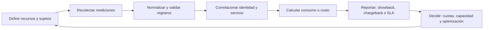

# 1.3 Gestión de Contabilidad (Accounting Management) - Enfoque ITU-T

## Propósito del tema

La **Gestión de Contabilidad (Accounting Management)** es una función de administración de redes orientada a conocer y controlar el uso de los recursos y servicios de telecomunicaciones. En el enfoque de la **ITU-T**, no se limita a llevar una cuenta financiera: establece mecanismos para recolectar, procesar, conservar y presentar información confiable sobre el consumo de recursos.

Su pregunta central es:

> ¿Qué recurso o servicio se utilizó, quién o qué entidad lo utilizó, durante cuánto tiempo, en qué cantidad y bajo qué condiciones?

La información obtenida puede utilizarse para facturación, distribución de costos, control de cuotas, análisis de tendencias, planeación de capacidad y comprobación del cumplimiento de acuerdos de servicio.

## 1. Ubicación en FCAPS y TMN

Accounting es la letra **A** del modelo **FCAPS**:

| Función | Pregunta principal |
|---|---|
| Fault | ¿Qué falló y cómo se recupera? |
| Configuration | ¿Qué está configurado y qué cambió? |
| **Accounting** | **¿Qué recursos se usaron, por quién y cuánto?** |
| Performance | ¿Con qué calidad y eficiencia opera la red? |
| Security | ¿Cómo se protege la infraestructura y la información? |

La ITU-T organiza estas funciones dentro del enfoque de **Telecommunications Management Network (TMN)**. Accounting debe relacionarse con inventario, configuración, desempeño, seguridad, operación y niveles de servicio; sin embargo, su objeto específico es la **medición y administración del uso de recursos**.

## 2. Alcance de Accounting según la ITU-T

El enfoque ITU-T puede resumirse en seis responsabilidades:

1. **Definir qué se contabiliza:** enlaces, bytes, sesiones, llamadas, mensajes, almacenamiento, licencias o servicios.
2. **Identificar al consumidor:** usuario, cliente, departamento, aplicación, dispositivo, VLAN, sitio o servicio.
3. **Recolectar datos de uso:** obtener mediciones de fuentes confiables y con una marca temporal.
4. **Procesar y validar registros:** eliminar duplicados, revisar inconsistencias, correlacionar eventos y conservar trazabilidad.
5. **Generar información administrativa:** reportes de consumo, cuotas, costos, cargos, tendencias y excepciones.
6. **Usar la información para decidir:** asignar costos, ajustar políticas, planear capacidad y mejorar la eficiencia.

Accounting no consiste únicamente en almacenar contadores. Un contador sin identidad, periodo, unidad de medida y contexto no permite justificar una factura ni tomar una decisión de administración.

## 3. Modelo conceptual de datos

Cada registro de uso debe responder, como mínimo, a las siguientes dimensiones:

| Dimensión | Ejemplo |
|---|---|
| Recurso | Enlace WAN de 1 Gbit/s |
| Servicio | Acceso a Internet, VPN o telefonía IP |
| Sujeto de consumo | Departamento de Ventas |
| Unidad de medida | GB transferidos, minutos o sesiones |
| Intervalo | 2026-09-01 00:00 a 2026-09-30 23:59 |
| Dirección | Entrada, salida o total |
| Calidad del registro | Fuente, precisión, estado de validación |
| Regla aplicada | Cuota, tarifa, nivel de servicio o política |

### Ejemplo de registro normalizado

```text
Recurso: enlace-WAN-principal
Sujeto: departamento-ventas
Servicio: acceso-internet
Inicio: 2026-09-01T00:00:00Z
Fin: 2026-09-30T23:59:59Z
Volumen_entrada: 860 GB
Volumen_salida: 210 GB
Total: 1070 GB
Fuente: colector-IPFIX
Estado: validado
```

La unidad y el intervalo deben conservarse. No es válido comparar "GB usados" de un día con "GB usados" de un mes sin normalizar el periodo.

## 4. Recursos que pueden contabilizarse

| Recurso o servicio | Métrica | Posible aplicación |
|---|---|---|
| Enlace de datos | Bytes, paquetes, picos y percentiles | Planeación, cuotas y distribución de costos |
| VPN o Wi-Fi | Sesiones, duración y volumen por usuario | Control de servicio y showback |
| Telefonía IP | Llamadas, duración y destino | Facturación y análisis de consumo |
| Servicios de nube | Solicitudes, almacenamiento y transferencia | Control presupuestario |
| Almacenamiento de red | GB ocupados y operaciones | Cuotas y crecimiento |
| Licencias de red | Usuarios o sesiones concurrentes | Rightsizing de licencias |
| Equipos administrados | Puertos, interfaces y servicios activos | Inventario y costo operativo |

La selección depende del objetivo administrativo. Para una red universitaria puede ser suficiente contabilizar consumo por edificio y servicio; para un proveedor, se necesita mayor granularidad por cliente, sesión y servicio.

## 5. Fuentes de datos

### 5.1 Flujos de red

**NetFlow, IPFIX y sFlow** permiten obtener información agregada sobre conversaciones o muestreos de tráfico. Un registro de flujo puede incluir origen, destino, protocolo, puertos, interfaz, paquetes, bytes y tiempos de inicio y fin.

Estos datos son útiles para identificar tendencias y consumidores principales. No deben interpretarse automáticamente como una inspección del contenido de las comunicaciones.

### 5.2 SNMP y telemetría

SNMP y la telemetría proporcionan contadores de interfaces, errores, octetos transmitidos, disponibilidad y otros indicadores. Son adecuados para consolidar consumo por enlace o dispositivo, aunque el administrador debe controlar reinicios de contadores, discontinuidades y diferencias de intervalo.

### 5.3 Registros de sesiones y servicios

RADIUS Accounting, CDR de telefonía, registros de VPN, DHCP, proxies y plataformas de nube pueden aportar sesiones, duración, identidad y servicio utilizado. La correlación debe respetar las políticas de privacidad y retención de la organización.

## 6. Flujo funcional de Accounting



### 6.1 Definición del modelo de medición

Antes de recolectar datos se deben establecer:

- Recurso y servicio que serán medidos.
- Sujeto al que se atribuirá el consumo.
- Unidad de medida y precisión requerida.
- Periodo de agregación.
- Fuente autorizada y responsable del dato.
- Reglas de redondeo, exclusión, retención y corrección.

### 6.2 Recolección

Los colectores reciben registros desde dispositivos, servicios o plataformas. Deben conservar la hora sincronizada, identificar la fuente y registrar errores de recepción. Una pérdida de datos debe marcarse como una limitación del reporte, no ocultarse como consumo cero.

### 6.3 Validación y correlación

El procesamiento debe detectar registros duplicados, intervalos superpuestos, contadores reiniciados, unidades incompatibles y sujetos desconocidos. Después se correlaciona el recurso técnico con el usuario, departamento, cliente o servicio que corresponde.

### 6.4 Producción de información

La información puede publicarse como:

- **Reporte operativo:** consumo por interfaz, servicio o periodo.
- **Showback:** costo equivalente mostrado al área responsable, sin cargo contable.
- **Chargeback:** distribución o cobro interno basado en una regla acordada.
- **Reporte de nivel de servicio:** consumo y condiciones comparadas contra un SLA.
- **Reporte de capacidad:** tendencias, umbrales y proyecciones.

## 7. Showback, chargeback y tarificación

| Modelo | Uso de la información | Riesgo que debe controlarse |
|---|---|---|
| Showback | Hacer visible el consumo y su costo equivalente | Que el costo estimado se interprete como factura real |
| Chargeback | Asignar el costo a un área o cliente | Disputas por medición, tarifa o responsabilidad |
| Tarificación externa | Cobrar al cliente conforme a un contrato | Falta de trazabilidad y evidencia contractual |

Una regla sencilla puede ser:

$$
Costo\ asignado = Consumo\ medido \times Tarifa\ aplicable
$$

Por ejemplo, si un área consume $2{,}400$ GB y la tarifa interna es de $0.80$ por GB:

$$
Costo\ asignado = 2{,}400 \times 0.80 = 1{,}920
$$

El cálculo solo es defendible si la medición, la tarifa, el periodo y la identidad del consumidor están documentados.

## 8. Cuotas y control del uso

Accounting puede alimentar políticas de cuota, pero no debe confundirse con el mecanismo que bloquea el tráfico. La relación correcta es:

1. Accounting mide el consumo.
2. La política define el umbral o condición.
3. El sistema de control aplica una acción autorizada.
4. Accounting registra el nuevo estado y permite verificar el resultado.

Ejemplos:

- Alertar cuando un departamento alcanza el 80% de su cuota mensual.
- Aplicar una política de velocidad después de superar el límite contratado.
- Solicitar autorización para ampliar un servicio de nube.
- Comparar consumo de VPN con la capacidad contratada.

## 9. Diferencia entre Accounting y AAA

En **AAA**, la segunda A es Authorization y la tercera A es Accounting. Ese Accounting registra sesiones y actividades asociadas con autenticación, por ejemplo, inicio, fin, duración y volumen de una sesión RADIUS.

Esto es compatible con FCAPS, pero no cambia el alcance principal de Accounting Management de la ITU-T:

| Concepto | Pregunta principal | Alcance |
|---|---|---|
| Accounting en FCAPS/TMN | ¿Cómo se administra el uso de recursos y servicios? | Red, telecomunicaciones, costos, capacidad y reportes |
| Accounting en AAA | ¿Qué actividad realizó una identidad autenticada? | Sesiones, acceso y auditoría asociada a AAA |
| Accounts Management | ¿Cómo se administran cuentas y permisos? | Identidad, ciclo de vida y autorización |

Una sesión RADIUS puede ser una fuente de datos para FCAPS Accounting, pero la gestión de cuentas y permisos pertenece principalmente a identidad y seguridad.

## 10. Calidad, seguridad y privacidad de los datos

Los registros de uso pueden contener identificadores de personas, direcciones IP, destinos, horarios y patrones de comportamiento. Por ello, Accounting debe aplicar:

- Sincronización de tiempo en dispositivos y colectores.
- Control de acceso por roles a reportes y registros detallados.
- Integridad, trazabilidad y protección contra alteraciones.
- Retención limitada conforme a políticas y normativa aplicable.
- Minimización de datos: recolectar solo lo necesario para el propósito definido.
- Anonimización o agregación cuando no se requiera identificar a una persona.
- Procedimiento de corrección y atención de disputas.

La contabilización no autoriza por sí misma la inspección del contenido de las comunicaciones. Medir metadatos de uso y analizar contenido son actividades distintas y requieren controles diferentes.

## 11. Caso integrador

Una institución cuenta con un enlace de Internet compartido por Investigación, Administración y Biblioteca. La dirección solicita saber si el enlace debe ampliarse y cómo distribuir el costo.

### Datos disponibles

- Capacidad contratada: 1 Gbit/s.
- Mediciones: IPFIX por interfaz y departamento.
- Periodo: seis meses.
- Identidad: VLAN y asignación de subred por área.
- Reporte requerido: showback mensual y proyección de saturación.

### Propuesta de solución

1. Validar que los relojes y contadores sean comparables.
2. Agregar bytes de entrada y salida por departamento y mes.
3. Identificar picos y percentiles, no solo el promedio.
4. Calcular el costo equivalente con una tarifa documentada.
5. Mostrar tendencias y proyectar el umbral de alerta de 80%.
6. Separar tráfico institucional, invitados y servicios críticos.
7. Recomendar optimización, QoS o ampliación con base en evidencia.
8. Conservar el reporte y su fuente para atender preguntas de las áreas.

### Preguntas de análisis

1. ¿Qué dato falta para atribuir consumo a un departamento con certeza?
2. ¿Por qué el promedio mensual puede ocultar saturaciones importantes?
3. ¿Qué diferencia habría entre presentar showback y aplicar chargeback?
4. ¿Qué controles de privacidad aplicarías al reporte?
5. ¿Qué evidencia solicitarías antes de aprobar una ampliación del enlace?

## 12. Indicadores para evaluar un sistema de Accounting

| Dimensión | Indicador sugerido |
|---|---|
| Cobertura | Porcentaje de recursos y servicios con medición activa |
| Completitud | Porcentaje de intervalos sin datos faltantes |
| Exactitud | Diferencia entre contador de origen y dato procesado |
| Trazabilidad | Registros que conservan fuente, tiempo y transformación |
| Oportunidad | Tiempo entre consumo y disponibilidad del reporte |
| Utilidad | Decisiones de capacidad, costo o política sustentadas |
| Privacidad | Reportes con acceso y retención conforme a política |

## Resumen

Accounting Management, en el sentido ITU-T, es la administración sistemática de información sobre el uso de recursos y servicios de red. Su valor no está en cobrar por cobrar, sino en convertir mediciones confiables en decisiones: distribuir costos, controlar cuotas, justificar inversiones, planear capacidad y verificar niveles de servicio. La función debe distinguirse de Accounts Management y relacionarse con AAA solo cuando sus registros sean una fuente de datos de uso.

## Referencias

1. ITU-T. (1996). *M.3010: Principles for a Telecommunications Management Network*. International Telecommunication Union.
2. ITU-T. (1997). *M.3400: TMN management functions*. International Telecommunication Union.
3. ITU-T. (2000). *M.3350: TMN service management requirements and analysis*. International Telecommunication Union.
4. IETF. (2003). *RFC 3954: Cisco Systems NetFlow Services Export Version 9*. https://www.rfc-editor.org/rfc/rfc3954
5. IETF. (2008). *RFC 5470: Architecture for IP Flow Information Export*. https://www.rfc-editor.org/rfc/rfc5470
6. IETF. (2000). *RFC 2866: RADIUS Accounting*. https://www.rfc-editor.org/rfc/rfc2866
