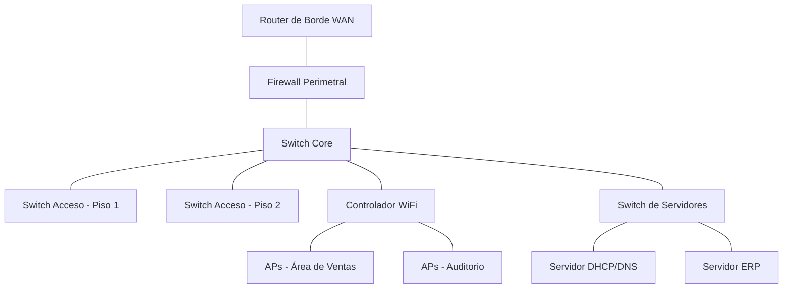

# Actividad 1.2-R: El Comité CAB — Aprobando Cambios en la Red

## Guía para el Alumno

**Asignatura**: Administración de Redes (SCA-1002) | Unidad 1 — Funciones de la administración de redes
**Tema**: 1.2 Gestión de Configuración (Proceso de Control de Cambios)
**Modalidad**: Grupal por equipos (4-5 integrantes), simulación de rol
**Duración estimada**: 60 minutos (1 sesión)

---

## ¿Qué vas a hacer?

Tu equipo será el **Comité CAB (Change Advisory Board)** de una empresa mediana. Durante la sesión llegarán **8 solicitudes de cambio (RFC)** para la red de la empresa: algunas urgentes, otras rutinarias, y otras que en realidad no deberían aprobarse todavía. Solo cuentan con una **ventana de mantenimiento de 4 horas** este sábado, así que **no todo cabe**. Tu equipo debe decidir, con criterio técnico, qué se aprueba, qué se rechaza y qué se difiere.

## Objetivo

Al finalizar, tu equipo podrá:
- Clasificar correctamente el tipo de cambio de cada RFC (estándar, normal o emergencia).
- Argumentar cada decisión (aprobar/rechazar/diferir) con base en el **impacto** y el **riesgo**, no en quién lo solicita o con qué urgencia lo pide.
- Proponer o exigir un **plan de rollback** viable para cada cambio aprobado.
- Priorizar qué cambios entran en la ventana de mantenimiento cuando no todos caben.

---

## Roles en el equipo

Asignen entre ustedes estos cuatro roles antes de empezar:

- **Presidente/a del CAB**: modera la discusión de cada RFC y decide en caso de empate.
- **Analista de Impacto**: usa la Ficha de Topología para identificar qué dispositivos o servicios se afectarían con cada RFC.
- **Analista de Riesgo**: evalúa qué podría salir mal con cada RFC y si el plan de rollback propuesto es viable.
- **Secretario/a**: llena el Acta CAB con la decisión de cada RFC y controla el tiempo usado en el Tablero de Ventana de Mantenimiento.

> Los roles rotan a la mitad de la actividad (después del RFC 4), para que todos practiquen tanto el análisis técnico como la facilitación y el registro.

---

## Lo que necesitas

- Ficha de Topología de Referencia (Anexo)
- Set de 8 Tarjetas RFC (Anexo)
- Tablero de Ventana de Mantenimiento (Anexo)
- Acta CAB en blanco (Anexo)
- Algo para escribir

---

## Cómo se desarrolla la actividad

### 1. Antes de empezar (5 min)
Recuerden en equipo los tres tipos de cambio vistos en teoría: **estándar**, **normal** y **emergencia**, y qué distingue a cada uno.

### 2. Revisión de la topología (5 min)
Revisen juntos la Ficha de Topología de Referencia **antes** de destapar las tarjetas RFC. Identifiquen qué dispositivos dependen de cuáles.

### 3. Sesión CAB: evaluación de RFC (30 min)
Destapen las 8 Tarjetas RFC en el orden que prefieran. Para cada una:
1. Lean la tarjeta en voz alta.
2. El/la Analista de Impacto identifica qué se vería afectado, apoyándose en la Ficha de Topología.
3. El/la Analista de Riesgo evalúa qué podría salir mal y si el plan de rollback es viable o si debe exigirse uno.
4. El/la Presidente/a somete a votación rápida: **Aprobar / Rechazar / Diferir**.
5. El/la Secretario/a registra la decisión en el Acta CAB y descuenta el tiempo estimado (si se aprueba) del Tablero de Ventana de Mantenimiento.

**Regla central: el tiempo total de las RFC aprobadas no puede exceder las 4 horas de la ventana de mantenimiento.** Si se pasan, regresen y reconsideren alguna decisión antes de que termine el tiempo: pueden diferir un RFC pendiente o "desaprobar" uno ya aceptado para hacerle espacio a otro más importante, documentando por qué.

### 4. Contraste con otros equipos (10 min)
Cuando el docente lo indique, compartan la decisión y la razón detrás de 1-2 RFC específicos, apoyándose en su Acta CAB. Comparen con las decisiones de otros equipos y anoten las diferencias relevantes.

### 5. Cierre (10 min)
Respondan en una frase, como equipo: **¿cuál fue el RFC más difícil de decidir y por qué?**

---

## Qué debes entregar como evidencia

Al finalizar la sesión, cada equipo entrega:

1. **Acta CAB completa**, con las 8 decisiones (tipo de cambio, impacto, riesgo, si el rollback es viable, decisión final y tiempo asignado).
2. **Tablero de Ventana de Mantenimiento** con el tiempo final usado (no debe exceder 4 horas).
3. **Respuesta breve por escrito** a la pregunta de cierre: ¿cuál fue el RFC más difícil de decidir y por qué?

---

## Rúbrica de evaluación

Actividad **formativa** (no se califica de forma sumativa, pero se retroalimenta con esta rúbrica).

| Criterio | Logrado | En proceso | No logrado |
|---|---|---|---|
| **Clasificación e identificación de impacto/riesgo** | El equipo clasifica correctamente el tipo de cambio y el nivel de riesgo en la mayoría de los RFC, apoyándose en la Ficha de Topología. | Clasifica correctamente algunos RFC, pero con errores o sin usar la Ficha de Topología de forma consistente. | No clasifica el tipo de cambio ni el riesgo, o lo hace sin relación con la evidencia disponible. |
| **Criterio técnico en la decisión (no presión del solicitante)** | Las decisiones de aprobar/rechazar/diferir se justifican con impacto y riesgo, incluso cuando el solicitante presiona (ej. un directivo). | Algunas decisiones se basan en criterio técnico, pero otras parecen influidas por la urgencia o el puesto del solicitante. | La mayoría de las decisiones se toman por presión del solicitante, sin analizar impacto o riesgo. |
| **Plan de rollback y manejo de la ventana de mantenimiento** | Exige o valida un plan de rollback viable antes de aprobar, y el tiempo total aprobado respeta las 4 horas disponibles. | Revisa el plan de rollback de forma parcial, o el tiempo total aprobado se excede ligeramente y lo corrige al notarlo. | Aprueba cambios sin considerar el rollback, y el tiempo total aprobado excede la ventana sin corrección. |
| **Acta CAB y participación del equipo** | El Acta CAB está completa y clara, y todos los roles participan activamente durante la sesión. | El Acta CAB tiene información incompleta en algunos campos, o la participación no es equitativa entre roles. | El Acta CAB está incompleta en su mayoría, o solo 1-2 integrantes participan en las decisiones. |

---

## Anexo: Material de la actividad

### Ficha de Topología de Referencia (simplificada)



**Notas de dependencia para el análisis de impacto:**
- Si falla el **Switch Core**, se afectan todos los pisos, el WiFi y los servidores (impacto total).
- El **Firewall Perimetral** protege la salida a Internet; un cambio mal hecho aquí puede dejar a toda la empresa sin salida a Internet o exponerla.
- El **Servidor DHCP/DNS** es usado por todos los dispositivos de la red interna; una falla aquí impide que equipos nuevos obtengan IP o resuelvan nombres.
- El **Controlador WiFi** afecta solo a los usuarios inalámbricos (Ventas y Auditorio), no a los equipos con cable.

### Tablero de Ventana de Mantenimiento

```
VENTANA DE MANTENIMIENTO DISPONIBLE: Sábado 22:00 - 02:00 (4 horas totales)

Tiempo usado:     [                                        ] 0 / 4 horas
(vayan marcando o restando conforme aprueben cada RFC)
```

### Acta CAB (formato en blanco)

| RFC # | Tipo (Estándar/Normal/Emergencia) | Dispositivo(s)/Servicio(s) afectado(s) | Riesgo (Alto/Medio/Bajo) | ¿Rollback viable? | Decisión (Aprobar/Rechazar/Diferir) | Tiempo asignado |
|---|---|---|---|---|---|---|
| 1 | | | | | | |
| 2 | | | | | | |
| 3 | | | | | | |
| 4 | | | | | | |
| 5 | | | | | | |
| 6 | | | | | | |
| 7 | | | | | | |
| 8 | | | | | | |
| **Total tiempo aprobado** | | | | | | **___ / 4 horas** |

### Tarjetas RFC (8 solicitudes de cambio)

**RFC-01**
> Solicitante: Jefe de Ventas. "Necesitamos agregar 15 puntos de acceso WiFi nuevos en el área de Ventas porque la señal se satura en horas pico." Tiempo estimado: 2 horas. Plan de rollback propuesto: ninguno (el solicitante dice que "no debería haber problema").

**RFC-02**
> Solicitante: Equipo de Redes. "Aplicar el baseline de seguridad actualizado (deshabilitar HTTP, forzar SSH v2) en los 10 switches de acceso, ya vencido según la última auditoría de compliance." Tiempo estimado: 1 hora. Plan de rollback propuesto: restaurar configuración desde backup previo (RANCID), probado en laboratorio.

**RFC-03**
> Solicitante: Gerente General. "Quiero que el cambio de firmware del Firewall Perimetral se haga HOY MISMO, antes de la ventana de mantenimiento, porque el proveedor lo está presionando para no perder la garantía." Tiempo estimado: 1.5 horas. Plan de rollback propuesto: ninguno, "no hay tiempo para probarlo antes".

**RFC-04**
> Solicitante: Administrador de Servidores. "Migrar el Servidor DHCP/DNS a una nueva IP dentro de la misma VLAN, por reorganización del rack." Tiempo estimado: 1 hora. Plan de rollback propuesto: revertir IP y reiniciar servicio, documentado paso a paso.

**RFC-05**
> Solicitante: Recepción/Auditorio. "Cambiar el nombre de la red WiFi de invitados a algo 'más bonito' antes del evento de la próxima semana." Tiempo estimado: 15 minutos. Plan de rollback propuesto: no aplica (cambio cosmético).

**RFC-06**
> Solicitante: Equipo de Seguridad. "Bloquear de emergencia un rango de IPs externas que están generando un escaneo de puertos activo contra el Firewall Perimetral en este momento." Tiempo estimado: 20 minutos. Plan de rollback propuesto: remover la regla de bloqueo si genera falsos positivos, ya validada por el equipo de seguridad.

**RFC-07**
> Solicitante: Equipo de Redes. "Actualizar el firmware del Switch Core a la última versión estable, recomendado por el fabricante para corregir una vulnerabilidad conocida (CVE publicado hace 2 semanas)." Tiempo estimado: 1.5 horas. Plan de rollback propuesto: reversión a firmware anterior guardado, con checklist de validación post-cambio.

**RFC-08**
> Solicitante: Pasante de TI. "Probar una configuración experimental de QoS en el Switch de Servidores para 'ver si mejora el rendimiento', sin documentación previa ni pruebas en laboratorio." Tiempo estimado: 45 minutos. Plan de rollback propuesto: "seguro se puede deshacer después".
