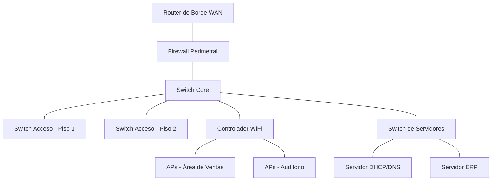

# Actividad 1.2-R: El Comité CAB — Aprobando Cambios en la Red

**Asignatura**: Administración de Redes (SCA-1002) | Unidad 1 — Funciones de la administración de redes

**Tema**: 1.2 Gestión de Configuración (Change Management Process)

**Competencia de unidad**: Aplica las funciones de la administración de redes para la optimización del desempeño y el aseguramiento de las mismas.

**Modalidad**: Grupal por equipos (4-5 integrantes), simulación de rol (role-play) + gamificación con recurso limitado

**Duración estimada**: 60 minutos (1 sesión)
**Metodología**: Simulación de rol + Aprendizaje Basado en Problemas (aplicación directa en contexto de redes, después de la teoría formal)

---

## Objetivo

Simular el funcionamiento de un **CAB (Change Advisory Board)** evaluando un conjunto de **RFC (Request for Change)** de una empresa ficticia, aplicando análisis de **impacto** (con apoyo de una CMDB simplificada), análisis de **riesgo**, definición de **plan de rollback**, y **priorización bajo una ventana de mantenimiento limitada**, para reconocer por qué el control de cambios formal reduce los incidentes causados por cambios no controlados.

**Resultado esperado**: al finalizar, cada equipo puede clasificar correctamente el tipo de cambio (estándar/normal/emergencia) de un conjunto de RFC, argumentar su decisión (aprobar/rechazar/diferir) con base en impacto y riesgo —no en presión del solicitante—, proponer un plan de rollback viable, y justificar qué cambios priorizó cuando no todos caben en la ventana de mantenimiento disponible.


---

## Por qué esta actividad (nota para el docente)

En [A1.2 configuracion.md](A1.2%20configuracion.md) los estudiantes ya transfirieron los cinco pilares de la gestión de configuración desde la analogía del recetario de un restaurante al contexto de redes, incluyendo la equivalencia "solicitud de cambio aprobada = RFC/CAB". Esta actividad retoma justo ese punto y lo profundiza: coloca a los estudiantes directamente en el rol del **CAB** descrito en [1.2 Configuracion.md](1.2%20Configuracion.md) (sección "Change Management Process"), enfrentándolos a RFC reales de infraestructura de red (routers, switches, firewalls) y a la restricción práctica de que **el tiempo de la ventana de mantenimiento es limitado**, obligándolos a priorizar con criterios técnicos (riesgo, impacto, reversibilidad) en lugar de simplemente aprobar todo lo que se solicita.

---

## Materiales

- 1 "Ficha de Topología de Referencia" por equipo (diagrama simplificado de la red de la empresa ficticia, ver Anexo)
- 1 set de 8 "Tarjetas RFC" por equipo (ver Anexo)
- 1 "Tablero de Ventana de Mantenimiento" por equipo (franja de tiempo total disponible, ver Anexo)
- 1 formato de "Acta CAB" por equipo (ver Anexo) para registrar cada decisión
- Cronómetro o temporizador visible
- Marcadores o plumones de colores

---

## Roles dentro del equipo

- **Presidente/a del CAB**: modera la discusión de cada RFC y decide en caso de empate entre el equipo.
- **Analista de Impacto**: usa la Ficha de Topología de Referencia para identificar qué dispositivos/servicios se verían afectados por cada RFC.
- **Analista de Riesgo**: evalúa qué podría salir mal con cada RFC y si el solicitante propone un plan de rollback viable.
- **Secretario/a**: llena el Acta CAB con la decisión final de cada RFC (tipo de cambio, impacto, riesgo, decisión, plan de rollback) y controla el tiempo usado en el Tablero de Ventana de Mantenimiento.

---

## Desarrollo de la actividad

### Fase 0 — Enganche (5 min)

**Instrucciones para el docente:**
1. Plantea el escenario: *"Son el Comité CAB de una empresa mediana. Cada semana llegan solicitudes de cambio a la red: unas urgentes, otras rutinarias, otras que en realidad no deberían aprobarse todavía. Solo tienen una ventana de mantenimiento de 4 horas este sábado. No todo cabe. Deben decidir qué se aprueba, qué se rechaza y qué se difiere."*
2. Recuerda brevemente el flujo de Change Management visto en teoría (RFC → Evaluación → Aprobación → Planificación → Implementación → Validación post-cambio).

**Instrucciones para el alumno:**
- Recuerda los tipos de cambio vistos en teoría: estándar, normal y emergencia, y qué los distingue.

### Fase 1 — Formación de equipos y roles (5 min)

**Instrucciones para el docente:**
1. Forma equipos de 4-5 integrantes.
2. Entrega a cada equipo: la Ficha de Topología de Referencia, el set de 8 Tarjetas RFC (bocabajo, sin revisar aún), el Tablero de Ventana de Mantenimiento y el Acta CAB en blanco.
3. Indica que la ventana de mantenimiento total disponible es de **4 horas** y que cada RFC indica su tiempo estimado de implementación.

**Instrucciones para el alumno:**
- Asignen los roles: Presidente/a del CAB, Analista de Impacto, Analista de Riesgo y Secretario/a.
- Revisen juntos la Ficha de Topología de Referencia antes de destapar las tarjetas RFC.

### Fase 2 — Sesión CAB: evaluación de RFC (30 min)

**Instrucciones para el docente:**
1. Da la señal de inicio; los equipos destapan y analizan las 8 Tarjetas RFC en el orden que prefieran.
2. Aclara la regla central: **el tiempo total de las RFC aprobadas no puede exceder las 4 horas de la ventana de mantenimiento**; si un equipo aprueba de más, debe regresar y reconsiderar antes de que termine el tiempo.
3. Circula entre los equipos resolviendo dudas de mecánica (no de contenido) y observando el criterio usado para decidir (impacto/riesgo vs. "quién lo pidió" o "quién grita más fuerte" — algunas tarjetas están diseñadas para tentar esto último).
4. Avisa cuando falten 10 minutos para forzar el cierre de decisiones pendientes.

**Instrucciones para el alumno (por cada RFC):**
1. Lean la tarjeta RFC en voz alta como equipo.
2. El/la Analista de Impacto identifica en la Ficha de Topología qué dispositivos o servicios se verían afectados.
3. El/la Analista de Riesgo evalúa: ¿qué podría salir mal?, ¿el solicitante propone un plan de rollback viable o hay que exigir uno?
4. El/la Presidente/a somete a votación rápida: **Aprobar / Rechazar / Diferir**.
5. El/la Secretario/a registra la decisión en el Acta CAB y descuenta el tiempo estimado (si se aprueba) del Tablero de Ventana de Mantenimiento.
6. Si el tiempo restante de la ventana no alcanza para un RFC, deben decidir si lo difieren o si "desaprueban" (quitan) un RFC ya aprobado para hacerle espacio, documentando por qué.

### Fase 3 — Contraste entre equipos (10 min)

**Instrucciones para el docente:**
1. Proyecta o escribe en el pizarrón una tabla con los 8 RFC en filas y un equipo por columna.
2. Pide a cada equipo que comparta rápidamente su decisión para 1-2 RFC específicos (asignados por el docente para cubrir los 8 sin repetir demasiado).
3. Señala discrepancias entre equipos (¿por qué unos aprobaron el RFC 5 —diseñado para tentar por presión del solicitante— y otros no?) y usa esas discrepancias para reforzar el criterio correcto: riesgo/impacto primero, urgencia del solicitante después.

**Instrucciones para el alumno:**
- El/la Vocero/a (puede rotar del rol de Presidente/a) comparte la decisión y la razón detrás, apoyándose en el Acta CAB.
- El resto del grupo compara con sus propias decisiones y anota diferencias relevantes.

### Fase 4 — Cierre (10 min)

**Instrucciones para el docente:**
1. Pregunta de cierre: *"¿Qué hubiera pasado si este comité no existiera y cada técnico aplicara sus cambios directamente, sin pasar por este análisis?"*
2. Vincula con el dato de la teoría: aproximadamente el 70% de las fallas de red se originan en cambios no controlados, y cómo un CAB reduce ese riesgo.
3. Anuncia que, en una práctica posterior, aplicarán este mismo criterio para configurar y documentar cambios reales en dispositivos.

**Instrucciones para el alumno:**
- Responde en una frase: ¿cuál fue el RFC más difícil de decidir para tu equipo y por qué?
- Conserva el Acta CAB completada como evidencia de la actividad.

---

## Evidencia y evaluación

Actividad **formativa** (no calificada de forma sumativa), orientada a la aplicación práctica del proceso de control de cambios.

- **Instrumento sugerido**: lista de cotejo de participación y coherencia de decisiones (simple, sin ponderación en calificación final).
- **Evidencia física**: Acta CAB completada con las 8 decisiones y el Tablero de Ventana de Mantenimiento con el tiempo asignado.
- **Uso posterior**: el Acta CAB puede retomarse como referencia para practicar la redacción formal de un RFC propio en actividades posteriores de la unidad.

---

## Variante de inclusión (DUA)

- **Representación**: la Ficha de Topología de Referencia puede presentarse como diagrama visual (para quienes procesan mejor lo gráfico) y también como lista textual de dispositivos y dependencias (para quienes prefieren texto).
- **Expresión**: en la Fase 3, el equipo puede optar por explicar su decisión de forma oral, señalando directamente en la Ficha de Topología, o leyendo su Acta CAB.
- **Participación**: los roles rotan a la mitad de la Fase 2 (por ejemplo, después del RFC 4) para que todos practiquen tanto el análisis técnico (impacto/riesgo) como la facilitación de la decisión (Presidente/a) y el registro (Secretario/a).

---

## Anexo: Material de la actividad

### Ficha de Topología de Referencia (simplificada)



**Notas de dependencia para el análisis de impacto:**
- Si falla el **Switch Core**, se afectan todos los pisos, el WiFi y los servidores (impacto total).
- El **Firewall Perimetral** protege la salida a Internet; un cambio mal hecho aquí puede dejar a toda la empresa sin salida a Internet o exponerla.
- El **Servidor DHCP/DNS** es usado por todos los dispositivos de la red interna; una falla aquí impide que equipos nuevos obtengan IP o resuelvan nombres.
- El **Controlador WiFi** afecta solo a los usuarios inalámbricos (Ventas y Auditorio), no a los equipos con cable.

### Tablero de Ventana de Mantenimiento

```
VENTANA DE MANTENIMIENTO DISPONIBLE: Sábado 22:00 - 02:00 (4 horas totales)

Tiempo usado:     [                                        ] 0 / 4 horas
(el equipo va marcando o restando conforme aprueba cada RFC)
```

### Acta CAB (formato en blanco)

| RFC # | Tipo (Estándar/Normal/Emergencia) | Dispositivo(s)/Servicio(s) afectado(s) | Riesgo (Alto/Medio/Bajo) | ¿Rollback viable? | Decisión (Aprobar/Rechazar/Diferir) | Tiempo asignado |
|---|---|---|---|---|---|---|
| 1 | | | | | | |
| 2 | | | | | | |
| 3 | | | | | | |
| 4 | | | | | | |
| 5 | | | | | | |
| 6 | | | | | | |
| 7 | | | | | | |
| 8 | | | | | | |
| **Total tiempo aprobado** | | | | | | **___ / 4 horas** |

### Tarjetas RFC (8 solicitudes de cambio)

**RFC-01**
> Solicitante: Jefe de Ventas. "Necesitamos agregar 15 puntos de acceso WiFi nuevos en el área de Ventas porque la señal se satura en horas pico." Tiempo estimado: 2 horas. Plan de rollback propuesto: ninguno (el solicitante dice que "no debería haber problema").

**RFC-02**
> Solicitante: Equipo de Redes. "Aplicar el baseline de seguridad actualizado (deshabilitar HTTP, forzar SSH v2) en los 10 switches de acceso, ya vencido según la última auditoría de compliance." Tiempo estimado: 1 hora. Plan de rollback propuesto: restaurar configuración desde backup previo (RANCID), probado en laboratorio.

**RFC-03**
> Solicitante: Gerente General. "Quiero que el cambio de firmware del Firewall Perimetral se haga HOY MISMO, antes de la ventana de mantenimiento, porque el proveedor lo está presionando para no perder la garantía." Tiempo estimado: 1.5 horas. Plan de rollback propuesto: ninguno, "no hay tiempo para probarlo antes".

**RFC-04**
> Solicitante: Administrador de Servidores. "Migrar el Servidor DHCP/DNS a una nueva IP dentro de la misma VLAN, por reorganización del rack." Tiempo estimado: 1 hora. Plan de rollback propuesto: revertir IP y reiniciar servicio, documentado paso a paso.

**RFC-05**
> Solicitante: Recepción/Auditorio. "Cambiar el nombre de la red WiFi de invitados a algo 'más bonito' antes del evento de la próxima semana." Tiempo estimado: 15 minutos. Plan de rollback propuesto: no aplica (cambio cosmético).

**RFC-06**
> Solicitante: Equipo de Seguridad. "Bloquear de emergencia un rango de IPs externas que están generando un escaneo de puertos activo contra el Firewall Perimetral en este momento." Tiempo estimado: 20 minutos. Plan de rollback propuesto: remover la regla de bloqueo si genera falsos positivos, ya validada por el equipo de seguridad.

**RFC-07**
> Solicitante: Equipo de Redes. "Actualizar el firmware del Switch Core a la última versión estable, recomendado por el fabricante para corregir una vulnerabilidad conocida (CVE publicado hace 2 semanas)." Tiempo estimado: 1.5 horas. Plan de rollback propuesto: reversión a firmware anterior guardado, con checklist de validación post-cambio.

**RFC-08**
> Solicitante: Pasante de TI. "Probar una configuración experimental de QoS en el Switch de Servidores para 'ver si mejora el rendimiento', sin documentación previa ni pruebas en laboratorio." Tiempo estimado: 45 minutos. Plan de rollback propuesto: "seguro se puede deshacer después".

**Guía de referencia para el docente (no entregar a los estudiantes):**
- RFC-01: riesgo medio, sin rollback definido — debería exigirse plan de rollback antes de aprobar, o aprobarse como estándar solo si hay backup de configuración previa del controlador WiFi.
- RFC-02: bajo riesgo, alto impacto en compliance, rollback viable — buen candidato a **aprobar** (cambio normal, bien planificado).
- RFC-03: alto riesgo (sin pruebas, sin rollback, afecta el firewall perimetral) a pesar de la presión jerárquica — candidato a **rechazar o diferir** hasta tener plan de rollback; ejemplifica la tentación de aprobar por presión de un directivo.
- RFC-04: riesgo medio, impacto alto (afecta resolución de nombres de toda la red), rollback documentado — candidato a **aprobar** con cuidado en la ventana de mantenimiento.
- RFC-05: riesgo bajo, cambio cosmético — candidato claro a **cambio estándar, aprobar rápido**, no debería consumir mucho debate ni tiempo de la ventana.
- RFC-06: es un **cambio de emergencia** legítimo (incidente de seguridad activo) — se aprueba fuera de la lógica de "ventana de mantenimiento programada", para reforzar que las emergencias siguen otro camino de aprobación (ver tabla de tipos de cambio en la teoría).
- RFC-07: riesgo medio-alto pero bien planificado y justificado por seguridad — buen candidato a **aprobar**, aunque compite por tiempo con otros cambios de alto valor.
- RFC-08: alto riesgo, sin justificación técnica sólida, sin pruebas ni documentación — candidato claro a **rechazar**, ejemplifica un cambio que no debería pasar el CAB aunque el tiempo estimado sea corto.
