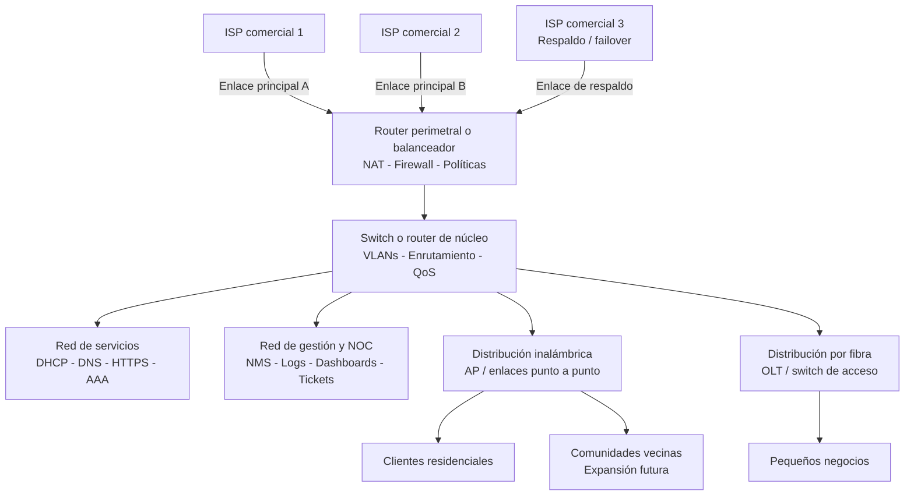

# Proyecto Integrador: Diseño y operación de un ISP local con monitoreo, seguridad y administración de red

## 1. Descripción general

El proyecto integrador consiste en diseñar, implementar y documentar la infraestructura técnica y operativa de una empresa proveedora de servicios de Internet (ISP) para una comunidad rural y tres comunidades vecinas. El objetivo es aplicar las funciones de administración de redes vistas en el curso: configuración, fallas, contabilidad, desempeño y seguridad, en un escenario realista y funcional.

> Nota: Este proyecto es un ejercicio académico y no debe considerarse una guía para operar una empresa de telecomunicaciones real ni una infraestructura de producción con impacto en servicios públicos.
>
> Nota: En la práctica real, la reventa de servicios y la operación de ISP requiere cumplir regulaciones comerciales, legales y de telecomunicaciones locales y nacionales.

## 2. Objetivo general

Diseñar e implementar un modelo operativo de ISP que permita ofrecer conectividad a Internet a clientes residenciales y pequeños negocios, integrando servicios de red, monitoreo, soporte técnico, seguridad, contabilidad y administración de la infraestructura con un enfoque académico y práctico.

## 3. Competencias a desarrollar

- Configura y administra servicios de red para el uso eficiente y confiable de la infraestructura tecnológica de la organización.
- Aplica las funciones de administración de redes para optimizar el desempeño y el aseguramiento de la red.
- Diseña soluciones de monitoreo, diagnóstico y recuperación ante fallas.
- Evalúa métricas de desempeño, consumo y disponibilidad de servicios.
- Implementa políticas básicas de seguridad y control de acceso.
- Organiza procesos de soporte, documentación y operación del servicio.

## 4. Escenario del proyecto

La empresa ISP será una organización pequeña con una infraestructura modular capaz de atender a 10 clientes mínimos, con una población potencial de 200 usuarios y posibilidad de expansión a 3 comunidades vecinas. La red contará con una combinación de clientes conectados por:

- Conexión inalámbrica
- Conexión por fibra óptica
- Acceso centralizado por medio de equipos de agregación y distribución
- Conectividad de salida hacia 3 proveedores de Internet comerciales

Para reducir costos, la empresa utilizará un modelo híbrido de infraestructura virtual y física. Dos proveedores serán usados en balanceo de carga y un tercer proveedor actuará como respaldo o failover.

### 4.1 Topología de referencia

El siguiente diagrama presenta únicamente una arquitectura de referencia para orientar el alcance del proyecto. No debe copiarse como solución obligatoria: cada equipo deberá diseñar su propia topología, justificar las decisiones técnicas y documentar sus cambios respecto a este ejemplo.

Como mínimo, la propuesta de cada equipo debe identificar:

- Límites de cada zona de red y los segmentos o VLANs utilizados.
- Ubicación del firewall, NAT, balanceo y mecanismo de failover.
- Servicios de red, servidores y dispositivos que serán monitoreados.
- Enlaces de acceso inalámbrico y por fibra, incluyendo sus restricciones.
- Flujo de administración, registros, alertas y atención de incidencias.
- Capacidad actual, supuestos de dimensionamiento y posibilidad de expansión.

La topología puede simplificarse o ampliarse según los recursos disponibles. Se permite utilizar infraestructura física, máquinas virtuales, simuladores o una combinación de estas alternativas, siempre que el equipo explique sus decisiones y presente evidencias de funcionamiento.

## 5. Alcance funcional

La empresa debe incluir, al menos, los siguientes elementos:

### 5.1 Infraestructura de acceso
- Red de distribución y agregación para clientes
- Segmentación por VLANs o zonas de servicio
- Enrutamiento y switching básico
- NAT y filtrado de tráfico
- DHCP y DNS internos
- Control de ancho de banda por usuario o grupo
- Al menos 10 clientes activos con posibilidad de crecimiento

### 5.2 Servicios de red
Se deben implementar servicios esenciales para prestar el servicio:

- DHCP
- DNS
- HTTP/HTTPS
- NAT
- Firewall o filtrado básico
- Proxy o caché opcional
- SSH para administración remota
- Sistema de autenticación o control de acceso de usuarios
- Monitoreo del estado de interfaces y enlaces

### 5.3 Administración operativa
El equipo debe incluir los siguientes procesos administrativos:

- Mantenimiento de inventario de equipos
- Bitácoras de eventos y cambios
- Registro de incidencias y solución
- Política de respaldo de configuración
- Control de accesos y permisos administrativos
- Definición de un SLA interno
- Gestión de tickets de servicio

### 5.4 Monitoreo y observabilidad
Se debe implementar una solución de monitoreo con, al menos, los siguientes elementos:

- Estado general de la infraestructura
- Alertas por fallas y degradación
- Visualización del consumo de ancho de banda
- Indicadores de disponibilidad
- Seguimiento de tráfico por cliente o segmento
- Historial de eventos y registros
- Dashboard principal con estado, mapas y alertas

## 6. Requerimientos mínimos del NOC

El NOC debe contar con, al menos, 3 pantallas o vistas principales:

1. Estado general de la red
   - Disponibilidad de enlaces
   - Servicios activos
   - Estado de dispositivos
   - Alertas vigentes

2. Mapa o topología de red
   - Distribución física o lógica de equipos
   - Segmentación por VLANs o zonas
   - Clientes conectados
   - Enlaces principales y de respaldo

3. Alertas y métricas operativas
   - Uso de ancho de banda
   - Clientes con consumo elevado
   - Fallas de servicio
   - Tiempos de recuperación

## 7. Roles del equipo

Cada integrante debe tener un rol definido. Se recomienda lo siguiente:

- Jefe de proyecto o gerente de operaciones
- Administrador de infraestructura y servicios
- Administrador de monitoreo y alertas
- Especialista en seguridad y control de acceso
- Especialista en soporte técnico y mesa de ayuda
- Analista de métricas y reportes

Los roles pueden variar según el número de integrantes del equipo, pero es importante que cada estudiante tenga responsabilidades documentadas y evidenciables.

## 8. SLA propuesto

La empresa debe definir un acuerdo de nivel de servicio interno con indicadores mínimos como:

- Disponibilidad del servicio: 99%
- Tiempo de respuesta a incidencias: por definir según el modelo institucional
- Tiempo de resolución de fallas críticas: por definir
- Tiempo máximo de interrupción de servicio para mantenimiento: por definir
- Política de créditos o compensaciones por interrupciones prolongadas: opcional

El SLA debe estar documentado y alineado con la operación real del servicio.

## 9. Casos a simular

El proyecto debe incluir la simulación de escenarios operativos reales, como los siguientes:

- Fallas en enlaces o dispositivos
- Pérdida de conectividad temporal en un cliente
- Saturación del ancho de banda en horarios pico
- Clientes que exceden su cuota contratada
- Configuración de límites, cortes o reanudación de servicio
- Generación de consumo periódico para simular patrones de uso
- Diferenciación entre tráfico de baja demanda y consumo pico
- Facturación y cobro por consumo
- Registro y seguimiento de incidentes
- Atenciones de mesa de ayuda

## 10. Herramientas sugeridas

Las herramientas pueden elegirse libremente, pero se recomienda utilizar una combinación práctica y accesible.

### 10.1 Para infraestructura y servicios
- VMware, VirtualBox o Proxmox para virtualización
- Cisco Packet Tracer o GNS3 para topologías de red
- Ubuntu Server / Debian / CentOS para servicios
- MikroTik, PfSense o firewall open source
- Windows Server o Linux para servidores internos

### 10.2 Para monitoreo y observabilidad
- Zabbix
- Nagios
- LibreNMS
- Observium
- Checkmk
- Cacti
- Grafana + Prometheus
- Wireshark
- ntopng

### 10.3 Para documentación y soporte
- Microsoft Excel o Google Sheets para inventarios y reportes
- Trello, Jira o Asana para gestión de incidencias
- Diagramas con draw.io o Lucidchart
- Markdown o documento formal con registros de configuración

### 10.4 Para reporting y presentaciones
- PowerPoint o Canva
- PDF con evidencia del proyecto
- Capturas de pantallas de dashboards, alertas y configuración

## 11. Entregables esperados

El proyecto debe entregarse en forma de paquete documental y práctico. Se recomienda incluir, al menos:

1. Documento de diseño de la red
   - Topología de la infraestructura
   - Distribución por zonas y servicios
   - Diagrama lógico y físico

2. Documento de servicios implementados
   - DHCP, DNS, NAT, firewall, proxy, etc.
   - Configuraciones básicas y justificación técnica

3. Documento de monitoreo y alertas
   - NOC con pantallas principales
   - Métricas relevantes
   - Alertas y políticas de respuesta

4. Registro de incidencias
   - Casos simulados
   - Diagnóstico
   - Solución realizada
   - Tiempo de recuperación

5. Documento de operación y soporte
   - Roles del equipo
   - Procedimientos de mesa de ayuda
   - Política de conservación de bitácoras
   - SLA propuesto

6. Presentación final
   - Descripción del proyecto
   - Resultados alcanzados
   - Retos y soluciones
   - Evidencias operativas

## 12. Criterios sugeridos de evaluación

El proyecto puede evaluarse con base en los siguientes criterios:

- Diseño y coherencia de la infraestructura
- Correcta implementación de servicios de red
- Calidad del monitoreo y observabilidad
- Manejo de incidencias y fallas
- Seguridad y control de acceso
- Organización del equipo y roles asignados
- Documentación técnica y claridad del reporte
- Presentación final y análisis de resultados

## 13. Recomendación de estructura de entrega

Se sugiere presentar el proyecto en una carpeta o conjunto de archivos con la siguiente estructura:

- 00-Introduccion.md
- 01-Topologia-y-Arquitectura.md
- 02-Servicios-Implementados.md
- 03-Monitoreo-y-Alertas.md
- 04-Politicas-de-Seguridad.md
- 05-SLA-y-Mesa-de-Ayuda.md
- 06-Registro-de-Incidencias.md
- 07-Resumen-Final.md
- Evidencias/
  - capturas
  - diagramas
  - reportes
  - dashboards

## 14. Aclaración didáctica

La intención del proyecto es permitir que los estudiantes apliquen de manera integrada los conceptos de administración de redes vistos en el curso, más que replicar una red real de telecomunicaciones. Por ello, se permite un enfoque funcional, modular y escalar con recursos limitados, siempre con una base técnica sólida y una clara relación con las funciones de administración de redes.

## 15. Propuesta de título para la entrega

Proyecto Integrador: Diseño y operación de un ISP local con monitoreo, seguridad y administración de red

## 16. Sugerencia de cierre

El proyecto se desarrolla de forma colaborativa, con una visión operativa y técnica, y debe reflejar la manera en que una organización administra una infraestructura de red para garantizar continuidad, seguridad, rendimiento y soporte a sus usuarios.

Si deseas, puedo convertir esta propuesta en una versión más formal para entregar como actividad en Moodle, o en una versión con rúbrica de evaluación y cronograma por semanas.
