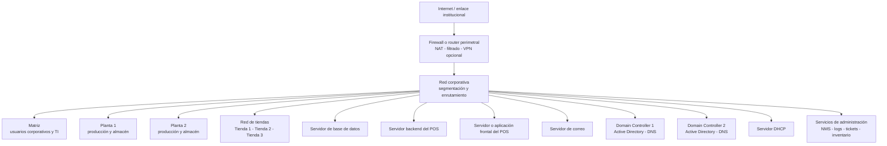

# Proyecto Integrador: Administración de Redes para La Vaca Lola

**Actividad sumativa**  
**Modalidad:** Equipos  
**Tipo de metodología:** Aprendizaje Orientado a Proyectos (AOP) con estudio de casos operativos  
**Asignatura:** Administración de Redes

## 1. Propósito

La empresa **La Vaca Lola S.A. de C.V.** necesita administrar una red empresarial que conecte su matriz, 5 regiones, hasta 3 plantas de producción por región y tres tiendas por región. El equipo diseñará, implementará y documentará una solución de administración de redes para soportar los servicios corporativos, el sistema de Punto de Venta (POS), la operación de las plantas y la atención de incidencias.

El énfasis estará en la administración de una red empresarial distribuida, sus servicios, usuarios, aplicaciones, seguridad, monitoreo, soporte y costos internos.


## 3. Objetivo general

Diseñar e implementar un modelo de administración de redes para una empresa comercial. Por simplicidad solamente implementará la matriz, dos plantas de producción y tres tiendas, integrando servicios de infraestructura, servidores de aplicaciones, identidad, monitoreo, seguridad, mesa de ayuda, gestión de configuración, gestión de fallas, gestión del desempeño y chargeback departamental.

## 4. Competencias a desarrollar

- Configura y administra servicios de red para el uso eficiente y confiable de la infraestructura tecnológica de una organización.
- Aplica las funciones de administración de redes: configuración, fallas, contabilidad, desempeño y seguridad.
- Analiza incidentes y propone procedimientos de diagnóstico, escalamiento y recuperación.
- Diseña métricas y mecanismos de observabilidad para servicios críticos.
- Administra identidades, permisos, respaldos y cambios de configuración.
- Relaciona el consumo de infraestructura con el presupuesto de las áreas usuarias mediante un modelo de chargeback.
- Trabaja colaborativamente con roles, responsabilidades y evidencias verificables.

## 5. Escenario empresarial

La empresa cuenta con los siguientes sitios:

| Sitio | Función principal | Servicios y usuarios principales |
|---|---|---|
| Matriz | Administración corporativa y coordinación general | Dirección, Finanzas, Recursos Humanos, TI, correo, servicios centrales y POS |
| Planta 1 | Producción y distribución | Operación, almacén, administración, supervisión y usuarios de planta |
| Planta 2 | Producción y distribución | Operación, almacén, administración, supervisión y usuarios de planta |
| Tienda 1 | Venta al público | Terminales POS, administración local y acceso de soporte |
| Tienda 2 | Venta al público | Terminales POS, administración local y acceso de soporte |
| Tienda 3 | Venta al público | Terminales POS, administración local y acceso de soporte |

La organización puede utilizar conectividad física, inalámbrica, virtualizada o simulada. El equipo debe definir los medios y justificar sus decisiones según disponibilidad de recursos, costo, seguridad y continuidad operativa.

## 6. Alcance obligatorio

El proyecto se limita a **seis sitios en total**:

- Una matriz.
- Dos plantas simplificadas.
- Tres tiendas.

No se deberán implementar las cinco regiones, todas las plantas ni todas las tiendas del proyecto. La solución debe ser suficientemente clara para demostrar administración de redes, pero manejable para estudiantes que no cursaron previamente Conmutación con el docente.

Cada equipo diseñará su propia arquitectura. La siguiente referencia no es una solución única ni debe copiarse sin análisis.

### 6.1 Topología de referencia



La topología final deberá indicar, como mínimo:

- Zonas o segmentos de red.
- Ubicación de los servidores y servicios.
- Conectividad entre matriz, plantas y tiendas.
- Flujo de usuarios hacia el POS.
- Flujo administrativo hacia servidores y dispositivos.
- Enlaces principales y alternativas de continuidad, si se implementan.
- Puntos de monitoreo y límites de responsabilidad del equipo.

## 7. Servicios y servidores obligatorios

Los siguientes servicios deben existir en el diseño y estar implementados o representados con evidencia funcional. El equipo puede distribuirlos en máquinas virtuales, servidores físicos, contenedores o una combinación de estas opciones.

### 7.1 Servidor de base de datos

Debe almacenar, como mínimo, información de ejemplo relacionada con:

- Productos.
- Existencias.
- Tiendas.
- Ventas.
- Usuarios o referencias de operación.
- Consumos que puedan utilizarse para reportes de chargeback.

No se requiere utilizar datos reales. Debe documentarse el motor seleccionado, la ubicación de los respaldos, el control de acceso y la disponibilidad esperada.

### 7.2 Servidor backend del POS

Debe proporcionar la lógica de negocio o API que comunica el sistema POS con la base de datos. El equipo debe documentar:

- Puertos y protocolos utilizados.
- Autenticación entre el POS y el backend.
- Dependencias con DNS, Active Directory y la base de datos.
- Registros de operación y errores.
- Procedimiento de reinicio o recuperación del servicio.

### 7.3 Servidor para el POS

Debe alojar la aplicación web o interfaz utilizada por las tiendas. Los equipos pueden utilizar una aplicación POS académica, una aplicación de demostración o un prototipo sencillo, siempre que sea posible evidenciar:

- Acceso desde las tres tiendas.
- Autenticación de usuarios.
- Consulta o registro de una operación de prueba.
- Comunicación con el backend.
- Registro de una transacción o evento de prueba.

### 7.4 Servidor de correo

Debe permitir representar la comunicación interna de la empresa. Puede utilizarse un servidor de correo completo o una solución simplificada de laboratorio. Debe demostrarse, al menos, el envío o registro de mensajes de prueba entre áreas o cuentas institucionales.

### 7.5 Active Directory con dos Domain Controllers

Se deben implementar o representar dos controladores de dominio para el dominio académico de la empresa. Por ejemplo: `lavalola.local`.

Requisitos mínimos:

- Dos Domain Controllers.
- Replicación o explicación documentada de la relación entre ambos.
- Usuarios y grupos para diferentes departamentos.
- Políticas básicas de contraseña y acceso.
- DNS integrado o asociado a Active Directory.
- Evidencia de autenticación y resolución de nombres.
- Procedimiento de recuperación ante la indisponibilidad de un controlador.

### 7.6 DHCP y DNS

El diseño debe incluir:

- Asignación automática de direcciones para clientes autorizados.
- Reservas o direcciones fijas para servidores y dispositivos críticos.
- Resolución de nombres internos.
- Registros para servidores del POS, correo, base de datos, monitoreo y Domain Controllers.
- Documentación de ámbitos, exclusiones, gateway y DNS entregados.

### 7.7 Servicios adicionales para FCAPS

Además de los servidores obligatorios, el equipo deberá seleccionar e implementar los servicios que necesite para administrar la red. Por ejemplo:

- Sistema de monitoreo de red y servidores.
- Recolección de logs o eventos.
- Sistema de tickets o mesa de ayuda.
- Inventario o CMDB.
- Respaldos de configuraciones.
- Plataforma de dashboards.
- Servidor de archivos para documentación y evidencias.
- Servicio de autenticación centralizada para dispositivos, si resulta viable.

## 8. Segmentación funcional sugerida

La segmentación puede realizarse con VLANs, subredes, zonas de firewall o redes virtuales. No se exige una tecnología específica, pero sí una separación justificable.

| Zona sugerida | Uso |
|---|---|
| Gestión | Administración de switches, routers, firewalls, hipervisores y NMS |
| Servidores | Servicios corporativos y aplicaciones |
| Administración | Finanzas, Recursos Humanos y dirección |
| Producción | Usuarios y dispositivos de las plantas |
| Ventas | Terminales y dispositivos de las tiendas |
| Invitados | Acceso limitado, si se implementa Wi-Fi para visitantes |
| Seguridad física | CCTV, sensores u otros dispositivos, si se incorporan |
| Respaldo | Copias de seguridad y replicación, si se incorpora |

La segmentación debe aplicar el principio de mínimo privilegio. Por ejemplo, las terminales de las tiendas deben acceder al servicio POS, pero no directamente a la base de datos ni a la administración de los dispositivos de red.

## 9. Funciones de administración de redes y evidencias

### 9.1 Configuración

El equipo debe documentar:

- Inventario de equipos, servidores, interfaces y servicios.
- Direccionamiento y nombres asignados.
- Configuraciones relevantes.
- Dependencias entre servicios.
- Diagrama lógico y físico o virtual.
- Procedimiento de alta de un nuevo sitio, usuario o terminal POS.

### 9.2 Fallas

El equipo debe establecer una mesa de ayuda y simular al menos cuatro incidentes, incluyendo:

- Falla de resolución DNS.
- Indisponibilidad del backend o del POS.
- Pérdida de conectividad de una tienda o planta.
- Indisponibilidad de un Domain Controller.
- Falla de DHCP, correo, base de datos o monitoreo, según la solución implementada.

Cada incidente debe contar con:

- Ticket o folio.
- Fecha y hora.
- Usuario o área afectada.
- Impacto y prioridad.
- Diagnóstico.
- Acciones realizadas.
- Evidencia de recuperación.
- Tiempo de respuesta y tiempo de solución.
- Medida preventiva o recomendación.

### 9.3 Contabilidad mediante chargeback

Como La Vaca Lola no es una empresa de telecomunicaciones, no se cobrará el acceso a Internet como si fueran clientes de un ISP. La gestión de contabilidad se realizará mediante un modelo de **chargeback interno**.

El chargeback asignará a cada departamento o sitio una parte de los costos de infraestructura y servicios para que se considere dentro de su presupuesto anual. El modelo puede ser estimado y académico; no se requieren precios reales de proveedores.

El equipo debe definir:

- Áreas participantes: por ejemplo, Administración, Producción, Ventas, TI y Dirección.
- Conceptos de costo: servidores, almacenamiento, licencias, conectividad, soporte, respaldos y monitoreo.
- Regla de distribución: usuarios, terminales, consumo, capacidad reservada, criticidad o combinación de factores.
- Periodicidad de cálculo.
- Responsable de autorizar el gasto.
- Reporte mensual o trimestral.
- Tratamiento de costos compartidos.

Debe generarse al menos un periodo de consumo simulado con datos de tres tiendas y dos plantas. El reporte debe mostrar el costo total, la asignación por área y el impacto en el presupuesto anual.

### 9.4 Desempeño

Se deben definir y observar métricas pertinentes para una empresa comercial, por ejemplo:

- Disponibilidad del POS.
- Tiempo de respuesta del backend.
- Tiempo de respuesta de consultas a la base de datos.
- Uso de CPU, memoria y almacenamiento.
- Latencia entre tiendas, plantas y matriz.
- Pérdida de paquetes.
- Uso de enlaces o interfaces.
- Cantidad de transacciones procesadas.
- Tiempo de respuesta de DNS y autenticación.
- Capacidad disponible para respaldos.

El equipo debe establecer umbrales de advertencia y críticos, aunque sean aproximados y adecuados para un laboratorio.

### 9.5 Seguridad

La solución debe contemplar, como mínimo:

- Cuentas individuales y grupos por departamento.
- Contraseñas seguras y políticas de expiración o bloqueo.
- Separación entre usuarios, servidores y administración.
- Acceso administrativo restringido.
- Protección de respaldos.
- Reglas de firewall documentadas.
- Registro de accesos y cambios.
- Actualización o mantenimiento de sistemas.
- Plan de respuesta ante pérdida de un servidor o cuenta privilegiada.

## 10. Simulaciones requeridas

El equipo deberá ejecutar y documentar simulaciones relacionadas con una empresa comercial. Se incluyen las siguientes:

1. Alta de una nueva terminal POS en una tienda.
2. Alta, baja o cambio de área de una persona usuaria.
3. Acceso autorizado al POS desde las tres tiendas.
4. Denegación de acceso directo de una tienda a la base de datos.
5. Falla de DNS y recuperación del servicio.
6. Falla del backend o del servidor POS y escalamiento del incidente.
7. Indisponibilidad de un Domain Controller y comprobación de la continuidad posible con el segundo.
8. Saturación o degradación de un servidor crítico.
9. Restauración de una configuración o respaldo.
10. Generación de un reporte de chargeback a partir de consumo simulado.
11. Aplicación de una política de mantenimiento con comunicación a las áreas afectadas.
12. Registro, atención y cierre de tickets de soporte.

No son obligatorias las simulaciones propias de un ISP, como excedentes de cuota de clientes externos, suspensión comercial por falta de pago o balanceo de múltiples proveedores de Internet. Pueden incluirse como ampliaciones, pero no sustituyen las simulaciones empresariales anteriores.

## 11. Roles del equipo

Cada integrante debe tener un rol definido y evidencias de su participación. Los roles pueden combinarse si el equipo es pequeño.

- Coordinación del proyecto y relación con las áreas usuarias.
- Administración de servidores y virtualización.
- Administración de identidad, Active Directory y DNS.
- Administración del POS, backend y base de datos.
- Administración de red, seguridad y respaldos.
- Monitoreo, mesa de ayuda, métricas y chargeback.

El equipo deberá entregar una matriz RACI o equivalente que indique quién ejecuta, aprueba, consulta y recibe información en las actividades principales.

## 12. SLA interno

El equipo debe proponer un SLA interno para los servicios críticos, con indicadores como:

| Servicio | Disponibilidad objetivo | Tiempo de respuesta | Tiempo de solución o restauración |
|---|---:|---:|---:|
| POS | Por definir | Por definir | Por definir |
| Backend del POS | Por definir | Por definir | Por definir |
| Base de datos | Por definir | Por definir | Por definir |
| DNS y DHCP | Por definir | Por definir | Por definir |
| Active Directory | Por definir | Por definir | Por definir |
| Correo | Por definir | Por definir | Por definir |

Los valores deben ser realistas para una empresa de este tamaño y coherentes con los recursos disponibles. El SLA debe identificar horarios de soporte, prioridades, ventanas de mantenimiento, responsables y mecanismo de comunicación.

## 13. Herramientas sugeridas

Las herramientas son de libre elección. Se recomienda priorizar soluciones gratuitas, educativas o de código abierto.

### Infraestructura

- VirtualBox, VMware o Proxmox.
- Ubuntu Server, Debian o Windows Server para los servicios que correspondan.
- Docker o Podman para servicios complementarios.
- Packet Tracer, GNS3, EVE-NG o diagramas documentados para representar la conectividad.
- pfSense, OPNsense o firewall equivalente.

### Identidad y servicios

- Windows Server para Active Directory, DNS y DHCP.
- Samba AD DC como alternativa educativa para Active Directory.
- Microsoft SQL Server, PostgreSQL o MariaDB para la base de datos.
- Aplicación POS académica, ERP de demostración o aplicación web propia.
- Postfix/Dovecot, Mailcow u otra alternativa para correo, según la capacidad del laboratorio.

### FCAPS y operación

- Zabbix, LibreNMS, Checkmk, Nagios o Uptime Kuma para monitoreo.
- Grafana y Prometheus para métricas y dashboards.
- Graylog, Wazuh, syslog-ng o Loki para logs.
- GLPI, Zammad, osTicket, Jira, Trello o una hoja de cálculo para tickets.
- GLPI, Snipe-IT o una hoja de cálculo estructurada para inventario y CMDB.
- Git, almacenamiento institucional o servidor de archivos para respaldos y control documental.
- draw.io, diagrams.net o Mermaid para diagramas.

No es necesario implementar todas las herramientas. Cada equipo debe justificar su selección considerando facilidad de instalación, integración, costo, evidencia que genera y conocimientos disponibles.

## 14. Entregables

Las evidencias y condiciones de entrega serán las mismas establecidas para el proyecto integrador de ISP. Para que esta alternativa sea autocontenida, se expresan aquí en términos concretos:

1. **Diseño de la solución**
   - Contexto y requisitos.
   - Supuestos y restricciones.
   - Topología lógica y física o virtual.
   - Segmentación y direccionamiento.
   - Inventario de equipos, servidores y servicios.

2. **Implementación funcional**
   - Evidencia de los servidores obligatorios.
   - Evidencia de DHCP, DNS y Active Directory con dos Domain Controllers.
   - Evidencia del POS, backend, base de datos y correo.
   - Evidencia de los servicios utilizados para FCAPS.

3. **Documento de operación**
   - Roles del equipo.
   - Procedimientos de alta, cambio, baja, respaldo y recuperación.
   - Mesa de ayuda y flujo de escalamiento.
   - Matriz RACI.
   - SLA.

4. **NOC o tablero de operación**
   - Vista del estado general.
   - Vista de topología, servicios o sitios.
   - Vista de métricas y alertas.
   - Evidencias de monitoreo histórico cuando la herramienta lo permita.

5. **Registro de fallas e incidentes**
   - Al menos cuatro casos documentados.
   - Tickets, diagnóstico, solución y tiempos.
   - Evidencias antes, durante y después de la recuperación.

6. **Reporte de chargeback**
   - Criterios de asignación.
   - Consumo simulado.
   - Costos compartidos y directos.
   - Asignación por área o sitio.
   - Impacto en el presupuesto anual.

7. **Políticas de seguridad y continuidad**
   - Identidad y permisos.
   - Segmentación y firewall.
   - Respaldos.
   - Gestión de cambios.
   - Recuperación ante fallas.

8. **Presentación y demostración final**
   - Recorrido por la arquitectura.
   - Demostración de servicios.
   - Ejecución de un incidente.
   - Explicación de métricas.
   - Presentación del chargeback.
   - Reflexión individual y del equipo.

## 15. Estructura sugerida de la entrega

```text
00-Contexto-y-Requisitos.md
01-Arquitectura-y-Topologia.md
02-Direccionamiento-y-Segmentacion.md
03-Servidores-y-Servicios.md
04-Active-Directory-y-Identidad.md
05-POS-Backend-y-Base-de-Datos.md
06-FCAPS-Monitoreo-Logs-y-Tickets.md
07-Seguridad-y-Respaldos.md
08-SLA-Mesa-de-Ayuda-y-RACI.md
09-Chargeback-y-Presupuesto.md
10-Incidentes-y-Simulaciones.md
11-Reflexion-Final.md
Evidencias/
    capturas/
    diagramas/
    configuraciones/
    reportes/
    dashboards/
```

## 16. Criterios sugeridos de evaluación

Las ponderaciones e indicadores serán los mismos del proyecto ISP. La evaluación debe considerar, como mínimo:

- Diseño y coherencia de la arquitectura.
- Implementación de los servicios obligatorios.
- Integración del POS, backend y base de datos.
- Configuración de Active Directory con dos Domain Controllers.
- Calidad de la solución FCAPS.
- Monitoreo, métricas y alertas.
- Gestión de fallas y calidad de los tickets.
- Seguridad, respaldos y continuidad.
- Chargeback y relación con el presupuesto departamental.
- Organización del equipo, roles y trazabilidad de contribuciones.
- Documentación técnica y presentación final.

La evidencia de producto se evaluará con rúbrica o lista de cotejo según corresponda; las demostraciones y simulaciones pueden complementarse con guía de observación. Los indicadores A-F deben distribuirse conforme al tipo de evidencia y al cuadro de correspondencia institucional.

## 17. Restricciones y decisiones permitidas

- No se exige utilizar equipos Cisco ni comandos de una plataforma particular.
- No se exige reproducir toda la topología del proyecto original de Conmutación.
- Se permite representar físicamente algunos componentes y virtualizar otros.
- Se permite sustituir un servicio por una alternativa equivalente, siempre que se documente la decisión.
- Se permite simplificar el POS, siempre que se demuestre la interacción entre cliente, backend y base de datos.
- Los datos, usuarios, ventas y costos deben ser ficticios.
- Las contraseñas, claves y configuraciones sensibles utilizadas en el laboratorio no deben reutilizarse en producción.

## 18. Resultado esperado

Al finalizar, el equipo deberá demostrar que puede administrar una red empresarial pequeña y distribuida, mantener disponibles sus servicios críticos, controlar el acceso, observar el desempeño, responder a fallas, documentar cambios y relacionar el consumo de infraestructura con el presupuesto de las áreas usuarias.

El éxito del proyecto no depende de construir la red más grande, sino de presentar una solución coherente, funcional, medible, segura y defendible técnicamente.
