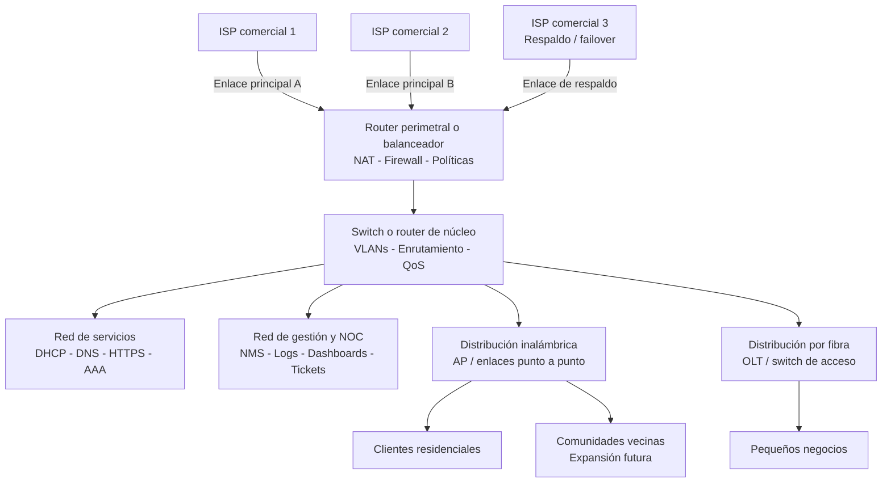

# Proyecto Integrador: Diseño y operación de un ISP local con monitoreo, seguridad y administración de red

## 1. Descripción general

El proyecto integrador consiste en diseñar, implementar y documentar la infraestructura técnica y operativa de una empresa proveedora de servicios de Internet (ISP) para una comunidad rural y comunidades vecinas. El objetivo es aplicar las funciones de administración de redes vistas en el curso: **configuración, fallas, contabilidad, desempeño y seguridad (FCAPS)**, en un escenario realista y funcional.

> **Nota:** Este proyecto es un ejercicio académico y no debe considerarse una guía para operar una empresa de telecomunicaciones real ni una infraestructura de producción con impacto en servicios públicos.
>
> **Nota:** En la práctica real, la reventa de servicios y la operación de un ISP requiere cumplir las regulaciones comerciales, legales y de telecomunicaciones locales y nacionales.

## 2. Objetivo general

Diseñar e implementar un modelo operativo de ISP que permita ofrecer conectividad a Internet a clientes residenciales y pequeños negocios, integrando servicios de red, monitoreo, soporte técnico, seguridad, medición de consumo y administración de la infraestructura con un enfoque académico y práctico.

## 3. Competencias a desarrollar

- Configura y administra servicios de red para el uso eficiente y confiable de la infraestructura tecnológica de la organización.
- Aplica las funciones FCAPS de administración de redes para optimizar el desempeño y aseguramiento de la red.
- Diseña soluciones de monitoreo, diagnóstico y recuperación ante fallas.
- Evalúa métricas de desempeño, consumo y disponibilidad de servicios.
- Implementa políticas básicas de seguridad y control de acceso.
- Organiza procesos de soporte, documentación y operación del servicio.
- Justifica decisiones técnicas a partir de evidencias y métricas.

## 4. Escenario del proyecto

La empresa ISP será una organización pequeña con infraestructura modular capaz de atender como mínimo 10 clientes, con una población potencial de 200 usuarios y posibilidad de expansión a comunidades vecinas.

La red contará con una combinación de:

- Conexiones inalámbricas.
- Conexiones por fibra óptica.
- Equipos de agregación y distribución.
- Conectividad de salida hacia **3 proveedores de Internet comerciales**.

Para reducir costos y aumentar la disponibilidad, la empresa utilizará un modelo híbrido de infraestructura virtual y física. Dos proveedores podrán utilizarse para balanceo de carga y un tercer proveedor como respaldo o *failover*.

### 4.1 Topología de referencia

El siguiente diagrama presenta únicamente una arquitectura de referencia. No debe copiarse como solución obligatoria: cada equipo deberá diseñar su propia topología, justificar las decisiones técnicas y documentar sus cambios.



Como mínimo, la propuesta de cada equipo debe identificar:

- Límites de cada zona de red y segmentos o VLAN utilizados.
- Ubicación del firewall, NAT, balanceo y mecanismo de *failover*.
- Servicios, servidores y dispositivos que serán monitoreados.
- Enlaces de acceso inalámbrico y por fibra, incluyendo restricciones.
- Flujo de administración, registros, alertas y atención de incidencias.
- Capacidad actual, supuestos de dimensionamiento y posibilidad de expansión.

La topología puede simplificarse o ampliarse según los recursos disponibles. Se permite utilizar infraestructura física, máquinas virtuales, simuladores o una combinación, siempre que el equipo explique sus decisiones y presente evidencias de funcionamiento.

## 5. Alcance funcional

### 5.1 Infraestructura de acceso

La solución debe incluir, al menos:

- Red de distribución y agregación para clientes.
- Segmentación mediante VLAN, zonas o mecanismos equivalentes.
- Enrutamiento y switching.
- NAT y filtrado de tráfico.
- DHCP y DNS.
- Control de ancho de banda por usuario o grupo.
- Al menos 10 clientes activos o simulados, con posibilidad de crecimiento.

### 5.2 Servicios de red

Se deben implementar servicios esenciales para prestar el servicio:

- DHCP.
- DNS.
- HTTP/HTTPS.
- NAT.
- Firewall o filtrado básico.
- Proxy o caché, opcional.
- SSH para administración remota.
- Autenticación o control de acceso de usuarios.
- Monitoreo del estado de interfaces y enlaces.

### 5.3 Administración operativa

El equipo debe incluir:

- Inventario de equipos.
- Bitácoras de eventos y cambios.
- Registro de incidencias y solución.
- Política de respaldo de configuraciones.
- Control de accesos y permisos administrativos.
- Definición de un SLA interno.
- Gestión de tickets de servicio.

### 5.4 Monitoreo y observabilidad

Se debe implementar una solución de monitoreo con:

- Estado general de la infraestructura.
- Alertas por fallas y degradación.
- Visualización del consumo de ancho de banda.
- Indicadores de disponibilidad.
- Seguimiento de tráfico por cliente o segmento.
- Historial de eventos y registros.
- Dashboard principal con estado, mapas y alertas.

## 6. Aplicación de FCAPS

FCAPS deberá aplicarse de manera integrada, no como cinco actividades aisladas.

### F — Fault Management / Gestión de fallas

El equipo deberá:

- Detectar fallas.
- Identificar su origen.
- Aislar el componente afectado.
- Aplicar una solución o recuperación.
- Registrar el incidente.
- Documentar el tiempo de recuperación.

Casos mínimos a simular:

- Falla de un enlace.
- Pérdida de conectividad de un cliente.
- Falla de un dispositivo.
- Degradación de un servicio.

### C — Configuration Management / Gestión de configuración

Deberá existir:

- Inventario actualizado.
- Configuración documentada.
- Respaldos.
- Registro de cambios.
- Control de versiones cuando sea posible.
- Procedimiento de cambio y recuperación.

Se deberá demostrar al menos un cambio planificado y documentado.

### A — Accounting Management / Gestión de consumo

El equipo deberá medir y analizar el uso de recursos de red, por ejemplo:

- Consumo de ancho de banda.
- Tráfico por cliente o segmento.
- Utilización de enlaces.
- Consumo en horarios pico.
- Uso de proveedores de Internet.

No se limita a facturación: el propósito es relacionar consumo de recursos con la operación del ISP.

### P — Performance Management / Gestión de desempeño

Se deberán definir y observar indicadores como:

- Disponibilidad.
- Latencia.
- Pérdida de paquetes.
- Utilización de enlaces.
- Capacidad.
- Tiempo de respuesta.
- Tiempo de recuperación.

El equipo deberá establecer umbrales de operación y analizar al menos un caso de degradación.

### S — Security Management / Gestión de seguridad

Deberá incluir:

- Segmentación de red.
- Control de acceso.
- Firewall o ACL.
- Protección de los servicios de administración.
- Autenticación.
- Registro de eventos relevantes.
- Medidas básicas para proteger la infraestructura.

Deberá simularse y documentarse al menos un evento o incidente de seguridad.

## 7. Requerimientos mínimos del NOC

El NOC debe contar con, al menos, tres pantallas o vistas principales:

1. **Estado general de la red**
   - Disponibilidad de enlaces.
   - Servicios activos.
   - Estado de dispositivos.
   - Alertas vigentes.

2. **Mapa o topología de red**
   - Distribución física o lógica.
   - Segmentación.
   - Clientes conectados.
   - Enlaces principales y de respaldo.

3. **Alertas y métricas operativas**
   - Uso de ancho de banda.
   - Clientes con consumo elevado.
   - Fallas de servicio.
   - Tiempos de recuperación.

## 8. Roles del equipo

Cada integrante debe tener un rol definido. Se recomienda:

- Jefe de proyecto o gerente de operaciones.
- Administrador de infraestructura y servicios.
- Administrador de monitoreo y alertas.
- Especialista en seguridad y control de acceso.
- Especialista en soporte técnico y mesa de ayuda.
- Analista de métricas y reportes.

Los roles pueden variar según el número de integrantes, pero cada estudiante debe tener responsabilidades documentadas y evidenciables.

## 9. SLA propuesto

La empresa debe definir un SLA interno con indicadores mínimos como:

- Disponibilidad del servicio: 99% o un valor técnicamente justificado.
- Tiempo de respuesta a incidencias.
- Tiempo de resolución de fallas críticas.
- Tiempo máximo de interrupción para mantenimiento.
- Criterios de escalamiento.

El SLA debe estar documentado y alineado con el modelo de servicio propuesto.

## 10. Casos a simular

El proyecto debe incluir escenarios operativos como:

- Falla de enlaces o dispositivos.
- Pérdida temporal de conectividad de un cliente.
- Saturación del ancho de banda.
- Cliente con consumo elevado.
- Cambio de configuración.
- Recuperación de una configuración.
- Generación de tráfico periódico y tráfico pico.
- Falla de un proveedor.
- Registro y seguimiento de incidentes.
- Atención de mesa de ayuda.
- Incidente básico de seguridad.

Al menos un caso debe obligar a utilizar evidencias de **F, C, A, P y S** de manera conjunta.

## 11. Herramientas sugeridas

Las herramientas pueden elegirse libremente.

### Infraestructura y servicios

- VMware, VirtualBox o Proxmox.
- Cisco Packet Tracer o GNS3.
- Ubuntu Server / Debian.
- MikroTik, pfSense u otro firewall open source.
- Windows Server o Linux.

### Monitoreo

- Zabbix.
- Nagios.
- LibreNMS.
- Observium.
- Checkmk.
- Cacti.
- Grafana + Prometheus.
- Wireshark.
- ntopng.

### Documentación y soporte

- Excel o Google Sheets.
- Trello, Jira, Asana u otra herramienta de tickets.
- draw.io o Lucidchart.
- Markdown.

## 12. Entregables

El proyecto debe entregarse como paquete documental y práctico.

1. **Documento de diseño de la red**
   - Topología.
   - Direccionamiento.
   - VLAN/zonas.
   - Servicios.
   - Justificación técnica.

2. **Documento de servicios implementados**
   - DHCP, DNS, NAT, firewall, etc.
   - Configuraciones.
   - Pruebas de funcionamiento.

3. **Documento de monitoreo y FCAPS**
   - NOC.
   - Métricas.
   - Alertas.
   - Evidencias de F, C, A, P y S.

4. **Registro de incidencias**
   - Caso.
   - Diagnóstico.
   - Evidencias.
   - Solución.
   - Tiempo de recuperación.
   - Funciones FCAPS involucradas.

5. **Documento de operación y soporte**
   - Roles.
   - Mesa de ayuda.
   - Inventario.
   - Bitácoras.
   - Respaldos.
   - SLA.

6. **Presentación final**
   - Descripción.
   - Arquitectura.
   - Demostración.
   - Incidentes.
   - Resultados.
   - Retos y soluciones.

## 13. Criterios sugeridos de evaluación

- Diseño y coherencia de la infraestructura.
- Correcta implementación de servicios.
- Aplicación integrada de FCAPS.
- Calidad del monitoreo y observabilidad.
- Diagnóstico y recuperación ante fallas.
- Seguridad y control de acceso.
- Gestión de configuración.
- Análisis de consumo y desempeño.
- Organización del equipo.
- Documentación técnica.
- Evidencias y presentación.

## 14. Estructura de entrega

```text
00-Introduccion.md
01-Topologia-y-Arquitectura.md
02-Servicios-Implementados.md
03-Monitoreo-y-FCAPS.md
04-Politicas-de-Seguridad.md
05-SLA-y-Mesa-de-Ayuda.md
06-Registro-de-Incidencias.md
07-Resumen-Final.md
Evidencias/
  capturas/
  diagramas/
  reportes/
  dashboards/
```

## 15. Aclaración didáctica

La intención es que los estudiantes administren una infraestructura de red funcional, aplicando FCAPS como un conjunto integrado de funciones de operación.

El proyecto no busca replicar la operación comercial real de un ISP, sino proporcionar un escenario académico para practicar diseño, configuración, monitoreo, diagnóstico, seguridad, documentación y soporte.

## 16. Propuesta de título

**Proyecto Integrador: Diseño y operación de un ISP local con monitoreo, seguridad y administración de red**

