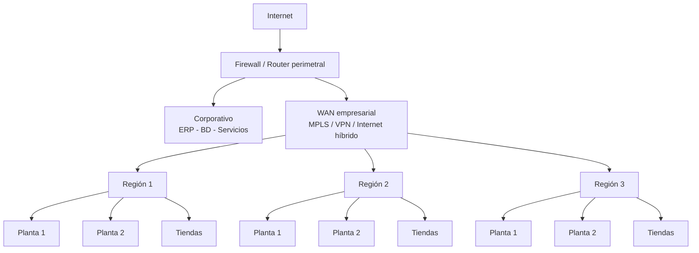

# Proyecto Integrador: Administración y operación de la red empresarial de "La Vaca Lola"

## 1. Descripción general

El proyecto integrador consiste en diseñar, implementar y documentar la infraestructura técnica y operativa de la red de una empresa productora, distribuidora y comercializadora de carne denominada **La Vaca Lola**.

La empresa cuenta con **5 regiones operativas**, cada una con **3 plantas de producción ubicadas en diferentes ciudades**, además de tiendas propias para la venta directa al consumidor, oficinas y servicios corporativos.

El objetivo es aplicar las funciones de administración de redes vistas en el curso: **configuración, fallas, contabilidad, desempeño y seguridad (FCAPS)**, en un escenario empresarial realista.

> **Nota de alcance:** Aunque la empresa completa cuenta con 5 regiones y 3 plantas por región, **para este proyecto académico cada equipo implementará únicamente 3 regiones y entre 1 y 2 plantas por región**. Las demás regiones y plantas deberán considerarse como infraestructura existente o de expansión futura y podrán representarse de manera conceptual.
>
> **Nota:** Este proyecto es un ejercicio académico. No constituye una guía para operar infraestructura industrial, sistemas de producción o servicios críticos reales.

## 2. Objetivo general

Diseñar e implementar una red empresarial que permita la comunicación confiable y segura entre el corporativo, las regiones, las plantas de producción y las tiendas de La Vaca Lola, integrando servicios de red, monitoreo, soporte técnico, seguridad y administración de la infraestructura con un enfoque FCAPS.

## 3. Competencias a desarrollar

- Configura y administra servicios de red para el uso eficiente y confiable de la infraestructura tecnológica de una organización.
- Aplica las funciones FCAPS de administración de redes para optimizar el desempeño y aseguramiento de la red.
- Diseña soluciones de monitoreo, diagnóstico y recuperación ante fallas.
- Evalúa métricas de desempeño, consumo y disponibilidad.
- Implementa políticas básicas de seguridad y control de acceso.
- Organiza procesos de soporte, documentación y operación.
- Justifica decisiones técnicas a partir de evidencias y métricas.

## 4. Escenario del proyecto

**La Vaca Lola** produce, distribuye y comercializa productos cárnicos.

La organización cuenta con:

- 5 regiones operativas.
- 3 plantas de producción por región.
- Plantas ubicadas en diferentes ciudades.
- Oficinas regionales.
- Centros de distribución o almacenes asociados a las plantas.
- Tiendas propias para venta directa al consumidor.
- Un corporativo con sistemas y servicios centrales.

### Alcance de implementación

Por razones de tiempo y recursos, cada equipo deberá implementar solamente:

- **3 regiones.**
- **1 o 2 plantas por región.**
- Una cantidad representativa de tiendas por región.
- El corporativo.

Esto permite construir una infraestructura suficientemente compleja para aplicar FCAPS sin exigir la implementación física o virtual de las 15 plantas.

El resto de las plantas y tiendas podrá aparecer en los diagramas como **sitios no implementados, existentes o de expansión futura**.

### 4.1 Servicios empresariales

La red deberá contemplar, de acuerdo con el alcance seleccionado:

- ERP o sistema administrativo.
- Inventario y logística.
- Sistemas de producción.
- Punto de venta (POS).
- Servidores de archivos o aplicaciones.
- Telefonía IP, opcional.
- Wi-Fi corporativo.
- Wi-Fi para visitantes.
- CCTV.
- Equipos IoT o sistemas de producción simulados.
- Servicios de administración de red.

No es necesario implementar físicamente sistemas industriales reales. Los procesos de producción pueden representarse mediante servidores, máquinas virtuales, sensores simulados o servicios de red.

### 4.2 Topología de referencia

El siguiente diagrama es únicamente una arquitectura de referencia. No debe copiarse como solución obligatoria: cada equipo deberá diseñar su propia topología, justificar sus decisiones y documentar sus cambios.



La solución puede utilizar MPLS, enlaces privados, VPN sobre Internet, una WAN híbrida u otra arquitectura técnicamente justificada.

### 4.3 Arquitectura de una planta

Como referencia:

```text
                         WAN
                          │
                   ┌──────▼──────┐
                   │ Router /    │
                   │ Firewall    │
                   └──────┬──────┘
                          │
                   ┌──────▼──────┐
                   │ Core Switch │
                   └──────┬──────┘
                          │
          ┌───────────────┼────────────────┐
          │               │                │
          ▼               ▼                ▼
   Administración     Producción        Servicios
          │               │                │
       PCs/ERP         PLC/IoT          CCTV/WiFi
```

Cada equipo deberá definir sus propias VLAN, subredes, políticas y mecanismos de acceso.

## 5. Alcance funcional

### 5.1 Infraestructura de red

La solución debe incluir, al menos:

- Red WAN entre corporativo y regiones.
- Redes LAN en plantas.
- Redes LAN en tiendas.
- Segmentación mediante VLAN o zonas.
- Enrutamiento.
- Firewall o filtrado.
- DHCP.
- DNS.
- Acceso administrativo seguro.
- Monitoreo de dispositivos y enlaces.

### 5.2 Segmentación sugerida

Cada equipo puede utilizar una estructura similar a:

| VLAN/Zona | Uso |
|---|---|
| 10 | Administración |
| 20 | Producción |
| 30 | POS / Ventas |
| 40 | CCTV |
| 50 | Voz |
| 60 | Wi-Fi corporativo |
| 70 | Invitados |
| 99 | Administración de red |

La propuesta no es obligatoria. Los equipos deberán justificar su propio diseño.

### 5.3 Administración operativa

El equipo debe incluir:

- Inventario de equipos.
- Bitácoras de eventos y cambios.
- Registro de incidencias.
- Política de respaldo de configuraciones.
- Control de accesos.
- Gestión de tickets.
- Procedimientos de atención.
- SLA interno para servicios críticos.

### 5.4 Monitoreo y observabilidad

Se debe implementar una solución que permita observar:

- Estado de enlaces WAN.
- Estado de routers, switches y firewalls.
- Disponibilidad de servicios.
- Utilización de ancho de banda.
- Latencia.
- Pérdida de paquetes.
- CPU y memoria.
- Alertas.
- Historial de eventos.
- Métricas por región, planta o servicio.

## 6. Aplicación de FCAPS

FCAPS deberá aplicarse de manera integrada.

### F — Fault Management / Gestión de fallas

El equipo deberá:

- Detectar fallas.
- Identificar el origen.
- Aislar el componente afectado.
- Recuperar el servicio.
- Registrar el incidente.
- Documentar evidencias y tiempos.

Casos mínimos:

- Falla de un enlace WAN.
- Falla de un switch o router.
- Pérdida de comunicación entre una planta y el corporativo.
- Falla de un servicio empresarial.
- Pérdida de conectividad de una tienda.

### C — Configuration Management / Gestión de configuración

Deberá existir:

- Inventario actualizado.
- Configuraciones documentadas.
- Respaldos.
- Registro de cambios.
- Control de versiones cuando sea posible.
- Procedimiento de cambio.
- Procedimiento de recuperación.

Se deberá realizar y documentar al menos un cambio planificado, por ejemplo:

- Crear una VLAN.
- Incorporar una tienda.
- Modificar una ACL.
- Incorporar un nuevo servicio.
- Cambiar una ruta.

### A — Accounting Management / Gestión de consumo

En este proyecto la contabilidad se enfocará en **medir el consumo de recursos de red**, no necesariamente en facturación.

Se deberá analizar, por ejemplo:

- Consumo WAN por región.
- Tráfico por planta.
- Tráfico por servicio.
- Consumo de CCTV.
- Consumo de respaldos.
- Tráfico de tiendas.
- Horarios pico.

El equipo deberá presentar al menos un análisis que permita relacionar el consumo con las necesidades de la empresa.

### P — Performance Management / Gestión de desempeño

Se deberán definir indicadores como:

- Disponibilidad.
- Latencia.
- Pérdida de paquetes.
- Utilización de enlaces.
- CPU.
- Memoria.
- Tiempo de respuesta.
- Tiempo de recuperación.
- Jitter, cuando aplique.

Se deberá analizar al menos un caso de degradación de rendimiento.

### S — Security Management / Gestión de seguridad

La red deberá contemplar:

- Segmentación.
- VLAN.
- ACL y/o firewall.
- Control de acceso.
- Protección de la administración.
- Autenticación.
- Registro de eventos.
- Separación entre producción, administración, POS, CCTV y visitantes.

Se deberá simular y documentar al menos un incidente de seguridad.

Ejemplo:

> Un equipo de una tienda intenta acceder a servidores de producción.

El equipo deberá determinar si el tráfico debe permitirse o bloquearse, implementar la política correspondiente y generar evidencia.

## 7. Requerimientos mínimos del NOC

El NOC deberá contar con al menos tres vistas:

1. **Estado general**
   - Regiones disponibles.
   - Plantas disponibles.
   - Tiendas disponibles.
   - Enlaces WAN.
   - Servicios críticos.
   - Alertas.

2. **Mapa o topología**
   - Corporativo.
   - Regiones.
   - Plantas.
   - Tiendas.
   - Enlaces.
   - Segmentación.

3. **Alertas y métricas**
   - Utilización WAN.
   - Latencia.
   - Pérdida.
   - CPU/memoria.
   - Servicios.
   - Incidentes.
   - Tiempo de recuperación.

## 8. Roles del equipo

Se recomienda:

- Jefe de proyecto / gerente de operaciones.
- Administrador de infraestructura.
- Administrador de servicios.
- Administrador de monitoreo.
- Especialista de seguridad.
- Especialista de soporte y mesa de ayuda.
- Analista de métricas.

Los roles pueden adaptarse al número de integrantes.

## 9. SLA propuesto

El equipo deberá definir un SLA interno para servicios empresariales.

Como mínimo deberá establecer:

- Disponibilidad de servicios críticos.
- Tiempo de respuesta.
- Tiempo de resolución.
- Prioridad de incidentes.
- Tiempo máximo de mantenimiento.
- Criterios de escalamiento.

Ejemplo:

| Servicio | Objetivo |
|---|---|
| POS | 99.5% |
| ERP | 99% |
| WAN regional | 99% |
| CCTV | 98% |
| Wi-Fi corporativo | 98% |

Los valores son referenciales y deberán ser justificados.

## 10. Casos a simular

El proyecto deberá incluir escenarios como:

- Falla de enlace WAN.
- Falla de dispositivo.
- Pérdida de conectividad de una planta.
- Falla de un servicio.
- Saturación de un enlace.
- Consumo elevado de CCTV.
- Cambio de configuración.
- Recuperación de configuración.
- Problema de rendimiento del POS.
- Incidente de seguridad.
- Alta de una nueva tienda.
- Registro y seguimiento de tickets.

Al menos un caso deberá integrar **F, C, A, P y S**.

### Caso integrador sugerido

> Una mañana, varias tiendas de la Región 3 reportan lentitud en el sistema POS. Al mismo tiempo, una planta de la misma región reporta problemas de comunicación con el ERP.
>
> El NOC observa un incremento inusual del tráfico WAN.
>
> La investigación revela que recientemente se incorporó un sistema de videovigilancia en una de las plantas y se modificó la configuración de un equipo de red.

El equipo deberá utilizar monitoreo, registros, configuración y métricas para determinar la causa y documentar la solución.

## 11. Herramientas sugeridas

### Infraestructura

- VMware, VirtualBox o Proxmox.
- Cisco Packet Tracer.
- GNS3.
- EVE-NG.
- PNETLab.
- Ubuntu Server / Debian.
- MikroTik.
- pfSense u otro firewall open source.

### Monitoreo

- Zabbix.
- Nagios.
- LibreNMS.
- Checkmk.
- Grafana + Prometheus.
- Cacti.
- Wireshark.
- ntopng.

### Documentación y soporte

- Excel o Google Sheets.
- Trello, Jira, Asana u otra herramienta de tickets.
- draw.io o Lucidchart.
- Markdown.

## 12. Entregables

El proyecto debe entregarse como paquete documental y práctico.

1. **Documento de diseño de la red**
   - Topología.
   - Direccionamiento.
   - VLAN/zonas.
   - WAN.
   - Servicios.
   - Justificación técnica.

2. **Documento de servicios implementados**
   - DHCP.
   - DNS.
   - Routing.
   - NAT.
   - Firewall/ACL.
   - Servicios empresariales simulados.
   - Pruebas de funcionamiento.

3. **Documento de monitoreo y FCAPS**
   - NOC.
   - Dashboards.
   - Métricas.
   - Alertas.
   - Evidencias de F, C, A, P y S.

4. **Registro de incidencias**
   - Caso.
   - Diagnóstico.
   - Evidencias.
   - Solución.
   - Tiempo de recuperación.
   - Funciones FCAPS involucradas.

5. **Documento de operación y soporte**
   - Roles.
   - Mesa de ayuda.
   - Inventario.
   - Bitácoras.
   - Respaldos.
   - SLA.

6. **Presentación final**
   - Descripción de la empresa.
   - Arquitectura.
   - Demostración.
   - Incidentes.
   - Resultados.
   - Retos y soluciones.

## 13. Criterios sugeridos de evaluación

- Diseño y coherencia de la infraestructura.
- Correcta implementación de servicios.
- Aplicación integrada de FCAPS.
- Calidad del monitoreo.
- Diagnóstico y recuperación ante fallas.
- Gestión de configuración.
- Análisis de consumo.
- Gestión del desempeño.
- Seguridad y control de acceso.
- Organización del equipo.
- Documentación técnica.
- Evidencias y presentación.

## 14. Estructura de entrega

La estructura será deliberadamente equivalente a la del proyecto ISP:

```text
00-Introduccion.md
01-Topologia-y-Arquitectura.md
02-Servicios-Implementados.md
03-Monitoreo-y-FCAPS.md
04-Politicas-de-Seguridad.md
05-SLA-y-Mesa-de-Ayuda.md
06-Registro-de-Incidencias.md
07-Resumen-Final.md
Evidencias/
  capturas/
  diagramas/
  reportes/
  dashboards/
```

## 15. Aclaración didáctica

La intención del proyecto es permitir que los estudiantes transfieran los conocimientos de administración de redes y FCAPS a un contexto diferente.

En el proyecto ISP, la red constituye el servicio que la organización proporciona a sus clientes.

En **La Vaca Lola**, la red es una infraestructura que soporta los procesos de producción, distribución, administración y venta de la empresa.

Por lo tanto, ambos proyectos utilizan los mismos principios de administración, pero presentan problemas operativos diferentes.

El proyecto no busca replicar una infraestructura industrial real. Los sistemas de producción pueden ser simulados y deben utilizarse únicamente con fines académicos.

## 16. Propuesta de título

**Proyecto Integrador: Administración y operación de la red empresarial de "La Vaca Lola"**
