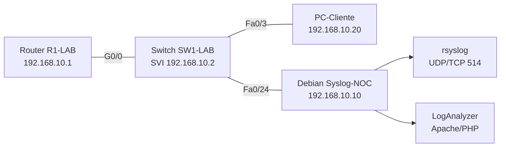

# Práctica 3: Detección de Fallas con rsyslog y LogAnalyzer

## Objetivo

Implementar un colector centralizado de mensajes Syslog en una máquina virtual con Debian, visualizar los eventos mediante Adiscon LogAnalyzer y comprobar la detección de cambios de estado en un router, un switch y un equipo cliente.

**Duración estimada:** 3 horas (2 sesiones)

## Competencias a desarrollar

- Configura un servicio de red en Debian para recibir y almacenar mensajes Syslog.
- Instala y configura Apache, PHP y Adiscon LogAnalyzer para consultar bitácoras.
- Configura dispositivos Cisco para enviar mensajes de eventos a un colector remoto.
- Verifica la relación entre un evento físico o lógico, su registro en rsyslog y su visualización en LogAnalyzer.
- Documenta evidencias de detección y analiza la utilidad de los registros para la administración de fallas.

## Introducción

En la administración de fallas, los dispositivos de red deben informar eventos relevantes a un punto central de recolección. Syslog permite transportar mensajes con información sobre el dispositivo, la fecha, la severidad y el evento ocurrido. El colector puede conservar estos mensajes para su consulta, correlación y generación de evidencia.

En esta práctica se construirá un laboratorio físico compuesto por una máquina virtual Debian, un router Cisco, un switch administrable y un equipo cliente. Debian recibirá los mensajes por el puerto 514, rsyslog los almacenará en un archivo dedicado y LogAnalyzer permitirá consultarlos desde un navegador. Se provocarán eventos controlados al conectar un dispositivo a una interfaz del switch y al cambiar el nombre del router.

La práctica se relaciona con el tema [1.1 Fallas.md](../1.1%20Fallas.md), especialmente con la detección pasiva, el registro de incidentes, la trazabilidad y el análisis de cambios recientes.

## Equipo de protección e higiene

- Realiza la práctica en una red aislada o en una VLAN de laboratorio. No envíes mensajes de prueba a la red institucional sin autorización.
- Utiliza cuentas administrativas únicamente para las tareas indicadas y emplea contraseñas de laboratorio que no se reutilicen en producción.
- No desconectes cables de equipos que presten servicios institucionales.
- Realiza una copia de la configuración del router y del switch antes de aplicar cambios.
- Mantén la máquina virtual y los dispositivos identificados para evitar modificar equipos equivocados.

## Material y equipo necesario

### Materiales e insumos

- Cables de red y cable de consola, si es necesario.
- Documento de reporte para registrar comandos, capturas y observaciones.

### Equipo de laboratorio

- Computadora con VirtualBox, VMware Workstation o KVM.
- Máquina virtual con Debian 12 o una versión posterior estable, con 2 núcleos de CPU, 2 GB de RAM como mínimo y 20 GB de almacenamiento.
- Router Cisco con acceso por consola o SSH.
- Switch Cisco administrable con acceso por consola o SSH.
- PC o laptop cliente con tarjeta Ethernet.

### Herramientas

- Debian, `sudo`, `systemd` y `ufw`.
- `rsyslog`.
- Apache HTTP Server y PHP.
- Adiscon LogAnalyzer.
- Navegador web.
- Wireshark o `tcpdump` para comprobar el transporte de Syslog.
- Cliente SSH, por ejemplo OpenSSH.

## Topología de referencia



## Plan de direccionamiento IP

| Dispositivo | Interfaz | Dirección IP | Máscara | Puerta de enlace |
|---|---|---|---|---|
| Debian Syslog-NOC | Ethernet | 192.168.10.10 | 255.255.255.0 | 192.168.10.1 |
| Router R1-LAB | G0/0 | 192.168.10.1 | 255.255.255.0 | -- |
| Switch SW1-LAB | VLAN 1 | 192.168.10.2 | 255.255.255.0 | 192.168.10.1 |
| PC-Cliente | Ethernet | 192.168.10.20 | 255.255.255.0 | 192.168.10.1 |

## Instrucciones

### Parte 1: Crear y preparar la máquina virtual Debian

1. Crea una máquina virtual llamada `Debian-Syslog-NOC`.
2. Instala Debian con una interfaz de red conectada a la red aislada del laboratorio.
3. Configura la dirección IP `192.168.10.10/24`, la puerta de enlace `192.168.10.1` y un nombre de equipo identificable:

   ```bash
   sudo hostnamectl set-hostname syslog-noc
   hostnamectl
   ip address
   ip route
   ```

4. Actualiza los índices de paquetes:

   ```bash
   sudo apt update
   sudo apt upgrade -y
   ```

5. Verifica que Debian pueda alcanzar el router y el switch cuando estos ya tengan su direccionamiento configurado:

   ```bash
   ping -c 4 192.168.10.1
   ping -c 4 192.168.10.2
   ```

**Evidencia E1:** captura de `hostnamectl`, `ip address`, `ip route` y una prueba de conectividad exitosa.

### Parte 2: Instalar y configurar rsyslog

1. Instala rsyslog y herramientas de diagnóstico:

   ```bash
   sudo apt install -y rsyslog tcpdump net-tools lsof
   sudo systemctl enable --now rsyslog
   systemctl status rsyslog --no-pager
   ```

2. Crea `/etc/rsyslog.d/10-network-devices.conf` con el siguiente contenido:

   ```text
   module(load="imudp")
   input(type="imudp" port="514")

   module(load="imtcp")
   input(type="imtcp" port="514")

   if ($fromhost-ip != "127.0.0.1" and $fromhost-ip != "::1") then {
       action(
           type="omfile"
           file="/var/log/network-devices.log"
           fileOwner="syslog"
           fileGroup="www-data"
           fileCreateMode="0640"
       )
       stop
   }
   ```

3. Comprueba la sintaxis y reinicia el servicio:

   ```bash
   sudo rsyslogd -N1
   sudo systemctl restart rsyslog
   sudo systemctl status rsyslog --no-pager
   ```

4. Comprueba que el servicio escucha en el puerto 514:

   ```bash
   sudo ss -lunpt | grep ':514'
   ```

5. Crea el archivo de registros y verifica sus permisos. Si rsyslog todavía no ha recibido un evento remoto, el archivo puede crearse manualmente:

   ```bash
   sudo touch /var/log/network-devices.log
   sudo chown syslog:www-data /var/log/network-devices.log
   sudo chmod 0640 /var/log/network-devices.log
   ls -l /var/log/network-devices.log
   ```

6. Si se utiliza el firewall UFW, permite el tráfico Syslog y HTTP únicamente en la red del laboratorio:

   ```bash
   sudo ufw allow from 192.168.10.0/24 to any port 514 proto udp
   sudo ufw allow from 192.168.10.0/24 to any port 514 proto tcp
   sudo ufw allow from 192.168.10.0/24 to any port 80 proto tcp
   sudo ufw status verbose
   ```

7. Deja preparada una terminal para observar los eventos en tiempo real:

   ```bash
   sudo tail -f /var/log/network-devices.log
   ```

**Evidencia E2:** captura de `rsyslogd -N1`, el estado activo de rsyslog, el puerto 514 escuchando y los permisos de `network-devices.log`.

### Parte 3: Instalar Apache y PHP

1. Instala Apache, PHP y las extensiones requeridas por LogAnalyzer:

   ```bash
   sudo apt install -y apache2 php libapache2-mod-php php-cli php-xml php-mbstring php-curl unzip wget
   sudo systemctl enable --now apache2
   ```

2. Verifica la instalación desde el navegador utilizando `http://192.168.10.10`.

3. Comprueba la versión de PHP y el estado de Apache:

   ```bash
   php --version
   systemctl status apache2 --no-pager
   curl -I http://127.0.0.1
   ```

**Evidencia E3:** captura de la página predeterminada de Apache y de las versiones de Apache/PHP.

### Parte 4: Instalar Adiscon LogAnalyzer

1. Descarga desde la página oficial de LogAnalyzer la versión estable indicada por la persona docente. Registra la versión utilizada; el nombre del archivo puede cambiar con el tiempo:

   ```bash
   cd /tmp
   wget '<URL-OFICIAL-DE-LA-VERSION-DESCARGADA>' -O loganalyzer.tar.gz
   tar -xzf loganalyzer.tar.gz
   sudo mkdir -p /var/www/html/loganalyzer
   sudo cp -a loganalyzer-*/src/. /var/www/html/loganalyzer/
   ```

2. Prepara los permisos para la instalación web:

   ```bash
   sudo chown -R www-data:www-data /var/www/html/loganalyzer
   sudo find /var/www/html/loganalyzer -type d -exec chmod 0755 {} \;
   sudo find /var/www/html/loganalyzer -type f -exec chmod 0644 {} \;
   ```

3. Abre `http://192.168.10.10/loganalyzer` y completa el asistente web. Cuando solicite el tipo de fuente, selecciona una fuente de archivo Syslog y utiliza:

   - **Nombre de la fuente:** `Dispositivos de red del laboratorio`.
   - **Ruta del archivo:** `/var/log/network-devices.log`.
   - **Formato:** Syslog file.
   - **Método de lectura:** archivo local.

4. Si el instalador solicita crear o modificar `config.php`, permite temporalmente la escritura al usuario `www-data`, completa el asistente y después revoca la escritura innecesaria. El archivo se encuentra normalmente en la raíz de la instalación:

   ```bash
   sudo touch /var/www/html/loganalyzer/config.php
   sudo chown www-data:www-data /var/www/html/loganalyzer/config.php
   sudo chmod 0660 /var/www/html/loganalyzer/config.php
   ```

   Después de finalizar el asistente:

   ```bash
   sudo chown root:www-data /var/www/html/loganalyzer/config.php
   sudo chmod 0640 /var/www/html/loganalyzer/config.php
   ```

5. Comprueba que Apache puede leer el archivo con el mismo usuario que utiliza LogAnalyzer:

   ```bash
   sudo -u www-data test -r /var/log/network-devices.log
   echo $?
   sudo -u www-data head -n 5 /var/log/network-devices.log
   ```

   El resultado esperado del primer comando es `0`.

**Evidencia E4:** captura del asistente configurado, LogAnalyzer mostrando la fuente `network-devices.log` y la comprobación de lectura con `www-data`.

### Parte 5: Configurar el router y el switch

#### 5.1 Configuración del router R1-LAB

```text
enable
configure terminal
hostname R1-LAB
interface gigabitEthernet 0/0
 ip address 192.168.10.1 255.255.255.0
 no shutdown
exit
service timestamps log datetime msec
logging host 192.168.10.10
logging trap informational
logging source-interface gigabitEthernet 0/0
logging on
end
write memory
```

Verifica:

```text
show ip interface brief
show logging
ping 192.168.10.10
```

#### 5.2 Configuración del switch SW1-LAB

```text
enable
configure terminal
hostname SW1-LAB
interface vlan 1
 ip address 192.168.10.2 255.255.255.0
 no shutdown
exit
ip default-gateway 192.168.10.1
service timestamps log datetime msec
logging host 192.168.10.10
logging trap informational
logging source-interface vlan 1
logging on
end
write memory
```

Verifica:

```text
show ip interface brief
show logging
ping 192.168.10.10
```

Si el IOS admite especificar transporte, puede utilizarse `logging host 192.168.10.10 transport udp port 514`. En modelos educativos o versiones antiguas de IOS, `logging host 192.168.10.10` utiliza UDP 514 de forma predeterminada.

**Evidencia E5:** capturas de `show logging` en el router y el switch, y de los mensajes correspondientes visibles en `/var/log/network-devices.log` o LogAnalyzer.

### Parte 6: Conectar un dispositivo y detectar el evento de interfaz

1. Configura `PC-Cliente` con `192.168.10.20/24` y puerta de enlace `192.168.10.1`.
2. Conecta físicamente el PC al puerto `FastEthernet0/3` del switch.
3. Observa simultáneamente `tail -f`, LogAnalyzer y la consola del switch.
4. Genera un cambio de estado controlado en el puerto del PC:

   ```text
   enable
   configure terminal
   interface fastEthernet 0/3
   shutdown
   end
   ```

5. Registra la hora y observa el mensaje de interfaz inactiva. Restablece el puerto:

   ```text
   configure terminal
   interface fastEthernet 0/3
   no shutdown
   end
   ```

6. Comprueba que el enlace vuelva a estar activo y que el mensaje de recuperación aparezca en rsyslog y LogAnalyzer. Los textos pueden variar, pero normalmente contienen `LINK-3-UPDOWN` o `LINEPROTO-5-UPDOWN`.

7. Si el switch no genera el evento esperado, desconecta y reconecta el cable del PC, verifica `show logging` y registra la diferencia como una limitación del modelo o de la configuración.

**Evidencia E6:** captura del PC conectado, del cambio de estado en el puerto y del evento recibido en rsyslog y LogAnalyzer.

### Parte 7: Cambiar el nombre del router y verificar la trazabilidad

1. En la consola del router registra el nombre actual y la hora:

   ```text
   show running-config | include hostname
   show clock
   ```

2. Cambia el nombre y guarda la configuración:

   ```text
   enable
   configure terminal
   hostname R1-RENOMBRADO
   end
   write memory
   ```

3. Revisa la terminal de rsyslog y LogAnalyzer. Identifica el mensaje generado por el cambio y comprueba si el nuevo nombre aparece en el texto o si el colector identifica el dispositivo principalmente por su IP.

4. Utiliza filtros de LogAnalyzer para buscar el evento por `192.168.10.1`, por `CONFIG_I` o `Configured`, y por el intervalo de tiempo de la modificación.

**Evidencia E7:** captura del cambio de hostname en la consola del router y del mismo evento localizado en rsyslog y LogAnalyzer.

### Parte 8: Validación con captura de red

1. En Debian inicia una captura breve del tráfico Syslog:

   ```bash
   sudo tcpdump -ni any port 514 -c 10 -vv
   ```

2. Genera un evento adicional en el router o el switch.
3. Comprueba que llegan datagramas desde la dirección IP del dispositivo.
4. Relaciona el paquete capturado con la línea almacenada en `/var/log/network-devices.log` y con el registro visible en LogAnalyzer.

**Evidencia E8:** captura de `tcpdump` mostrando tráfico desde el router o switch hacia el puerto 514.

## Registro de observaciones

| Evento | Hora | Dispositivo | Evidencia en rsyslog | Evidencia en LogAnalyzer | Observaciones |
|---|---|---|---|---|---|
| Router y switch configurados | | | | | |
| PC conectado a Fa0/3 | | | | | |
| Puerto Fa0/3 apagado | | | | | |
| Puerto Fa0/3 restablecido | | | | | |
| Cambio de nombre del router | | | | | |
| Evento adicional | | | | | |

## Preguntas de análisis

1. ¿Qué diferencia existe entre que rsyslog reciba un mensaje y que LogAnalyzer pueda mostrarlo?
2. ¿Por qué es necesario verificar los permisos de lectura del archivo para el usuario `www-data`?
3. ¿Qué información del evento permite identificar el dispositivo que originó el mensaje?
4. ¿Qué ventajas y limitaciones tiene utilizar UDP 514 para Syslog en un laboratorio?
5. ¿Qué riesgo existe si el cambio de nombre del router no queda registrado con una marca de tiempo?
6. ¿Qué medidas aplicarías para proteger los mensajes Syslog en una red de producción?
7. ¿Cómo utilizarías estos registros para abrir, priorizar y cerrar un ticket de falla?

## Evidencia y evaluación

**Producto esperado:** reporte técnico con direccionamiento, comandos relevantes, capturas E1-E8, tabla de observaciones, respuestas de análisis y conclusión sobre la utilidad del monitoreo pasivo.

**Instrumento sugerido:** rúbrica de cuatro niveles.

| Criterio | Excelente (3) | Bueno (2) | Aceptable (1) | Insuficiente (0) |
|---|---|---|---|---|
| Preparación de Debian | Configura la VM, direccionamiento y conectividad sin errores y documenta verificaciones | Configuración funcional con evidencia parcial | Requiere apoyo o presenta inconsistencias menores | No logra conectividad básica |
| Configuración de rsyslog | Recibe por 514, valida sintaxis, almacena eventos y demuestra permisos correctos | Recibe y almacena eventos con poca evidencia | Recibe eventos parcialmente o sin justificar permisos | No recibe ni almacena mensajes |
| Apache, PHP y LogAnalyzer | Instala, configura la fuente y consulta correctamente el archivo | Visualiza eventos con configuración parcialmente documentada | Requiere apoyo para consultar registros | LogAnalyzer no funciona o no tiene fuente válida |
| Configuración de dispositivos | Router y switch envían mensajes y conservan su configuración | Ambos funcionan con evidencia incompleta | Solo un dispositivo envía mensajes | No configura el envío |
| Detección del evento de interfaz | Relaciona evento físico, mensaje Syslog, hora y visualización web | Identifica el evento con análisis limitado | Evidencia incompleta o sin correlación temporal | No demuestra detección |
| Cambio de hostname y trazabilidad | Localiza y explica el evento en consola, archivo y LogAnalyzer | Localiza el evento en dos fuentes | Localiza el evento sin explicar la trazabilidad | No registra el cambio |
| Análisis y documentación | Responde con argumentos técnicos, evidencias y conclusiones aplicables | Responde correctamente con poca profundidad | Respuestas incompletas o descriptivas | No entrega análisis |

## Notas y solución de problemas

- Si `rsyslogd -N1` reporta un error, revisa comillas, llaves y la ruta del archivo en `/etc/rsyslog.d/10-network-devices.conf`.
- Si el puerto 514 no aparece escuchando, comprueba que rsyslog esté activo y que los módulos `imudp` e `imtcp` estén disponibles.
- Si el archivo se actualiza pero LogAnalyzer no muestra datos, ejecuta `sudo -u www-data head /var/log/network-devices.log` y revisa la ruta configurada en la fuente web.
- Si la prueba anterior devuelve un error de permisos, corrige el grupo y modo del archivo, reinicia rsyslog y repite la validación.
- Si no llegan mensajes, verifica conectividad IP, `show logging`, la dirección del servidor, el firewall y una captura con `tcpdump`.
- El nombre de un dispositivo puede no aparecer como campo separado en todos los formatos Syslog. Conserva la IP de origen y el texto completo del mensaje como elementos de trazabilidad.
- La ruta de descarga de LogAnalyzer puede cambiar. Registra la versión y la URL realmente utilizada.
- Para producción se recomienda Syslog sobre TLS, control de acceso, sincronización NTP, retención definida y separación entre el servidor web y el colector. Esta práctica utiliza una red aislada y UDP 514 por compatibilidad con equipos Cisco de laboratorio.

## Referencias

1. Adiscon. (s. f.). *LogAnalyzer documentation*. https://loganalyzer.adiscon.com/doc/
2. Debian Project. (s. f.). *rsyslog documentation*. https://www.rsyslog.com/doc/
3. IETF. (2009). *RFC 5424: The Syslog Protocol*. https://www.rfc-editor.org/rfc/rfc5424
4. IETF. (2009). *RFC 5425: Transport Layer Security (TLS) Transport Mapping for Syslog*. https://www.rfc-editor.org/rfc/rfc5425
5. Cisco. (s. f.). *System message logging*. Cisco IOS documentation.