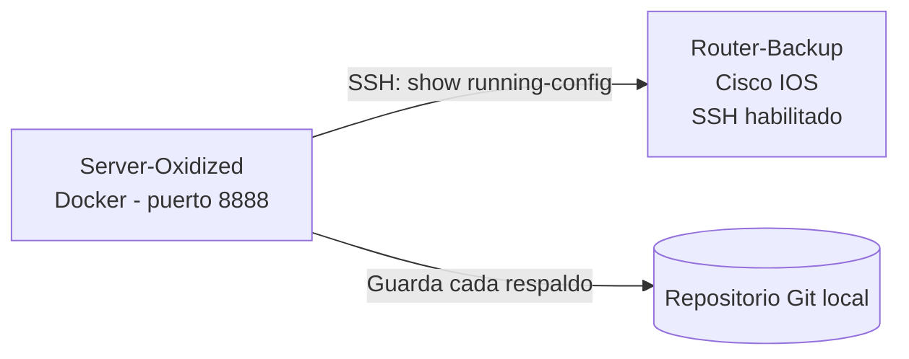

# Práctica 4: Respaldo y Versionado de Configuraciones con Oxidized

## Objetivo

Desplegar **Oxidized** mediante Docker, configurarlo para respaldar por SSH la configuración de un dispositivo Cisco IOS, verificar el respaldo inicial y comprobar que un cambio posterior en el dispositivo se refleja como una nueva versión con diferencias (diff) visibles.

**Duración estimada:** 1.5 horas (1-2 sesiones)

## Competencias a desarrollar

- Configura el acceso SSH administrativo necesario para que una herramienta de respaldo consulte un dispositivo Cisco IOS.
- Despliega Oxidized como contenedor Docker y define el inventario de dispositivos a respaldar (`router.db`).
- Verifica un respaldo de configuración exitoso y localiza su historial de versiones.
- Relaciona un cambio real de configuración con la generación automática de una nueva versión y su diferencia (diff).
- Explica el valor de Oxidized dentro de la Gestión de Configuración vista en [1.2 Configuracion.md](../1.2%20Configuracion.md): control de cambios, versionamiento, auditoría y capacidad de rollback.

## Introducción

En [1.2 Configuracion.md](../1.2%20Configuracion.md) se señaló que, sin un mecanismo automatizado de respaldo y versionamiento, las configuraciones de red se vuelven inconsistentes, los cambios quedan sin documentar y la recuperación ante un error de configuración puede tardar horas. **Oxidized** es una herramienta de código abierto, sucesora de RANCID, que se conecta periódicamente a los dispositivos de red mediante SSH o Telnet, descarga su configuración (`show running-config` en el caso de Cisco IOS) y la almacena en un repositorio Git. Cada respaldo se guarda como un nuevo commit, de modo que cualquier cambio posterior queda registrado como una diferencia (diff) revisable.

Esta práctica configura Oxidized en un contenedor Docker para respaldar un único router Cisco IOS, comprobando el flujo completo: acceso SSH, respaldo inicial, cambio real de configuración y verificación del nuevo respaldo con su diferencia.

## Equipo de protección e higiene

- No utilices las credenciales de esta práctica (usuario, contraseña) en dispositivos de producción; son válidas únicamente para el entorno de laboratorio.
- No expongas el puerto web de Oxidized (8888) hacia redes públicas o fuera del laboratorio.
- Guarda el archivo de configuración de Oxidized con las credenciales fuera de repositorios públicos si continúas usando este entorno después de la práctica.
- Verifica con el docente si el dispositivo Cisco a respaldar es compartido con otros equipos, para no interferir con su trabajo durante los cambios de configuración de la Parte 4.

## Prerrequisitos del entorno

- Una computadora con **Docker** instalado (Docker Desktop o Docker Engine), con permisos para ejecutar contenedores.
- Un dispositivo Cisco IOS (router o switch, físico o emulado en GNS3) accesible por SSH desde la computadora anterior. Puede reutilizarse un dispositivo de una práctica previa de la unidad.
- Conocer la dirección IP de administración del dispositivo Cisco y tener acceso de consola para configurarlo inicialmente.

## Entorno de referencia



| Elemento | Rol | Dato de referencia |
|---|---|---|
| Server-Oxidized | Equipo con Docker donde corre Oxidized | Dirección IP o `localhost` |
| Router-Backup | Dispositivo Cisco IOS a respaldar | Dirección IP de administración, por ejemplo `192.168.10.1` |
| Usuario Oxidized | Cuenta local en el dispositivo Cisco | `oxidized` / privilegio 15 |

## Instrucciones

### Parte 0: Preparar el acceso SSH en Router-Backup

1. Ingresa por consola a `Router-Backup` y configura el acceso SSH y un usuario dedicado:

    ```
    enable
    configure terminal
    hostname Router-Backup
    ip domain-name lab.local
    crypto key generate rsa modulus 1024
    username oxidized privilege 15 secret Oxidized2026!
    line vty 0 4
     transport input ssh
     login local
    end
    write memory
    ```

2. Desde la computadora donde instalarás Oxidized, prueba el acceso manualmente:

    ```bash
    ssh oxidized@192.168.10.1
    ```

3. Confirma que puedes autenticarte y ejecutar `show running-config` antes de continuar.

**Evidencia E1:** captura de la conexión SSH exitosa desde la terminal hacia `Router-Backup` con el usuario `oxidized`.

### Parte 1: Preparar la carpeta de trabajo y el inventario de dispositivos

1. Crea una carpeta de trabajo para Oxidized:

    ```bash
    mkdir -p ~/oxidized-lab/config
    cd ~/oxidized-lab
    ```

2. Crea el archivo de inventario `config/router.db` con el dispositivo a respaldar, usando el formato `nombre:modelo:grupo`:

    ```bash
    echo "192.168.10.1:ios:lab" > config/router.db
    ```

### Parte 2: Desplegar Oxidized con Docker

1. Genera un primer arranque para que Oxidized cree su archivo de configuración por defecto:

    ```bash
    docker run --rm -it \
      -v "$(pwd)/config:/home/oxidized/.config/oxidized" \
      oxidized/oxidized:latest oxidized
    ```

2. Detén el contenedor con `Ctrl+C` una vez que se haya generado el archivo `config/config`.
3. Edita `config/config` y ajusta, como mínimo, estos valores:

    ```yaml
    username: oxidized
    password: Oxidized2026!
    model: ios
    resolve_dns: false
    rest: 0.0.0.0:8888

    input:
      default: ssh
      ssh:
        secure: false

    source:
      default: csv
      csv:
        file: "/home/oxidized/.config/oxidized/router.db"
        delimiter: !ruby/regexp /:/
        map:
          name: 0
          model: 1
          group: 2
    ```

4. Crea el archivo `docker-compose.yml` en `~/oxidized-lab`:

    ```yaml
    services:
      oxidized:
        image: oxidized/oxidized:latest
        container_name: oxidized
        ports:
          - "8888:8888"
        volumes:
          - ./config:/home/oxidized/.config/oxidized
        restart: unless-stopped
    ```

5. Levanta el contenedor en segundo plano:

    ```bash
    docker compose up -d
    ```

**Evidencia E2:** captura del comando `docker compose up -d` o `docker ps` mostrando el contenedor `oxidized` en ejecución.

### Parte 3: Verificar el primer respaldo

1. Abre en el navegador `http://localhost:8888` para acceder a la interfaz web de Oxidized.
2. Localiza el nodo `192.168.10.1` en la lista y verifica su estado (debe cambiar a un estado exitoso después del primer intento de respaldo, según el `interval` configurado).
3. Si necesitas forzar el respaldo sin esperar el intervalo, usa la opción de la interfaz web para ejecutar el respaldo de inmediato, o el siguiente comando:

    ```bash
    curl http://localhost:8888/node/next/192.168.10.1
    ```

4. Da clic sobre el nodo para ver la configuración respaldada más reciente.

**Evidencia E3:** captura de la interfaz web de Oxidized mostrando el nodo `192.168.10.1` con estado exitoso.

**Evidencia E4:** captura de la configuración respaldada visible desde la interfaz web (debe distinguirse claramente que corresponde a `Router-Backup`, por ejemplo mostrando el `hostname`).

### Parte 4: Provocar un cambio real y verificar el nuevo respaldo

1. Ingresa nuevamente por consola o SSH a `Router-Backup` y realiza un cambio verificable, por ejemplo, agregar un mensaje del día:

    ```
    enable
    configure terminal
    banner motd # Cambio de prueba para la practica de Oxidized #
    end
    write memory
    ```

2. Regresa a la interfaz web de Oxidized y fuerza un nuevo respaldo del nodo (repite el paso de la Parte 3, punto 3).
3. Una vez que el nuevo respaldo se complete, busca en la interfaz la opción de historial de versiones (log) del nodo y selecciona comparar (diff) la versión más reciente contra la anterior.

**Evidencia E5:** captura del diff mostrado por Oxidized donde se observe la línea de `banner motd` agregada respecto a la versión anterior.

4. Como verificación adicional desde la línea de comandos, revisa el historial de commits del repositorio Git interno de Oxidized:

    ```bash
    docker exec -it oxidized git -C /home/oxidized/.config/oxidized/oxidized.git log --oneline
    ```

**Evidencia E6:** captura del historial de commits (`git log --oneline`) mostrando al menos dos versiones del dispositivo `192.168.10.1`.

## Registro de la práctica

| Campo | Dato registrado |
|---|---|
| Dirección IP de Router-Backup | |
| Hora del primer respaldo exitoso | |
| Cambio de configuración realizado | |
| Hora del segundo respaldo (tras el cambio) | |
| Número de commits en el historial tras el ejercicio | |
| ¿El diff mostró correctamente el cambio realizado? (Sí/No) | |

## Preguntas de análisis

1. ¿Qué function del modelo FCAPS corresponde a lo realizado en esta práctica, y por qué?
2. ¿Qué información le habría faltado a un administrador para diagnosticar "quién hizo qué cambio y cuándo" si no existiera el historial de versiones que generó Oxidized?
3. Si `Router-Backup` fallara y necesitaras restaurar su configuración, ¿qué pasos tomarías a partir de lo que Oxidized guardó? Describe el procedimiento en términos generales, sin ejecutarlo.
4. ¿Qué riesgo de seguridad identificas en el uso de un usuario con privilegio 15 y contraseña en texto plano dentro del archivo de configuración de Oxidized? ¿Qué alternativa mencionarías para mitigarlo en un entorno real?
5. ¿Qué diferencia existe entre que Oxidized simplemente guarde una copia de la configuración y que además genere un diff automático entre versiones?

## Evidencia y evaluación

Actividad de laboratorio con evidencia visual obligatoria.

- **Instrumento sugerido:** lista de cotejo para verificar la presencia de las seis evidencias (`E1` a `E6`), el registro de la práctica y las respuestas de análisis.
- **Producto esperado:** reporte con las capturas `E1` a `E6`, la tabla de registro completa y las respuestas a las preguntas de análisis.

| Criterio | Cumple | No cumple |
|---|---|---|
| Acceso SSH configurado y verificado en Router-Backup (E1) | | |
| Oxidized desplegado correctamente en Docker (E2) | | |
| Primer respaldo exitoso verificado en la interfaz web (E3, E4) | | |
| Cambio real realizado y nuevo respaldo generado | | |
| Diff mostrando el cambio, verificado en la interfaz web y en Git (E5, E6) | | |
| Preguntas de análisis respondidas con justificación técnica | | |

## Notas

- Si no se dispone de un dispositivo Cisco físico o emulado en GNS3, consulta con el docente por un dispositivo compartido de laboratorio antes de iniciar la práctica; Oxidized requiere un dispositivo real (o emulado con IOS real) alcanzable por SSH, no es compatible de forma directa con topologías de Packet Tracer.
- El intervalo de respaldo (`interval`) definido en la configuración determina cada cuánto tiempo Oxidized revisa los dispositivos automáticamente; forzar el respaldo manualmente evita esperar ese intervalo durante la práctica.
- En un entorno de producción, la contraseña del usuario de Oxidized no debe guardarse en texto plano dentro del archivo de configuración; se recomienda usar variables de entorno protegidas, un gestor de secretos o cuentas con permisos restringidos a solo lectura de configuración.
- Conserva el contenedor y su carpeta de configuración si planeas continuar usando este entorno en una práctica posterior sobre auditoría de cambios o inventario de dispositivos.
