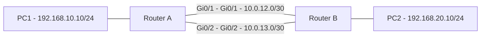

# Práctica 7: Técnicas de optimización del desempeño (QoS, Traffic Shaping y Balanceo de Carga)

## Objetivo

Aplicar y comparar el efecto de tres técnicas de optimización del desempeño (QoS, Traffic Shaping y balanceo de carga con ECMP) sobre un enlace WAN simulado, midiendo el impacto en throughput, latencia y priorización de tráfico antes y después de cada configuración.

**Duración estimada:** 2 horas

## Competencias a desarrollar

- Aplica las funciones de la administración de redes para la optimización del desempeño y el aseguramiento de las mismas.
- Configura QoS para clasificar y priorizar tráfico crítico sobre tráfico de baja prioridad.
- Aplica Traffic Shaping para controlar ráfagas de tráfico y evitar saturación de buffers.
- Configura balanceo de carga (ECMP) entre dos enlaces de igual costo.
- Compara métricas de desempeño antes y después de aplicar cada técnica, y justifica cuál es más adecuada según el escenario.

## Introducción

La Gestión del Desempeño no se limita a medir métricas; también implica **actuar** sobre la red para mejorar su comportamiento. En esta práctica se implementan tres técnicas de optimización revisadas en la teoría: **QoS** (priorización de tráfico), **Traffic Shaping** (control de ráfagas) y **Load Balancing con ECMP** (distribución de tráfico entre enlaces redundantes).

Se trabajará con dos routers Cisco (en **GNS3**, **PNetLab** o **laboratorio físico**) interconectados por dos enlaces WAN, simulando tráfico de distintas clases (crítico, normal y de baja prioridad) para observar el efecto de cada técnica en el desempeño.

La práctica se relaciona con la sección "Técnicas de optimización" de [1.4 Desempeño.md](../1.4%20Desempeño.md).

## Equipo de protección e higiene

- Realiza los cambios de configuración únicamente en el entorno de laboratorio o simulación, nunca sobre equipo en producción.
- Guarda la configuración inicial de cada router (`show running-config`) antes de aplicar cambios, para poder revertirlos.
- Si usas equipo físico, verifica cableado y etiquetado de interfaces antes de energizar los dispositivos.
- Documenta cada cambio y su justificación antes de aplicarlo.

## Material y equipo necesario

### Materiales e insumos

- Documento o bitácora de reporte con espacio para capturas de comandos `show`.
- Diagrama de la topología utilizada.

### Equipo de laboratorio

- **GNS3**, **PNetLab** o dos routers Cisco físicos (IOS con soporte de `policy-map`/`class-map`). La plataforma debe registrarse en el reporte.
- Dos enlaces WAN entre Router A y Router B (dos interfaces por router, con igual costo OSPF).
- Dos hosts o PC finales (uno en cada extremo) para generar tráfico de prueba (PC de GNS3/PNetLab, VPCS o máquina Linux/Windows).
- Opcional: un tercer host Linux para pruebas de throughput con `iperf3`.

### Herramientas

- CLI de IOS (`class-map`, `policy-map`, `service-policy`, `shape`, `router ospf`).
- `ping`, `tracert`/`traceroute`.
- `iperf3` (si se cuenta con hosts Linux o Windows con la herramienta instalada).

## Topología de referencia



## Direccionamiento IP

| Dispositivo | Interfaz | Dirección IP | Conecta con |
|---|---|---|---|
| Router A | Gi0/0 | 192.168.10.1/24 | PC1 |
| Router A | Gi0/1 | 10.0.12.1/30 | Router B Gi0/1 (Enlace 1) |
| Router A | Gi0/2 | 10.0.13.1/30 | Router B Gi0/2 (Enlace 2) |
| Router B | Gi0/1 | 10.0.12.2/30 | Router A Gi0/1 (Enlace 1) |
| Router B | Gi0/2 | 10.0.13.2/30 | Router A Gi0/2 (Enlace 2) |
| Router B | Gi0/0 | 192.168.20.1/24 | PC2 |
| PC1 | - | 192.168.10.10/24, gateway 192.168.10.1 | Router A Gi0/0 |
| PC2 | - | 192.168.20.10/24, gateway 192.168.20.1 | Router B Gi0/0 |

Ajusta los nombres de interfaz (`GigabitEthernet0/0`, `Gi0/1`, etc.) según el modelo de router disponible en GNS3, PNetLab o el equipo físico.

## Instrucciones

### Parte 1: Direccionamiento, enrutamiento y línea base sin optimización

1. Configura el direccionamiento IP en **Router A**:

   ```cisco
   enable
   configure terminal
   hostname RouterA
   !
   interface GigabitEthernet0/0
    description LAN-PC1
    ip address 192.168.10.1 255.255.255.0
    no shutdown
   !
   interface GigabitEthernet0/1
    description WAN-Enlace1-a-RouterB
    ip address 10.0.12.1 255.255.255.252
    no shutdown
   !
   interface GigabitEthernet0/2
    description WAN-Enlace2-a-RouterB
    ip address 10.0.13.1 255.255.255.252
    no shutdown
   !
   end
   write memory
   ```

2. Configura el direccionamiento IP en **Router B**:

   ```cisco
   enable
   configure terminal
   hostname RouterB
   !
   interface GigabitEthernet0/0
    description LAN-PC2
    ip address 192.168.20.1 255.255.255.0
    no shutdown
   !
   interface GigabitEthernet0/1
    description WAN-Enlace1-a-RouterA
    ip address 10.0.12.2 255.255.255.252
    no shutdown
   !
   interface GigabitEthernet0/2
    description WAN-Enlace2-a-RouterA
    ip address 10.0.13.2 255.255.255.252
    no shutdown
   !
   end
   write memory
   ```

3. Habilita OSPF de área única en ambos routers. En **Router A**:

   ```cisco
   configure terminal
   router ospf 1
    router-id 1.1.1.1
    network 192.168.10.0 0.0.0.255 area 0
    network 10.0.12.0 0.0.0.3 area 0
    network 10.0.13.0 0.0.0.3 area 0
   end
   write memory
   ```

4. En **Router B**:

   ```cisco
   configure terminal
   router ospf 1
    router-id 2.2.2.2
    network 192.168.20.0 0.0.0.255 area 0
    network 10.0.12.0 0.0.0.3 area 0
    network 10.0.13.0 0.0.0.3 area 0
   end
   write memory
   ```

5. Verifica adyacencias OSPF y rutas aprendidas en cualquiera de los dos routers:

   ```cisco
   show ip ospf neighbor
   show ip route ospf
   ```

6. Configura el direccionamiento en **PC1** (192.168.10.10/24, gateway 192.168.10.1) y en **PC2** (192.168.20.10/24, gateway 192.168.20.1) según la plataforma utilizada:

   ```text
   # VPCS (GNS3/PNetLab)
   ip 192.168.10.10/24 192.168.10.1        (en PC1)
   ip 192.168.20.10/24 192.168.20.1        (en PC2)

   # Linux
   sudo ip addr add 192.168.10.10/24 dev eth0
   sudo ip route add default via 192.168.10.1
   ```

7. Verifica conectividad extremo a extremo desde PC1:

   ```cisco
   ping 192.168.20.10
   ```

8. Si cuentas con `iperf3`, mide el throughput inicial entre PC1 y PC2:

   ```bash
   iperf3 -s                        # en PC2
   iperf3 -c 192.168.20.10 -t 20    # en PC1
   ```

9. Registra latencia promedio y throughput como **línea base sin optimización**.

**Evidencia E1:** capturas de `ping`/`iperf3`, `show ip ospf neighbor` y `show ip route ospf` con direccionamiento documentado.

### Parte 2: Configurar QoS

1. En **Router A** (punto donde sale el tráfico hacia el enlace WAN 1), define listas de acceso para clasificar el tráfico. Se usará el puerto 5201 (`iperf3`) como tráfico crítico y el puerto 21 (FTP) como tráfico de baja prioridad:

   ```cisco
   configure terminal
   ip access-list extended ACL-CRITICO
    permit tcp any any eq 5201
   !
   ip access-list extended ACL-SCAVENGER
    permit tcp any any eq 21
   end
   ```

2. Crea las clases de tráfico con `class-map`:

   ```cisco
   configure terminal
   class-map match-any CLASE-CRITICA
    match access-group name ACL-CRITICO
   !
   class-map match-any CLASE-SCAVENGER
    match access-group name ACL-SCAVENGER
   end
   ```

3. Crea la política de servicio `policy-map` con porcentajes de ancho de banda garantizado:

   ```cisco
   configure terminal
   policy-map POLITICA-QOS
    class CLASE-CRITICA
     bandwidth percent 60
    class CLASE-SCAVENGER
     bandwidth percent 5
    class class-default
     fair-queue
   end
   ```

4. Aplica la política de servicio en la interfaz WAN de salida (Gi0/1) de Router A:

   ```cisco
   configure terminal
   interface GigabitEthernet0/1
    service-policy output POLITICA-QOS
   end
   write memory
   ```

5. Genera tráfico simultáneo de ambas clases, por ejemplo una prueba `iperf3` en el puerto 5201 (crítica) y una transferencia FTP o `iperf3 -p 21` (baja prioridad, requiere permisos de administrador para usar el puerto 21), y verifica el comportamiento:

   ```cisco
   show policy-map interface GigabitEthernet0/1
   ```

6. Registra cómo cambia la distribución de ancho de banda entre clases respecto a la línea base.

**Evidencia E2:** configuración de `class-map`/`policy-map` y salida de `show policy-map interface` con tráfico activo.

### Parte 3: Configurar Traffic Shaping

1. Sobre la misma interfaz WAN (Gi0/1 de Router A), aplica un `shape average` para limitar la tasa de salida a 50 Mbps (ajusta el valor según la capacidad del enlace simulado):

   ```cisco
   configure terminal
   policy-map POLITICA-SHAPE
    class class-default
     shape average 50000000
     service-policy POLITICA-QOS
   !
   interface GigabitEthernet0/1
    service-policy output POLITICA-SHAPE
   end
   write memory
   ```

   > **Nota:** al anidar `POLITICA-QOS` dentro de `POLITICA-SHAPE`, solo se aplica una `service-policy output` en la interfaz (la de shaping), que a su vez invoca la política de QoS.

2. Genera una ráfaga de tráfico, por ejemplo varias sesiones `iperf3` en paralelo desde PC1:

   ```bash
   iperf3 -c 192.168.20.10 -P 4 -t 20
   ```

3. Verifica la tasa moldeada y los descartes:

   ```cisco
   show policy-map interface GigabitEthernet0/1
   ```

4. Compara el comportamiento de la latencia y las pérdidas con y sin shaping durante la ráfaga (puedes remover temporalmente `service-policy output POLITICA-SHAPE` de la interfaz para repetir la prueba sin shaping).

**Evidencia E3:** configuración de shaping y comparación de resultados con y sin ráfaga controlada.

### Parte 4: Configurar balanceo de carga (ECMP)

1. En ambos routers, asegura que los dos enlaces WAN tengan el mismo costo OSPF (por defecto, si el ancho de banda configurado en las interfaces es igual, el costo ya es igual; se puede forzar explícitamente):

   ```cisco
   configure terminal
   interface GigabitEthernet0/1
    ip ospf cost 10
   !
   interface GigabitEthernet0/2
    ip ospf cost 10
   end
   write memory
   ```

   (Repite este bloque en Router A y en Router B.)

2. Habilita múltiples rutas de igual costo en el proceso OSPF:

   ```cisco
   configure terminal
   router ospf 1
    maximum-paths 4
   end
   write memory
   ```

   (Repite en Router A y en Router B.)

3. Verifica que la tabla de enrutamiento muestre las dos rutas de igual costo hacia la red remota:

   ```cisco
   show ip route 192.168.20.0
   ```

4. Genera dos flujos de tráfico distintos, por ejemplo dos sesiones `iperf3` con puertos diferentes desde PC1 (o `ping` desde dos hosts distintos si se dispone de ellos), y verifica en las interfaces de Router A cuál enlace transporta cada flujo:

   ```bash
   iperf3 -c 192.168.20.10 -p 5201 -t 20     # flujo 1
   iperf3 -c 192.168.20.10 -p 5202 -t 20     # flujo 2 (iperf3 -s -p 5202 en PC2)
   ```

   ```cisco
   show interfaces GigabitEthernet0/1 | include packets
   show interfaces GigabitEthernet0/2 | include packets
   ```

5. Registra si el tráfico se distribuyó entre ambos enlaces o se concentró en uno solo, y explica por qué (hash por flujo).

**Evidencia E4:** configuración de ECMP y evidencia de distribución de tráfico entre los dos enlaces.

## Registro de resultados

| Condición | Throughput | Latencia | Pérdida de paquetes | Observaciones |
|---|---:|---:|---:|---|
| Sin optimización (línea base) | | | | |
| Con QoS activo | | | | |
| Con Traffic Shaping activo | | | | |
| Con ECMP activo | | | | |

## Preguntas de análisis

1. ¿Por qué QoS no aumenta el ancho de banda total del enlace, pero sí mejora la experiencia del tráfico crítico?
2. ¿Qué problema específico resuelve el Traffic Shaping que QoS por sí solo no resuelve?
3. ¿Qué ocurre si los dos enlaces en ECMP no tienen el mismo costo? ¿Cómo lo verificarías?
4. ¿Por qué el balanceo ECMP se realiza por flujo y no por paquete individual? ¿Qué ventaja y qué limitación tiene esto?
5. De las tres técnicas aplicadas, ¿cuál recomendarías primero para un enlace WAN saturado con tráfico de VoIP y cuál para un enlace con throughput insuficiente? Justifica.

## Evidencia y evaluación

**Producto esperado:** reporte técnico con topología, configuraciones de QoS, Shaping y ECMP, capturas E1-E4, tabla comparativa de resultados y respuestas de análisis.

**Instrumento sugerido:** lista de cotejo.

| Criterio | Cumple | No cumple |
|---|---|---|
| Establece una línea base sin optimización | | |
| Configura clases de tráfico y política de QoS funcional | | |
| Verifica priorización de tráfico crítico con `show policy-map interface` | | |
| Configura Traffic Shaping y evidencia su efecto ante una ráfaga | | |
| Configura ECMP con rutas de igual costo | | |
| Evidencia distribución de tráfico entre los dos enlaces | | |
| Compara las cuatro condiciones en la tabla de resultados | | |
| Responde las preguntas de análisis con argumentos técnicos | | |

## Notas

- Si no se cuenta con `iperf3`, se pueden usar transferencias de archivos grandes o múltiples solicitudes `ping -f` (flood, solo en laboratorio aislado) para generar carga de prueba.
- El comportamiento y la disponibilidad de comandos QoS/Shaping puede variar ligeramente entre la imagen IOS usada en GNS3/PNetLab y un router físico; si algún comando no está disponible, documenta la alternativa utilizada.
- El balanceo ECMP distribuye por flujo (hash de 5-tuplas), por lo que un solo flujo grande no se dividirá entre los dos enlaces; esto debe explicarse en el análisis si se observa concentración en un solo enlace.
- Esta práctica es complementaria a la Práctica 3.4 (Análisis de Desempeño) y a la Práctica 3.4B (Gestión del Desempeño con Monitoreo y Carga): aquí el énfasis está en **aplicar** técnicas de optimización, mientras que en la Unidad 3 el énfasis está en **medir y monitorear** el desempeño resultante.
