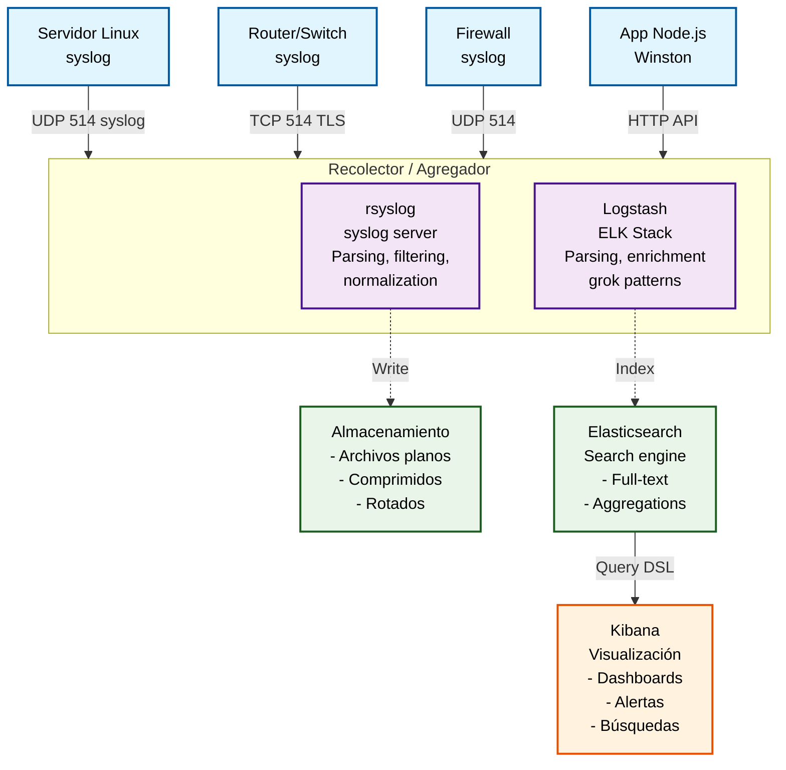

# 3.2 Bitácoras (Logs)

> **"Los logs son la caja negra de tu red"** - Toda acción, evento o error debe quedar registrado para análisis posterior, auditoría y troubleshooting.

## Descripción

Las **bitácoras** o **logs** son registros cronológicos de eventos que ocurren en sistemas, aplicaciones y dispositivos de red. Son fundamentales para:

- ✅ **Troubleshooting**: Identificar causa raíz de problemas
- ✅ **Auditoría**: Cumplir con compliance (PCI-DSS, HIPAA, SOX)
- ✅ **Seguridad**: Detectar intrusiones, ataques, accesos no autorizados
- ✅ **Análisis forense**: Investigar incidentes de seguridad
- ✅ **Monitoreo proactivo**: Alertas basadas en patrones de logs
- ✅ **Capacity planning**: Tendencias de uso de recursos

### Problema sin gestión centralizada de logs

```
Servidor web cae a medianoche
→ Administrador se conecta al servidor
→ Revisa /var/log/apache2/error.log manualmente
→ Encuentra "Segmentation fault" pero no hay contexto
→ Revisa /var/log/syslog → OOM Killer mató Apache
→ Revisa /var/log/mysql/error.log → Query lento causó memoria llena
→ Tiempo invertido: 2 horas (conectarse a 3 servers diferentes)
→ No hay correlación automática entre eventos
```

### Solución con gestión centralizada

```
Todos los logs → Servidor central → Análisis automático
→ Dashboard muestra correlación: MySQL slow query → OOM → Apache crash
→ Alerta enviada 5 minutos después del evento
→ Administrador ve dashboard desde casa
→ Tiempo de diagnóstico: 5 minutos
→ Query lento identificado con context completo
```

## Arquitectura de Gestión de Logs




## Protocolo Syslog

### RFC 5424 - The Syslog Protocol

**Puerto:** UDP 514 (tradicional), TCP 514 (seguro), TCP 6514 (TLS)  
**Formato:** `<PRI>VERSION TIMESTAMP HOSTNAME APP-NAME PROCID MSGID STRUCTURED-DATA MSG`

#### Niveles de Severidad (Severity)

| Código | Nombre | Descripción | Ejemplo |
|--------|--------|-------------|---------|
| **0** | Emergency | Sistema inutilizable | Kernel panic |
| **1** | Alert | Acción inmediata requerida | Filesystem 100% full |
| **2** | Critical | Condición crítica | Temperatura CPU crítica |
| **3** | Error | Condiciones de error | Failed to start service |
| **4** | Warning | Condiciones de advertencia | Disk 90% full |
| **5** | Notice | Normal pero significativo | User logged in |
| **6** | Informational | Mensajes informativos | Service started |
| **7** | Debug | Mensajes de debug | Function called with param X |

#### Facilidades (Facilities)

| Código | Facility | Descripción |
|--------|----------|-------------|
| **0** | kern | Mensajes del kernel |
| **1** | user | Mensajes de usuario |
| **2** | mail | Sistema de correo |
| **3** | daemon | Daemons del sistema |
| **4** | auth | Seguridad/autorización |
| **5** | syslog | syslogd interno |
| **6** | lpr | Subsistema de impresión |
| **7** | news | Network news |
| **8** | uucp | UUCP subsystem |
| **9** | cron | Clock daemon |
| **10** | authpriv | Seguridad/autorización (privado) |
| **11** | ftp | FTP daemon |
| **16-23** | local0-local7 | Uso local customizable |

#### Cálculo de PRI (Priority)

```
PRI = Facility * 8 + Severity

Ejemplo:
  auth (4) + error (3) = 4*8 + 3 = 35
  local0 (16) + info (6) = 16*8 + 6 = 134

Formato en mensaje: <35> o <134>
```

#### Formato de Mensaje Syslog (RFC 5424)

```
<34>1 2026-04-03T14:30:15.003Z server1.ejemplo.com sshd 1234 ID47 [exampleSDID@32473 iut="3" eventSource="Application" eventID="1011"] Failed password for root from 192.168.1.100 port 54321 ssh2

│   │ │                       │                   │    │    │    │                                                                │
│   │ │                       │                   │    │    │    └─ Mensaje legible
│   │ │                       │                   │    │    └─ Datos estructurados (opcional)
│   │ │                       │                   │    └─ Message ID (opcional)
│   │ │                       │                   └─ Process ID
│   │ │                       └─ Nombre de aplicación
│   │ └─ Hostname
│   └─ Timestamp (ISO 8601)
└─ PRI (facility=4 auth, severity=2 critical → 4*8+2=34)
```

## rsyslog - Sistema de Logging Moderno

**rsyslog** es la implementación moderna de syslog en Linux (reemplaza a syslogd tradicional).

### Instalación

```bash
# Ubuntu/Debian (ya viene instalado)
sudo apt install rsyslog -y

# Rocky Linux
sudo dnf install rsyslog -y

# Verificar instalación
rsyslogd -v

# Iniciar servicio
sudo systemctl enable rsyslog --now
sudo systemctl status rsyslog
```

### Configuración de rsyslog

**Archivo principal:** `/etc/rsyslog.conf`

```conf
# /etc/rsyslog.conf

#### MODULES ####

# Recibir logs vía UDP
module(load="imudp")
input(type="imudp" port="514")

# Recibir logs vía TCP (más confiable)
module(load="imtcp")
input(type="imtcp" port="514")

# Soporte para systemd journal
module(load="imjournal")

#### GLOBAL DIRECTIVES ####

# Formato de archivo
$FileCreateMode 0640
$DirCreateMode 0755
$Umask 0022

# Templates para formato de logs
template(name="CustomFormat" type="string"
  string="%TIMESTAMP% %HOSTNAME% %syslogtag%%msg:::sp-if-no-1st-sp%%msg:::drop-last-lf%\n"
)

#### RULES ####

# Logs de autenticación (sensibles)
auth,authpriv.*                 /var/log/auth.log

# Todos los logs del kernel
kern.*                          /var/log/kern.log

# Logs de cron
cron.*                          /var/log/cron.log

# Logs de mail
mail.*                          /var/log/mail.log

# Emergencias a todos los usuarios logueados
*.emerg                         :omusrmsg:*

# Descartar mensajes de debug (opcional)
*.=debug                        stop

# Todos los otros logs
*.info;mail.none;authpriv.none;cron.none    /var/log/messages

# Logs a servidor remoto
*.* @@logserver.ejemplo.com:514
# @ = UDP, @@ = TCP
```

### Filtrado Avanzado en rsyslog

```conf
# Filtrar por facility y severity
auth.info                       /var/log/auth-info.log
auth.warning                    /var/log/auth-warning.log

# Filtrar por hostname
:hostname, isequal, "web01"     /var/log/web01.log

# Filtrar por mensaje (regex)
:msg, contains, "Failed password"    /var/log/ssh-failed.log

# Filtrar por programa
:programname, isequal, "sshd"   /var/log/sshd.log

# Múltiples condiciones
if $programname == 'sshd' and $msg contains 'Failed' then {
    /var/log/ssh-attacks.log
    stop
}

# Descartar logs de cierto host (reduce ruido)
:hostname, isequal, "spammy-server"     stop
```

### Servidor Centralizado de Logs con rsyslog

**Servidor (logserver):**

```bash
sudo nano /etc/rsyslog.conf
```

```conf
# /etc/rsyslog.conf - SERVIDOR

# Habilitar recepción UDP
module(load="imudp")
input(type="imudp" port="514")

# Habilitar recepción TCP (recomendado)
module(load="imtcp")
input(type="imtcp" port="514")

# Template para organizar logs por host
template(name="RemoteHost" type="string"
  string="/var/log/remote/%HOSTNAME%/%PROGRAMNAME%.log"
)

# Guardar logs remotos en directorios separados por host
*.* ?RemoteHost
# ?: crear directorios si no existen

# Detener procesamiento de logs remotos (no duplicar en local)
& stop
```

```bash
# Crear directorio para logs remotos
sudo mkdir -p /var/log/remote
sudo chown syslog:adm /var/log/remote

# Firewall (permitir puerto 514)
sudo ufw allow 514/tcp
sudo ufw allow 514/udp

# Reiniciar rsyslog
sudo systemctl restart rsyslog

# Verificar que escucha en puerto 514
sudo ss -tulnp | grep rsyslog
```

**Clientes (envían logs al servidor):**

```bash
sudo nano /etc/rsyslog.conf
```

```conf
# /etc/rsyslog.conf - CLIENTE

# Enviar todos los logs al servidor central
*.* @@logserver.ejemplo.com:514
# @@: TCP (confiable)
# @: UDP (más rápido pero puede perder paquetes)

# Opcionalmente, mantener logs locales también
*.* /var/log/syslog
```

```bash
# Reiniciar rsyslog
sudo systemctl restart rsyslog

# Probar enviando log de prueba
logger -t test-app "Mensaje de prueba desde $(hostname)"

# Verificar en servidor que llegó el log
ssh logserver
tail -f /var/log/remote/$(hostname)/test-app.log
```

### TLS para Syslog (Seguro)

**Servidor:**

```bash
# Generar certificados (o usar Let's Encrypt)
sudo openssl req -new -x509 -days 365 -nodes \
  -out /etc/rsyslog-certs/server.pem \
  -keyout /etc/rsyslog-certs/server-key.pem \
  -subj "/C=MX/ST=Jalisco/L=GDL/O=Ejemplo/CN=logserver.ejemplo.com"

sudo chmod 600 /etc/rsyslog-certs/server-key.pem
```

```conf
# /etc/rsyslog.conf - Servidor con TLS

# Cargar módulos TLS
module(load="imtcp"
  StreamDriver.Name="gtls"
  StreamDriver.Mode="1"
  StreamDriver.AuthMode="anon"
)

# Certificados
global(
  DefaultNetstreamDriver="gtls"
  DefaultNetstreamDriverCAFile="/etc/rsyslog-certs/ca.pem"
  DefaultNetstreamDriverCertFile="/etc/rsyslog-certs/server.pem"
  DefaultNetstreamDriverKeyFile="/etc/rsyslog-certs/server-key.pem"
)

# Escuchar en puerto TLS
input(type="imtcp" port="6514")
```

**Cliente:**

```conf
# /etc/rsyslog.conf - Cliente con TLS

# Configuración TLS
global(
  DefaultNetstreamDriver="gtls"
  DefaultNetstreamDriverCAFile="/etc/rsyslog-certs/ca.pem"
)

# Enviar logs vía TLS
*.* @@logserver.ejemplo.com:6514
```

## syslog-ng - Alternativa Avanzada

**syslog-ng** es una alternativa más poderosa a rsyslog, con mejor filtrado y parsing.

### Instalación

```bash
# Ubuntu
sudo apt install syslog-ng -y

# Rocky Linux
sudo dnf install syslog-ng -y

# Deshabilitar rsyslog primero
sudo systemctl stop rsyslog
sudo systemctl disable rsyslog

# Iniciar syslog-ng
sudo systemctl enable syslog-ng --now
```

### Configuración de syslog-ng

```conf
# /etc/syslog-ng/syslog-ng.conf

@version: 3.35

# Opciones globales
options {
  stats_freq(600);
  time_reopen(10);
  log_fifo_size(10000);
  chain_hostnames(no);
  use_dns(no);
  use_fqdn(no);
  create_dirs(yes);
  keep_hostname(yes);
  perm(0640);
  dir_perm(0750);
};

# Sources (de dónde vienen los logs)
source s_local {
  system();
  internal();
};

source s_network {
  udp(port(514));
  tcp(port(514));
};

# Destinations (a dónde van los logs)
destination d_messages {
  file("/var/log/messages");
};

destination d_auth {
  file("/var/log/auth.log");
};

destination d_remote {
  file("/var/log/remote/$HOST/$PROGRAM.log" create_dirs(yes));
};

# Filters (qué logs pasar)
filter f_auth {
  facility(auth, authpriv);
};

filter f_messages {
  level(info..emerg) and not facility(auth, authpriv, cron, daemon, mail);
};

filter f_ssh_failed {
  program("sshd") and match("Failed password" value("MESSAGE"));
};

# Log paths (conectar source → filter → destination)
log {
  source(s_local);
  filter(f_auth);
  destination(d_auth);
};

log {
  source(s_local);
  filter(f_messages);
  destination(d_messages);
};

log {
  source(s_network);
  destination(d_remote);
};

# Alerta para intentos SSH fallidos
log {
  source(s_local);
  filter(f_ssh_failed);
  destination {
    file("/var/log/ssh-attacks.log");
    program("/usr/local/bin/alert-ssh-failed.sh");
  };
};
```

### Parsing Estructurado con syslog-ng

```conf
# Parser para logs de Apache
parser p_apache {
  csv-parser(
    columns("client_ip", "ident", "userid", "timestamp", "request", "status", "size")
    delimiters(" ")
    quote-pairs('""')
  );
};

# Aplicar parser
log {
  source(s_network);
  filter { program("apache"); };
  parser(p_apache);
  destination {
    file("/var/log/apache-parsed.log"
      template("${client_ip} - ${status} - ${request}\n")
    );
  };
};
```

## ELK Stack (Elasticsearch, Logstash, Kibana)

**ELK** es la solución más popular para análisis de logs a escala empresarial.

### Arquitectura ELK

```
┌─────────────────────────────────────────────────────────────────┐
│                      Fuentes de Datos                            │
│  Servidores, Apps, Dispositivos de Red                          │
└──────────────────┬──────────────────────────────────────────────┘
                   │
                   │ Logs (archivos, syslog, beats)
                   │
┌──────────────────▼──────────────────────────────────────────────┐
│                      Logstash                                    │
│              (Ingestión y Procesamiento)                         │
│  - Input plugins (file, syslog, beats, kafka)                   │
│  - Filter plugins (grok, mutate, date, geoip)                   │
│  - Output plugins (elasticsearch, file, kafka)                  │
└──────────────────┬──────────────────────────────────────────────┘
                   │
                   │ JSON documents
                   │
┌──────────────────▼──────────────────────────────────────────────┐
│                   Elasticsearch                                  │
│               (Almacenamiento e Indexación)                      │
│  - Cluster de nodos                                              │
│  - Indices con shards y réplicas                                 │
│  - Full-text search                                              │
│  - Aggregations (stats, histograms, etc.)                        │
└──────────────────┬──────────────────────────────────────────────┘
                   │
                   │ REST API / Query DSL
                   │
┌──────────────────▼──────────────────────────────────────────────┐
│                       Kibana                                     │
│                  (Visualización y Análisis)                      │
│  - Discover (búsqueda interactiva)                               │
│  - Visualize (gráficas, tablas, mapas)                          │
│  - Dashboard (paneles personalizados)                            │
│  - Alerting (Watcher)                                            │
└──────────────────────────────────────────────────────────────────┘
```

### Instalación de ELK Stack

#### Elasticsearch

```bash
# Agregar repositorio
wget -qO - https://artifacts.elastic.co/GPG-KEY-elasticsearch | sudo gpg --dearmor -o /usr/share/keyrings/elasticsearch-keyring.gpg

echo "deb [signed-by=/usr/share/keyrings/elasticsearch-keyring.gpg] https://artifacts.elastic.co/packages/8.x/apt stable main" | sudo tee /etc/apt/sources.list.d/elastic-8.x.list

# Instalar Elasticsearch
sudo apt update
sudo apt install elasticsearch -y

# Configurar
sudo nano /etc/elasticsearch/elasticsearch.yml
```

```yaml
# /etc/elasticsearch/elasticsearch.yml

cluster.name: logs-cluster
node.name: node-1

# Network
network.host: 0.0.0.0
http.port: 9200

# Discovery (single node para desarrollo)
discovery.type: single-node

# Paths
path.data: /var/lib/elasticsearch
path.logs: /var/log/elasticsearch

# Memory (ajustar según RAM disponible)
# En /etc/elasticsearch/jvm.options:
# -Xms2g
# -Xmx2g
```

```bash
# Iniciar Elasticsearch
sudo systemctl enable elasticsearch --now

# Verificar
curl -X GET "localhost:9200/?pretty"

# Debe devolver info del cluster
```

#### Logstash

```bash
# Instalar Logstash
sudo apt install logstash -y

# Configurar
sudo nano /etc/logstash/conf.d/syslog.conf
```

```conf
# /etc/logstash/conf.d/syslog.conf

input {
  # Recibir syslog vía UDP
  udp {
    port => 5514
    type => "syslog"
  }
  
  # Recibir syslog vía TCP
  tcp {
    port => 5514
    type => "syslog"
  }
  
  # Leer archivos de log locales
  file {
    path => "/var/log/syslog"
    start_position => "beginning"
    type => "syslog"
  }
}

filter {
  # Parsear syslog
  if [type] == "syslog" {
    grok {
      match => {
        "message" => "%{SYSLOGTIMESTAMP:syslog_timestamp} %{SYSLOGHOST:hostname} %{DATA:program}(?:\[%{POSINT:pid}\])?: %{GREEDYDATA:syslog_message}"
      }
    }
    
    # Convertir timestamp
    date {
      match => [ "syslog_timestamp", "MMM  d HH:mm:ss", "MMM dd HH:mm:ss" ]
      target => "@timestamp"
    }
    
    # Agregar GeoIP si es IP
    geoip {
      source => "client_ip"
      target => "geoip"
    }
  }
}

output {
  # Enviar a Elasticsearch
  elasticsearch {
    hosts => ["localhost:9200"]
    index => "syslog-%{+YYYY.MM.dd}"
  }
  
  # Debug: imprimir en stdout (desarrollo)
  # stdout { codec => rubydebug }
}
```

```bash
# Probar configuración
sudo /usr/share/logstash/bin/logstash --config.test_and_exit -f /etc/logstash/conf.d/syslog.conf

# Iniciar Logstash
sudo systemctl enable logstash --now

# Ver logs
sudo journalctl -u logstash -f
```

#### Kibana

```bash
# Instalar Kibana
sudo apt install kibana -y

# Configurar
sudo nano /etc/kibana/kibana.yml
```

```yaml
# /etc/kibana/kibana.yml

server.port: 5601
server.host: "0.0.0.0"
server.name: "kibana-server"

elasticsearch.hosts: ["http://localhost:9200"]

# Logging
logging.dest: /var/log/kibana/kibana.log
```

```bash
# Iniciar Kibana
sudo systemctl enable kibana --now

# Acceder a web UI
# http://servidor:5601

# Firewall
sudo ufw allow 5601/tcp
```

### Uso de Kibana

**Discover (Búsqueda):**

```
1. Ir a Kibana → Discover
2. Crear index pattern: syslog-*
3. Seleccionar @timestamp como Time Field
4. Buscar logs:
   - program: "sshd"
   - syslog_message: "Failed password"
   - hostname: "web01"
   
KQL (Kibana Query Language):
  program: "sshd" AND syslog_message: *Failed*
  hostname: "web01" OR hostname: "web02"
  @timestamp: [now-1h TO now]
```

**Visualizations:**

```
1. Crear visualización → Vertical Bar Chart
2. Y-axis: Count
3. X-axis: Date Histogram (@timestamp)
4. Split Series: Terms (program.keyword)
5. Guardar como "Logs por Programa"
```

**Dashboard:**

```
1. Crear Dashboard
2. Agregar visualizaciones creadas
3. Filtros globales:
   - Time range: Last 24 hours
   - hostname: web*
4. Guardar dashboard
5. Compartir URL
```

## Loki + Promtail (Alternativa Ligera)

**Grafana Loki** es una alternativa a ELK más ligera y económica.

### Diferencias Loki vs ELK

| Característica | ELK | Loki |
|----------------|-----|------|
| **Indexación** | Full-text (todos los campos) | Solo metadata (labels) |
| **Búsqueda** | Muy rápida (full-text index) | Más lenta (scan de logs) |
| **Almacenamiento** | Alto (indices grandes) | Bajo (solo logs comprimidos) |
| **Costo** | Alto (RAM, CPU, disco) | Bajo |
| **Integración** | Kibana | Grafana (mismo UI que métricas) |
| **Uso típico** | Análisis complejo, compliance | Troubleshooting, correlación con métricas |

### Instalación de Loki + Promtail

**Loki (servidor):**

```bash
# Descargar Loki
wget https://github.com/grafana/loki/releases/download/v2.9.0/loki-linux-amd64.zip
unzip loki-linux-amd64.zip
sudo mv loki-linux-amd64 /usr/local/bin/loki

# Configuración
sudo mkdir -p /etc/loki
sudo nano /etc/loki/config.yml
```

```yaml
# /etc/loki/config.yml

auth_enabled: false

server:
  http_listen_port: 3100

ingester:
  lifecycler:
    ring:
      kvstore:
        store: inmemory
      replication_factor: 1
  chunk_idle_period: 5m
  chunk_retain_period: 30s

schema_config:
  configs:
    - from: 2020-10-24
      store: boltdb
      object_store: filesystem
      schema: v11
      index:
        prefix: index_
        period: 24h

storage_config:
  boltdb:
    directory: /var/lib/loki/index
  filesystem:
    directory: /var/lib/loki/chunks

limits_config:
  enforce_metric_name: false
  reject_old_samples: true
  reject_old_samples_max_age: 168h

chunk_store_config:
  max_look_back_period: 0s

table_manager:
  retention_deletes_enabled: true
  retention_period: 720h  # 30 días
```

```bash
# Crear directorios
sudo mkdir -p /var/lib/loki/{index,chunks}
sudo chown -R $USER:$USER /var/lib/loki

# Systemd service
sudo nano /etc/systemd/system/loki.service
```

```ini
[Unit]
Description=Loki
After=network.target

[Service]
Type=simple
User=loki
ExecStart=/usr/local/bin/loki -config.file=/etc/loki/config.yml
Restart=on-failure

[Install]
WantedBy=multi-user.target
```

```bash
# Crear usuario
sudo useradd --system --no-create-home loki
sudo chown -R loki:loki /var/lib/loki

# Iniciar Loki
sudo systemctl daemon-reload
sudo systemctl enable loki --now
```

**Promtail (agente):**

```bash
# Descargar Promtail
wget https://github.com/grafana/loki/releases/download/v2.9.0/promtail-linux-amd64.zip
unzip promtail-linux-amd64.zip
sudo mv promtail-linux-amd64 /usr/local/bin/promtail

# Configuración
sudo mkdir -p /etc/promtail
sudo nano /etc/promtail/config.yml
```

```yaml
# /etc/promtail/config.yml

server:
  http_listen_port: 9080

positions:
  filename: /var/lib/promtail/positions.yaml

clients:
  - url: http://localhost:3100/loki/api/v1/push

scrape_configs:
  # Syslog
  - job_name: syslog
    static_configs:
      - targets:
          - localhost
        labels:
          job: syslog
          __path__: /var/log/syslog
  
  # Auth logs
  - job_name: auth
    static_configs:
      - targets:
          - localhost
        labels:
          job: auth
          __path__: /var/log/auth.log
  
  # Apache logs
  - job_name: apache
    static_configs:
      - targets:
          - localhost
        labels:
          job: apache
          __path__: /var/log/apache2/*.log
    pipeline_stages:
      - regex:
          expression: '^(?P<remote_addr>[\w\.]+) - (?P<user>[\w-]+) \[(?P<timestamp>[^\]]+)\] "(?P<method>\w+) (?P<path>[^\s]+) (?P<protocol>[^"]+)" (?P<status>\d+) (?P<size>\d+)'
      - labels:
          remote_addr:
          status:
```

```bash
# Crear directorios
sudo mkdir -p /var/lib/promtail
sudo chown -R $USER:$USER /var/lib/promtail

# Systemd service
sudo nano /etc/systemd/system/promtail.service
```

```ini
[Unit]
Description=Promtail
After=network.target

[Service]
Type=simple
User=promtail
ExecStart=/usr/local/bin/promtail -config.file=/etc/promtail/config.yml
Restart=on-failure

[Install]
WantedBy=multi-user.target
```

```bash
# Crear usuario
sudo useradd --system --no-create-home promtail
sudo usermod -aG adm promtail  # Para leer logs en /var/log
sudo chown -R promtail:promtail /var/lib/promtail

# Iniciar Promtail
sudo systemctl daemon-reload
sudo systemctl enable promtail --now
```

**Configurar en Grafana:**

```
1. Grafana → Configuration → Data Sources → Add data source
2. Seleccionar "Loki"
3. URL: http://localhost:3100
4. Save & Test

5. Explore → Seleccionar Loki
6. Log browser → Seleccionar {job="syslog"}
7. Query: {job="syslog"} |= "error"
```

**LogQL Queries:**

```logql
# Todos los logs de syslog
{job="syslog"}

# Logs con palabra "error" (case-insensitive)
{job="syslog"} |= "error"

# Logs de SSH con "Failed"
{job="auth"} |~ "sshd.*Failed"

# Rate de logs por segundo
rate({job="syslog"}[5m])

# Contar errores por host
sum by(hostname) (count_over_time({job="syslog"} |= "error" [5m]))
```

## Rotación de Logs

### logrotate

**logrotate** rota, comprime y elimina logs antiguos automáticamente.

```bash
# Configuración global
sudo nano /etc/logrotate.conf
```

```conf
# /etc/logrotate.conf

# Rotar logs semanalmente
weekly

# Mantener 4 semanas de logs
rotate 4

# Crear nuevos logs después de rotar
create

# Comprimir logs antiguos (gzip)
compress

# No comprimir el log más reciente
delaycompress

# Incluir configuraciones adicionales
include /etc/logrotate.d
```

**Configuración específica:**

```bash
sudo nano /etc/logrotate.d/apache2
```

```conf
# /etc/logrotate.d/apache2

/var/log/apache2/*.log {
    daily
    missingok
    rotate 14
    compress
    delaycompress
    notifempty
    create 0640 www-data adm
    sharedscripts
    postrotate
        if /etc/init.d/apache2 status > /dev/null ; then \
            /etc/init.d/apache2 reload > /dev/null; \
        fi;
    endscript
}
```

**Opciones importantes:**

| Opción | Descripción |
|--------|-------------|
| `daily` | Rotar diariamente |
| `weekly` | Rotar semanalmente |
| `monthly` | Rotar mensualmente |
| `rotate N` | Mantener N rotaciones |
| `size 100M` | Rotar cuando archivo >100MB |
| `compress` | Comprimir logs rotados |
| `delaycompress` | No comprimir el más reciente |
| `missingok` | No error si archivo no existe |
| `notifempty` | No rotar si está vacío |
| `create MODE OWNER GROUP` | Crear nuevo archivo con permisos |
| `postrotate ... endscript` | Comandos después de rotar |
| `sharedscripts` | Ejecutar scripts una sola vez |

**Probar rotación manualmente:**

```bash
# Ejecutar logrotate en modo debug
sudo logrotate -d /etc/logrotate.conf

# Forzar rotación inmediata
sudo logrotate -f /etc/logrotate.conf

# Ver estado de rotaciones
cat /var/lib/logrotate/status
```

## Análisis de Logs

### Caso de Uso 1: Detectar Intentos de Brute Force SSH

**Con grep:**

```bash
# Ver intentos fallidos de SSH
sudo grep "Failed password" /var/log/auth.log

# Contar por IP
sudo grep "Failed password" /var/log/auth.log | \
  awk '{print $(NF-3)}' | \
  sort | uniq -c | sort -nr

# Output:
#  156 192.168.1.100
#   45 203.0.113.50
#   12 10.0.0.88
```

**Con Logstash:**

```conf
# /etc/logstash/conf.d/ssh-bruteforce.conf

filter {
  if [program] == "sshd" and [message] =~ /Failed password/ {
    mutate {
      add_tag => ["ssh_failed_login"]
    }
    
    grok {
      match => {
        "message" => "Failed password for %{USER:failed_user} from %{IP:attacker_ip}"
      }
    }
  }
}
```

**Alerta en Kibana:**

```json
{
  "trigger": {
    "schedule": {
      "interval": "5m"
    }
  },
  "input": {
    "search": {
      "request": {
        "indices": ["syslog-*"],
        "body": {
          "query": {
            "bool": {
              "must": [
                {"match": {"program": "sshd"}},
                {"match": {"message": "Failed password"}}
              ],
              "filter": {
                "range": {
                  "@timestamp": {
                    "gte": "now-5m"
                  }
                }
              }
            }
          }
        }
      }
    }
  },
  "condition": {
    "compare": {
      "ctx.payload.hits.total": {
        "gt": 10
      }
    }
  },
  "actions": {
    "email_admin": {
      "email": {
        "to": "admin@ejemplo.com",
        "subject": "SSH Brute Force Detectado",
        "body": "Se detectaron {{ctx.payload.hits.total}} intentos fallidos de SSH en los últimos 5 minutos"
      }
    }
  }
}
```

### Caso de Uso 2: Análisis de Performance Web

**Apache access logs:**

```bash
# Top 10 URLs más lentas
awk '{print $NF, $(NF-1)}' /var/log/apache2/access.log | \
  sort -k1 -nr | head -10

# Output:
# 5432 /api/slow-query
# 3210 /report/generate
# 2100 /search?q=...
```

**Con ELK:**

```logql
# Logstash filter para parsear Apache
grok {
  match => {
    "message" => '%{COMBINEDAPACHELOG} %{NUMBER:response_time:float}'
  }
}

# Kibana: Visualización de response time promedio
Aggregation: Average response_time
Group by: path.keyword
```

### Caso de Uso 3: Correlación de Logs

**Problema:** Request falla con error 500

**Logs a correlacionar:**
1. Apache access.log: Request ID, status code
2. Application log: Exception stack trace
3. Database log: Slow query

**Con Loki + Grafana:**

```logql
# Panel 1: Apache errors
{job="apache"} |= "500" | json | status="500"

# Panel 2: Application exceptions (mismo timestamp)
{job="app"} |~ "Exception" | json | line_format "{{.level}} - {{.message}}"

# Panel 3: DB slow queries
{job="mysql"} | logfmt | query_time > 1
```

**Dashboard con correlación temporal:**
- Panel 1 arriba muestra timeline de errores 500
- Click en spike → Todos los paneles filtran a ese timestamp
- Panel 2 muestra exception específica
- Panel 3 muestra query lento que causó el error

## Mejores Prácticas

### 1. Estructurar Logs Correctamente

**❌ Malo:**

```
Error happened
Something went wrong
Failed
```

**✅ Bueno:**

```json
{
  "timestamp": "2026-04-03T14:30:15.123Z",
  "level": "ERROR",
  "service": "api-gateway",
  "request_id": "abc-123-def",
  "user_id": "user-456",
  "error": "DatabaseConnectionTimeout",
  "message": "Failed to connect to database after 5 retries",
  "duration_ms": 5000,
  "stack_trace": "..."
}
```

### 2. Niveles de Log Apropiados

```
DEBUG: Información detallada para debugging (solo desarrollo)
INFO: Eventos normales (login, operaciones exitosas)
WARN: Eventos inesperados pero recuperables (retry exitoso)
ERROR: Errores que afectan funcionalidad (exception, timeout)
FATAL: Sistema inutilizable (crash)
```

### 3. Retención de Logs

```
Hot storage (SSD, búsqueda rápida):    7-30 días
Warm storage (HDD, búsqueda lenta):    31-90 días
Cold storage (S3/object, archived):    91-365 días
Eliminación:                            >365 días (excepto compliance)
```

### 4. Seguridad de Logs

```bash
# Permisos restrictivos
sudo chmod 640 /var/log/auth.log
sudo chown syslog:adm /var/log/auth.log

# No logguear datos sensibles
# ❌ Malo: logger "Password: secreto123"
# ✅ Bueno: logger "Login attempt for user john"

# Cifrar logs en tránsito (TLS)
# Cifrar logs en reposo (LUKS, dm-crypt)
```

### 5. Compliance (PCI-DSS, HIPAA, SOX)

```
✅ Logs centralizados (no modificables localmente)
✅ Timestamps sincronizados (NTP)
✅ Retención mínima (PCI: 1 año, HIPAA: 6 años)
✅ Acceso controlado (quién accede logs de auditoría)
✅ Integridad (hash, firma digital)
✅ Respaldo (backup de logs)
```

## Recursos y Referencias

### Software
- **rsyslog**: https://www.rsyslog.com/
- **syslog-ng**: https://www.syslog-ng.com/
- **ELK Stack**: https://www.elastic.co/elastic-stack
- **Grafana Loki**: https://grafana.com/oss/loki/
- **Graylog**: https://www.graylog.org/

### Documentación
- **rsyslog Documentation**: https://www.rsyslog.com/doc/
- **Logstash Reference**: https://www.elastic.co/guide/en/logstash/
- **Kibana Guide**: https://www.elastic.co/guide/en/kibana/
- **Loki Documentation**: https://grafana.com/docs/loki/

### RFCs
- **RFC 5424**: The Syslog Protocol
- **RFC 5426**: Transmission of Syslog Messages over UDP
- **RFC 5425**: Transport Layer Security (TLS) Transport Mapping for Syslog
- **RFC 3164**: The BSD syslog Protocol (legacy)

---

## Resumen Ejecutivo

Los **logs son fundamentales** para troubleshooting, seguridad y compliance:

**Syslog:**
- ✅ Protocolo estándar (RFC 5424)
- ✅ Niveles de severidad (0-7)
- ✅ Facilidades para clasificar logs
- ⚠️ UDP por defecto (puede perder logs) → usar TCP

**rsyslog:**
- ✅ Implementación moderna de syslog
- ✅ Centralización de logs
- ✅ Filtrado avanzado
- ✅ TLS para seguridad

**ELK Stack:**
- ✅ Análisis complejo, full-text search
- ✅ Kibana para visualización
- ⚠️ Alto consumo de recursos

**Loki + Promtail:**
- ✅ Alternativa ligera a ELK
- ✅ Integración perfecta con Grafana
- ✅ Bajo costo (solo indexa metadata)
- ⚠️ Búsquedas más lentas que ELK

**Stack recomendado:**
- **Pequeña escala**: rsyslog centralizado
- **Mediana escala**: Loki + Promtail + Grafana
- **Gran escala**: ELK Stack completo

**Mejores prácticas:**
- Logs estructurados (JSON)
- Niveles apropiados (DEBUG/INFO/WARN/ERROR)
- Rotación automática (logrotate)
- Retención según compliance
- Centralización obligatoria
- TLS para logs sensibles

**Conclusión:** Sin logs centralizados y analizables, el troubleshooting es **imposible a escala**. Invertir en infraestructura de logs ahorra infinitas horas de diagnóstico manual.