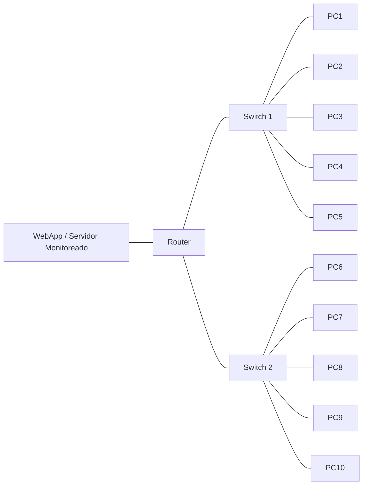

# Práctica 3.4B: Gestión del Desempeño — Monitoreo con Zabbix/Nagios y Simulación de Carga

## Objetivo
Configurar un sistema de monitoreo (Zabbix o Nagios) sobre una topología con servidor web, router y dos redes de clientes, para establecer una línea base de desempeño y analizar el comportamiento del sistema al incrementar progresivamente la carga generada con una herramienta de pruebas de carga.

**Duración estimada:** 3 horas

## Competencias a desarrollar
- Analiza y monitorea la red para medir su desempeño y fiabilidad con herramientas de software.
- Interpreta métricas de desempeño (CPU, memoria, latencia, throughput, tiempo de respuesta) para distinguir comportamiento normal de degradado.
- Correlaciona el origen de la carga (segmento de red) con el impacto observado en el servicio monitoreado.

## Introducción
La gestión del desempeño no se limita a revisar si un servicio está disponible; requiere establecer una **línea base (baseline)** y compararla contra condiciones de estrés controladas. En esta práctica se monitorea una aplicación web mediante una herramienta NMS (Zabbix o Nagios) mientras se somete al sistema a cargas incrementales generadas con una herramienta de pruebas de carga (JMeter, K6, Locust o LoadView), permitiendo observar en el dashboard cómo evoluciona el desempeño conforme aumenta el número de clientes activos y desde qué segmento de la red proviene la carga.

## Equipo de protección e higiene
- Ejecutar las pruebas de carga únicamente en un entorno de laboratorio aislado (PNetLab, GNS3 o físico), nunca contra sistemas de producción.
- Definir límites de carga máxima antes de iniciar, para evitar saturar el laboratorio compartido o el hardware físico.
- No usar credenciales ni datos reales de usuarios en la WebApp de prueba.
- Cuidar el cableado y la conexión eléctrica si se usa laboratorio físico con switches y PCs reales.

## Material y equipo necesario

### Materiales e insumos
- Formato de reporte de práctica con espacio para capturas de dashboard.
- Bitácora de tiempos para registrar cada fase de la prueba.

### Equipo de laboratorio
- Topología virtualizada en **PNetLab** o **GNS3**, o equivalente en **laboratorio físico**:
  - 1 servidor con aplicación web (WebApp) de prueba.
  - 1 router (interconexión entre WebApp y las dos redes de clientes).
  - 2 switches, cada uno conectando una subred de clientes.
  - 5 PC clientes (físicas, virtuales o contenedores) por switch (10 en total).
- 1 servidor de monitoreo con **Zabbix** o **Nagios** instalado (puede coexistir con la WebApp o estar en un nodo dedicado).
- Agente de monitoreo (Zabbix Agent o NRPE) instalado en el servidor de la WebApp y, si el tiempo lo permite, en al menos un cliente por switch.

### Herramientas
- Zabbix o Nagios (a elección del equipo, justificando la decisión).
- Herramienta de simulación de usuarios/carga a elegir: **JMeter**, **K6**, **Locust** o **LoadView**.
- Navegador o `curl`/`ping` para verificaciones manuales de respaldo.

## Topología de referencia

## Instrucciones

### Fase 1: Preparación del entorno
1. Monta la topología en PNetLab, GNS3 o laboratorio físico según la disponibilidad del equipo. Documenta el direccionamiento IP de la WebApp, el router y cada subred de clientes.
2. Instala y configura Zabbix o Nagios como servidor de monitoreo. Justifica brevemente la elección de la herramienta.
3. Da de alta la WebApp como host monitoreado y configura al menos los siguientes ítems/checks:
   - Uso de CPU y memoria del servidor.
   - Tiempo de respuesta HTTP del servicio web (web check o `check_http`).
   - Tráfico de red de la interfaz del servidor (throughput entrante/saliente).
4. Configura un dashboard visible con estas métricas en tiempo real (gráficas o widgets).

### Fase 2: Monitoreo sin carga
5. Con el sistema en reposo (sin clientes activos), observa el dashboard durante al menos 3 minutos.
6. Registra en tu bitácora los valores de reposo: CPU, memoria, tiempo de respuesta y tráfico de red. Esta es tu referencia de "sistema sin carga".

### Fase 3: Baseline con 5 clientes continuos
7. Configura tu herramienta de carga elegida (JMeter, K6, Locust o LoadView) para simular **5 clientes concurrentes** realizando peticiones continuas a la WebApp.
8. Ejecuta la prueba durante al menos 3-5 minutos mientras observas el dashboard en tiempo real.
9. Registra los valores obtenidos (CPU, memoria, tiempo de respuesta, throughput) como **línea base con carga mínima**.
10. Captura pantalla del dashboard y de la herramienta de carga mostrando los 5 clientes activos.

### Fase 4: Incremento de carga desde el Switch 1
11. Aumenta la carga generada desde las PC clientes conectadas al **Switch 1** (por ejemplo, incrementando el número de usuarios virtuales asignados a ese segmento, o ejecutando la herramienta de carga desde varias PC de ese switch simultáneamente).
12. Observa el comportamiento del dashboard: ¿cambia el tiempo de respuesta? ¿aumenta el uso de CPU/memoria? ¿se satura el enlace?
13. Registra los nuevos valores y captura el dashboard en el punto de mayor carga.

### Fase 5: Incremento de carga desde el Switch 2
14. Sin retirar la carga del Switch 1 (o reiniciando la prueba, según acuerdo con el docente), aumenta ahora la carga generada desde las PC clientes conectadas al **Switch 2**.
15. Observa nuevamente el dashboard y registra si el impacto es proporcional, mayor o distinto al causado por el Switch 1.
16. Captura el dashboard con ambos switches generando carga simultáneamente.

### Fase 6: Análisis comparativo
17. Construye una tabla comparativa con los valores de las 4 condiciones: sin carga, baseline (5 clientes), carga desde Switch 1, carga desde Switch 2 (o ambos).
18. Identifica el punto en que el desempeño se degrada de manera notoria (umbral de saturación) y qué métrica lo evidenció primero.
19. Propón una recomendación de gestión del desempeño: ¿balanceo de carga, ampliación de recursos, políticas de QoS, escalamiento del servidor?

## Evidencias
- E1: Topología documentada con direccionamiento y plataforma utilizada.
- E2: Configuración del sistema de monitoreo (Zabbix/Nagios) y dashboard con métricas activas.
- E3: Capturas del dashboard en las 4 condiciones (sin carga, baseline 5 clientes, carga Switch 1, carga Switch 2).
- E4: Tabla comparativa de métricas por condición.
- E5: Análisis de cuello de botella y recomendación de gestión del desempeño.

## Preguntas de análisis
1. ¿Qué métrica reaccionó primero al aumento de carga: CPU, memoria, tiempo de respuesta o tráfico de red? ¿Por qué crees que fue esa?
2. ¿El impacto de la carga del Switch 1 fue igual, mayor o menor que el del Switch 2? ¿A qué factores podría deberse una diferencia?
3. ¿En qué punto consideras que el servicio dejó de cumplir un nivel aceptable de desempeño? Justifica con datos del dashboard.
4. ¿Qué acción de gestión del desempeño (de las revisadas en la Unidad 1.4) aplicarías primero ante este escenario y por qué?
5. ¿Qué diferencias encontraste entre usar Zabbix/Nagios (monitoreo pasivo) y la herramienta de carga (generación activa)? ¿Cómo se complementan?

## Evaluación
**Instrumento sugerido:** Rúbrica (evidencia de producto y desempeño), ya que involucra configuración de herramientas, ejecución de pruebas y análisis interpretativo.

| Criterio | Excelente (3) | Bueno (2) | Aceptable (1) | Insuficiente (0) |
|----------|---------------|-----------|----------------|-------------------|
| Configuración del monitoreo | Dashboard completo con las 3 métricas y umbrales | Dashboard funcional con métricas básicas | Monitoreo parcial o incompleto | Intento sin monitoreo funcional |
| Ejecución de la prueba de carga | Las 4 condiciones ejecutadas y documentadas con capturas claras | Condiciones ejecutadas con evidencia parcial | Solo algunas condiciones evidenciadas | Prueba de carga no ejecutada o sin evidencia |
| Análisis comparativo | Identifica el umbral de saturación y correlaciona métricas con causa | Compara condiciones con interpretación básica | Compara datos sin interpretación clara | Sin comparación o datos incoherentes |
| Recomendación técnica | Propuesta justificada y viable de gestión del desempeño | Propuesta pertinente pero poco detallada | Propuesta genérica sin justificación | Sin recomendación o no relacionada |

## Notas
- Si no se cuenta con 10 PC físicas o virtuales disponibles, se puede simular cada "cliente" con procesos o hilos de la herramienta de carga distribuidos lógicamente entre dos VLAN/subredes que representen cada switch.
- Si el laboratorio no permite instalar agentes en cada PC cliente, es suficiente con monitorear el servidor de la WebApp, siempre que se documente claramente desde qué switch se originó cada incremento de carga.
- Esta práctica complementa la Práctica 3.4 (Análisis básico de desempeño); aquí el énfasis está en el monitoreo continuo con dashboard y la correlación con el origen de la carga, no solo en la medición puntual con `ping`/`iperf3`.
