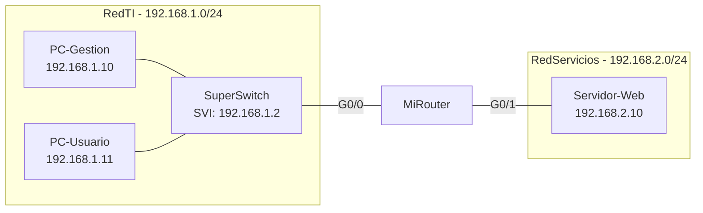

# Práctica: Introducción a SNMP con MIB Browser en Packet Tracer

## Objetivo

Configurar SNMP en un router simulado y consultar información de administración mediante un MIB Browser, identificando el nombre del dispositivo, su tabla de ruteo, su tiempo de actividad y el uso de sus interfaces antes y después de generar tráfico real hacia un servidor.

**Duración estimada:** 1.5 horas (1-2 sesiones)

## Competencias a desarrollar

- Configura el agente SNMP (community string, ubicación, contacto) en un dispositivo Cisco simulado.
- Utiliza un MIB Browser para navegar el árbol de OIDs y consultar valores de administración.
- Identifica `sysName`, `sysUpTime` y la tabla de ruteo mediante OIDs estándar de MIB-II.
- Interpreta los contadores `ifInOctets` e `ifOutOctets` para relacionar tráfico generado con el uso de una interfaz.
- Relaciona SNMP con las funciones de **Desempeño (Performance)** y **Contabilidad (Accounting)** del modelo FCAPS.

## Introducción

**SNMP (Simple Network Management Protocol)** permite que un sistema de gestión consulte, de forma estandarizada, información almacenada en la **MIB (Management Information Base)** de un dispositivo. Cada valor consultable se identifica mediante un **OID (Object Identifier)**, por ejemplo `sysName` (nombre del dispositivo) o `ifInOctets` (bytes recibidos por una interfaz).

Un **MIB Browser** es una herramienta cliente que envía solicitudes SNMP (`GET`) a un dispositivo y muestra el valor devuelto de forma legible, sin que el administrador necesite memorizar el OID completo.

Esta práctica retoma los conceptos de SNMP, OID y MIB-II vistos en [3.1-Protocolos-Administracion-Red.md](3.1-Protocolos-Administracion-Red.md) y los aplica en una topología simple dentro de Packet Tracer, comparando el uso de una interfaz antes y después de generar tráfico real.

## Equipo de protección e higiene

- Guarda tu progreso con frecuencia para evitar pérdida de trabajo por cierre inesperado de Packet Tracer.
- No compartas capturas donde aparezcan datos de tu institución si la práctica se realiza fuera de un entorno controlado.
- Trabaja con orden: nombra los dispositivos exactamente como se indica para facilitar la revisión.

## Material y equipo necesario

### Equipo de laboratorio

- Computadora con Cisco Packet Tracer instalado (versión con soporte de MIB Browser en el escritorio de PC).

### Herramientas

- Router genérico Cisco (ISR o similar) para `MiRouter`.
- Switch genérico Cisco (2960 o similar) para `SuperSwitch`.
- Dos PC y un Server disponibles en la paleta de dispositivos finales de Packet Tracer.
- Cables de cobre de conexión directa (Packet Tracer selecciona automáticamente el tipo correcto).
- Documento de reporte para registrar capturas, valores consultados y respuestas.

## Topología de referencia



## Plan de direccionamiento IP

| Dispositivo | Interfaz | Dirección IP | Máscara | Puerta de enlace |
|---|---|---|---|---|
| MiRouter | G0/0 (hacia SuperSwitch) | 192.168.1.1 | 255.255.255.0 | — |
| MiRouter | G0/1 (hacia Servidor-Web) | 192.168.2.1 | 255.255.255.0 | — |
| SuperSwitch | VLAN 1 (SVI) | 192.168.1.2 | 255.255.255.0 | 192.168.1.1 |
| PC-Gestion | FastEthernet | 192.168.1.10 | 255.255.255.0 | 192.168.1.1 |
| PC-Usuario | FastEthernet | 192.168.1.11 | 255.255.255.0 | 192.168.1.1 |
| Servidor-Web | FastEthernet | 192.168.2.10 | 255.255.255.0 | 192.168.2.1 |

## Instrucciones

### Parte 0: Armado de la topología

1. Coloca los dispositivos `MiRouter`, `SuperSwitch`, `PC-Gestion`, `PC-Usuario` y `Servidor-Web` en el área de trabajo, renombrándolos exactamente así en la pestaña **Config > Display Name** o al hacer clic sobre el nombre del dispositivo.
2. Conecta `PC-Gestion` y `PC-Usuario` a puertos disponibles de `SuperSwitch`.
3. Conecta `SuperSwitch` (puerto G0/1 o el primero disponible) a la interfaz `G0/0` de `MiRouter`.
4. Conecta la interfaz `G0/1` de `MiRouter` directamente a `Servidor-Web`.

**Evidencia E1:** captura de la topología completa, con los cinco dispositivos visibles, correctamente nombrados y conectados según el diagrama.

### Parte 1: Direccionamiento IP

1. En cada PC y en el servidor, abre **Desktop > IP Configuration** y asigna la dirección IP, máscara y puerta de enlace de la tabla de direccionamiento.
2. En `MiRouter`, configura las interfaces por CLI:

    ```
    enable
    configure terminal
    hostname MiRouter
    !
    interface GigabitEthernet0/0
     description Enlace a RedTI - SuperSwitch
     ip address 192.168.1.1 255.255.255.0
     no shutdown
    !
    interface GigabitEthernet0/1
     description Enlace a RedServicios - Servidor Web
     ip address 192.168.2.1 255.255.255.0
     no shutdown
    end
    write memory
    ```

3. En `SuperSwitch`, configura la SVI de administración por CLI:

    ```
    enable
    configure terminal
    hostname SuperSwitch
    !
    interface vlan 1
     ip address 192.168.1.2 255.255.255.0
     no shutdown
    !
    ip default-gateway 192.168.1.1
    end
    write memory
    ```

4. Verifica conectividad básica: desde `PC-Gestion`, haz `ping` a `192.168.1.1` (MiRouter), `192.168.1.2` (SuperSwitch) y `192.168.2.10` (Servidor-Web).

**Evidencia E2:** captura de los tres `ping` exitosos desde `PC-Gestion`.

### Parte 2: Configuración de SNMP en MiRouter

1. En `MiRouter`, habilita el agente SNMP con una community string de solo lectura:

    ```
    configure terminal
    snmp-server community public RO
    snmp-server location Laboratorio-Redes
    snmp-server contact admin@instituto.edu
    snmp-server chassis-id MiRouter-01
    end
    write memory
    ```

2. Repite la configuración de `snmp-server community public RO` en `SuperSwitch`, para poder consultarlo si el docente lo solicita como extensión de la práctica.

**Nota de seguridad:** la community string `public` viaja sin cifrar en SNMPv1/v2c y solo debe usarse en un entorno de laboratorio simulado. En una red real se recomienda SNMPv3 con autenticación y cifrado.

**Evidencia E3:** captura de la configuración de SNMP en `MiRouter` mostrando el comando `snmp-server community` aplicado (por ejemplo, con `show run | include snmp`).

### Parte 3: Primera consulta con MIB Browser desde PC-Gestion

1. En `PC-Gestion`, abre **Desktop > MIB Browser**.
2. En el campo de dirección, escribe `192.168.1.1` (la IP de `MiRouter`) y confirma que la community configurada sea `public`.
3. Haz clic en **Go** o en el botón equivalente para cargar el árbol de MIB del dispositivo.
4. Navega el árbol hasta `mib-2 > system` y consulta:
   - `sysName` (OID `1.3.6.1.2.1.1.5.0`): nombre del dispositivo.
   - `sysUpTime` (OID `1.3.6.1.2.1.1.3.0`): tiempo desde el último reinicio.

**Evidencia E4:** captura del MIB Browser mostrando el valor de `sysName` y `sysUpTime` de `MiRouter`.

5. Navega hasta `mib-2 > ip > ipRouteTable > ipRouteEntry` (OID `1.3.6.1.2.1.4.21`) y consulta al menos dos entradas de la tabla de ruteo, identificando la red destino y la interfaz de salida asociada.

**Evidencia E5:** captura del MIB Browser mostrando al menos dos entradas de `ipRouteTable`, con la red destino visible.

6. Navega hasta `mib-2 > interfaces > ifTable > ifEntry` y localiza, para cada interfaz (`G0/0` y `G0/1`), los siguientes valores:
   - `ifDescr` (OID `1.3.6.1.2.1.2.2.1.2`): para confirmar qué índice corresponde a cada interfaz física.
   - `ifInOctets` (OID `1.3.6.1.2.1.2.2.1.10`): bytes recibidos.
   - `ifOutOctets` (OID `1.3.6.1.2.1.2.2.1.16`): bytes enviados.
7. Registra estos valores como la **medición base** (antes de generar tráfico) en la tabla de resultados.

**Evidencia E6:** captura del MIB Browser mostrando `ifDescr`, `ifInOctets` e `ifOutOctets` de las dos interfaces de `MiRouter`, antes de generar tráfico.

### Parte 4: Generación de tráfico desde PC-Usuario

1. En `PC-Usuario`, abre **Desktop > Web Browser**.
2. Escribe la dirección `192.168.2.10` y presiona **Go** para solicitar la página del `Servidor-Web`.
3. Repite la solicitud varias veces (mínimo 5 veces), recargando la página, para generar un volumen de tráfico perceptible en los contadores.

**Evidencia E7:** captura del navegador de `PC-Usuario` mostrando la página del servidor cargada correctamente.

### Parte 5: Segunda consulta de interfaces y comparación

1. Regresa a `PC-Gestion` y abre nuevamente el **MIB Browser**.
2. Consulta otra vez `ifInOctets` e `ifOutOctets` de las mismas dos interfaces de `MiRouter`.
3. Registra estos valores como la **medición posterior** (después de generar tráfico) en la tabla de resultados.
4. Calcula la diferencia entre la medición posterior y la medición base para cada interfaz y cada dirección (entrada/salida).

**Evidencia E8:** captura del MIB Browser con los nuevos valores de `ifInOctets` e `ifOutOctets`, tomada después de la generación de tráfico.

## Tabla de resultados

| Interfaz | ifDescr | ifInOctets (base) | ifInOctets (posterior) | Diferencia entrada | ifOutOctets (base) | ifOutOctets (posterior) | Diferencia salida |
|---|---|---|---|---|---|---|---|
| G0/0 | | | | | | | |
| G0/1 | | | | | | | |

## Preguntas de análisis

1. ¿Qué información obtuviste con `sysName` y `sysUpTime`, y para qué le serviría a un administrador que gestiona muchos dispositivos?
2. ¿En qué interfaz de `MiRouter` (G0/0 o G0/1) aumentaron más los `ifOutOctets` después de la navegación desde `PC-Usuario`? Explica por qué, considerando la dirección del tráfico hacia el servidor.
3. ¿Qué relación existe entre lo consultado en esta práctica y las funciones de **Desempeño (Performance)** y **Contabilidad (Accounting)** del modelo FCAPS?
4. ¿Qué riesgo de seguridad identificas al usar la community string `public` en SNMPv2c, y qué alternativa se mencionó para mitigarlo?

## Evidencia y evaluación

Actividad de laboratorio con evidencia visual obligatoria.

- **Instrumento sugerido:** lista de cotejo para verificar la presencia de las ocho evidencias (`E1` a `E8`) y la tabla de resultados completa.
- **Producto esperado:** reporte con la topología armada, las capturas `E1` a `E8`, la tabla de resultados con las diferencias calculadas y las respuestas a las preguntas de análisis.

| Criterio | Cumple | No cumple |
|---|---|---|
| Topología armada y direccionamiento correcto (E1, E2) | | |
| SNMP configurado en MiRouter con community de solo lectura (E3) | | |
| `sysName`, `sysUpTime` y tabla de ruteo consultados (E4, E5) | | |
| Medición base de las dos interfaces registrada (E6) | | |
| Tráfico generado desde PC-Usuario hacia el servidor (E7) | | |
| Medición posterior registrada y diferencia calculada (E8, tabla de resultados) | | |
| Preguntas de análisis respondidas con justificación técnica | | |

## Notas

- Si los contadores no muestran incremento, verifica que el tráfico realmente haya pasado por `MiRouter` (revisa el `ping` y la ruta) y que estés consultando la interfaz correcta según `ifDescr`.
- El nombre de los botones del MIB Browser puede variar ligeramente entre versiones de Packet Tracer; identifica la función equivalente sin modificar el objetivo de la práctica.
- Como extensión opcional, el docente puede solicitar repetir la consulta de `ifInOctets`/`ifOutOctets` también en `SuperSwitch`, para comparar el conteo en el switch de acceso contra el del router.
