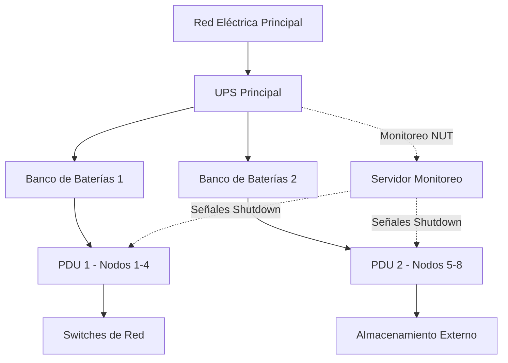

# Proyecto Blade: Estrategia Académica y Operativa

Instituto: TecNM  
Programa: Ingeniería en Sistemas Computacionales  
Alcance: Uso académico multi-materia de un servidor tipo blade con 8 nodos

## 1) Resumen ejecutivo
- Plataforma objetivo: Proxmox VE (cluster de 8 blades) para virtualización KVM/LXC, SDN, alta disponibilidad, backups y API.
- Seguridad y facilidad de uso: Acceso por roles, plantillas con cloud-init, redes por curso (VLAN), autoservicio limitado para docentes.
- Escenarios didácticos: Soporte a BD distribuidas, SO con contenedores/Kubernetes, Redes y servicios, Web/Móvil y Pruebas de software.
- Migración: De VMware 6.5 a Proxmox con ventana controlada, importación OVA/OVF y validación progresiva.
- **Infraestructura eléctrica:** 2 bancos de baterías + 1 UPS para garantizar continuidad operativa ante cortes eléctricos.

## 2) Objetivos
- Pedagógicos: Aprendizajes prácticos con escenarios realistas (multi-nodo, alto nivel de disponibilidad, CI/CD).
- Técnicos: Aislar entornos por curso, reducir riesgo operativo, facilitar despliegues a docentes vía plantillas y automatización.
- **Continuidad:** Garantizar operación ininterrumpida durante cortes eléctricos mediante respaldo energético adecuado.

## 3) Decisión de plataforma
- Opción recomendada: Proxmox VE 8
  - KVM y LXC (contenerización ligera)
  - Clustering y HA
  - SDN y VLANs por curso
  - Proxmox Backup Server (PBS)
  - Integración LDAP/AD y API robusta
  - Suscripción opcional (no obligatoria)
- VMware 6.5 (actual): EOL, licenciamiento y compatibilidad limitan evolución.

## 4) Arquitectura propuesta (8 blades)
- Cluster Proxmox VE: 8 nodos
- Red:
  - VLAN-10 Gestión (PVE, IPMI)
  - VLAN-20 Backup (PBS)
  - VLAN-30 Alumnos/Prácticas (por curso, sub-VLANs)
  - VLAN-40 Servicios comunes (repositorios, mirror apt, registro Docker)
  - VLAN-50 DMZ (accesos externos si aplica)
- Almacenamiento:
  - Opción A (simple y estable): ZFS por nodo + PBS externo (backups)
  - Opción B (distribuido): Ceph en 3-5 nodos con SSD/NVMe (si hay discos locales rápidos)
- Roles por nodo (sugerido):
  - Nodos 1-6: Compute (cursos, laboratorios)
  - Nodo 7: Servicios de plataforma (PBS, Registry, GitLab Runner, Mirror repos)
  - Nodo 8: Bastión/Firewall virtual (pfSense/OPNsense), monitoreo

## **4.5) Infraestructura Eléctrica y Continuidad**

### **Configuración de Respaldo Energético**

**Equipamiento disponible:**
- 2 bancos de baterías externos
- 1 UPS (Sistema de Alimentación Ininterrumpida)

### **Arquitectura Eléctrica Recomendada**



### **Distribución de Cargas**

**Configuración A: Redundancia Total (Recomendada)**
- **UPS → Banco 1:** Nodos 1-4 + Switch Core + PBS
- **UPS → Banco 2:** Nodos 5-8 + Switch Backup + Servicios Críticos
- **Ventaja:** Tolerancia a fallo de un banco sin pérdida total del clúster

**Configuración B: Capacidad Extendida**
- **UPS → Banco 1 + Banco 2 en serie:** Todos los nodos + infraestructura de red
- **Ventaja:** Mayor autonomía temporal (mayor tiempo de respaldo)
- **Desventaja:** Punto único de falla en el UPS principal

### **Autonomía Estimada y Cálculos**

**Datos requeridos para dimensionamiento:**
```
Consumo blade típico: 200-400W por nodo
Consumo total cluster (8 nodos): 1.6 - 3.2 kW
Consumo switches + storage: +300-500W
Consumo total estimado: 2-4 kW

Capacidad UPS: [PENDIENTE: especificar kVA/kW]
Capacidad bancos baterías: [PENDIENTE: especificar Ah y voltaje]

Autonomía estimada = (Capacidad baterías × Voltaje × 0.8) / Consumo total
```

**Escenarios típicos de autonomía:**
- **Sin bancos externos:** 5-15 minutos (solo UPS interno)
- **Con 1 banco externo (100Ah/48V):** 30-60 minutos adicionales
- **Con 2 bancos externos:** 60-120 minutos de autonomía total

### **Integración con Proxmox - Network UPS Tools (NUT)**

**Instalación y configuración en todos los nodos:**

```bash
# Instalar NUT en nodo maestro (conectado al UPS por USB/SNMP)
apt update && apt install nut nut-client nut-server -y

# Configurar UPS en nodo maestro (/etc/nut/ups.conf)
cat > /etc/nut/ups.conf << 'EOF'
[apc-campus]
    driver = usbhid-ups
    port = auto
    desc = "UPS Campus Principal"
    pollinterval = 2
EOF

# Configurar modo servidor (/etc/nut/upsd.conf)
cat > /etc/nut/upsd.conf << 'EOF'
LISTEN 0.0.0.0 3493
EOF

# Usuarios y permisos (/etc/nut/upsd.users)
cat > /etc/nut/upsd.users << 'EOF'
[monuser]
    password = SecurePassword123
    upsmon master

[admin]
    password = AdminPassword456
    actions = SET
    instcmds = ALL
EOF

# Configurar modo (/etc/nut/nut.conf)
echo "MODE=netserver" > /etc/nut/nut.conf

# Reiniciar servicios
systemctl restart nut-server nut-monitor
systemctl enable nut-server nut-monitor
```

**Configuración en nodos esclavos (clientes NUT):**

```bash
# Instalar cliente NUT
apt install nut-client -y

# Configurar monitoreo (/etc/nut/upsmon.conf)
cat > /etc/nut/upsmon.conf << 'EOF'
MONITOR apc-campus@192.168.10.1 1 monuser SecurePassword123 slave
MINSUPPLIES 1
SHUTDOWNCMD "/sbin/shutdown -h +0"
NOTIFYCMD /usr/sbin/upssched
POLLFREQ 5
POLLFREQALERT 2
HOSTSYNC 15
DEADTIME 25
POWERDOWNFLAG /etc/killpower

NOTIFYMSG ONLINE    "UPS %s: Alimentación eléctrica restaurada"
NOTIFYMSG ONBATT    "UPS %s: Funcionando con baterías"
NOTIFYMSG LOWBATT   "UPS %s: Batería baja - Shutdown inminente"
NOTIFYMSG SHUTDOWN  "UPS %s: Iniciando apagado del sistema"

NOTIFYFLAG ONLINE   SYSLOG+WALL+EXEC
NOTIFYFLAG ONBATT   SYSLOG+WALL+EXEC
NOTIFYFLAG LOWBATT  SYSLOG+WALL+EXEC
NOTIFYFLAG SHUTDOWN SYSLOG+WALL+EXEC
EOF

# Configurar modo cliente
echo "MODE=netclient" > /etc/nut/nut.conf

# Reiniciar servicio
systemctl restart nut-monitor
systemctl enable nut-monitor
```

### **Script de Apagado Ordenado del Clúster**

```bash
# /usr/local/bin/proxmox-ups-shutdown.sh
#!/bin/bash

# Script de apagado ordenado para clúster Proxmox ante fallo eléctrico

LOG_FILE="/var/log/ups-shutdown.log"
CRITICAL_BATTERY_LEVEL=20  # Porcentaje crítico de batería

log_message() {
    echo "[$(date '+%Y-%m-%d %H:%M:%S')] $1" | tee -a "$LOG_FILE"
}

get_battery_charge() {
    upsc apc-campus@localhost battery.charge 2>/dev/null || echo "0"
}

shutdown_vms_gracefully() {
    log_message "Iniciando apagado ordenado de VMs..."
    
    # Listar todas las VMs en ejecución
    for vmid in $(qm list | awk 'NR>1 {print $1}'); do
        vm_name=$(qm config "$vmid" | grep '^name:' | cut -d' ' -f2)
        log_message "Apagando VM $vmid ($vm_name)..."
        
        # Intentar apagado limpio (ACPI)
        qm shutdown "$vmid" --timeout 60
        
        # Si no responde en 60s, forzar apagado
        sleep 65
        if qm status "$vmid" | grep -q "running"; then
            log_message "VM $vmid no respondió - Forzando apagado"
            qm stop "$vmid"
        fi
    done
}

shutdown_containers() {
    log_message "Apagando contenedores LXC..."
    
    for ctid in $(pct list | awk 'NR>1 {print $1}'); do
        ct_name=$(pct config "$ctid" | grep '^hostname:' | cut -d' ' -f2)
        log_message "Apagando CT $ctid ($ct_name)..."
        pct shutdown "$ctid" --timeout 30
    done
}

notify_admins() {
    local message="$1"
    
    # Notificar por syslog
    logger -t UPS-SHUTDOWN "$message"
    
    # Notificar por correo (si está configurado)
    if command -v mail &> /dev/null; then
        echo "$message" | mail -s "URGENTE: UPS Campus - Apagado de Emergencia" admin@campus.edu.mx
    fi
    
    # Notificar por Teams webhook (opcional)
    if [ -n "$TEAMS_WEBHOOK_URL" ]; then
        curl -H "Content-Type: application/json" -d "{\"text\":\"$message\"}" "$TEAMS_WEBHOOK_URL"
    fi
}

# MAIN EXECUTION
battery_level=$(get_battery_charge)

log_message "========================================"
log_message "UPS Shutdown Script Iniciado"
log_message "Nivel de batería: ${battery_level}%"

if [ "$battery_level" -lt "$CRITICAL_BATTERY_LEVEL" ]; then
    notify_admins "CRÍTICO: Batería UPS al ${battery_level}% - Iniciando apagado de emergencia del clúster Proxmox"
    
    # Fase 1: Apagar VMs no críticas primero
    shutdown_vms_gracefully
    
    # Fase 2: Apagar contenedores
    shutdown_containers
    
    # Fase 3: Sincronizar discos
    log_message "Sincronizando sistemas de archivos..."
    sync
    
    # Fase 4: Apagar nodo
    log_message "Apagando nodo Proxmox..."
    notify_admins "Nodo $(hostname) apagándose ahora"
    
    /sbin/shutdown -h now "UPS battery critical - Emergency shutdown"
else
    log_message "Batería en nivel aceptable (${battery_level}%) - No se requiere acción"
fi
```

**Hacer ejecutable y configurar en NUT:**

```bash
chmod +x /usr/local/bin/proxmox-ups-shutdown.sh

# Configurar en /etc/nut/upssched.conf
cat > /etc/nut/upssched.conf << 'EOF'
CMDSCRIPT /usr/local/bin/proxmox-ups-shutdown.sh
PIPEFN /run/nut/upssched.pipe
LOCKFN /run/nut/upssched.lock

AT ONBATT * START-TIMER onbatt 30
AT ONLINE * CANCEL-TIMER onbatt
AT LOWBATT * EXECUTE shutdown-critical
AT SHUTDOWN * EXECUTE shutdown-now
EOF
```

### **Monitoreo y Alertas - Dashboard Grafana**

**Configurar datasource Prometheus para métricas UPS:**

```yaml
# /etc/prometheus/prometheus.yml
scrape_configs:
  - job_name: 'nut_exporter'
    static_configs:
      - targets: ['localhost:9199']
    relabel_configs:
      - source_labels: [__address__]
        target_label: instance
        replacement: 'UPS-Campus-Principal'
```

**Instalar NUT Exporter para Prometheus:**

```bash
# En nodo con UPS conectado
wget https://github.com/DRuggeri/nut_exporter/releases/download/v2.3.2/nut_exporter_2.3.2_linux_amd64.tar.gz
tar xvf nut_exporter_2.3.2_linux_amd64.tar.gz
cp nut_exporter /usr/local/bin/

# Crear servicio systemd
cat > /etc/systemd/system/nut-exporter.service << 'EOF'
[Unit]
Description=NUT Exporter for Prometheus
After=network.target

[Service]
Type=simple
User=prometheus
ExecStart=/usr/local/bin/nut_exporter --nut.server=localhost
Restart=always

[Install]
WantedBy=multi-user.target
EOF

systemctl daemon-reload
systemctl enable --now nut-exporter
```

**Panel Grafana (JSON snippet):**

```json
{
  "panels": [
    {
      "title": "Estado UPS Campus",
      "targets": [
        {
          "expr": "network_ups_tools_ups_status{ups=\"apc-campus\"}"
        }
      ]
    },
    {
      "title": "Nivel de Batería (%)",
      "targets": [
        {
          "expr": "network_ups_tools_battery_charge{ups=\"apc-campus\"}"
        }
      ],
      "alert": {
        "conditions": [
          {
            "evaluator": {
              "params": [30],
              "type": "lt"
            },
            "query": {
              "datasourceId": 1,
              "model": {
                "expr": "network_ups_tools_battery_charge"
              }
            }
          }
        ],
        "message": "Batería UPS por debajo del 30%"
      }
    },
    {
      "title": "Carga del UPS (W)",
      "targets": [
        {
          "expr": "network_ups_tools_ups_load{ups=\"apc-campus\"}"
        }
      ]
    },
    {
      "title": "Tiempo Restante Estimado (min)",
      "targets": [
        {
          "expr": "network_ups_tools_battery_runtime{ups=\"apc-campus\"} / 60"
        }
      ]
    }
  ]
}
```

### **Políticas de Operación con Respaldo Energético**

**Procedimientos operativos estándar:**

1. **Operación Normal (Red Eléctrica Estable)**
   - UPS en modo línea (pass-through)
   - Bancos de baterías en carga flotante
   - Monitoreo cada 5 minutos
   - Cluster en operación completa

2. **Evento: Corte Eléctrico (Batería 100-50%)**
   - UPS cambia a modo batería automáticamente
   - Notificación inmediata a administradores
   - Sistema continúa operación normal
   - Monitoreo cada 1 minuto
   - NO se interrumpen prácticas académicas en curso

3. **Batería Baja (50-30%)**
   - Alerta a todos los docentes activos
   - Advertencia en consolas de VMs
   - Preparación para apagado ordenado
   - Guardar trabajos en progreso

4. **Batería Crítica (<30%)**
   - Inicio automático de apagado ordenado
   - VMs no críticas se apagan primero (5 min)
   - VMs de servicios (DNS, LDAP, PBS) al final (2 min)
   - Shutdown de nodos en secuencia inversa (nodo 8→1)

5. **Recuperación de Energía**
   - Arranque automático de nodos (Wake-on-LAN o IPMI)
   - Inicio de servicios críticos primero
   - Validación de integridad de almacenamiento (scrub ZFS)
   - Notificación de restablecimiento completo

### **Mantenimiento Preventivo del Sistema Eléctrico**

**Calendario de mantenimiento:**

**Mensual:**
- Inspección visual de conexiones UPS y baterías
- Revisión de logs de eventos eléctricos
- Prueba de autonomía (simulación de corte 5 min)

**Trimestral:**
- Calibración de baterías (descarga controlada 50%)
- Limpieza de ventiladores UPS
- Verificación de voltajes en PDUs

**Semestral:**
- Prueba completa de autonomía (hasta 30% batería)
- Revisión de script de apagado ordenado
- Actualización de procedimientos operativos

**Anual:**
- Reemplazo preventivo de baterías (según fabricante)
- Inspección termográfica de conexiones eléctricas
- Auditoría de capacidad vs consumo real

### **Métricas Clave a Monitorear**

```
- ups.status                  # OL (Online), OB (On Battery), LB (Low Battery)
- battery.charge              # Porcentaje de carga (%)
- battery.runtime             # Tiempo restante estimado (segundos)
- battery.voltage             # Voltaje de batería (V)
- input.voltage               # Voltaje de entrada (V)
- output.voltage              # Voltaje de salida (V)
- ups.load                    # Carga actual del UPS (%)
- ups.temperature             # Temperatura interna (°C)
- battery.date                # Fecha de instalación de baterías
- ups.test.result             # Resultado última prueba automática
```

### **Costos Operativos Estimados**

**Inversión inicial (ya adquirida):**
- 2 Bancos de baterías externos: Adquiridos
- 1 UPS: Adquirido
- Cableado y PDUs: A confirmar

**Costos operativos anuales:**
- Consumo eléctrico cluster (24/7 @ 3kW): ~$35,000-45,000 MXN/año
- Reemplazo baterías (cada 3-5 años): ~$15,000-25,000 MXN
- Mantenimiento preventivo: ~$5,000 MXN/año

**Costo por hora de inactividad evitada:**
- Valor estimado: $2,000-5,000 MXN/hora (considerando pérdida académica, re-programación)
- ROI del sistema UPS: 6-12 meses

## 5) Identidad, acceso y seguridad
- Autenticación: LDAP/AD institucional (si existe) o Keycloak (SSO).
- Autorización: Pools por curso en Proxmox y roles por perfil:
  - Admin-plataforma (TI)
  - Docente-curso (crea VMs desde plantillas de su pool)
  - Alumno (acceso a sus VMs; sin privilegios de crear)
- Segmentación:
  - VLAN por materia y por grupo si se requiere.
  - Bastión SSH y VPN docente, sin exposición directa de hipervisores.
- Mínimo privilegio:
  - Plantillas bloqueadas, recursos y cuotas por pool.
  - Acceso a consolas vía Proxmox Web UI con 2FA (opcional).

## 6) Catálogo de plantillas (cloud-init)
- Linux: Ubuntu Server LTS, Debian, Rocky Linux
- Windows Server (si hay licenciamiento académico)
- K3s/Kubernetes worker preconfigurado
- Base de datos (PostgreSQL/MySQL) pre-endurecido
- NGINX reverse proxy con TLS (Let's Encrypt interno)

## 7) Automatización y CI/CD
- Terraform (provider Proxmox) para VMs por curso
- Ansible para configuración por rol (DB, web, DNS, etc.)
- GitHub Classroom + GitHub Actions/GitLab Runner para pipelines de prácticas
- Registro de contenedores local (Harbor/Registry) y mirror de repos (apt/npm/pypi) para reducir internet-dependencia

## 8) Backups, monitoreo y operación
- Backups: Proxmox Backup Server (incrementales, deduplicados). Política: diaria (7), semanal (4), mensual (3).
- Monitoreo: Prometheus + Grafana, alertas (hooks a Teams/Email).
- Logs: Loki/ELK opcional por curso.
- DR básico: Exportación periódica de VMs críticas y snapshots de infraestructura.
- **UPS Monitoring:** NUT (Network UPS Tools) integrado con apagado ordenado automático.

## 9) Política de uso y calendario
- Pools por curso (Unidad/Periodo). Cuotas por docente (vCPU/RAM/Disco).
- Ventana de mantenimiento: semanal (domingos 02:00-05:00).
- Solicitudes por issue en repositorio interno (plantilla de solicitud).
- Apagado automático de VMs inactivas (etiquetas y TTL).
- **Procedimiento de emergencia eléctrica:** Apagado ordenado automático <30% batería, notificación a docentes activos.

---

# Escenarios y prácticas por materia

## A) Taller de Base de Datos y Administración de BD (distribuidas)
- Laboratorio 1: Replicación primaria-secundaria (PostgreSQL streaming / MySQL replica)
- Laboratorio 2: Alta disponibilidad (PostgreSQL Patroni o MySQL InnoDB Cluster)
- Laboratorio 3: Sharding/particiones y balanceo de lectura
- Laboratorio 4: Backups lógicos y físicos + recuperación puntual
- Laboratorio 5: Seguridad: roles, cifrado en tránsito, auditoría básica

Recursos:
- 3 VMs por equipo: db-primary, db-replica, client
- VLAN-BD y plantilla “db-secured”

## B) Taller de Sistemas Operativos (contenedores y Kubernetes)
- Laboratorio 1: Docker/Podman fundamentos + Compose
- Laboratorio 2: k3s (3 nodos), despliegue de microservicios, Ingress y TLS
- Laboratorio 3: Persistencia (NFS/Longhorn), ConfigMaps/Secrets
- Laboratorio 4: Observabilidad (Prometheus/Grafana/Loki)
- Laboratorio 5: Escalado/HPA y tolerancia a fallos

Recursos:
- 3 VMs por equipo (k3s-master, k3s-worker1, k3s-worker2)
- Registro local para imágenes (Harbor/Registry)

## C) Administración de Redes (HTTP, DNS, FTP, SSH)
- Laboratorio 1: DNS autoritativo y recursivo (Bind9) + zonas
- Laboratorio 2: NGINX reverse proxy, TLS, hardening
- Laboratorio 3: FTP seguro (vsftpd/SFTP), chroot y permisos
- Laboratorio 4: SSH endurecido, claves, fail2ban
- Laboratorio 5: Firewall y segmentación (pfSense), NAT, ACLs

Recursos:
- 2-3 VMs por equipo en VLAN-RED, pfSense compartido por curso

## D) Programación Web y Móvil
- Laboratorio 1: CI/CD (build, test, image, deploy a k3s dev)
- Laboratorio 2: API con DB y migraciones; secrets y variables
- Laboratorio 3: Observabilidad de app (logs, métricas, tracing básico)
- Laboratorio 4: Canary/Blue-Green en k3s
- Laboratorio 5: Pruebas E2E con Selenium/Cypress en pipeline

Recursos:
- Proyecto template + runner + namespace k3s por equipo

## E) Pruebas de Software
- Laboratorio 1: Integración de pruebas unitarias y cobertura en pipeline
- Laboratorio 2: Selenium Grid/E2E automatizadas
- Laboratorio 3: Carga con JMeter/k6
- Laboratorio 4: Análisis estático (SonarQube) y DAST (OWASP ZAP)
- Laboratorio 5: Reportes y Quality Gates

Recursos:
- VM de herramientas (SonarQube/ZAP/JMeter), runners

---

# Diseño de permisos y operación docente

## Pools y roles en Proxmox
- Pool “U3-TallerBD-2025A”: cuota 32 vCPU, 128 GB RAM, 2 TB
- Roles:
  - PVEAdmin (TI plataforma)
  - PVE-Docente (crear desde plantillas en su pool, iniciar/detener)
  - PVE-Alumno (consola VM propia, sin crear/borrar)

## Red por curso
- VLAN 131 (TallerBD), 132 (SO), 133 (Redes), 134 (WebMovil), 135 (Pruebas)
- Subnets RFC1918, DNS interno, salida NAT controlada
- Ingress a DMZ solo si lo aprueba TI (evaluaciones públicas)

## Plantillas base (cloud-init)
- “tpl-ubuntu-22LTS-ci”
- “tpl-debian-12-k3s”
- “tpl-rocky-9-web”
- “tpl-win-srv” (según licenciamiento)
- Endurecimiento: SSH sin password, usuario docente con sudo, agentes QEMU.

---

# Migración VMware 6.5 → Proxmox (plan resumido)

1) Compatibilidad y preparación  
- Verificar CPU (Intel VT-x/AMD-V), NICs y controladoras  
- Respaldar VMs en VMware (snapshots/exports)

2) Despliegue Proxmox cluster  
```bash
# Nodo 1
pvecm create campus-cluster
# Nodo 2..8
pvecm add <IP-nodo1>
```

3) Almacenamiento  
- ZFS por nodo (mirror si hay 2 SSD)  
- Proxmox Backup Server en nodo 7

4) Redes y VLANs  
- Trunk en switches físicos  
- Crear bridges vmbr0 (mgmt) y vmbrX por VLAN curso

5) Importación VMs  
```bash
# Exportar en VMware a OVA/OVF y luego:
qm create 200 --name vm-import --memory 4096 --cores 2 --net0 virtio,bridge=vmbr0
qm importovf 200 vmware-export.ovf local-lvm
qm set 200 --scsihw virtio-scsi-pci --virtio0 local-lvm:vm-200-disk-0
qm set 200 --boot order=virtio0
```

6) Validación y corte  
- Pruebas por curso en ventana de mantenimiento  
- Cambio de DNS y documentación de acceso

---

# Operación diaria y soporte

- Mesa de ayuda: issues por repositorio “Infra-Campus” (plantilla)
- Catálogo de servicios: lista de plantillas y redes disponibles
- Procedimientos: alta de curso, asignación de pool, caducidad de recursos
- Auditoría: revisión mensual de uso y costos energéticos

---

# Anexos

## A) Comandos útiles Proxmox
```bash
# Crear VM desde plantilla y cloud-init
qm clone 9000 1201 --name=u3-db-equipo01 --full true
qm set 1201 --ciuser alumno --cipassword '***' --ipconfig0 ip=dhcp
qm start 1201

# Backups (PBS)
proxmox-backup-client backup vm-1201.pxar:/etc/pve --repository pbs@pam@pbs:datastore
```

## B) Ejemplo Terraform (VM Ubuntu)
```hcl
provider "proxmox" {
  pm_api_url = "https://pve1:8006/api2/json"
  pm_user    = "terraform@pve"
  pm_password= var.pm_password
  pm_tls_insecure = true
}

resource "proxmox_vm_qemu" "u3_db_equipo01" {
  name        = "u3-db-equipo01"
  target_node = "pve1"
  clone       = "tpl-ubuntu-22LTS-ci"
  cores       = 2
  sockets     = 1
  memory      = 4096
  ipconfig0   = "ip=dhcp"
  ssh_user    = "alumno"
  ciuser      = "alumno"
}
```

## C) Ejemplo Ansible (rol DB)
```yaml
- hosts: db
  become: yes
  tasks:
    - name: Instalar PostgreSQL
      apt:
        name: postgresql
        state: present
        update_cache: yes
    - name: Ajustar pg_hba
      lineinfile:
        path: /etc/postgresql/14/main/pg_hba.conf
        regexp: '^host\s+all\s+all\s+10\.0\.0\.0/8\s+'
        line: 'host all all 10.0.0.0/8 md5'
      notify: restart pg
  handlers:
    - name: restart pg
      service:
        name: postgresql
        state: restarted
```

---

## Requerimientos pendientes
- Confirmar hardware de cada blade (CPU/RAM/NIC/Discos)
- Definir si habrá acceso externo público (DMZ)
- Licenciamiento Windows (si aplica)
- Integración con SSO institucional
- **Especificaciones técnicas del UPS:** Capacidad en kVA/kW, tipo (online/line-interactive), conexión (USB/SNMP/serie)
- **Especificaciones bancos de baterías:** Capacidad (Ah), voltaje (V), tipo (plomo-ácido/litio), conexión con UPS
- **Certificación eléctrica:** Revisar instalación eléctrica del cuarto de servidores (tierra física, reguladores, PDUs)

## Riesgos y mitigación
- Carga excesiva en períodos pico → cuotas y escalado horizontal por pools
- Exposición de servicios → DMZ controlada, WAF/reverse proxy, VPN
- Fallos de disco → PBS + ZFS/Ceph con redundancia
- **Cortes eléctricos prolongados (>autonomía UPS):** Generar protocolo de comunicación con CFE para mantenimientos programados, considerar generador diésel de respaldo para implementación futura
- **Fallo del UPS principal:** Evaluar adquisición de segundo UPS para configuración redundante N+1
- **Degradación de baterías:** Monitoreo proactivo con reemplazo preventivo cada 3-5 años

Fin del documento.