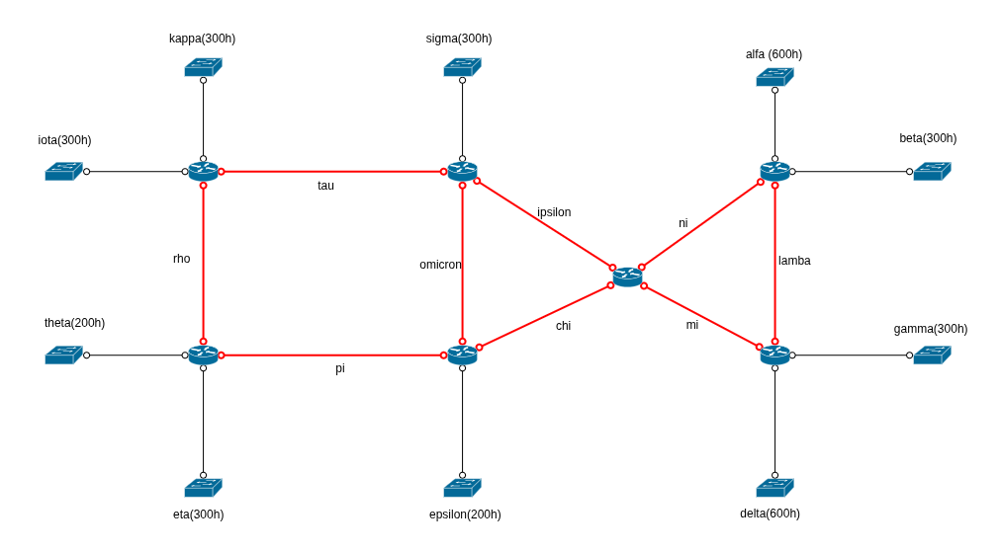

# Ejercicio 2: Diseño de Esquema de Direccionamiento IP con VLSM

## Objetivo
Diseñar un esquema de direccionamiento IP eficiente utilizando VLSM (Variable Length Subnet Mask) para optimizar el uso del espacio de direcciones disponible.

## Escenario
Con la topología mostrada en la figura y el bloque de direcciones **10.0.0.0/8**, diseñe un esquema de direccionamiento que optimice el espacio de direcciones según la cantidad de subredes y hosts requeridos en cada segmento de red.

## Instrucciones
1. Analice los requerimientos de hosts para cada subred
2. Aplique la técnica VLSM para asignar máscaras de subred apropiadas
3. Complete la tabla con los valores calculados
4. Verifique que no existan solapamientos entre subredes

## Tabla de Direccionamiento

| Subred | Hosts Requeridos | Máscara de Subred | Rango de Direcciones Útiles | Dirección de Red | Dirección de Broadcast |
|--------|------------------|-------------------|------------------------------|------------------|------------------------|
| alpha  |                 |    |  |        |         |
| beta  |                 |    |  |        |         |
| gamma  |                 |    |  |        |         |
| delta  |                 |    |  |        |         |
| epsilon  |                 |    |  |        |         |
| eta  |                 |    |  |        |         |
| theta  |                 |    |  |        |         |
| iota  |                 |    |  |        |         |
| kappa  |                 |    |  |        |         |
| sigma  |                 |    |  |        |         |
| labda  |                 |    |  |        |         |
| mi  |                 |    |  |        |         |
| ni  |                 |    |  |        |         |
| chi  |                 |    |  |        |         |
| omicron  |                 |    |  |        |         |
| pi  |                 |    |  |        |         |
| rho  |                 |    |  |        |         |
| ipsilon  |                 |    |  |        |         |

## Consideraciones
- Recuerde reservar direcciones para la dirección de red y broadcast
- Ordene las subredes de mayor a menor número de hosts requeridos
- Utilice la máscara más específica posible para cada subred
- Documente su proceso de cálculo paso a paso