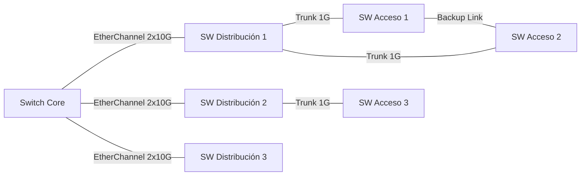
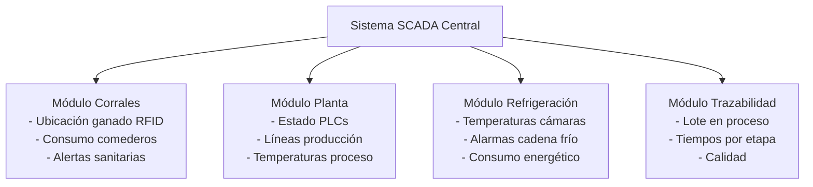

# Caso de Estudio: Red Convergente para Planta de Producción Cárnica

**Conmutación y Enrutamiento en Redes de Datos - Unidad 2**

---

## Escenario

**Empresa:** FrigoCarnes Industrial S.A.  
**Ubicación:** Planta de procesamiento de carne en zona rural con enlace dedicado a Internet  
**Personal:** 250 empleados (administrativos, operarios, veterinarios, seguridad)  
**Extensión:** 15 hectáreas con múltiples edificios

### Descripción General

FrigoCarnes Industrial es una planta moderna de procesamiento de carne bovina que integra desde la recepción y engorda del ganado hasta el empaque y distribución del producto final. La empresa requiere una red convergente que soporte:

- **Operaciones ganaderas automatizadas** con IoT
- **Procesos industriales** controlados digitalmente
- **Sistemas de gestión empresarial** (ERP, inventarios, trazabilidad)
- **Comunicaciones unificadas** (datos, voz, video)
- **Cumplimiento normativo** (trazabilidad SAGARPA/SENASICA, HACCP)

---

## Áreas Funcionales y Sistemas

### 1. Corrales y Engorda (Zona Ganadera)

**Superficie:** 8 hectáreas con 12 corrales  
**Capacidad:** 500 cabezas de ganado

#### Sistemas Implementados:

**A. Sistema de Identificación RFID:**
- **Chips RFID UHF** en aretes de cada animal (rango de lectura: 10-15 metros)
- **20 antenas RFID fijas** distribuidas en corrales para seguimiento en tiempo real
- **Lectores RFID móviles** para veterinarios y cuidadores
- **Servidor de localización** que registra movimientos y ubicación de cada individuo

**B. Comederos Inteligentes:**
- **24 comederos automatizados** con sensores de peso y lectores RFID integrados
- Detección automática de animal que se aproxima
- Registro de consumo individual (kg de alimento por día)
- Control de raciones según plan nutricional en base de datos
- Conexión **Ethernet industrial** (IP67 para intemperie)

**C. Conectividad de Personal:**
- **4 Access Points WiFi 6 industriales** (IP67, rango extendido)
- Cobertura para veterinarios, cuidadores y personal móvil
- Soporte para tablets/smartphones rugerizados
- Red separada para dispositivos médicos veterinarios

**D. Sensores Ambientales:**
- Sensores de temperatura y humedad en corrales techados
- Pluviómetros y estaciones meteorológicas
- Datos enviados vía LoRaWAN/WiFi al sistema SCADA

**Requerimientos de Red:**
- VLAN dedicada para sensores IoT (lectores RFID, comederos)
- VLAN para WiFi de personal
- Switches industriales PoE+ en gabinetes protegidos
- Priorización de tráfico (QoS) para datos de trazabilidad críticos

---

### 2. Planta de Procesamiento (Matadero y Empaque)

**Superficie:** 5,000 m² bajo techo  
**Áreas:** Sacrificio, despiece, empaque primario, empaque secundario

#### Sistemas Implementados:

**A. Trazabilidad de Proceso:**
- **Lectores RFID en puntos de control:** recepción, sacrificio, despiece, empaque
- **Básculas automatizadas** con integración a sistema ERP
- **Impresoras de etiquetas** con códigos de barras/QR para trazabilidad
- Registro automático de tiempos de proceso y cadena de frío

**B. Control de Temperatura (Crítico):**
- **50 sensores de temperatura** distribuidos en:
  - Áreas de procesamiento (4-7°C)
  - Cámaras de refrigeración (0-4°C)
  - Cámaras de congelación (-18°C a -25°C)
- **Sistema SCADA** para monitoreo en tiempo real
- Alarmas automáticas por desviaciones de temperatura
- Registro continuo para auditorías HACCP

**C. Sistema de CCTV:**
- **60 cámaras IP** (resolución 4MP, H.265+):
  - 20 cámaras en planta de procesamiento
  - 15 cámaras en cámaras de refrigeración
  - 10 cámaras en corrales
  - 15 cámaras en perímetro y accesos
- **NVR redundante** con almacenamiento de 90 días
- **Analítica de video:** detección de movimiento, conteo de personas, alarmas

**D. Control de Acceso:**
- **Torniquetes biométricos** en acceso a planta
- **Lectores de tarjetas RFID** en puertas de cámaras de refrigeración
- **Control de temperatura corporal** (post-COVID)
- Integración con sistema de asistencia

**E. Automatización Industrial:**
- **PLCs** (Controladores Lógicos Programables) para líneas de procesamiento
- Brazos robóticos para empaque automatizado
- Bandas transportadoras con sensores de peso
- Protocolo industrial: **Ethernet/IP** o **Modbus TCP**

**Requerimientos de Red:**
- VLAN para SCADA/automatización (alta prioridad)
- VLAN para CCTV (alto ancho de banda)
- VLAN para control de acceso
- Switches industriales administrables con STP/RSTP
- Enlaces troncales de 10 Gbps entre switches de distribución

---

### 3. Área de Refrigeración y Almacén

**Superficie:** 2,000 m² (cámaras frías y congeladores)  
**Capacidad:** 200 toneladas de producto terminado

#### Sistemas Implementados:

**A. Monitoreo de Cadena de Frío:**
- **30 sensores de temperatura/humedad** inalámbricos (batería de larga duración)
- Gateway LoRaWAN o ZigBee para recolección de datos
- Dashboard en tiempo real visible para operadores
- Alertas por SMS/correo ante desviaciones

**B. Sistema de Gestión de Almacén (WMS):**
- Lectores RFID/código de barras en entradas/salidas
- Terminales móviles para operadores de montacargas
- WiFi de alta densidad para comunicación constante
- Integración con ERP para control de inventarios

**C. Control de Puertas Automatizadas:**
- Sensores de apertura/cierre de cámaras
- Registro de eventos para auditoría
- Bloqueo automático fuera de horario

**Requerimientos de Red:**
- VLAN para sensores inalámbricos (baja latencia)
- VLAN para WMS y terminales móviles
- Access Points industriales resistentes a bajas temperaturas
- Redundancia de enlaces críticos (STP, EtherChannel)

---

### 4. Área Administrativa y Oficinas

**Superficie:** 1,000 m²  
**Personal:** 50 empleados administrativos

#### Sistemas Implementados:

**A. Infraestructura de TI:**
- **Servidor físico** con virtualización (VMware/Hyper-V):
  - Servidor ERP (SAP Business One / Microsoft Dynamics)
  - Servidor de Base de Datos (SQL Server)
  - Controlador de Dominio (Active Directory)
  - Servidor de archivos y backup
- **Storage NAS** para respaldos y archivos compartidos
- **UPS de rack** para protección de energía

**B. Comunicaciones Unificadas:**
- **Central telefónica IP** (FreePBX / Cisco CUCM)
- 50 teléfonos IP en escritorios
- Softphones para personal móvil
- Grabación de llamadas para calidad

**C. Red de Datos:**
- **Switches de acceso PoE** para teléfonos IP y Access Points
- Access Points WiFi 6 para dispositivos corporativos
- Impresoras de red compartidas

**D. Acceso a Internet:**
- **Firewall de siguiente generación** (Fortinet/Palo Alto/pfSense)
- Filtrado de contenido y prevención de amenazas
- VPN para acceso remoto de ejecutivos
- Conexión dedicada de 100 Mbps simétricos

**Requerimientos de Red:**
- VLAN de datos corporativos
- VLAN de voz (VoIP) con QoS
- VLAN de servidores (zona DMZ interna)
- VLAN de invitados (aislada)
- Segmentación de red según roles (administración, ventas, producción)

---

### 5. Sistema de Control de Asistencia

**Distribución:** 8 puntos de checado estratégicos

#### Ubicaciones:

1. Acceso principal (oficinas)
2. Entrada a planta de procesamiento
3. Acceso a corrales
4. Área de refrigeración
5. Zona de embarque
6. Comedor de empleados
7. Vestidores/sanitarios
8. Caseta de vigilancia

#### Tecnología:

- **Checadores biométricos** (huella + tarjeta RFID de proximidad)
- Conexión Ethernet PoE
- Software de gestión de asistencia en servidor
- Integración con sistema de nómina
- Reportes de puntualidad, horas extra, ausencias

**Requerimientos de Red:**
- VLAN dedicada para control de asistencia
- Sincronización horaria NTP
- Respaldo de base de datos de asistencias

---

### 6. Zona de Embarque y Recepción

**Superficie:** 1,500 m² (andenes de carga)  
**Capacidad:** 12 andenes simultáneos

#### Sistemas Implementados:

**A. Control de Acceso Vehicular:**
- **Lectores RFID UHF de largo alcance** en acceso
- Registro automático de placas (ANPR - Automatic Number Plate Recognition)
- Básculas de camiones para control de peso
- Sincronización con sistema de trazabilidad

**B. Gestión de Logística:**
- Pantallas de asignación de andenes
- Terminales para choferes (registro de entrada/salida)
- Impresoras de documentos de embarque
- WiFi para tablets de supervisores

**C. CCTV de Seguridad:**
- Cámaras en andenes y área de maniobras
- Grabación de procesos de carga/descarga
- Analítica para conteo de vehículos

**Requerimientos de Red:**
- VLAN para control de acceso vehicular
- VLAN para gestión logística
- Cobertura WiFi en zona de maniobras

---

### 7. Laboratorio de Calidad

**Superficie:** 150 m²  
**Personal:** 5 técnicos de laboratorio

#### Sistemas Implementados:

- **Equipos de análisis conectados:** pH-metros, espectrofotómetros, equipos microbiológicos
- Sistema LIMS (Laboratory Information Management System)
- Registro digital de resultados de análisis
- Conexión a bases de datos para trazabilidad
- Acceso a normas y procedimientos digitales

**Requerimientos de Red:**
- VLAN para LIMS y equipamiento científico
- Conexión de alta disponibilidad (laboratorio crítico)

---

## Arquitectura de Red Propuesta

### Topología de Red

```mermaid
graph TB
    subgraph Internet
        ISP[Proveedor ISP<br/>100 Mbps]
    end
    
    subgraph DMZ
        FW[Firewall<br/>FortiGate 60F]
        VPN[Servidor VPN]
    end
    
    subgraph Datacenter
        SW_CORE[Switch Core L3<br/>Cisco Catalyst 9300<br/>2x 10G uplinks]
        SRV1[Servidor Virtualización]
        SRV2[Storage NAS]
        SRV3[NVR CCTV]
    end
    
    subgraph Distribucion
        SW_DIST1[Switch Distribución<br/>Planta Procesamiento<br/>Cisco 2960X]
        SW_DIST2[Switch Distribución<br/>Corrales<br/>Industrial PoE+]
        SW_DIST3[Switch Distribución<br/>Refrigeración<br/>Cisco 2960X]
        SW_DIST4[Switch Distribución<br/>Oficinas<br/>Cisco 2960X PoE]
        SW_DIST5[Switch Distribución<br/>Embarque<br/>Cisco 2960X]
    end
    
    subgraph Acceso_Planta
        SW_ACC1[Switch Acceso<br/>Matadero]
        SW_ACC2[Switch Acceso<br/>Empaque]
        PLC1[PLCs Automatización]
        CAM1[Cámaras IP CCTV]
        TEMP1[Sensores Temperatura]
    end
    
    subgraph Acceso_Corrales
        SW_ACC3[Switch Industrial<br/>Corrales Norte]
        SW_ACC4[Switch Industrial<br/>Corrales Sur]
        RFID1[Lectores RFID]
        COMEDEROS[Comederos Inteligentes]
        AP_CORRAL[Access Points WiFi]
    end
    
    subgraph Acceso_Refrigeracion
        SW_ACC5[Switch Acceso<br/>Cámaras Frías]
        TEMP2[Sensores Temp/Humedad]
        CAM2[Cámaras CCTV]
        SCADA[Gateway SCADA]
    end
    
    subgraph Acceso_Oficinas
        SW_ACC6[Switch PoE<br/>Piso 1]
        SW_ACC7[Switch PoE<br/>Piso 2]
        TEL[Teléfonos IP]
        AP_OFICINA[Access Points WiFi]
        IMP[Impresoras Red]
    end
    
    subgraph Acceso_Embarque
        SW_ACC8[Switch Embarque]
        BASCULA[Básculas Vehículos]
        ANPR[Cámaras ANPR]
        CHECADOR[Checadores Asistencia]
    end
    
    ISP --> FW
    FW --> SW_CORE
    SW_CORE --> SRV1
    SW_CORE --> SRV2
    SW_CORE --> SRV3
    
    SW_CORE --> SW_DIST1
    SW_CORE --> SW_DIST2
    SW_CORE --> SW_DIST3
    SW_CORE --> SW_DIST4
    SW_CORE --> SW_DIST5
    
    SW_DIST1 --> SW_ACC1
    SW_DIST1 --> SW_ACC2
    SW_ACC1 --> PLC1
    SW_ACC1 --> CAM1
    SW_ACC2 --> TEMP1
    
    SW_DIST2 --> SW_ACC3
    SW_DIST2 --> SW_ACC4
    SW_ACC3 --> RFID1
    SW_ACC3 --> COMEDEROS
    SW_ACC4 --> AP_CORRAL
    
    SW_DIST3 --> SW_ACC5
    SW_ACC5 --> TEMP2
    SW_ACC5 --> CAM2
    SW_ACC5 --> SCADA
    
    SW_DIST4 --> SW_ACC6
    SW_DIST4 --> SW_ACC7
    SW_ACC6 --> TEL
    SW_ACC6 --> AP_OFICINA
    SW_ACC7 --> IMP
    
    SW_DIST5 --> SW_ACC8
    SW_ACC8 --> BASCULA
    SW_ACC8 --> ANPR
    SW_ACC8 --> CHECADOR
```



---

## Diseño de VLANs (Segmentación de Red)

### Tabla de VLANs

| VLAN ID | Nombre | Subred | Gateway | Descripción | QoS Priority |
|---------|--------|--------|---------|-------------|--------------|
| **1** | NATIVA | - | - | VLAN nativa (no usar) | - |
| **10** | SERVIDORES | 10.50.10.0/24 | 10.50.10.1 | Servidores datacenter | Alta |
| **20** | ADMINISTRACION | 10.50.20.0/24 | 10.50.20.1 | PCs administrativos | Media |
| **25** | VOZ | 10.50.25.0/24 | 10.50.25.1 | Teléfonos IP (VoIP) | Crítica |
| **30** | WIFI_CORPORATIVO | 10.50.30.0/23 | 10.50.30.1 | WiFi empleados (RADIUS) | Media |
| **35** | WIFI_INVITADOS | 10.50.35.0/24 | 10.50.35.1 | WiFi visitantes (aislado) | Baja |
| **40** | CCTV | 10.50.40.0/23 | 10.50.40.1 | Cámaras de vigilancia | Alta |
| **50** | SCADA_CONTROL | 10.50.50.0/24 | 10.50.50.1 | PLCs y automatización | Crítica |
| **55** | SENSORES_IOT | 10.50.55.0/23 | 10.50.55.1 | Sensores temperatura, RFID | Alta |
| **60** | RFID_GANADO | 10.50.60.0/24 | 10.50.60.1 | Lectores RFID corrales | Alta |
| **65** | COMEDEROS | 10.50.65.0/24 | 10.50.65.1 | Comederos inteligentes | Media |
| **70** | ASISTENCIA | 10.50.70.0/24 | 10.50.70.1 | Checadores biométricos | Media |
| **75** | CONTROL_ACCESO | 10.50.75.0/24 | 10.50.75.1 | Torniquetes, lectores | Media |
| **80** | LOGISTICA | 10.50.80.0/24 | 10.50.80.1 | WMS, básculas, ANPR | Media |
| **90** | LABORATORIO | 10.50.90.0/24 | 10.50.90.1 | Equipos laboratorio, LIMS | Alta |
| **99** | ADMINISTRACION_RED | 10.50.99.0/24 | 10.50.99.1 | Gestión switches/APs | - |
| **100** | DMZ | 192.168.100.0/24 | 192.168.100.1 | Servidores públicos | Media |

### Criterios de Segmentación

**Seguridad:**
- Aislamiento de sistemas críticos (SCADA, RFID, sensores)
- Separación de tráfico operativo vs. administrativo
- Zona DMZ para servicios expuestos a Internet

**Rendimiento:**
- Reducción de dominios de broadcast
- Priorización de tráfico crítico (VoIP, SCADA, trazabilidad)
- Ancho de banda dedicado para CCTV

**Gestión:**
- Troubleshooting simplificado por función
- Aplicación de políticas de seguridad específicas
- Facilita auditorías y cumplimiento normativo

---

## Esquema de Direccionamiento IP

### Servidores y Servicios (VLAN 10)

| Dispositivo | IP | Función |
|-------------|-----|---------|
| Router Core (Gateway) | 10.50.10.1 | Gateway VLAN Servidores |
| Servidor Virtualización | 10.50.10.10 | ESXi/Hyper-V Host |
| VM: Controlador Dominio | 10.50.10.11 | Active Directory / DNS |
| VM: Servidor ERP | 10.50.10.12 | SAP Business One |
| VM: SQL Server | 10.50.10.13 | Base de datos centralizada |
| VM: Servidor Archivos | 10.50.10.14 | File Server |
| VM: SCADA Server | 10.50.10.15 | Supervisory Control |
| VM: Sistema Trazabilidad | 10.50.10.16 | Blockchain/DB trazabilidad |
| Storage NAS | 10.50.10.20 | Almacenamiento compartido |
| NVR Principal | 10.50.10.30 | Grabación CCTV |
| NVR Respaldo | 10.50.10.31 | NVR redundante |
| Central Telefónica IP | 10.50.10.40 | FreePBX/CUCM |
| Servidor Backup | 10.50.10.50 | Veeam/Bacula |

### Ejemplo de Asignación por Área

**VLAN 50 - SCADA/Control (Planta de Procesamiento):**
- 10.50.50.10-29: PLCs líneas de procesamiento
- 10.50.50.30-49: Paneles HMI (interfaces operador)
- 10.50.50.50-69: Controladores de bandas transportadoras
- 10.50.50.70-89: Variadores de frecuencia
- 10.50.50.100-120: Sensores de proceso

**VLAN 60 - RFID Ganado (Corrales):**
- 10.50.60.10-29: Antenas RFID fijas (20 unidades)
- 10.50.60.30-39: Lectores RFID móviles
- 10.50.60.50: Servidor de localización RFID

**VLAN 65 - Comederos Inteligentes:**
- 10.50.65.10-33: Comederos (24 unidades + reserva)

**VLAN 40 - CCTV:**
- 10.50.40.10-29: Cámaras planta procesamiento
- 10.50.40.30-49: Cámaras refrigeración
- 10.50.40.50-69: Cámaras corrales
- 10.50.40.70-89: Cámaras perímetro y accesos

---

## Equipamiento de Red Requerido

### Core y Distribución

| Cantidad | Equipo | Especificaciones | Ubicación | Función |
|----------|--------|------------------|-----------|---------|
| 1 | **Switch Core L3** | Cisco Catalyst 9300, 48 puertos 1G, 4x 10G SFP+, PoE+, apilable | Datacenter | Routing inter-VLAN, core de red |
| 5 | **Switch Distribución L2/L3** | Cisco Catalyst 2960X, 48 puertos 1G, 4x SFP, PoE+ | Edificios principales | Agregación de switches de acceso |

### Acceso

| Cantidad | Equipo | Especificaciones | Ubicación | Función |
|----------|--------|------------------|-----------|---------|
| 10 | **Switch Acceso PoE** | Cisco 2960X, 24 puertos 1G PoE+, 4x SFP | Oficinas, planta | Conectividad usuarios y teléfonos IP |
| 6 | **Switch Industrial** | Cisco IE-2000, 8 puertos 1G PoE, IP67, temp extendido | Corrales, exteriores | Conectividad dispositivos IoT en intemperie |

### Conectividad Inalámbrica

| Cantidad | Equipo | Especificaciones | Ubicación | Función |
|----------|--------|------------------|-----------|---------|
| 1 | **Controlador WiFi** | Cisco WLC 3504, hasta 150 APs | Datacenter | Gestión centralizada de APs |
| 8 | **Access Point Interior** | Cisco Aironet 2802i, WiFi 6, dual-band | Oficinas, planta | Cobertura interior |
| 6 | **Access Point Exterior** | Cisco Aironet 1572EAC, IP67, antena direccional | Corrales, patio maniobras | Cobertura exterior |

### Seguridad y Conectividad WAN

| Cantidad | Equipo | Especificaciones | Ubicación | Función |
|----------|--------|------------------|-----------|---------|
| 1 | **Firewall UTM** | FortiGate 60F, 1 Gbps throughput, VPN, IPS | Datacenter | Seguridad perimetral, VPN |
| 1 | **Router ISP** | Proporcionado por ISP, 100 Mbps | Entrada principal | Conexión a Internet |

### Servidores y Storage

| Cantidad | Equipo | Especificaciones | Ubicación | Función |
|----------|--------|------------------|-----------|---------|
| 1 | **Servidor Físico** | Dell PowerEdge R740, 2x Xeon, 128 GB RAM, RAID 10 | Datacenter | Virtualización (8-10 VMs) |
| 1 | **Storage NAS** | Synology RS3621xs+, 12 bahías, 48 TB usable | Datacenter | Almacenamiento y backups |
| 2 | **NVR CCTV** | Hikvision DS-96256NI-I24, 256 canales, 192 TB | Datacenter | Grabación videovigilancia |
| 2 | **UPS Rack** | APC Smart-UPS 3000 VA | Datacenter | Respaldo eléctrico |

### Cableado Estructurado

| Tipo | Cantidad Estimada | Especificación |
|------|-------------------|----------------|
| **Cable UTP Cat6A** | 15,000 metros | Instalaciones interiores, hasta 100 metros |
| **Fibra Óptica Multimodo** | 2,000 metros | Enlaces entre edificios, hasta 500 metros |
| **Fibra Óptica Monomodo** | 1,000 metros | Enlaces de larga distancia (corrales) |
| **Patch Panels Cat6A** | 25 unidades | 48 puertos c/u |
| **Racks 42U** | 10 unidades | Distribución en edificios |
| **Canalizaciones exteriores** | 500 metros | Tubería conduit para protección |

---

## Configuración de QoS (Calidad de Servicio)

### Priorización de Tráfico

| Prioridad | Clase de Tráfico | VLANs | DSCP | CoS | Ancho Banda Garantizado |
|-----------|------------------|-------|------|-----|------------------------|
| **Crítica** | Voz (VoIP) | 25 | EF (46) | 5 | 20% |
| **Crítica** | SCADA/Control Industrial | 50 | CS6 (48) | 6 | 15% |
| **Alta** | Trazabilidad/RFID | 55, 60 | AF41 (34) | 4 | 15% |
| **Alta** | CCTV (Video vigilancia) | 40 | AF31 (26) | 3 | 30% |
| **Media** | Datos corporativos | 20, 90 | AF21 (18) | 2 | 10% |
| **Baja** | Best Effort | 30, 80 | BE (0) | 0 | 10% |

### Políticas de QoS en Switches

```cisco
! Configuración global de QoS
mls qos
mls qos map cos-dscp 0 8 16 24 32 46 48 56

! Configuración en interfaces de trunk (hacia teléfonos IP)
interface range GigabitEthernet1/0/1 - 24
 switchport mode access
 switchport voice vlan 25
 mls qos trust cos
 spanning-tree portfast
 
! Configuración en uplinks
interface range GigabitEthernet1/0/45 - 48
 switchport mode trunk
 mls qos trust dscp
```

---

## Seguridad de Red

### Políticas de Seguridad Implementadas

#### 1. Segmentación por VLANs

- **Aislamiento total** entre VLANs críticas (SCADA, RFID, CCTV)
- **ACLs** en switch core para control de flujo entre VLANs
- **VLAN de invitados** completamente aislada (solo acceso a Internet)

#### 2. Control de Acceso a Red (NAC)

- **802.1X** en puertos de acceso corporativos
- **MAC Authentication Bypass (MAB)** para dispositivos IoT sin capacidad 802.1X
- **RADIUS** (FreeRADIUS o Cisco ISE) para autenticación centralizada
- **Port Security** en switches de acceso (máximo 2 MACs por puerto)

#### 3. Protección de Switches

```cisco
! Deshabilitar servicios innecesarios
no ip http server
no ip http secure-server
no cdp run
no lldp run

! Seguridad en consola y VTY
line console 0
 password 7 [encriptada]
 login
 exec-timeout 5 0
 
line vty 0 15
 transport input ssh
 login local
 exec-timeout 5 0

! SSH versión 2
ip ssh version 2
crypto key generate rsa modulus 2048

! Port Security
interface range GigabitEthernet1/0/1 - 24
 switchport port-security
 switchport port-security maximum 2
 switchport port-security violation restrict
 switchport port-security aging time 2
```

#### 4. Seguridad en WiFi

- **WPA3-Enterprise** para red corporativa
- **WPA2-PSK** (contraseña rotativa mensual) para invitados
- **Redes separadas** por tipo de usuario (empleados, dispositivos IoT, invitados)
- **Client isolation** en VLAN de invitados

#### 5. Firewall y Filtrado

**Reglas de Firewall (FortiGate):**

```
# Política 1: Internet → DMZ (servicios públicos)
Permitir: HTTP/HTTPS hacia servidor web
Denegar: Todo lo demás

# Política 2: LAN Corporativa → Internet
Permitir: HTTP/HTTPS, DNS, NTP
Denegar: P2P, Torrents, streaming multimedia

# Política 3: SCADA/IoT → Internet
Denegar: TODO (sin acceso directo a Internet)

# Política 4: DMZ → LAN Interna
Denegar: TODO (comunicación unidireccional)

# Política 5: VPN Remota → Servidores
Permitir: Acceso a ERP, archivos (con autenticación 2FA)
```

#### 6. Prevención de Amenazas

- **IPS/IDS** (Intrusion Prevention System) en firewall
- **Antivirus de red** para análisis de tráfico HTTP/SMTP
- **Web Filtering** para bloqueo de sitios maliciosos
- **Actualizaciones automáticas** de firmas de amenazas

---

## Resiliencia y Alta Disponibilidad

### Redundancia de Enlaces



**Tecnologías de Redundancia:**

- **EtherChannel (LACP):** Agregación de enlaces entre core y distribución (2 enlaces 10G → 20G)
- **Spanning Tree Protocol (RSTP):** Prevención de loops, convergencia rápida (<1 segundo)
- **HSRP/VRRP:** Redundancia de gateway en VLAN críticas
- **Dual homing:** Switches de distribución conectados a dos uplinks

### Ejemplo de Configuración HSRP

```cisco
! Switch Core (Activo)
interface Vlan 10
 ip address 10.50.10.2 255.255.255.0
 standby 10 ip 10.50.10.1
 standby 10 priority 110
 standby 10 preempt
 
! Switch Core Backup (Standby)
interface Vlan 10
 ip address 10.50.10.3 255.255.255.0
 standby 10 ip 10.50.10.1
 standby 10 priority 100
```

### Respaldo de Energía

- **UPS en datacenter:** 30 minutos de autonomía
- **UPS en switches críticos:** 15 minutos (tiempo para apagado ordenado)
- **Generador diésel:** Arranque automático ante corte prolongado (>10 min)
- **PoE para dispositivos críticos:** Alimentación centralizada desde switches

---

## Monitoreo y Gestión

### Sistema de Monitoreo de Red

**Herramientas Implementadas:**

1. **PRTG Network Monitor** o **Zabbix:**
   - Monitoreo de disponibilidad de switches, routers, APs
   - Alertas por SMS/correo ante caídas de servicio
   - Gráficas de utilización de ancho de banda por interfaz
   - Monitoreo de temperatura de switches

2. **Syslog Server:**
   - Centralización de logs de todos los dispositivos
   - Análisis de eventos de seguridad (intentos de acceso fallidos)
   - Auditoría de cambios de configuración

3. **Cisco Prime Infrastructure** (opcional):
   - Gestión centralizada de switches y APs Cisco
   - Mapas de topología automáticos
   - Configuración masiva de dispositivos

4. **NetFlow Analyzer:**
   - Análisis de tráfico en tiempo real
   - Identificación de aplicaciones consumidoras de ancho de banda
   - Detección de anomalías (ataques DDoS, escaneos)

### Dashboard SCADA para Operaciones



### Indicadores Clave (KPIs) Monitoreados

| KPI | Objetivo | Alerta si... |
|-----|----------|-------------|
| Disponibilidad de red | >99.5% | <98% en ventana de 24h |
| Latencia core-corrales | <50 ms | >100 ms sostenido |
| Pérdida de paquetes SCADA | 0% | >0.1% en 1 hora |
| Utilización de enlaces trunk | <70% promedio | >85% en hora pico |
| Temperatura switches | <50°C | >55°C |
| Eventos de seguridad | <10/día | >50/día (posible ataque) |

---

## Plan de Implementación

### Fase 1: Infraestructura Core (Semanas 1-3)

- Instalación de racks en datacenter
- Montaje de switch core, servidores, UPS
- Configuración de VLANs y routing inter-VLAN
- Instalación de firewall y configuración de políticas básicas
- Pruebas de conectividad y redundancia

### Fase 2: Cableado Estructurado (Semanas 2-6)

- Tendido de fibra óptica entre edificios
- Instalación de cableado UTP en oficinas y planta
- Certificación de enlaces (cat6A, fibra)
- Etiquetado de puntos de red
- Documentación de topología física

### Fase 3: Red de Planta y SCADA (Semanas 4-8)

- Instalación de switches industriales
- Conexión de PLCs y sensores de temperatura
- Configuración de VLAN 50 (SCADA) con QoS crítico
- Integración con sistema SCADA
- Pruebas de latencia y disponibilidad

### Fase 4: Sistema RFID y Corrales (Semanas 6-10)

- Instalación de antenas RFID en corrales
- Montaje de comederos inteligentes
- Despliegue de switches industriales PoE en exteriores
- Configuración de VLANs 60 y 65
- Integración con servidor de localización

### Fase 5: WiFi y Telecomunicaciones (Semanas 8-11)

- Instalación de controlador WiFi
- Montaje de Access Points (interiores y exteriores)
- Configuración de SSIDs corporativos e invitados
- Instalación de central telefónica IP
- Despliegue de teléfonos IP en escritorios
- Configuración de QoS para VoIP

### Fase 6: CCTV y Control de Acceso (Semanas 9-12)

- Instalación de cámaras IP en todas las áreas
- Montaje de NVRs con almacenamiento
- Configuración de VLAN 40 (CCTV)
- Instalación de checadores biométricos
- Integración con sistema de asistencia

### Fase 7: Pruebas Integrales y Capacitación (Semanas 12-14)

- Pruebas de carga en red (simulación de tráfico pico)
- Validación de QoS (VoIP, SCADA, CCTV simultáneos)
- Pruebas de failover (redundancia de enlaces)
- Capacitación a personal de TI y usuarios
- Documentación técnica final (as-built)

### Fase 8: Puesta en Producción (Semana 15)

- Migración gradual por áreas
- Monitoreo intensivo 24/7 primeras semanas
- Ajustes de configuración según comportamiento real
- Entrega formal del proyecto

---

## Presupuesto Estimado

| Rubro | Cantidad | Costo Unitario (USD) | Subtotal (USD) |
|-------|----------|----------------------|----------------|
| **Equipamiento de Red** |  |  |  |
| Switch Core Cisco 9300 | 1 | $12,000 | $12,000 |
| Switch Distribución 2960X | 5 | $3,500 | $17,500 |
| Switch Acceso PoE | 10 | $1,800 | $18,000 |
| Switch Industrial IE-2000 | 6 | $2,500 | $15,000 |
| Access Points Cisco (interior) | 8 | $800 | $6,400 |
| Access Points Cisco (exterior) | 6 | $1,200 | $7,200 |
| Controlador WiFi 3504 | 1 | $4,500 | $4,500 |
| Firewall FortiGate 60F | 1 | $2,500 | $2,500 |
| **Subtotal Equipamiento Red** |  |  | **$83,100** |
|  |  |  |  |
| **Servidores y Storage** |  |  |  |
| Servidor Dell R740 | 1 | $8,000 | $8,000 |
| Storage NAS Synology | 1 | $6,000 | $6,000 |
| NVR Hikvision (256 ch) | 2 | $4,000 | $8,000 |
| UPS APC 3000VA | 2 | $1,200 | $2,400 |
| **Subtotal Servidores** |  |  | **$24,400** |
|  |  |  |  |
| **Cableado Estructurado** |  |  |  |
| Cable UTP Cat6A (15,000 m) | 1 lote | $9,000 | $9,000 |
| Fibra óptica MM/SM (3,000 m) | 1 lote | $12,000 | $12,000 |
| Patch panels, conectores | 1 lote | $5,000 | $5,000 |
| Racks 42U | 10 | $800 | $8,000 |
| Canalización y ductos | 1 lote | $7,000 | $7,000 |
| Mano de obra cableado | 1 lote | $15,000 | $15,000 |
| **Subtotal Cableado** |  |  | **$56,000** |
|  |  |  |  |
| **Dispositivos IoT y Telefonía** |  |  |  |
| Lectores RFID (20 fijos + 10 móviles) | 30 | $400 | $12,000 |
| Comederos inteligentes | 24 | $800 | $19,200 |
| Sensores temperatura/humedad | 80 | $150 | $12,000 |
| Cámaras IP CCTV | 60 | $350 | $21,000 |
| Teléfonos IP | 50 | $200 | $10,000 |
| Central telefónica (software) | 1 | $3,000 | $3,000 |
| Checadores biométricos | 8 | $600 | $4,800 |
| **Subtotal IoT y Telefonía** |  |  | **$82,000** |
|  |  |  |  |
| **Licencias de Software** |  |  |  |
| Windows Server Datacenter | 1 | $6,000 | $6,000 |
| SQL Server Standard | 1 | $4,000 | $4,000 |
| Sistema SCADA | 1 | $15,000 | $15,000 |
| Software de monitoreo (PRTG) | 1 | $3,500 | $3,500 |
| Antivirus empresarial (250 endpoints) | 1 | $4,000 | $4,000 |
| **Subtotal Licencias** |  |  | **$32,500** |
|  |  |  |  |
| **Servicios Profesionales** |  |  |  |
| Diseño de red e ingeniería | 1 | $10,000 | $10,000 |
| Instalación y configuración | 1 | $20,000 | $20,000 |
| Capacitación | 1 | $5,000 | $5,000 |
| Documentación técnica | 1 | $3,000 | $3,000 |
| **Subtotal Servicios** |  |  | **$38,000** |
|  |  |  |  |
| **TOTAL PROYECTO** |  |  | **$316,000** |
| **Contingencia (10%)** |  |  | **$31,600** |
| **TOTAL GENERAL** |  |  | **$347,600** |

---

## Consideraciones Adicionales

### Cumplimiento Normativo

**NOM-051-SCFI-1994 (Trazabilidad de Productos Cárnicos):**
- Sistema digital de trazabilidad desde corral hasta consumidor
- Registro de lotes y movimientos
- Almacenamiento de registros por 5 años

**NOM-009-ZOO-1994 (Proceso Sanitario de Carne):**
- Registro digital de inspecciones veterinarias
- Control de temperatura en tiempo real
- Alarmas ante desviaciones de parámetros críticos

**NOM-194-SSA1-2004 (HACCP - Análisis de Peligros y Puntos Críticos de Control):**
- Monitoreo continuo de temperaturas
- Registros de limpieza y desinfección
- Auditorías digitales

### Escalabilidad Futura

La red está diseñada para soportar crecimiento:

- **Capacidad de switches:** Puertos libres del 30% para expansión
- **Ancho de banda:** Enlaces troncales 10G soportan duplicar tráfico
- **Direccionamiento IP:** Subredes /24 permiten agregar dispositivos
- **Virtualización:** Servidor dimensionado para 15 VMs (actualmente 10)

### Mantenimiento y Soporte

**Contrato de Soporte Anual:**
- Mantenimiento preventivo trimestral de equipos
- Actualización de firmware de switches y APs
- Renovación de licencias de firewall y antivirus
- Soporte técnico 8x5 (lunes a viernes, horario laboral)
- Servicio de emergencia 24x7 para fallas críticas

**Costo estimado:** $25,000 USD/año

---

## Conclusión

Esta red convergente permite a FrigoCarnes Industrial operar de manera eficiente, segura y cumpliendo con normativas sanitarias y de trazabilidad. La integración de tecnologías IoT, automatización industrial y sistemas de información empresarial en una sola infraestructura genera:

**Beneficios Operativos:**
- Trazabilidad completa del ganado (desde recepción hasta producto final)
- Optimización de alimentación y cuidado animal
- Reducción de pérdidas por mermas y fallas en cadena de frío
- Mayor productividad del personal con herramientas digitales

**Beneficios de Seguridad:**
- Videovigilancia integral de instalaciones
- Control de acceso a zonas críticas
- Prevención de robos y accidentes
- Cumplimiento de normativas de seguridad alimentaria

**Beneficios Económicos:**
- ROI estimado en 3-4 años
- Reducción del 15% en costos operativos por eficiencias
- Incremento del 20% en rendimiento por mejor gestión de inventarios
- Certificaciones de calidad (ISO 9001, HACCP) facilitan exportación

---

## Referencias

- Cisco. (2024). *Industrial Networking Solutions*. https://www.cisco.com/c/en/us/solutions/industries/manufacturing.html
- Rockwell Automation. (2023). *Ethernet/IP Industrial Protocol*. https://www.odva.org/
- SAGARPA. (2024). *Normas Oficiales Mexicanas del Sector Alimentario*. https://www.gob.mx/senasica
- IEEE. (2020). *IEEE 802.1Q - Virtual LANs*. https://standards.ieee.org/
- ISA. (2024). *ISA-95 Enterprise-Control System Integration*. https://www.isa.org/

---

**Documento elaborado por:** [Profesor]  
**Fecha:** 21 de abril de 2026  
**Asignatura:** Conmutación y Enrutamiento en Redes de Datos
