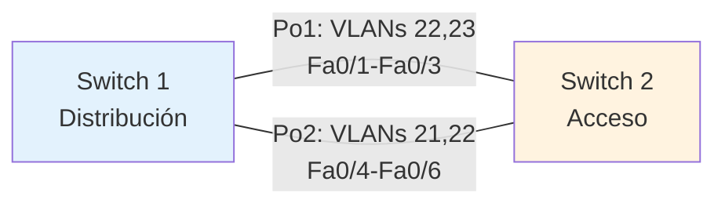

# Práctica: Agregación de Enlaces con EtherChannel

**Conmutación y Enrutamiento en Redes de Datos - Unidad 2: Conmutación de Redes LAN**

---

## Objetivo

Configurar y verificar la agregación de enlaces mediante EtherChannel entre dos switches, implementando políticas de filtrado de VLANs por canal para optimizar el uso del ancho de banda y segmentar el tráfico según departamentos organizacionales.

**Duración estimada:** 1 hora

---

## Competencias a desarrollar

- Configura agregación de enlaces mediante protocolos estándar (LACP) y propietarios (PAgP)
- Implementa políticas de filtrado de VLANs en enlaces troncales
- Verifica el estado operacional de canales agregados mediante comandos de diagnóstico
- Diseña y ejecuta pruebas de conectividad para validar requisitos de segmentación de tráfico
- Documenta configuraciones y evidencias técnicas en formato profesional

---

## Introducción

### ¿Qué es EtherChannel?

**EtherChannel** es una tecnología de agregación de enlaces que permite combinar múltiples enlaces físicos Ethernet en un único enlace lógico de mayor capacidad. Esta técnica proporciona:

- **Mayor ancho de banda:** Suma el ancho de banda de los enlaces individuales
- **Redundancia:** Si un enlace falla, el tráfico se redistribuye automáticamente
- **Balanceo de carga:** Distribuye tráfico entre los enlaces activos
- **Prevención de loops:** STP considera el EtherChannel como un solo enlace

### Protocolos de Negociación

**LACP (Link Aggregation Control Protocol - IEEE 802.3ad):**
- Estándar abierto, interoperable entre fabricantes
- Modos: `active` (inicia negociación) y `passive` (espera negociación)
- Recomendado para entornos multi-vendor

**PAgP (Port Aggregation Protocol - Cisco):**
- Protocolo propietario de Cisco
- Modos: `desirable` (inicia negociación) y `auto` (espera negociación)
- Solo funciona entre dispositivos Cisco

**Modo On:**
- Sin negociación dinámica
- Fuerza la agregación sin protocolo
- Menos recomendado (sin detección de errores automática)

### Filtrado de VLANs en Trunks

El comando `switchport trunk allowed vlan` permite controlar qué VLANs pueden transitar por un enlace troncal específico, mejorando:

- **Seguridad:** Aislamiento de tráfico sensible
- **Rendimiento:** Reduce broadcast domains innecesarios
- **Organización:** Separación lógica por funciones

### Topología de la Práctica



**Especificaciones:**

- **Port-Channel 1:** 3 puertos (Fa0/1-Fa0/3), modo trunk, VLANs permitidas: 22 (TI), 23 (RH)
- **Port-Channel 2:** 3 puertos (Fa0/4-Fa0/6), modo trunk, VLANs permitidas: 21 (MKT), 22 (TI)
- **Protocolo:** LACP (modo active en ambos lados)

---

## Equipo de protección e higiene

- No se requiere equipo de protección especial para esta práctica
- Mantener área de trabajo ordenada y libre de líquidos cerca del equipo
- Evitar desconexiones bruscas de cables de red

---

## Material y equipo necesario

### Equipo de laboratorio

**Opción A - Equipamiento físico:**
- 2 switches Cisco Catalyst (2960, 3560 o superior) con soporte para EtherChannel
- 6 cables Ethernet directos (categoría 5e o superior)
- 2 computadoras con adaptadores de red (para pruebas de conectividad)

**Opción B - Simulación (recomendado):**
- Cisco Packet Tracer 8.0 o superior
- 2 switches Catalyst 2960 (modelo disponible en Packet Tracer)
- 4 PCs para pruebas (una por VLAN)

### Herramientas

- Aplicación de terminal (PuTTY, Tera Term, o consola de Packet Tracer)
- Editor de texto para documentación
- Herramienta de captura de pantalla
- Software para generar PDF (LibreOffice, Microsoft Word, o similar)

---

## Instrucciones

### Parte 1: Preparación del Entorno (10 minutos)

#### 1.1 Configuración Inicial de Switches

Acceda a cada switch y configure lo básico:

**Switch 1:**
```
enable
configure terminal
hostname SW1
no ip domain-lookup
line console 0
  logging synchronous
  exec-timeout 0 0
exit
end
```

**Switch 2:**
```
enable
configure terminal
hostname SW2
no ip domain-lookup
line console 0
  logging synchronous
  exec-timeout 0 0
exit
end
```

#### 1.2 Creación de VLANs

Configure las VLANs en **ambos switches**:

```
configure terminal
!
vlan 21
 name MKT
vlan 22
 name TI
vlan 23
 name RH
!
end
```

**Verificación:**
```
show vlan brief
```

**Captura requerida:** Screenshot del comando `show vlan brief` en ambos switches.

---

### Parte 2: Configuración de EtherChannel 1 (15 minutos)

#### 2.1 Configuración de Port-Channel 1 (VLANs 22 y 23)

**En Switch 1:**
```
configure terminal
!
interface range FastEthernet0/1 - 3
 description Enlace_a_SW2_Po1
 switchport mode trunk
 switchport trunk allowed vlan 22,23
 channel-group 1 mode active
 no shutdown
exit
!
interface Port-channel1
 description EtherChannel_a_SW2_TI_RH
 switchport mode trunk
 switchport trunk allowed vlan 22,23
exit
!
end
```

**En Switch 2:**
```
configure terminal
!
interface range FastEthernet0/1 - 3
 description Enlace_a_SW1_Po1
 switchport mode trunk
 switchport trunk allowed vlan 22,23
 channel-group 1 mode active
 no shutdown
exit
!
interface Port-channel1
 description EtherChannel_a_SW1_TI_RH
 switchport mode trunk
 switchport trunk allowed vlan 22,23
exit
!
end
```

#### 2.2 Verificación de Port-Channel 1

Ejecute los siguientes comandos en **ambos switches**:

```
show etherchannel summary
show etherchannel port-channel
show interfaces Port-channel1 switchport
show interfaces trunk
```

**Capturas requeridas:**

1. `show etherchannel summary` - Debe mostrar Po1 con estado "SU" (Layer2 - in use)
2. `show interfaces Port-channel1 switchport` - Verificar VLANs permitidas: 22,23
3. `show interfaces trunk` - Confirmar Po1 como trunk

**Puntos de verificación:**

- [ ] Port-Channel 1 está en estado "up"
- [ ] Los 3 puertos físicos muestran flag "P" (bundled in port-channel)
- [ ] Protocolo LACP activo
- [ ] VLANs permitidas: solo 22 y 23

---

### Parte 3: Configuración de EtherChannel 2 (15 minutos)

#### 3.1 Configuración de Port-Channel 2 (VLANs 21 y 22)

**En Switch 1:**
```
configure terminal
!
interface range FastEthernet0/4 - 6
 description Enlace_a_SW2_Po2
 switchport mode trunk
 switchport trunk allowed vlan 21,22
 channel-group 2 mode active
 no shutdown
exit
!
interface Port-channel2
 description EtherChannel_a_SW2_MKT_TI
 switchport mode trunk
 switchport trunk allowed vlan 21,22
exit
!
end
```

**En Switch 2:**
```
configure terminal
!
interface range FastEthernet0/4 - 6
 description Enlace_a_SW1_Po2
 switchport mode trunk
 switchport trunk allowed vlan 21,22
 channel-group 2 mode active
 no shutdown
exit
!
interface Port-channel2
 description EtherChannel_a_SW1_MKT_TI
 switchport mode trunk
 switchport trunk allowed vlan 21,22
exit
!
end
```

#### 3.2 Verificación de Port-Channel 2

Ejecute en **ambos switches**:

```
show etherchannel summary
show interfaces Port-channel2 switchport
show interfaces trunk
```

**Capturas requeridas:**

1. `show etherchannel summary` - Debe mostrar Po1 y Po2 ambos en estado "SU"
2. `show interfaces Port-channel2 switchport` - Verificar VLANs permitidas: 21,22
3. `show interfaces trunk` - Confirmar Po1 y Po2 como trunks

**Puntos de verificación:**

- [ ] Port-Channel 2 está en estado "up"
- [ ] Los 3 puertos físicos (Fa0/4-6) muestran flag "P"
- [ ] VLANs permitidas: solo 21 y 22

---

### Parte 4: Configuración de Puertos de Acceso para Pruebas (5 minutos)

Configure puertos de acceso en cada VLAN para conectar PCs de prueba:

**En Switch 2:**
```
configure terminal
!
interface FastEthernet0/11
 description PC_VLAN_21_MKT
 switchport mode access
 switchport access vlan 21
 no shutdown
!
interface FastEthernet0/12
 description PC_VLAN_22_TI
 switchport mode access
 switchport access vlan 22
 no shutdown
!
interface FastEthernet0/13
 description PC_VLAN_23_RH
 switchport mode access
 switchport access vlan 23
 no shutdown
!
end
```

**En Switch 1:**
```
configure terminal
!
interface FastEthernet0/11
 description PC_VLAN_22_TI
 switchport mode access
 switchport access vlan 22
 no shutdown
!
end
```

---

### Parte 5: Pruebas de Conectividad y Validación (10 minutos)

#### 5.1 Asignación de Direcciones IP a PCs

Configure las PCs con las siguientes direcciones:

| Dispositivo | VLAN | IP Address | Subnet Mask | Ubicación |
|-------------|------|------------|-------------|-----------|
| PC-MKT | 21 | 172.16.21.10 | 255.255.255.0 | SW2 Fa0/11 |
| PC-TI-1 | 22 | 172.16.22.10 | 255.255.255.0 | SW2 Fa0/12 |
| PC-TI-2 | 22 | 172.16.22.20 | 255.255.255.0 | SW1 Fa0/11 |
| PC-RH | 23 | 172.16.23.10 | 255.255.255.0 | SW2 Fa0/13 |

#### 5.2 Diseño de Pruebas

**Objetivo de las pruebas:** Demostrar que cada EtherChannel solo transporta las VLANs asignadas.

**Prueba 1: Verificar conectividad de VLAN 22 (TI) por ambos Port-Channels**

VLAN 22 está permitida en Po1 y Po2, por lo tanto debe haber conectividad:

```
# Desde PC-TI-1 (SW2):
ping 172.16.22.20

# Resultado esperado: Éxito (paquetes transitan por Po1 o Po2)
```

**Prueba 2: Verificar aislamiento de VLAN 21 (MKT) en Po1**

VLAN 21 solo está permitida en Po2. Si deshabilitamos Po2, no debe haber conectividad:

**Acción:**
```
# En SW1 y SW2:
configure terminal
interface Port-channel2
 shutdown
end
```

```
# Desde PC-MKT:
ping 172.16.22.10

# Resultado esperado: Fallo (VLAN 21 no transita por Po1)
```

**Acción de restauración:**
```
# En SW1 y SW2:
configure terminal
interface Port-channel2
 no shutdown
end
```

**Prueba 3: Verificar aislamiento de VLAN 23 (RH) en Po2**

VLAN 23 solo está permitida en Po1. Si deshabilitamos Po1, no debe haber conectividad:

**Acción:**
```
# En SW1 y SW2:
configure terminal
interface Port-channel1
 shutdown
end
```

```
# Desde PC-RH:
ping 172.16.22.10

# Resultado esperado: Fallo (VLAN 23 no transita por Po2)
```

**Acción de restauración:**
```
# En SW1 y SW2:
configure terminal
interface Port-channel1
 no shutdown
end
```

**Prueba 4: Verificar balanceo de carga y redundancia**

Deshabilite un puerto físico de Po1 y verifique que el tráfico continúa:

```
# En SW1:
configure terminal
interface FastEthernet0/1
 shutdown
end

# Verificar estado:
show etherchannel summary

# Desde PC-TI-1:
ping 172.16.22.20 -n 100

# Resultado esperado: Éxito (tráfico usa Fa0/2 y Fa0/3)
```

**Restauración:**
```
configure terminal
interface FastEthernet0/1
 no shutdown
end
```

#### 5.3 Capturas de Evidencia Requeridas

Para cada prueba, capture:

1. Configuración aplicada (comandos ejecutados)
2. Resultado del ping (exitoso o fallido)
3. Estado de los Port-Channels (`show etherchannel summary`)
4. Tabla MAC de las VLANs involucradas (`show mac address-table vlan XX`)

---

### Parte 6: Documentación Final (5 minutos)

#### 6.1 Recopilación de Información de Estado

Ejecute y capture los siguientes comandos en **ambos switches**:

```
show running-config | section interface
show etherchannel summary
show etherchannel port-channel
show etherchannel load-balance
show interfaces trunk
show spanning-tree vlan 21,22,23
```

#### 6.2 Estructura del Reporte PDF

Su documento debe contener:

**1. Portada**
- Nombre de la práctica
- Nombre del alumno
- Matrícula
- Fecha de realización

**2. Introducción**
- Objetivo de la práctica (con sus palabras)
- Topología implementada (diagrama)

**3. Desarrollo**
- Configuración de VLANs (screenshots)
- Configuración de Port-Channel 1 (comandos y verificación)
- Configuración de Port-Channel 2 (comandos y verificación)
- Configuración de puertos de acceso

**4. Pruebas de Validación**
- Descripción de cada prueba realizada
- Screenshots de resultados
- Análisis de resultados (¿por qué funcionó o falló?)

**5. Evidencias de Estado**
- `show etherchannel summary` (ambos switches)
- `show interfaces trunk` (ambos switches)
- `show spanning-tree vlan 21,22,23` (un switch)

**6. Conclusiones**
- Lecciones aprendidas
- Problemas encontrados y soluciones aplicadas
- Aplicaciones prácticas de EtherChannel en redes reales

**7. Reflexión Personal**
- ¿Qué ventajas tiene separar VLANs en diferentes EtherChannels?
- ¿Cómo impacta esta configuración en la seguridad de la red?
- ¿Qué consideraciones tendría para implementar esto en un entorno de producción?

---

## Notas

### Consideraciones Importantes

**Sobre la configuración de VLANs permitidas:**

- El filtrado de VLANs se debe configurar tanto en los puertos físicos como en la interfaz Port-channel
- Si existe discrepancia, prevalece la configuración más restrictiva
- Recomendación: configure primero el Port-channel, luego los puertos físicos heredan la configuración

**Sobre el balanceo de carga:**

- Por defecto, el balanceo se basa en MAC de origen (src-mac)
- Para verificar el método: `show etherchannel load-balance`
- Puede cambiarse con: `port-channel load-balance {src-mac | dst-mac | src-dst-mac | src-ip | dst-ip | src-dst-ip}`

**Troubleshooting común:**

| Problema | Causa probable | Solución |
|----------|----------------|----------|
| Port-channel en estado "down" | Modos LACP incompatibles | Verificar que ambos lados usen `active` o combinación `active-passive` |
| Puertos en estado "s" (suspended) | Configuración inconsistente entre puertos | Verificar que todos los puertos del grupo tengan configuración idéntica |
| VLANs no transitan | Filtrado incorrecto | Verificar `allowed vlan` en port-channel y puertos físicos |
| Paquetes se pierden intermitentemente | STP bloqueando puertos | Verificar `show spanning-tree` - EtherChannel debe ser un solo enlace lógico |

**Comandos útiles para diagnóstico:**

```
show etherchannel summary                    # Resumen del estado
show etherchannel port-channel               # Detalles de port-channels
show interfaces [interface] etherchannel     # Info de puerto específico
show lacp neighbor                           # Información del vecino LACP
show lacp internal                           # Configuración LACP local
show pagp neighbor                           # (Si usa PAgP en lugar de LACP)
debug etherchannel events                    # Debug en tiempo real (usar con precaución)
```

### Criterios de Evaluación

El reporte será evaluado mediante rúbrica adjunta (ver siguiente sección).

**Aspectos clave:**

- Configuración correcta y completa de ambos EtherChannels
- Pruebas que demuestren efectivamente el filtrado de VLANs
- Screenshots claros y relevantes
- Documentación organizada y profesional
- Análisis técnico de los resultados
- Reflexión personal significativa

### Recursos Adicionales

**Documentación oficial:**
- Cisco. (2024). *EtherChannel Configuration Guide*. https://www.cisco.com/c/en/us/td/docs/switches/lan/catalyst2960/software/release/15-0_2_se/configuration/guide/scg_2960/swethchl.html

**Lecturas recomendadas:**
- Odom, W. (2020). *CCNA 200-301 Official Cert Guide Library*. Cisco Press. (Capítulo sobre EtherChannel)

### Tiempo Sugerido por Actividad

| Actividad | Tiempo |
|-----------|--------|
| Configuración inicial y VLANs | 10 min |
| Port-Channel 1 | 15 min |
| Port-Channel 2 | 15 min |
| Puertos de acceso | 5 min |
| Pruebas de validación | 10 min |
| Documentación final | 5 min |
| **TOTAL** | **60 min** |

**NOTA:** Gestione su tiempo efectivamente. Si termina antes, utilice el tiempo restante para mejorar sus capturas y documentación.

---

## Entregables

**Archivo PDF** que incluya:

1. Portada completa
2. Todas las secciones del desarrollo
3. Screenshots legibles y numerados
4. Conclusiones y reflexión personal
5. Nombre del archivo: `Practica_EtherChannel_Apellido_Matricula.pdf`

**Formato de entrega:** Subir a la plataforma Moodle antes de la fecha límite establecida.

---

# Rúbrica de Evaluación

## Práctica: Agregación de Enlaces con EtherChannel

**Nombre del alumno:** ___________________________  
**Matrícula:** _______________  
**Fecha de evaluación:** _______________

---

### Criterios de Evaluación

| Criterio | Excelente (10 pts) | Satisfactorio (7 pts) | Insuficiente (4 pts) | Puntos |
|----------|-------------------|----------------------|---------------------|--------|
| **1. Configuración de EtherChannels** | Los dos Port-Channels están correctamente configurados con LACP, los 3 puertos en cada uno, modo trunk, y VLANs filtradas según especificaciones (Po1: 22,23 / Po2: 21,22). Screenshots muestran estado "SU" y configuración completa. | Port-Channels configurados pero con errores menores (ej: falta descripción, un puerto mal asignado). Estado operativo correcto. VLANs mayormente correctas. | Uno o ambos Port-Channels no funcionan, configuración incompleta o incorrecta. No hay evidencia del estado operativo. VLANs no filtradas correctamente. | __/10 |
| **2. Pruebas de Validación** | Diseña y ejecuta al menos 3 pruebas diferentes que demuestran efectivamente el filtrado de VLANs. Incluye pruebas con Port-Channels deshabilitados. Screenshots de pings exitosos y fallidos según corresponde. Análisis técnico correcto de cada resultado. | Ejecuta pruebas básicas de conectividad con screenshots, pero sin demostrar completamente el filtrado de VLANs. Análisis limitado o superficial de los resultados. | Pruebas insuficientes o incorrectas. No demuestra el filtrado de VLANs. Sin análisis de resultados. Screenshots faltantes o irrelevantes. | __/10 |
| **3. Evidencias Técnicas** | Incluye todos los comandos de verificación requeridos: `show etherchannel summary`, `show interfaces trunk`, `show interfaces port-channel`, `show spanning-tree`. Screenshots claros y numerados. Evidencia del estado de ambos switches. | Incluye la mayoría de comandos de verificación pero faltan algunos. Screenshots presentes pero no todos son claros o relevantes. Evidencia de al menos un switch. | Evidencias técnicas insuficientes o faltantes. No incluye comandos clave de verificación. Screenshots de mala calidad o irrelevantes. | __/10 |
| **4. Documentación y Presentación** | Documento PDF completo con portada, índice, desarrollo estructurado, conclusiones y reflexión personal significativa. Redacción clara, sin errores ortográficos. Formato profesional. Incluye análisis de ventajas de la segregación de VLANs en EtherChannels. | Documento completo pero con organización mejorable. Algunas secciones superficiales. Errores ortográficos menores. Reflexión personal básica. Formato aceptable. | Documento incompleto o desorganizado. Falta portada, conclusiones o reflexión. Múltiples errores ortográficos. Formato deficiente. | __/10 |

---

### Puntuación Total

| Concepto | Puntos |
|----------|--------|
| Configuración de EtherChannels | __/10 |
| Pruebas de Validación | __/10 |
| Evidencias Técnicas | __/10 |
| Documentación y Presentación | __/10 |
| **TOTAL** | **__/40** |

---

### Escala de Calificación

| Puntos | Calificación |
|--------|--------------|
| 36-40 | 10 (Excelente) |
| 32-35 | 9 |
| 28-31 | 8 |
| 24-27 | 7 (Suficiente) |
| 20-23 | 6 |
| < 20 | 5 o menos (No Acreditado) |

---

### Observaciones y Retroalimentación

**Fortalezas identificadas:**

_______________________________________________________________

_______________________________________________________________

**Áreas de mejora:**

_______________________________________________________________

_______________________________________________________________

**Comentarios adicionales:**

_______________________________________________________________

_______________________________________________________________

_______________________________________________________________

---

**Firma del evaluador:** _______________  
**Fecha:** _______________
