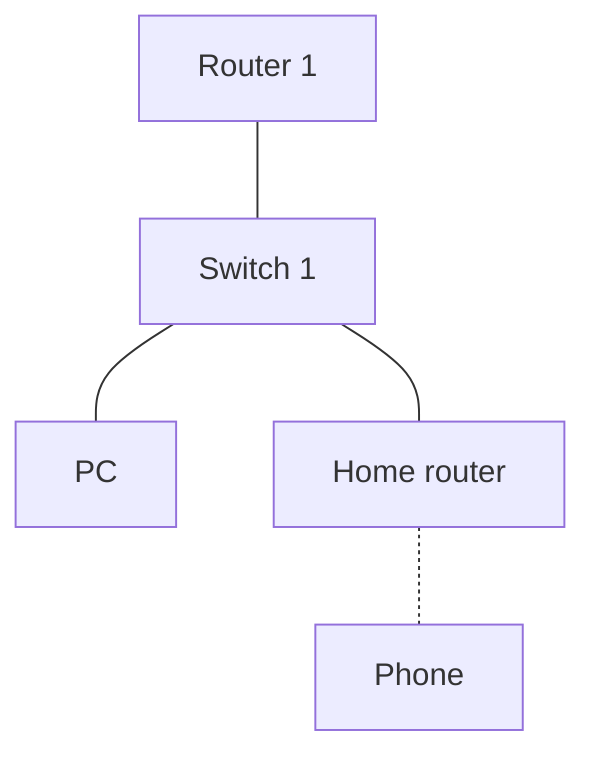

# Trabajo Final - Unidad 4: Redes Inalámbricas
## 1. Configuración de la Topología y Pruebas de Conectividad

Réplica la topología de red que se muestra en el siguiente diagrama utilizando el simulador de tu elección (o entorno físico, según corresponda):

Una vez que la red esté operativa, ejecuta una prueba de conectividad (ping) desde el dispositivo móvil (Phone) hacia la computadora (PC) y responde detalladamente a las siguientes cuestiones:

¿Cuál es el resultado de la prueba? (Exitoso / Fallido).

¿Por qué ocurre este comportamiento? Explica el flujo de datos y el papel que juegan el enrutamiento y la traducción de direcciones (NAT), si aplica, en este escenario.

## 2. Análisis del Impacto Físico en la Señal Inalámbrica

Realiza un entorno de pruebas experimental para evaluar cómo influyen los factores físicos en la intensidad y calidad de la señal Wi-Fi.

### A. Orientación y Posicionamiento del Dispositivo

Describe de qué manera afectan el rendimiento y la cobertura de la señal las siguientes variables:

- La orientación física de las antenas del Home Router.
- La posición del chasis del Home Router (colocación en plano vertical vs. horizontal).

### B. Atenuación por Obstáculos y Materiales

Bloquea u obstaculiza la línea de vista del Home Router utilizando diferentes materiales y entornos. Mide y describe el impacto que tiene cada uno de ellos en la degradación de la señal:

- Pared de ladrillo
- Madera densa
- Lámina de metal
- Malla metálica
- Jaula de Faraday (aislamiento total)
- Efecto de choque de un cuarto de onda (atenuación por interferencia constructiva/destructiva o cancelaciones de fase)
- Espejo
  
## 3. Mapeo de Cobertura (Mapa de Calor) y Optimización

1. **Diseño del Mapa de Calor:** Utilizando una aplicación de análisis de espectro o Wi-Fi (como NetSpot, WiFi Analyzer, etc.), genera un mapa de calor que muestre la cobertura y la intensidad de la señal inalámbrica en las distintas áreas de tu hogar.

2. **Propuesta de Mejora:** Con base en los resultados visuales del mapa, justifica qué cambios técnicos o de ubicación física podrías implementar para optimizar la cobertura y reducir las zonas muertas.

## 4. Sustentación Teórica

Requisito obligatorio: Cada una de tus observaciones y conclusiones experimentales (pérdida de señal por materiales, orientación de antenas y comportamiento del ping) deberá estar estrictamente validada y respaldada por referencias bibliográficas en formato APA.