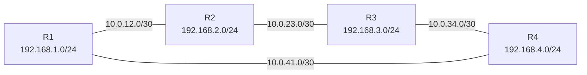

# Práctica 1678: Enrutamiento Estático en Topología de Anillo

## Objetivo

Configurar rutas estáticas en cuatro routers interconectados en topología de anillo para lograr conectividad total entre todas las redes, analizando el comportamiento del tráfico ante diferentes rutas configuradas y comprendiendo la selección de rutas en escenarios con rutas redundantes.

**Duración estimada:** 3 horas

## Competencias a desarrollar

- Configura rutas estáticas en routers Cisco para alcanzar redes remotas en una topología de anillo
- Diseña un esquema de direccionamiento IP para enlaces punto a punto y redes LAN
- Selecciona la ruta óptima y una ruta de respaldo en topologías con redundancia
- Verifica la conectividad extremo a extremo mediante herramientas de diagnóstico (`ping`, `traceroute`, `show ip route`)
- Interpreta la tabla de enrutamiento para analizar el comportamiento del tráfico

## Introducción

El enrutamiento estático es la forma más básica y controlada de configurar el encaminamiento en una red. A diferencia del enrutamiento dinámico, el administrador define manualmente las rutas que cada router utiliza para reenviar paquetes. Este enfoque es adecuado para redes pequeñas, enlaces WAN con ancho de banda limitado, o cuando se requiere control total sobre el flujo del tráfico.

### Topología de anillo

Una topología de anillo conecta cada dispositivo al siguiente formando un circuito cerrado. En el contexto de enrutamiento, esto crea **redundancia de rutas**: entre cualquier par de routers existen siempre dos caminos posibles (horario y antihorario).



Con enrutamiento estático, el administrador elige explícitamente qué camino sigue el tráfico hacia cada red destino. En esta práctica se configurará la **ruta principal en sentido horario** (R1 → R2 → R3 → R4) y se analizará opcionalmente la configuración de una ruta de respaldo en sentido antihorario.

### Plan de direccionamiento IP

**Redes LAN (una por router):**

| Router | Red LAN | Gateway (int. LAN) | Rango de hosts |
|--------|---------|---------------------|----------------|
| R1 | 192.168.1.0/24 | 192.168.1.1 | .10 – .254 |
| R2 | 192.168.2.0/24 | 192.168.2.1 | .10 – .254 |
| R3 | 192.168.3.0/24 | 192.168.3.1 | .10 – .254 |
| R4 | 192.168.4.0/24 | 192.168.4.1 | .10 – .254 |

**Redes de enlace punto a punto (WAN):**

| Enlace | Red | R - extremo A | R - extremo B |
|--------|-----|---------------|---------------|
| R1 – R2 | 10.0.12.0/30 | 10.0.12.1 (R1 Gi0/1) | 10.0.12.2 (R2 Gi0/0) |
| R2 – R3 | 10.0.23.0/30 | 10.0.23.1 (R2 Gi0/1) | 10.0.23.2 (R3 Gi0/0) |
| R3 – R4 | 10.0.34.0/30 | 10.0.34.1 (R3 Gi0/1) | 10.0.34.2 (R4 Gi0/0) |
| R4 – R1 | 10.0.41.0/30 | 10.0.41.1 (R4 Gi0/1) | 10.0.41.2 (R1 Gi0/0) |

**Hosts de prueba:**

| Host | Dirección IP | Gateway | Conectado a |
|------|-------------|---------|-------------|
| PC1 | 192.168.1.10/24 | 192.168.1.1 | R1 Gi0/2 |
| PC2 | 192.168.2.10/24 | 192.168.2.1 | R2 Gi0/2 |
| PC3 | 192.168.3.10/24 | 192.168.3.1 | R3 Gi0/2 |
| PC4 | 192.168.4.10/24 | 192.168.4.1 | R4 Gi0/2 |

### Rutas estáticas requeridas por router

La **ruta principal** sigue el sentido horario (R1 → R2 → R3 → R4 → R1). La tabla muestra las rutas que cada router debe conocer para alcanzar todas las redes remotas por el camino principal:

**R1** — debe alcanzar: 192.168.2.0, 192.168.3.0, 192.168.4.0, 10.0.23.0, 10.0.34.0

| Destino | Máscara | Siguiente salto |
|---------|---------|-----------------|
| 192.168.2.0 | /24 | 10.0.12.2 |
| 10.0.23.0 | /30 | 10.0.12.2 |
| 192.168.3.0 | /24 | 10.0.12.2 |
| 10.0.34.0 | /30 | 10.0.12.2 |
| 192.168.4.0 | /24 | 10.0.41.2* |

*La red LAN de R4 puede alcanzarse en un salto por el enlace R4–R1.

**R2** — debe alcanzar: 192.168.1.0, 192.168.3.0, 192.168.4.0, 10.0.41.0, 10.0.34.0

| Destino | Máscara | Siguiente salto |
|---------|---------|-----------------|
| 192.168.1.0 | /24 | 10.0.12.1 |
| 10.0.41.0 | /30 | 10.0.12.1 |
| 192.168.3.0 | /24 | 10.0.23.2 |
| 10.0.34.0 | /30 | 10.0.23.2 |
| 192.168.4.0 | /24 | 10.0.23.2 |

**R3** — debe alcanzar: 192.168.1.0, 192.168.2.0, 192.168.4.0, 10.0.12.0, 10.0.41.0

| Destino | Máscara | Siguiente salto |
|---------|---------|-----------------|
| 192.168.2.0 | /24 | 10.0.23.1 |
| 10.0.12.0 | /30 | 10.0.23.1 |
| 192.168.1.0 | /24 | 10.0.23.1 |
| 10.0.41.0 | /30 | 10.0.34.2 |
| 192.168.4.0 | /24 | 10.0.34.2 |

**R4** — debe alcanzar: 192.168.1.0, 192.168.2.0, 192.168.3.0, 10.0.12.0, 10.0.23.0

| Destino | Máscara | Siguiente salto |
|---------|---------|-----------------|
| 192.168.3.0 | /24 | 10.0.34.1 |
| 10.0.23.0 | /30 | 10.0.34.1 |
| 192.168.2.0 | /24 | 10.0.34.1 |
| 10.0.12.0 | /30 | 10.0.34.1 |
| 192.168.1.0 | /24 | 10.0.41.2 |

## Equipo de protección e higiene

No aplica para esta práctica de simulación en laboratorio de cómputo.

## Material y equipo necesario

### Materiales e insumos

- Computadora con acceso a Cisco Packet Tracer 8.2 o superior
- Libreta técnica para registro de comandos y observaciones
- Acceso a documentación oficial de Cisco IOS

### Equipo de laboratorio

- Software: Cisco Packet Tracer (simulación)
- Mínimo 4 GB de RAM
- 500 MB de espacio disponible en disco

### Herramientas

- Cisco Packet Tracer 8.2+
- Modelos de router recomendados: Cisco 4331 o ISR 1941

## Instrucciones

### Parte 1: Construcción de la topología

1. Abrir Cisco Packet Tracer y crear un nuevo proyecto.
2. Agregar **4 routers** (modelo Cisco 4331 o equivalente) y nombrarlos R1, R2, R3 y R4.
3. Agregar **4 PCs**, una por cada router (PC1 a PC4).
4. Interconectar los routers en anillo con cables **Serial DCE** o **Ethernet** según disponibilidad:
   - R1 Gi0/1 ↔ R2 Gi0/0
   - R2 Gi0/1 ↔ R3 Gi0/0
   - R3 Gi0/1 ↔ R4 Gi0/0
   - R4 Gi0/1 ↔ R1 Gi0/0
5. Conectar cada PC a la interfaz LAN (Gi0/2) de su router correspondiente.

### Parte 2: Configuración básica de los routers

Aplicar en los **cuatro routers** la configuración de seguridad básica antes de configurar interfaces. Ejemplo para R1:

```
enable
configure terminal
hostname R1
no ip domain-lookup
enable secret cisco123
line console 0
 password cisco
 login
line vty 0 4
 password cisco
 login
service password-encryption
banner motd # Acceso restringido - solo personal autorizado #
```

### Parte 3: Configuración de interfaces

**R1:**
```
interface GigabitEthernet0/0
 description Enlace-R4
 ip address 10.0.41.2 255.255.255.252
 no shutdown

interface GigabitEthernet0/1
 description Enlace-R2
 ip address 10.0.12.1 255.255.255.252
 no shutdown

interface GigabitEthernet0/2
 description LAN-R1
 ip address 192.168.1.1 255.255.255.0
 no shutdown
```

**R2:**
```
interface GigabitEthernet0/0
 description Enlace-R1
 ip address 10.0.12.2 255.255.255.252
 no shutdown

interface GigabitEthernet0/1
 description Enlace-R3
 ip address 10.0.23.1 255.255.255.252
 no shutdown

interface GigabitEthernet0/2
 description LAN-R2
 ip address 192.168.2.1 255.255.255.0
 no shutdown
```

**R3:**
```
interface GigabitEthernet0/0
 description Enlace-R2
 ip address 10.0.23.2 255.255.255.252
 no shutdown

interface GigabitEthernet0/1
 description Enlace-R4
 ip address 10.0.34.1 255.255.255.252
 no shutdown

interface GigabitEthernet0/2
 description LAN-R3
 ip address 192.168.3.1 255.255.255.0
 no shutdown
```

**R4:**
```
interface GigabitEthernet0/0
 description Enlace-R3
 ip address 10.0.34.2 255.255.255.252
 no shutdown

interface GigabitEthernet0/1
 description Enlace-R1
 ip address 10.0.41.1 255.255.255.252
 no shutdown

interface GigabitEthernet0/2
 description LAN-R4
 ip address 192.168.4.1 255.255.255.0
 no shutdown
```

### Parte 4: Configuración de rutas estáticas (sentido horario)

**R1:**
```
ip route 192.168.2.0 255.255.255.0 10.0.12.2
ip route 10.0.23.0 255.255.255.252 10.0.12.2
ip route 192.168.3.0 255.255.255.0 10.0.12.2
ip route 10.0.34.0 255.255.255.252 10.0.12.2
ip route 192.168.4.0 255.255.255.0 10.0.41.2
```

**R2:**
```
ip route 192.168.1.0 255.255.255.0 10.0.12.1
ip route 10.0.41.0 255.255.255.252 10.0.12.1
ip route 192.168.3.0 255.255.255.0 10.0.23.2
ip route 10.0.34.0 255.255.255.252 10.0.23.2
ip route 192.168.4.0 255.255.255.0 10.0.23.2
```

**R3:**
```
ip route 192.168.2.0 255.255.255.0 10.0.23.1
ip route 10.0.12.0 255.255.255.252 10.0.23.1
ip route 192.168.1.0 255.255.255.0 10.0.23.1
ip route 10.0.41.0 255.255.255.252 10.0.34.2
ip route 192.168.4.0 255.255.255.0 10.0.34.2
```

**R4:**
```
ip route 192.168.3.0 255.255.255.0 10.0.34.1
ip route 10.0.23.0 255.255.255.252 10.0.34.1
ip route 192.168.2.0 255.255.255.0 10.0.34.1
ip route 10.0.12.0 255.255.255.252 10.0.34.1
ip route 192.168.1.0 255.255.255.0 10.0.41.2
```

### Parte 5: Configuración de los hosts

Configurar cada PC con la dirección IP, máscara y gateway indicados en el plan de direccionamiento. Ejemplo para PC1:
- IP: `192.168.1.10`
- Máscara: `255.255.255.0`
- Gateway: `192.168.1.1`

### Parte 6: Verificación de conectividad

**6.1** En cada router, verificar que las interfaces estén activas y con la dirección correcta:
```
show ip interface brief
```

**6.2** Verificar la tabla de enrutamiento de cada router:
```
show ip route
```
- Identificar las rutas directamente conectadas (C) y las rutas estáticas (S).
- Verificar que cada router conoce las **8 redes** del escenario (4 LAN + 4 enlaces WAN).

**6.3** Desde cada PC, realizar ping hacia las tres PCs remotas:
```
ping 192.168.2.10
ping 192.168.3.10
ping 192.168.4.10
```
Todos los pings deben ser exitosos (5/5).

**6.4** Desde PC1, ejecutar traceroute hacia PC3 (dos saltos de distancia) y hacia PC4 (un salto de distancia):
```
tracert 192.168.3.10
tracert 192.168.4.10
```
Registrar los saltos intermedios y verificar que coinciden con la ruta principal configurada.

### Parte 7 (Actividad de análisis): Ruta de respaldo

7.1 Agregar una ruta de respaldo en R1 hacia la LAN de R3 (192.168.3.0/24) con distancia administrativa 5 (mayor que la ruta principal) por el enlace antihorario a través de R4:
```
ip route 192.168.3.0 255.255.255.0 10.0.41.2 5
```

7.2 Verificar con `show ip route` que la ruta de respaldo aparece como flotante (no activa mientras exista la ruta principal).

7.3 Simular la caída del enlace R1–R2 con `shutdown` en la interfaz Gi0/1 de R1 y verificar que el tráfico hacia R3 ahora sigue el camino antihorario.

7.4 Restaurar la interfaz con `no shutdown` y verificar que la ruta principal vuelve a ser activa.

## Notas

- Las máscaras `/30` (`255.255.255.252`) en los enlaces WAN permiten solo 2 hosts útiles, lo que es la práctica estándar para enlaces punto a punto.
- En Cisco IOS, la distancia administrativa predeterminada para rutas estáticas es **1**. Una ruta con mayor distancia administrativa es preferida solo cuando la ruta de menor distancia no está disponible.
- Si se usa cable serial en lugar de Ethernet para los enlaces WAN, la interfaz DCE requiere el comando `clock rate 64000` para proveer señal de reloj.
- Guardar la configuración de todos los routers al finalizar: `copy running-config startup-config`
- Documentar en la libreta técnica la tabla de enrutamiento final de cada router y los resultados de los pings de verificación.
