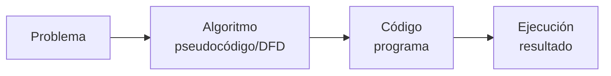

# Unidad 1: Diseño Algorítmico

**Asignatura**: Fundamentos de Programación (AED-1285) — ISC / IADEV — TecNM

---

## 1.1 Conceptos Básicos

### ¿Qué es un algoritmo?

Un **algoritmo** es una secuencia finita, ordenada y precisa de instrucciones que resuelve un problema o realiza una tarea en un tiempo finito.

La palabra proviene del nombre del matemático persa Muhammad ibn Musa al-Juarismi (siglo IX), cuyo libro sobre aritmética introdujo el sistema de numeración decimal en Europa.

**Propiedades de un algoritmo válido:**

| Propiedad | Descripción | Contraejemplo (no es un algoritmo) |
|-----------|-------------|-----------------------------------|
| **Finito** | Debe terminar después de un número finito de pasos | "Sigue revolviendo hasta que quede listo" — sin criterio de parada |
| **Preciso** | Cada instrucción debe ser inequívoca | "Agrega suficiente sal" — ¿cuánto es suficiente? |
| **Definido** | El mismo estado inicial produce siempre el mismo resultado | Un proceso al azar no es determinista |
| **Entrada** | Puede tener cero o más datos de entrada | |
| **Salida** | Debe producir al menos un resultado | Un proceso sin resultado no sirve |
| **Efectivo** | Cada operación debe ser ejecutable en tiempo finito | |

### Algoritmo, programa y paradigma



- **Algoritmo**: plan de solución en lenguaje natural o simbólico (DFD, pseudocódigo)
- **Programa**: algoritmo expresado en un lenguaje de programación formal (Python, Java, C++)
- **Paradigma de programación**: enfoque o estilo general para resolver problemas (estructurado, orientado a objetos, funcional, lógico)

### Tipos de datos básicos

| Tipo | Descripción | Ejemplos |
|------|-------------|---------|
| **Entero** (integer) | Números sin parte decimal | 0, 25, -3, 1000 |
| **Real** (float) | Números con parte decimal | 3.14, -0.5, 2.718 |
| **Carácter** (char) | Una letra, dígito o símbolo | 'A', '7', '$' |
| **Cadena** (string) | Secuencia de caracteres | "Xóchitl", "Hola mundo" |
| **Lógico** (boolean) | Solo dos valores | Verdadero / Falso |

### Variable, constante e identificador

- **Variable**: espacio en memoria con nombre, cuyo valor puede cambiar durante la ejecución (`edad`, `precio`, `nombre`)
- **Constante**: valor que no cambia durante la ejecución (`PI = 3.14159`, `IVA = 0.16`)
- **Identificador**: nombre que el programador asigna a variables, constantes o funciones; debe ser descriptivo y seguir reglas del lenguaje (sin espacios, sin acentos en muchos lenguajes, sin palabras reservadas)

### Operadores

| Categoría | Operadores | Ejemplo |
|-----------|-----------|---------|
| Aritméticos | `+` `-` `*` `/` `%` `^` | `precio * 1.16` |
| Relacionales | `=` `<>` `<` `>` `<=` `>=` | `edad >= 18` |
| Lógicos | `Y` (`and`) `O` (`or`) `NO` (`not`) | `tiene_credencial Y es_mayor` |
| Asignación | `←` (pseudocódigo), `=` (Python) | `total ← precio * cantidad` |

---

## 1.2 Representación de Algoritmos

Los algoritmos se pueden expresar de múltiples formas antes de convertirlos en código. Las más usadas en ingeniería son el **diagrama de flujo** y el **pseudocódigo**.

### Diagrama de flujo (DFD)

Representación gráfica que usa símbolos estandarizados (ISO 5807):

| Símbolo | Nombre | Uso |
|---------|--------|-----|
| Óvalo / Terminal | Inicio / Fin | Punto de entrada y salida del algoritmo |
| Rectángulo | Proceso | Operación de cálculo o asignación |
| Rombo | Decisión | Condición con dos caminos: Sí / No |
| Paralelogramo | Entrada/Salida | Leer datos o mostrar resultados |
| Flechas | Flujo | Dirección de ejecución |
| Rectángulo doble | Subproceso / Función | Llamada a un módulo externo |

**Reglas importantes:**
- Todo diagrama tiene exactamente un INICIO y un FIN
- Los rombos (decisión) siempre tienen exactamente dos salidas etiquetadas (Sí/No o V/F)
- Las flechas no deben cruzarse innecesariamente
- Fluye de arriba hacia abajo y de izquierda a derecha

### Pseudocódigo

Lenguaje intermedio entre el español y el código de programación. Permite describir el algoritmo con precisión sin preocuparse por la sintaxis exacta de un lenguaje.

**Convenciones usadas en este curso (estilo PSeInt):**

```
Algoritmo nombre_del_algoritmo
    // Comentarios con doble diagonal
    Definir variable Como TipoDeDato
    Leer variable
    variable <- expresión
    Escribir "texto" , variable
    Si condición Entonces
        instrucciones
    SiNo
        instrucciones
    FinSi
    Mientras condición Hacer
        instrucciones
    FinMientras
    Para i <- inicio Hasta fin Hacer
        instrucciones
    FinPara
FinAlgoritmo
```

---

## 1.3 Diseño de Algoritmos

### Metodología EPP: Entrada — Proceso — Salida

Todo algoritmo puede analizarse en tres partes:

| Parte | Pregunta clave | Ejemplo: calcular precio con IVA |
|-------|---------------|----------------------------------|
| **Entrada** | ¿Qué datos necesito? | Precio sin IVA |
| **Proceso** | ¿Qué cálculos o decisiones realizo? | `precio_final ← precio * 1.16` |
| **Salida** | ¿Qué resultado entrego? | Precio final con IVA |

### Ejemplos con contextos socioculturales

**Ejemplo 1 — Comunidad nahua (Hidalgo): Distribuir cosecha**

Una familia de Ixmiquilpan cosechó `kilos_maiz` kilogramos de maíz y quiere repartirlos en partes iguales entre `num_familias` familias de su comunidad.

```
Algoritmo distribuir_cosecha
    Definir kilos_maiz, num_familias, porcion Como Real
    Escribir "¿Cuántos kilos de maíz cosecharon?"
    Leer kilos_maiz
    Escribir "¿Entre cuántas familias se repartirá?"
    Leer num_familias
    Si num_familias > 0 Entonces
        porcion <- kilos_maiz / num_familias
        Escribir "A cada familia le corresponden: ", porcion, " kg"
    SiNo
        Escribir "Error: el número de familias debe ser mayor que cero"
    FinSi
FinAlgoritmo
```

**Ejemplo 2 — Cooperativa pesquera (Puerto Ángel, Oaxaca): Calcular ingreso**

La cooperativa vende `kilos_pescado` kilogramos de mojarra a `precio_kilo` pesos el kilo. Calcular el ingreso total y descontar 10% para el fondo comunitario.

```
Algoritmo ingreso_cooperativa
    Definir kilos_pescado, precio_kilo, ingreso, fondo, neto Como Real
    Leer kilos_pescado, precio_kilo
    ingreso <- kilos_pescado * precio_kilo
    fondo   <- ingreso * 0.10
    neto    <- ingreso - fondo
    Escribir "Ingreso bruto: $ ", ingreso
    Escribir "Fondo comunitario: $ ", fondo
    Escribir "Ingreso neto: $ ", neto
FinAlgoritmo
```

**Ejemplo 3 — Receta de atole de guayaba (Abuela Dolores, Veracruz)**

Para preparar atole de guayaba para `personas` comensales se necesitan 2 guayabas y 200 mL de agua por persona.

```
Algoritmo receta_atole
    Definir personas Como Entero
    Definir guayabas Como Entero
    Definir agua_ml Como Real
    Leer personas
    guayabas <- personas * 2
    agua_ml  <- personas * 200
    Escribir "Guayabas necesarias: ", guayabas
    Escribir "Agua necesaria: ", agua_ml, " mL"
FinAlgoritmo
```

**Ejemplo 4 — Tianguis de San Cristóbal de las Casas (Chiapas): Cambio de vuelto**

La vendedora Citlali recibe `pago` pesos y el artículo cuesta `precio` pesos. Calcular el cambio.

```
Algoritmo calcular_cambio
    Definir precio, pago, cambio Como Real
    Leer precio, pago
    Si pago >= precio Entonces
        cambio <- pago - precio
        Escribir "Cambio: $ ", cambio
    SiNo
        Escribir "Pago insuficiente. Faltan: $ ", precio - pago
    FinSi
FinAlgoritmo
```

**Ejemplo 5 — Clínica comunitaria (Sierra Norte de Puebla): Dosis de medicamento**

Un medicamento requiere 5 mg por kilogramo de peso corporal. Calcular la dosis para un/a paciente.

```
Algoritmo calcular_dosis
    Definir peso_kg, dosis_mg Como Real
    Definir DOSIS_POR_KG Como Real
    DOSIS_POR_KG <- 5.0
    Leer peso_kg
    dosis_mg <- peso_kg * DOSIS_POR_KG
    Escribir "Dosis recomendada: ", dosis_mg, " mg"
FinAlgoritmo
```

---

## 1.4 Diseño de Funciones

Una **función** (o módulo) es un bloque de instrucciones con un nombre propio que realiza una tarea específica y puede ser llamado desde el algoritmo principal cuando se necesite.

**¿Por qué usar funciones?**
- Evitan repetir el mismo código (reutilización)
- Hacen el algoritmo más legible
- Facilitan la corrección de errores
- Permiten dividir un problema grande en partes manejables

**Estructura de una función en pseudocódigo:**

```
Función nombre_función(parámetro1 Como Tipo, parámetro2 Como Tipo) Como TipoRetorno
    // instrucciones
    Retornar resultado
FinFunción
```

**Ejemplo — Función para calcular el área de un terreno rectangular:**

```
Función calcular_area(largo Como Real, ancho Como Real) Como Real
    Definir area Como Real
    area <- largo * ancho
    Retornar area
FinFunción

Algoritmo terreno_milpa
    Definir largo, ancho, resultado Como Real
    Escribir "Ingresa el largo del terreno (metros):"
    Leer largo
    Escribir "Ingresa el ancho del terreno (metros):"
    Leer ancho
    resultado <- calcular_area(largo, ancho)
    Escribir "Área total: ", resultado, " m²"
FinAlgoritmo
```

**Tabla de seguimiento (traza del algoritmo)** para largo=15, ancho=8:

| Paso | Instrucción | largo | ancho | area | resultado |
|------|-------------|-------|-------|------|-----------|
| 1 | Leer largo | 15 | — | — | — |
| 2 | Leer ancho | 15 | 8 | — | — |
| 3 | calcular_area(15, 8) | 15 | 8 | — | — |
| 4 | area ← 15 * 8 | 15 | 8 | 120 | — |
| 5 | Retornar 120 | 15 | 8 | 120 | — |
| 6 | resultado ← 120 | 15 | 8 | 120 | 120 |

---

## Conexión con Moodle y PSeInt

Los algoritmos de esta unidad se pueden implementar directamente en **PSeInt** (software gratuito que interpreta pseudocódigo y genera diagramas de flujo automáticamente):

1. Descargar PSeInt desde https://pseint.sourceforge.net/
2. Escribir el algoritmo en la ventana de código
3. Usar el botón "Ejecutar" (F9) para probarlo
4. Usar el botón "Diagrama" para generar el DFD automáticamente

El Quiz 1 se encuentra disponible en Moodle (cuestionario con tiempo límite de 30 minutos).

---

## Referencias

1. Cairo, O. (2005). *Metodología de la programación: algoritmos, diagramas de flujo y programas*. Alfaomega. — Cap. 1-4
2. Joyanes, L. (2010). *Fundamentos de programación* (4a ed.). McGraw-Hill. — Cap. 1-3
3. Brassard, G. y Bratley, P. (1997). *Fundamentos de algoritmia*. Prentice Hall. — Cap. 1
4. PSeInt. (2024). *Manual de PSeInt*. https://pseint.sourceforge.net/index.php?page=documentacion.php
