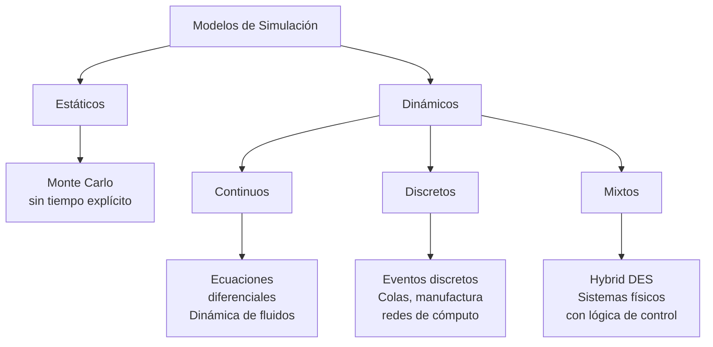
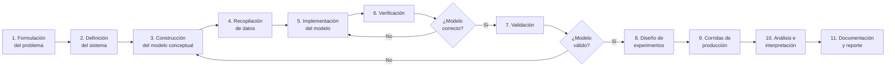
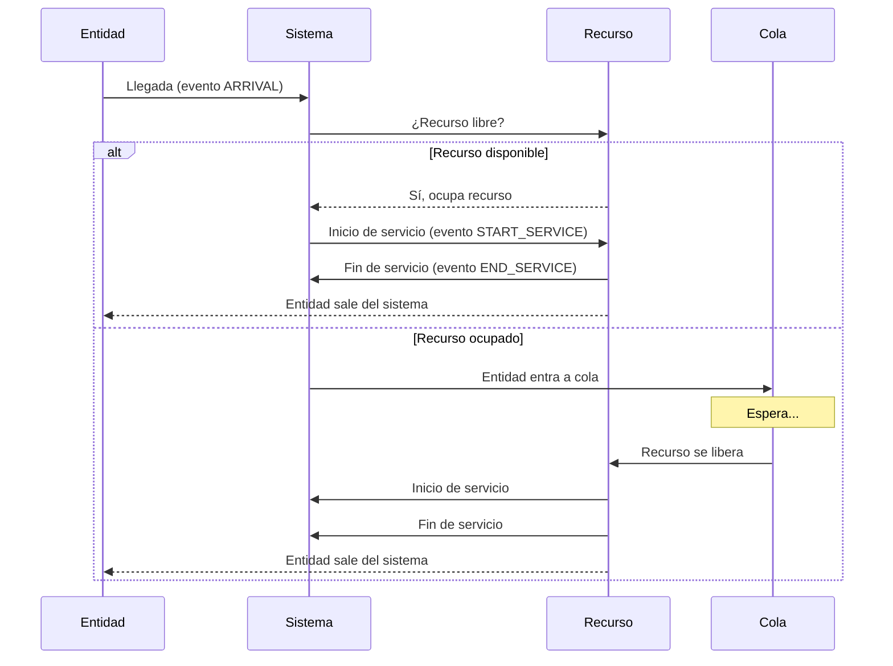

# Unidad 1: Introducción a la Simulación

**Asignatura**: Simulación (SCD-1022) — Ingeniería en Sistemas Computacionales — TecNM  
**SATCA**: 2-3-5

---

## 1.1 Definición e Importancia de la Simulación en la Ingeniería

### ¿Qué es la simulación?

La **simulación** es la representación de la operación o características de un sistema real mediante el uso de otro sistema. En el contexto computacional, un modelo de simulación es un programa que imita el comportamiento dinámico de un sistema real a lo largo del tiempo.

La definición formal según Law (2015) es:

> "Simulation is the imitation of the operation of a real-world process or system over time."

Un **modelo** es una representación abstracta de un sistema real que captura las características relevantes para el objetivo del estudio, descartando los detalles que no afectan significativamente los resultados.

### Importancia en la Ingeniería en Sistemas Computacionales

La simulación se aplica cuando:

- El sistema real es **demasiado complejo** para ser analizado analíticamente
- El sistema aún **no existe** y se desea evaluar diseños alternativos antes de construirlo
- Experimentar con el sistema real es **demasiado costoso**, peligroso o disruptivo
- Se necesita **comprimir o expandir el tiempo** para observar fenómenos que ocurren muy lento o muy rápido

Áreas de aplicación directa para el ISC:
- Redes de cómputo (modelado de tráfico, latencia, throughput)
- Centros de datos (planificación de capacidad, colas de trabajos)
- Sistemas de atención al cliente (call centers, ventanillas, servicios web)
- Cadenas de suministro y logística
- Sistemas de manufactura y producción

---

## 1.2 Conceptos Básicos de la Simulación

### Terminología fundamental

| Término | Definición |
|---------|-----------|
| **Sistema** | Colección de entidades (personas, máquinas, mensajes) que interactúan juntas para lograr algún fin lógico |
| **Modelo** | Representación abstracta de un sistema; captura las relaciones relevantes entre sus componentes |
| **Entidad** | Objeto de interés en el sistema cuyo movimiento o cambio de estado se rastrea (cliente, paquete, solicitud) |
| **Atributo** | Propiedad que caracteriza a una entidad (tiempo de llegada, prioridad, tipo de servicio requerido) |
| **Recurso** | Elemento del sistema que sirve a las entidades (servidor, máquina, canal de comunicación) |
| **Cola** | Conjunto de entidades que esperan por un recurso |
| **Evento** | Ocurrencia instantánea que cambia el estado del sistema (llegada de cliente, fin de servicio) |
| **Actividad** | Duración de tiempo de duración conocida a priori (tiempo de servicio con distribución dada) |
| **Demora** | Duración de tiempo que no se conoce a priori; depende del estado del sistema (tiempo de espera en cola) |
| **Estado del sistema** | Colección de variables necesarias para describir el sistema en un momento dado |

### Tipos de modelos de simulación



**Sistemas de eventos discretos (DES)**: el estado del sistema cambia solo en puntos discretos del tiempo (en el instante en que ocurre un evento). Entre eventos, el estado permanece constante. Este es el enfoque dominante en el curso.

---

## 1.3 Metodología de la Simulación

La metodología establece el proceso sistemático para desarrollar un estudio de simulación válido y útil. Se puede visualizar como un ciclo iterativo:



**Verificación** vs. **Validación**:
- **Verificación**: ¿El modelo fue construido correctamente? (el programa hace lo que el modelo conceptual especifica)
- **Validación**: ¿Se construyó el modelo correcto? (el modelo representa adecuadamente el sistema real)

---

## 1.4 Estructura y Etapas de un Estudio de Simulación

### Componentes de un simulador de eventos discretos

Un simulador de eventos discretos necesita mantener y manipular los siguientes componentes:

| Componente | Descripción | Implementación típica en Python |
|-----------|-------------|--------------------------------|
| **Reloj de simulación** | Variable que registra el tiempo simulado actual | `float` o `int` |
| **Lista de eventos** | Lista ordenada de eventos futuros programados | `heapq` (min-heap por tiempo) |
| **Variables de estado** | Describen el estado actual del sistema | Variables o diccionario |
| **Contadores estadísticos** | Acumulan datos para calcular medidas de desempeño | Listas, acumuladores |
| **Rutinas de inicialización** | Establecen el estado inicial y programa el primer evento | Función `inicializar()` |
| **Rutinas de eventos** | Procesan la lógica de cada tipo de evento | Funciones por tipo de evento |
| **Rutinas de reportes** | Calculan y generan estadísticas al final | Función `reportar()` |

### Algoritmo principal del mecanismo de avance del tiempo

```python
# Pseudocódigo del mecanismo de avance del tiempo por próximo evento
def ejecutar_simulacion(tiempo_fin):
    inicializar()
    while lista_eventos:
        evento = extraer_proximo_evento()  # mínimo tiempo
        if evento.tiempo > tiempo_fin:
            break
        reloj = evento.tiempo
        procesar_evento(evento)
    reportar()
```

---

## 1.5 Etapas de un Proyecto de Simulación

Conforme al programa TecNM, el proyecto de asignatura se estructura en 4 fases:

| Fase | Descripción |
|------|-------------|
| **Fundamentación** | Marco referencial del sistema: descripción del sistema real, datos históricos, justificación de la simulación como herramienta de análisis |
| **Planeación** | Diseño del proyecto: objetivos de simulación, variables a medir, distribuciones estadísticas a usar, cronograma y recursos |
| **Ejecución** | Implementación del simulador en Python; experimentos de simulación variando parámetros; recopilación de resultados |
| **Evaluación** | Validación del modelo; análisis estadístico de resultados; elaboración de reporte con conclusiones y recomendaciones |

---

## 1.6 Elementos Básicos de un Simulador de Eventos Discretos

### Ciclo de vida de una entidad en un sistema de colas



### Medidas de desempeño comunes

- **Throughput** (rendimiento): número de entidades procesadas por unidad de tiempo
- **Tiempo promedio en el sistema** ($W$): tiempo que una entidad pasa desde su llegada hasta su salida
- **Tiempo promedio de espera en cola** ($W_q$): porción de $W$ gastada esperando
- **Longitud promedio del sistema** ($L$): número promedio de entidades en el sistema (relacionado con $W$ por la Ley de Little: $L = \lambda W$)
- **Utilización del recurso** ($\rho$): fracción del tiempo que el recurso está ocupado

---

## 1.7 Ventajas y Desventajas de la Simulación

### Ventajas

- Permite estudiar sistemas complejos imposibles de analizar analíticamente
- Puede comprimir años de operación real en minutos de tiempo de cómputo
- Permite experimentar sin riesgo ni costo de interrumpir el sistema real
- Permite visualizar la operación dinámica del sistema
- Facilita la comparación de alternativas de diseño con el mismo modelo

### Desventajas

- Un modelo de simulación no produce una solución óptima; solo describe el comportamiento
- Los resultados son estocásticos: requieren análisis estadístico cuidadoso (errores de Tipo I y II)
- El desarrollo de modelos válidos requiere tiempo, experiencia y datos confiables
- El costo de software comercial de simulación puede ser elevado
- Existe el riesgo de construir un modelo de alta precisión para un sistema mal comprendido

### ¿Cuándo NO simular?

- Cuando existe una **solución analítica exacta** y los supuestos del modelo la soportan (e.g., modelo M/M/1 con supuestos válidos)
- Cuando el problema puede resolverse con **sentido común** o **inspección directa**
- Cuando los **datos de entrada no están disponibles** con suficiente calidad
- Cuando el **tiempo y recursos** para un modelo válido son mayores que el beneficio esperado

---

## Referencias

### Bibliografía Principal
1. Law, A. M. (2015). *Simulation Modeling and Analysis* (5th ed.). McGraw-Hill. — Cap. 1-3
2. Banks, J., Carson, J. S., Nelson, B. L., & Nicol, D. M. (2014). *Discrete-Event System Simulation* (5th ed.). Pearson. — Cap. 1-3

### Bibliografía Complementaria
3. Coss Bu, R. (1992). *Simulación: un enfoque práctico*. LIMUSA. — Cap. 1
4. Robinson, S. (2014). *Simulation: The Practice of Model Development and Use* (2nd ed.). Palgrave Macmillan. — Cap. 1-2

### Recursos en Línea
5. AnyLogic. (2025). *What is Simulation Modeling*. https://anylogic.com/resources/books/simulation-modeling/
6. NIST/SEMATECH. (2012). *e-Handbook of Statistical Methods — Introduction to Monte Carlo*. https://www.itl.nist.gov/div898/handbook/
