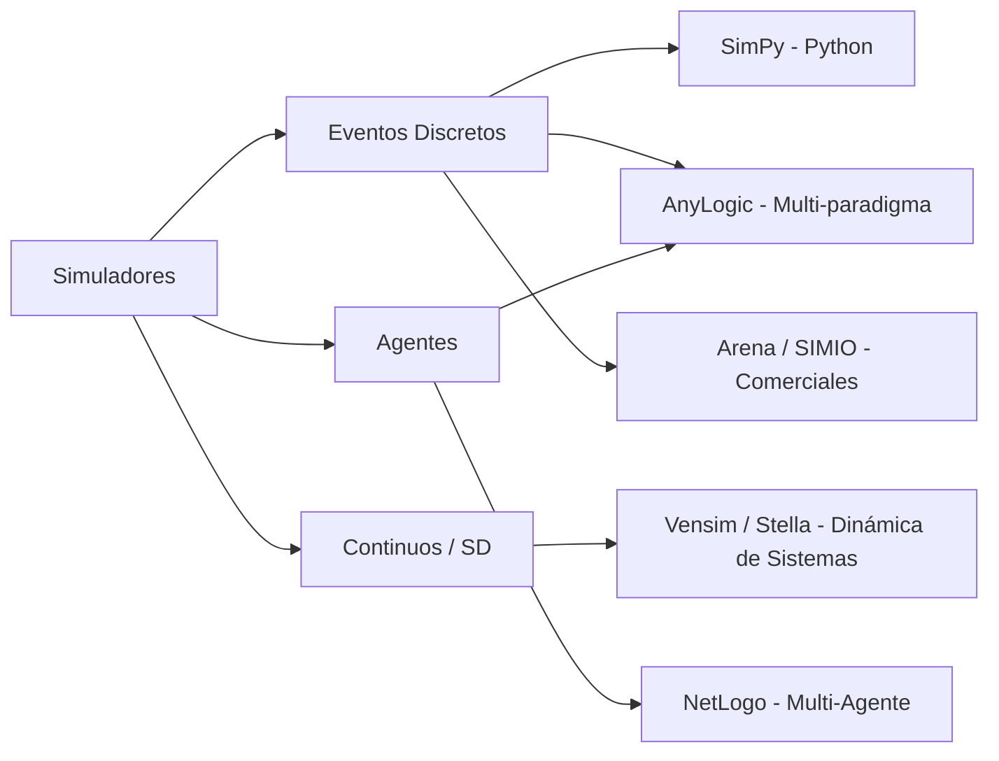
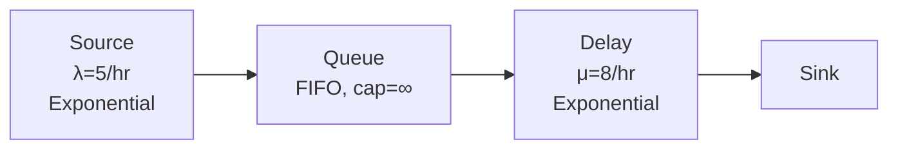

# Unidad 4: Lenguajes y Entornos de Simulación

**Asignatura**: Simulación (SCD-1022) — ISC — TecNM

---

## 4.1 Panorama de Herramientas de Simulación

Los simuladores especializados permiten construir modelos más rápido que con código general, a costa de menor flexibilidad. La elección depende del dominio, el presupuesto y las competencias del equipo.



---

## 4.2 Comparación de Herramientas Principales

| Criterio | SimPy | AnyLogic PLE | Arena | NetLogo |
|----------|-------|-------------|-------|---------|
| **Licencia** | Open source (MIT) | Gratuita (PLE) | Comercial | Gratuita |
| **Paradigma** | DES | DES + SD + MA | DES | Agentes |
| **Interfaz** | Código Python | GUI + código Java | GUI | GUI + código |
| **Curva de aprendizaje** | Media (requiere Python) | Media-alta | Alta | Baja |
| **Escalabilidad** | Alta | Alta | Alta | Media |
| **Salida estadística** | Manual (numpy/pandas) | Integrada | Integrada | Manual |
| **Integración Python** | Nativa | Parcial (Jython) | No | No |
| **Uso académico** | Muy alto | Alto | Medio | Alto |

---

## 4.3 Conceptos Clave de Simulación de Eventos Discretos (DES)

### Componentes del motor DES

```python
import heapq
from dataclasses import dataclass, field
from typing import Any

@dataclass(order=True)
class Evento:
    tiempo: float
    prioridad: int = field(compare=True)
    tipo: str = field(compare=False)
    datos: Any = field(default=None, compare=False)

class MotorDES:
    """Motor de simulación de eventos discretos mínimo."""

    def __init__(self):
        self.reloj = 0.0
        self._lista_eventos: list = []
        self._contador_eventos = 0

    def programar(self, tiempo_relativo: float, tipo: str,
                   datos: Any = None, prioridad: int = 0):
        """Agrega un evento a la lista de eventos futuros."""
        tiempo_abs = self.reloj + tiempo_relativo
        evento = Evento(tiempo_abs, prioridad, tipo, datos)
        heapq.heappush(self._lista_eventos, evento)

    def siguiente_evento(self) -> Evento | None:
        """Extrae el próximo evento (menor tiempo)."""
        if self._lista_eventos:
            evento = heapq.heappop(self._lista_eventos)
            self.reloj = evento.tiempo
            return evento
        return None

    def ejecutar(self, tiempo_max: float, manejadores: dict):
        """
        Bucle principal de simulación.
        manejadores: dict {tipo_evento: función}
        """
        while self._lista_eventos:
            evento = self.siguiente_evento()
            if evento.tiempo > tiempo_max:
                break
            if evento.tipo in manejadores:
                manejadores[evento.tipo](evento)
```

### Tipos de avance del reloj

1. **Avance por siguiente evento** (Next-Event Time Advance — NETA): el reloj salta directamente al tiempo del próximo evento. Es el estándar en DES.

2. **Avance por incremento fijo** (Fixed-Increment Time Advance): el reloj avanza en pasos iguales Δt. Apropiado para simulaciones continuas o cuando todos los eventos ocurren en instantes discretos regulares.

---

## 4.4 SimPy — Simulación en Python

SimPy usa **corrutinas de Python** (`yield`) para modelar procesos concurrentes. El paradigma es orientado a procesos (Process Interaction).

### Ejemplo básico: Cola M/M/1

```python
import simpy
import random
import statistics

def cliente(env, nombre, servidor, tiempos_espera: list, mu: float):
    """Proceso cliente: llegada → espera en cola → servicio → salida."""
    llegada = env.now
    with servidor.request() as req:
        yield req                          # esperar servidor libre
        inicio_servicio = env.now
        tiempos_espera.append(inicio_servicio - llegada)

        tiempo_servicio = random.expovariate(mu)
        yield env.timeout(tiempo_servicio)  # servicio

def generador_llegadas(env, lam: float, mu: float, servidor,
                        tiempos_espera: list):
    """Genera clientes con llegadas Poisson(λ)."""
    i = 0
    while True:
        yield env.timeout(random.expovariate(lam))
        env.process(cliente(env, f"C{i}", servidor, tiempos_espera, mu))
        i += 1

# Configuración M/M/1: λ=5/hr, μ=8/hr, ρ=5/8=0.625
lam, mu = 5.0, 8.0

# Ejecutar simulación
random.seed(42)
env = simpy.Environment()
servidor = simpy.Resource(env, capacity=1)
tiempos_espera = []

env.process(generador_llegadas(env, lam, mu, servidor, tiempos_espera))
env.run(until=1000)  # simular 1000 horas

# Métricas de desempeño
Wq_sim = statistics.mean(tiempos_espera)
rho = lam / mu
Wq_teo = (rho / mu) / (1 - rho)  # Teoría M/M/1

print(f"Utilización ρ = {rho:.3f}")
print(f"Tiempo espera simulado:  Wq = {Wq_sim:.4f} horas")
print(f"Tiempo espera teórico:   Wq = {Wq_teo:.4f} horas")
print(f"Error relativo: {abs(Wq_sim - Wq_teo)/Wq_teo*100:.1f}%")
```

### Integración con GeneradorVariables

```python
import sys
sys.path.insert(0, '../3. Generacion de Variables Aleatorias')
from variables_aleatorias import GeneradorVariables

gen = GeneradorVariables()  # usa generador LCG de Práctica 2

def cliente_lcg(env, nombre, servidor, tiempos_espera, mu_media):
    llegada = env.now
    with servidor.request() as req:
        yield req
        tiempos_espera.append(env.now - llegada)
        yield env.timeout(gen.exponencial(media=1/mu_media))

def generador_lcg(env, lam, mu_media, servidor, tiempos_espera):
    while True:
        yield env.timeout(gen.exponencial(media=1/lam))
        env.process(cliente_lcg(env, "", servidor, tiempos_espera, mu_media))
```

---

## 4.5 AnyLogic — Simulación Visual Multi-paradigma

AnyLogic Personal Learning Edition (PLE) es gratuita para uso educativo y soporta:

- **Process Modeling Library (PML)**: bloques de flujo tipo Arena (Source, Queue, Delay, Sink)
- **System Dynamics**: diagramas causa-efecto y diagramas de flujo
- **Agent-Based**: agentes con comportamiento autónomo

### Flujo básico en AnyLogic PML



**Parámetros del bloque Source**:
- Arrival rate: `exponential(5)` (llegadas Poisson)

**Parámetros del bloque Delay**:
- Delay time: `exponential(1/8)` = `exponential(0.125)` horas

---

## 4.6 Criterios para Selección de Herramienta

| Situación | Herramienta recomendada |
|-----------|------------------------|
| Prototipo rápido, sin GUI | SimPy |
| Modelo visual para presentación | AnyLogic PLE |
| Integración con análisis Python | SimPy |
| Sistema multi-agente complejo | AnyLogic PLE (modo Agentes) |
| Evaluación de cursos previos | Arena/SIMIO (si disponible) |
| Dinámica de sistemas (inventarios macro) | Vensim |

---

## 4.7 Métricas de Desempeño en Simulación

Las métricas clave que todo simulador debe reportar:

| Métrica | Notación | Fórmula teórica M/M/1 | Definición |
|---------|----------|----------------------|------------|
| Utilización del servidor | ρ | λ/μ | Fracción del tiempo que el servidor está ocupado |
| Longitud media de cola | Lq | ρ²/(1−ρ) | Promedio de clientes esperando |
| Longitud media del sistema | L | ρ/(1−ρ) | Promedio de clientes en total |
| Tiempo medio en cola | Wq | Lq/λ | Tiempo promedio que espera un cliente |
| Tiempo medio en sistema | W | L/λ | Tiempo total promedio en el sistema |

---

## Referencias

1. Law, A. M. (2015). *Simulation Modeling and Analysis* (5th ed.). McGraw-Hill. — Cap. 3, 4
2. Banks, J. et al. (2014). *Discrete-Event System Simulation* (5th ed.). Pearson. — Cap. 3
3. SimPy Team. (2025). *SimPy Documentation*. https://simpy.readthedocs.io/en/latest/
4. AnyLogic. (2025). *AnyLogic Personal Learning Edition*. https://www.anylogic.com/downloads/
5. Kelton, W. D., Sadowski, R. P., & Zupick, N. B. (2015). *Simulation with Arena* (6th ed.). McGraw-Hill.
