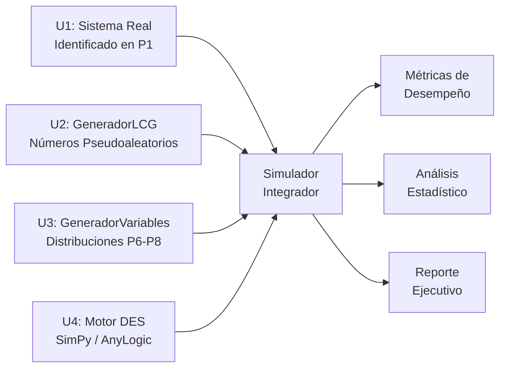

# Unidad 5: Proyecto Integrador de Simulación

**Asignatura**: Simulación (SCD-1022) — ISC — TecNM

---

## 5.1 Introducción al Proyecto Integrador

El proyecto integrador consolida todas las competencias desarrolladas en el curso:



El sistema a simular es el **mismo sistema real** descrito y analizado en la Práctica 1 (Unidad 1), para el que se propusieron distribuciones en la Actividad 3 (Unidad 3).

---

## 5.2 Fases del Proyecto

### Fase 1: Definición del modelo conceptual

Antes de escribir código, documentar formalmente:

1. **Descripción del sistema**: propósito, límites y nivel de detalle del modelo
2. **Componentes DES**:
   - **Entidades**: ¿qué fluye? (clientes, piezas, paquetes, pacientes)
   - **Recursos**: ¿qué atiende? (servidores, máquinas, médicos, cajeros)
   - **Colas**: disciplina (FIFO, LIFO, prioridad) y capacidad
   - **Variables de estado**: tamaños de cola, utilización, inventario
3. **Variables de entrada** y distribuciones propuestas (de la Actividad 3)
4. **Métricas de desempeño** que se desean estimar

**Ejemplo de referencia**: Clínica de Diálisis con 8 máquinas y tiempo de servicio Normal(240, 30) minutos — ver [Ejercicios.md](../Ejercicios.md).

### Fase 2: Implementación del simulador

Arquitectura recomendada:

```python
# simulador_proyecto.py
import sys
import simpy
import statistics
import json
from dataclasses import dataclass, field
from typing import Optional

sys.path.insert(0, '../3. Generacion de Variables Aleatorias')
from variables_aleatorias import GeneradorVariables

@dataclass
class ConfiguracionSistema:
    """Parámetros del sistema a simular."""
    # Completar según el sistema elegido en P1
    # Ejemplo para sistema de atención bancaria:
    tasa_llegada: float = 10.0    # clientes/hora
    num_servidores: int = 3
    media_servicio: float = 0.15  # horas
    std_servicio: float = 0.05    # horas (si es Normal)
    tiempo_simulacion: float = 200.0  # horas
    num_replicas: int = 30
    warm_up: float = 20.0         # horas de calentamiento

@dataclass
class Metricas:
    """Almacena los resultados de UNA réplica."""
    tiempos_espera: list = field(default_factory=list)
    tiempos_sistema: list = field(default_factory=list)
    longitudes_cola: list = field(default_factory=list)
    entidades_procesadas: int = 0
    tiempo_ocupado_servidor: float = 0.0
    tiempo_total: float = 0.0

    def utilizacion(self, num_servidores: int) -> float:
        if self.tiempo_total > 0:
            return self.tiempo_ocupado_servidor / (self.tiempo_total * num_servidores)
        return 0.0

    def wq(self) -> float:
        return statistics.mean(self.tiempos_espera) if self.tiempos_espera else 0.0

    def w(self) -> float:
        return statistics.mean(self.tiempos_sistema) if self.tiempos_sistema else 0.0

    def lq(self) -> float:
        return statistics.mean(self.longitudes_cola) if self.longitudes_cola else 0.0

class Simulador:
    """
    Motor principal del simulador integrador.
    Estructura base — adaptar los métodos según el sistema específico.
    """

    def __init__(self, config: ConfiguracionSistema, semilla: int = 12345):
        self.config = config
        self.gen = GeneradorVariables()  # usa generador LCG de P2
        self.metricas = Metricas()

    def proceso_entidad(self, env: simpy.Environment,
                         nombre: str,
                         servidor: simpy.Resource,
                         metricas: Metricas):
        """
        Proceso genérico de una entidad en el sistema.
        ADAPTAR según el sistema específico del proyecto.
        """
        t_llegada = env.now

        with servidor.request() as req:
            yield req
            t_inicio = env.now

            # Cola de espera (solo si pasó warm-up)
            if t_llegada >= self.config.warm_up:
                metricas.tiempos_espera.append(t_inicio - t_llegada)

            # Tiempo de servicio — usar GeneradorVariables
            t_servicio = self.gen.normal_polar(
                mu=self.config.media_servicio,
                sigma=self.config.std_servicio
            )
            t_servicio = max(0, t_servicio)  # evitar negativos
            yield env.timeout(t_servicio)

            if t_llegada >= self.config.warm_up:
                metricas.tiempos_sistema.append(env.now - t_llegada)
                metricas.entidades_procesadas += 1
            metricas.tiempo_ocupado_servidor += t_servicio

    def proceso_generador(self, env: simpy.Environment,
                           servidor: simpy.Resource,
                           metricas: Metricas):
        """Genera entidades con distribución de tiempos entre llegadas."""
        i = 0
        while True:
            t_entre_llegadas = self.gen.exponencial(
                media=1.0 / self.config.tasa_llegada
            )
            yield env.timeout(t_entre_llegadas)

            # Monitor de longitud de cola
            metricas.longitudes_cola.append(len(servidor.queue))

            env.process(self.proceso_entidad(
                env, f"E{i}", servidor, metricas
            ))
            i += 1

    def ejecutar_replica(self, semilla_offset: int = 0) -> Metricas:
        """Ejecuta una réplica completa de la simulación."""
        env = simpy.Environment()
        servidor = simpy.Resource(env, capacity=self.config.num_servidores)
        metricas = Metricas()

        env.process(self.proceso_generador(env, servidor, metricas))
        env.run(until=self.config.tiempo_simulacion)

        metricas.tiempo_total = self.config.tiempo_simulacion - self.config.warm_up
        return metricas

    def ejecutar_experimento(self) -> dict:
        """Ejecuta todas las réplicas y calcula estadísticas finales."""
        resultados = []
        for i in range(self.config.num_replicas):
            m = self.ejecutar_replica(semilla_offset=i)
            resultados.append({
                'Wq': m.wq(),
                'W': m.w(),
                'Lq': m.lq(),
                'rho': m.utilizacion(self.config.num_servidores),
                'n': m.entidades_procesadas
            })

        # Estadísticas consolidadas
        metricas_finales = {}
        for metrica in ['Wq', 'W', 'Lq', 'rho']:
            valores = [r[metrica] for r in resultados]
            n = len(valores)
            media = statistics.mean(valores)
            std = statistics.stdev(valores)
            # IC 95% aproximado (t_{0.025, n-1} ≈ 2.045 para n=30)
            t_critico = 2.045
            margen = t_critico * std / (n ** 0.5)
            metricas_finales[metrica] = {
                'media': media,
                'std': std,
                'ic_inferior': media - margen,
                'ic_superior': media + margen
            }

        return metricas_finales
```

---

## 5.3 Análisis Estadístico de Resultados

Una vez obtenidos los resultados de las N réplicas, se aplica:

### Análisis descriptivo

```python
import numpy as np
import matplotlib.pyplot as plt
from scipy import stats

def analizar_resultados(wq_replicas: list, config: ConfiguracionSistema,
                         wq_teo: Optional[float] = None):
    """
    Análisis completo de los resultados de simulación.
    wq_teo: valor teórico si existe (e.g., para M/M/c)
    """
    n = len(wq_replicas)
    media = np.mean(wq_replicas)
    std = np.std(wq_replicas, ddof=1)
    t_crit = stats.t.ppf(0.975, df=n-1)
    margen = t_crit * std / np.sqrt(n)

    print(f"\n{'='*55}")
    print(f"ANÁLISIS ESTADÍSTICO — Tiempo en Cola Wq")
    print(f"{'='*55}")
    print(f"Réplicas:           {n}")
    print(f"Media muestral:     {media:.4f}")
    print(f"Desv. estándar:     {std:.4f}")
    print(f"IC 95%:             [{media-margen:.4f}, {media+margen:.4f}]")
    if wq_teo:
        error = abs(media - wq_teo) / wq_teo * 100
        print(f"Valor teórico:      {wq_teo:.4f}")
        print(f"Error relativo:     {error:.1f}%")

    # Histograma
    plt.figure(figsize=(8, 4))
    plt.hist(wq_replicas, bins=min(n//3, 10), edgecolor='black',
              color='steelblue', alpha=0.7)
    plt.axvline(media, color='red', lw=2, label=f'Media={media:.3f}')
    plt.axvline(media-margen, color='orange', ls='--', label='IC 95%')
    plt.axvline(media+margen, color='orange', ls='--')
    if wq_teo:
        plt.axvline(wq_teo, color='green', lw=2, ls=':', label=f'Teórico={wq_teo:.3f}')
    plt.xlabel('Wq (horas)')
    plt.ylabel('Frecuencia')
    plt.title('Distribución de Wq entre réplicas')
    plt.legend()
    plt.tight_layout()
    plt.savefig('resultados_wq.png', dpi=150)
    plt.show()
```

---

## 5.4 Verificación y Validación

**Verificación** (¿el simulador funciona como se diseñó?):
- Ejecutar el modelo con ρ → 0 (poca carga): Wq ≈ 0
- Ejecutar con ρ → 1 (mucha carga): Wq → ∞
- Verificar balance de flujo: entidades que entran = entidades que salen

**Validación** (¿el simulador representa el sistema real?):
- Comparar métricas simuladas con datos históricos o con valores teóricos
- Si existe teoría analítica (M/M/c): verificar que el error sea < 10% con 30 réplicas
- Entrevista con expertos del sistema real

---

## 5.5 Escenarios de Análisis (Diseño de Experimentos)

Para generar valor al negocio, el simulador debe evaluar al menos **3 escenarios**:

| Escenario | Descripción | Variable modificada |
|-----------|-------------|---------------------|
| Base | Sistema actual | Parámetros observados |
| Mejora A | Reducción de tiempo de servicio | media_servicio × 0.8 |
| Mejora B | Aumento de servidores | num_servidores + 1 |
| Mejora C | Política de prioridades | Modificar disciplina cola |

Para cada escenario, reportar: Wq, W, Lq, ρ con IC al 95%.

---

## Referencias

1. Law, A. M. (2015). *Simulation Modeling and Analysis* (5th ed.). McGraw-Hill. — Cap. 9, 10
2. Banks, J. et al. (2014). *Discrete-Event System Simulation* (5th ed.). Pearson. — Cap. 10, 12
3. SimPy Team. (2025). *SimPy Documentation — Examples*. https://simpy.readthedocs.io/en/latest/examples/
