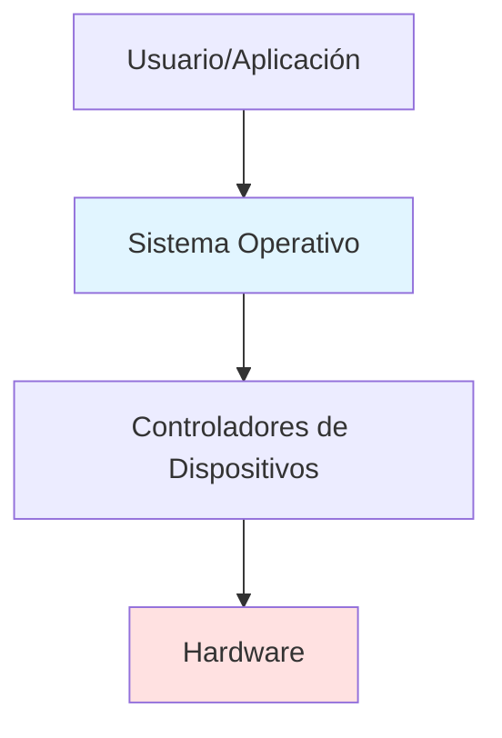
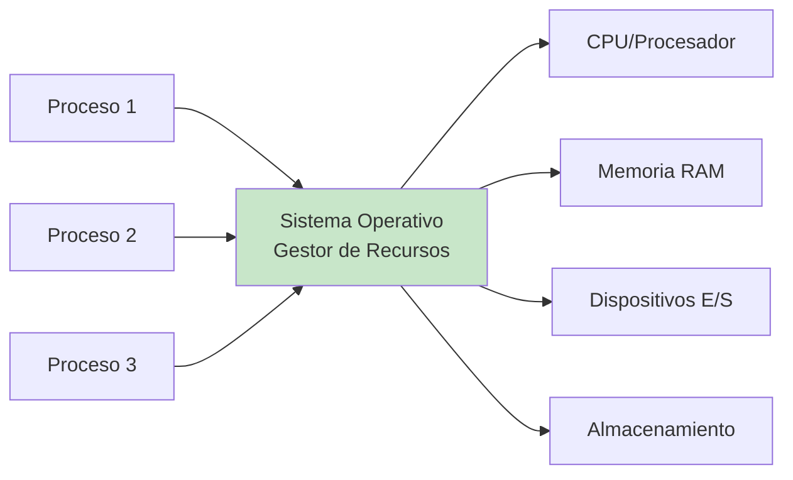
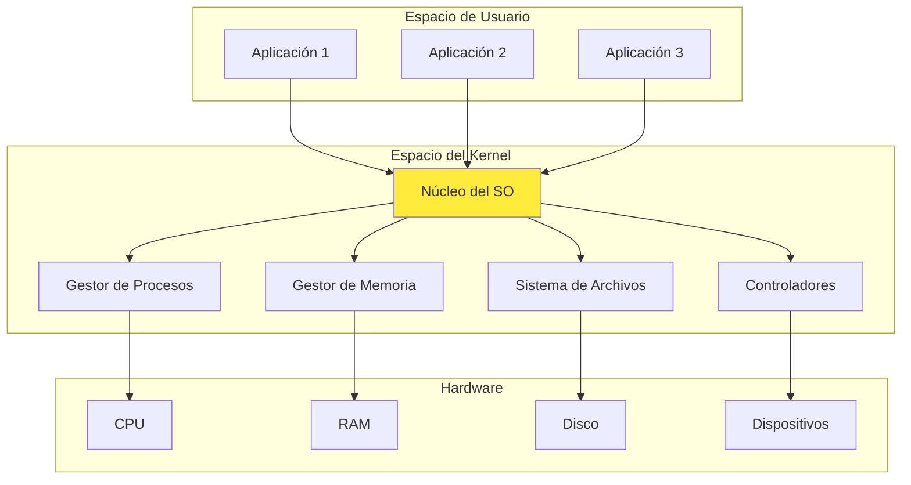
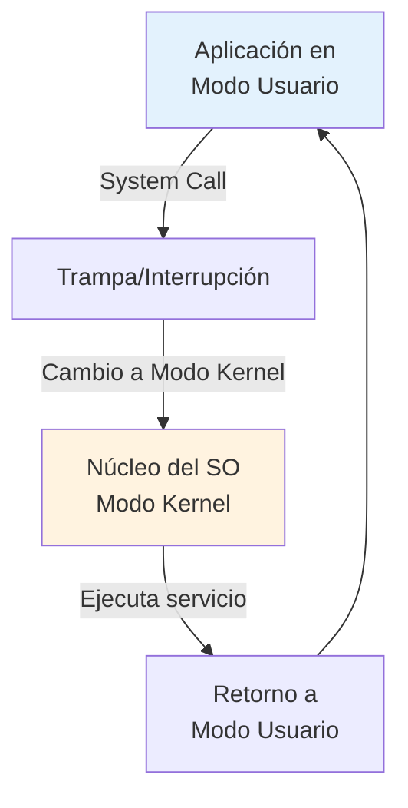
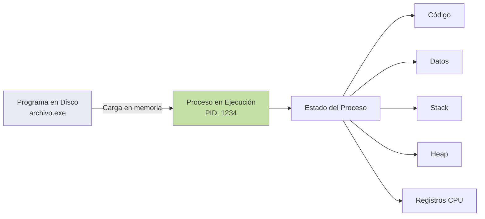

# 1.1 Definición y Concepto de Sistema Operativo

**Sistemas Operativos I - Unidad 1: Introducción a los Sistemas Operativos**

---

## Índice

1. [Introducción](#introducción)
2. [Definición de Sistema Operativo](#definición-de-sistema-operativo)
3. [Perspectivas del Sistema Operativo](#perspectivas-del-sistema-operativo)
4. [Objetivos de un Sistema Operativo](#objetivos-de-un-sistema-operativo)
5. [Componentes Principales](#componentes-principales)
6. [El Sistema Operativo como Gestor de Recursos](#el-sistema-operativo-como-gestor-de-recursos)
7. [Programas del Sistema vs Programas de Aplicación](#programas-del-sistema-vs-programas-de-aplicación)
8. [Conclusiones](#conclusiones)
9. [Referencias](#referencias)

---

## Introducción

Un **sistema operativo** es el software fundamental que permite el funcionamiento de una computadora. Sin él, el hardware sería inútil para los usuarios finales, ya que proporciona la interfaz necesaria entre el usuario, las aplicaciones y el hardware físico de la máquina.

Para comprender adecuadamente qué es un sistema operativo, es necesario analizar diferentes perspectivas: desde el punto de vista del usuario, desde la perspectiva del sistema computacional, y como programa que gestiona recursos.

---

## Definición de Sistema Operativo

### Definición Formal

Según Silberschatz, Galvin y Gagne (2006), un sistema operativo es:

> "Un programa que actúa como intermediario entre el usuario de una computadora y el hardware de la computadora. El propósito de un sistema operativo es proporcionar un ambiente en el cual el usuario pueda ejecutar programas de manera conveniente y eficiente."

Tanenbaum (2009) proporciona una definición complementaria:

> "El sistema operativo es el programa (o conjunto de programas) que oculta los detalles del hardware y proporciona al programador una interfaz conveniente para usar la computadora."

### Perspectiva Conceptual

Desde un punto de vista conceptual, un sistema operativo puede entenderse desde tres ángulos diferentes:

**1. Perspectiva del Usuario:**
El sistema operativo proporciona una interfaz amigable que permite al usuario interactuar con la computadora sin necesidad de conocer los detalles técnicos del hardware. Facilita la ejecución de programas, gestión de archivos y comunicación con dispositivos periféricos.

**2. Perspectiva del Sistema:**
El sistema operativo es un **asignador de recursos** que administra y controla el uso del procesador, memoria, dispositivos de entrada/salida y sistemas de archivos, garantizando un uso eficiente y equitativo de los recursos entre múltiples programas y usuarios.

**3. Perspectiva de Implementación:**
Es un programa de control que supervisa la ejecución de programas de usuario para prevenir errores y uso inadecuado del hardware, especialmente en lo relacionado con operaciones de entrada/salida.

---

## Perspectivas del Sistema Operativo

### 1. Máquina Extendida (Abstracción del Hardware)

El hardware de una computadora es complejo y difícil de programar directamente. Los sistemas operativos proporcionan **abstracciones** que simplifican esta complejidad.



**Ejemplo de abstracción:**
- **Nivel de hardware:** Para escribir en disco es necesario conocer cilindros, sectores, cabezales, controladores DMA, interrupciones.
- **Nivel de abstracción del SO:** El programador simplemente llama a una función como `write()` y el sistema operativo se encarga de todos los detalles técnicos.

Esta abstracción permite que los programadores se concentren en la lógica de sus aplicaciones sin preocuparse por los detalles específicos del hardware.

### 2. Gestor de Recursos

El sistema operativo administra los recursos del hardware de forma ordenada y controlada. Los recursos principales que gestiona son:

- **CPU (Procesador):** Asigna tiempo de procesador a diferentes programas
- **Memoria:** Administra el espacio de memoria disponible
- **Dispositivos de E/S:** Controla el acceso a dispositivos periféricos
- **Almacenamiento:** Gestiona el sistema de archivos



El sistema operativo debe resolver **conflictos** cuando múltiples programas solicitan los mismos recursos, estableciendo **políticas** para asignarlos de manera justa y eficiente.

---

## Objetivos de un Sistema Operativo

Un sistema operativo bien diseñado debe cumplir con los siguientes objetivos fundamentales:

### 1. Conveniencia

Hacer que el uso de la computadora sea más **cómodo y fácil** para el usuario. El usuario no debe preocuparse por los detalles técnicos del hardware.

**Ejemplo:** Un usuario puede copiar un archivo simplemente arrastrándolo en una interfaz gráfica, sin conocer cómo se realiza la lectura/escritura en sectores del disco.

### 2. Eficiencia

Utilizar los recursos del sistema de manera **eficiente**, maximizando el rendimiento y minimizando el desperdicio de recursos.

**Métricas de eficiencia:**
- **Throughput (Rendimiento):** Cantidad de trabajos completados por unidad de tiempo
- **Tiempo de respuesta:** Tiempo desde que se envía una solicitud hasta que se recibe la respuesta
- **Utilización de recursos:** Porcentaje de tiempo que los recursos están siendo utilizados productivamente

### 3. Capacidad de Evolución

El sistema operativo debe ser capaz de **evolucionar** para incorporar nuevas funcionalidades sin alterar drásticamente los servicios existentes.

**Aspectos evolutivos:**
- Desarrollo e integración de nuevos controladores de dispositivos
- Actualizaciones de seguridad
- Soporte para nuevas tecnologías de hardware
- Mejoras en algoritmos de gestión

---

## Componentes Principales

Un sistema operativo está compuesto por varios componentes que trabajan coordinadamente:

### 1. Núcleo (Kernel)

El **núcleo** es el componente central del sistema operativo que reside permanentemente en memoria. Gestiona las funciones más críticas:

- Administración de procesos
- Gestión de memoria
- Control de dispositivos de E/S
- Gestión de interrupciones
- Comunicación entre procesos



### 2. Gestión de Procesos

Controla la creación, ejecución, suspensión y terminación de procesos. Un **proceso** es un programa en ejecución.

**Funciones principales:**
- Creación y eliminación de procesos
- Suspensión y reanudación de procesos
- Sincronización de procesos
- Comunicación entre procesos
- Manejo de interbloqueos (deadlocks)

### 3. Gestión de Memoria

Administra la memoria principal (RAM), asignando espacio a los procesos y recuperándolo cuando ya no es necesario.

**Funciones principales:**
- Asignación y liberación de memoria
- Protección de memoria entre procesos
- Gestión de memoria virtual
- Paginación y segmentación

### 4. Gestión de Almacenamiento

Proporciona una visión lógica del almacenamiento físico mediante el **sistema de archivos**.

**Funciones principales:**
- Creación y eliminación de archivos y directorios
- Manipulación de archivos (lectura, escritura)
- Mapeo de archivos al almacenamiento secundario
- Respaldo de archivos

### 5. Gestión de Entrada/Salida

Controla y coordina el uso de los dispositivos periféricos.

**Componentes:**
- Sistema de buffers y caché
- Interfaz general de controladores de dispositivos
- Controladores específicos para cada dispositivo

---

## El Sistema Operativo como Gestor de Recursos

La función principal del sistema operativo es actuar como **gestor de recursos**. Debe asignar recursos de manera que:

### Principios de Gestión de Recursos

**1. Multiplexación en el Tiempo**

Los recursos se comparten asignando tiempo a cada usuario/proceso.

**Ejemplo - CPU:**
```
Proceso A: [ejecuta 10ms] -> [espera]
Proceso B: [espera] -> [ejecuta 10ms] -> [espera]
Proceso C: [espera] -> [ejecuta 10ms]
```

El procesador alterna rápidamente entre procesos, dando la ilusión de ejecución simultánea.

**2. Multiplexación en el Espacio**

Los recursos se dividen físicamente entre usuarios/procesos.

**Ejemplo - Memoria RAM:**
```
┌─────────────────────┐
│  Sistema Operativo  │  100 MB
├─────────────────────┤
│    Proceso A        │  200 MB
├─────────────────────┤
│    Proceso B        │  150 MB
├─────────────────────┤
│    Proceso C        │  300 MB
├─────────────────────┤
│    Libre            │  250 MB
└─────────────────────┘
```

Cada proceso tiene asignado un espacio específico de memoria.

### Políticas de Asignación

El sistema operativo debe implementar **políticas** para decidir:

- **¿Cuándo asignar recursos?** - Momento de asignación
- **¿A quién asignar?** - Criterios de prioridad
- **¿Cuánto asignar?** - Cantidad de recurso
- **¿Por cuánto tiempo?** - Duración de la asignación

**Algoritmos comunes de planificación de CPU:**
- **FCFS (First Come First Served):** El primero en llegar es el primero en ser atendido
- **SJF (Shortest Job First):** Prioriza trabajos más cortos
- **Round Robin:** Asigna tiempo equitativo en forma circular
- **Prioridades:** Asigna según niveles de prioridad

---

## Programas del Sistema vs Programas de Aplicación

Es importante distinguir entre diferentes tipos de software en un sistema computacional:

### Programas del Sistema Operativo

Son programas que están **estrechamente relacionados** con el sistema operativo pero no necesariamente forman parte del núcleo.

**Ejemplos:**
- **Intérpretes de comandos (shell):** bash, PowerShell, cmd
- **Compiladores y ensambladores:** gcc, javac
- **Editores de texto del sistema:** vi, nano
- **Utilidades del sistema:** cp, mv, ls, ps, kill

### Programas de Aplicación

Son programas que **utilizan** el sistema operativo para realizar tareas específicas del usuario.

**Ejemplos:**
- Navegadores web (Firefox, Chrome)
- Procesadores de texto (LibreOffice Writer, Microsoft Word)
- Hojas de cálculo (Excel, Calc)
- Reproductores multimedia (VLC, Media Player)

### Comparación

| Característica | Programas del Sistema | Programas de Aplicación |
|----------------|----------------------|-------------------------|
| **Propósito** | Facilitar uso y desarrollo del sistema | Resolver problemas específicos del usuario |
| **Nivel** | Cercano al hardware | Alejado del hardware |
| **Privilegios** | Pueden requerir acceso privilegiado | Generalmente modo usuario |
| **Dependencia del SO** | Específicos del SO | Idealmente portables |

---

## Modos de Operación

Los sistemas operativos modernos operan en al menos dos modos para proteger el sistema:

### Modo Usuario (User Mode)

- Modo en el que se ejecutan los programas de aplicación
- **Acceso restringido** a instrucciones privilegiadas
- No puede ejecutar instrucciones que afecten directamente al hardware
- Si intenta ejecutar una instrucción privilegiada, el hardware genera una **trampa** (trap)

### Modo Kernel (Kernel Mode / Modo Supervisor)

- Modo en el que se ejecuta el núcleo del sistema operativo
- **Acceso completo** a todas las instrucciones del procesador
- Puede ejecutar instrucciones privilegiadas
- Control directo del hardware



**Transición de modos:**

1. La aplicación solicita un servicio del SO mediante una **llamada al sistema** (system call)
2. Se produce una **trampa** que cambia el modo de usuario a modo kernel
3. El SO ejecuta el servicio solicitado con privilegios completos
4. Al finalizar, retorna el control a la aplicación en modo usuario

Esta separación de modos garantiza:
- **Protección:** Las aplicaciones no pueden dañar el sistema
- **Seguridad:** Control sobre operaciones críticas
- **Estabilidad:** Errores en aplicaciones no afectan al núcleo

---

## Llamadas al Sistema (System Calls)

Las **llamadas al sistema** son la interfaz de programación que el sistema operativo proporciona a los programas de usuario para solicitar servicios.

### Categorías de Llamadas al Sistema

**1. Control de Procesos**
- `fork()` - Crear un nuevo proceso
- `exit()` - Terminar un proceso
- `wait()` - Esperar a que termine un proceso hijo
- `exec()` - Cargar y ejecutar un programa

**2. Gestión de Archivos**
- `open()` - Abrir un archivo
- `read()` - Leer de un archivo
- `write()` - Escribir en un archivo
- `close()` - Cerrar un archivo

**3. Gestión de Dispositivos**
- `ioctl()` - Controlar dispositivo
- `read()` / `write()` - Leer/escribir en dispositivo

**4. Mantenimiento de Información**
- `getpid()` - Obtener identificador de proceso
- `time()` - Obtener fecha/hora del sistema
- `gethostname()` - Obtener nombre del host

**5. Comunicación entre Procesos**
- `pipe()` - Crear tubería de comunicación
- `shmget()` - Obtener memoria compartida
- `mmap()` - Mapear memoria

### Ejemplo de Uso de System Call

```c
// Programa que copia un archivo usando system calls de UNIX

#include <fcntl.h>
#include <unistd.h>

int main() {
    int fd_origen, fd_destino;
    char buffer[1024];
    int bytes_leidos;
    
    // Abrir archivo origen (system call open)
    fd_origen = open("archivo_origen.txt", O_RDONLY);
    
    // Crear archivo destino (system call open con O_CREAT)
    fd_destino = open("archivo_destino.txt", O_WRONLY | O_CREAT, 0644);
    
    // Leer y escribir (system calls read y write)
    while ((bytes_leidos = read(fd_origen, buffer, sizeof(buffer))) > 0) {
        write(fd_destino, buffer, bytes_leidos);
    }
    
    // Cerrar archivos (system call close)
    close(fd_origen);
    close(fd_destino);
    
    return 0;
}
```

En este ejemplo, cada operación (`open`, `read`, `write`, `close`) es una llamada al sistema que transfiere el control al núcleo del sistema operativo.

---

## Conceptos Fundamentales

### Proceso vs Programa

**Programa:**
- Entidad **pasiva** almacenada en disco
- Código ejecutable junto con datos estáticos
- Puede existir indefinidamente sin cambios

**Proceso:**
- Entidad **activa** en ejecución
- Programa cargado en memoria con estado dinámico
- Tiene ciclo de vida: creación, ejecución, terminación
- Incluye: código, datos, stack, heap, PC (Program Counter), registros



**Relación:**
- Un programa puede generar múltiples procesos
- Ejemplo: Abrir dos ventanas del navegador crea dos procesos distintos del mismo programa

### Multiprogramación vs Multitarea

**Multiprogramación:**
- Mantener **múltiples programas en memoria** simultáneamente
- El SO selecciona uno para ejecutar cuando el actual se bloquea (espera E/S)
- Maximiza el uso de la CPU evitando tiempos muertos
- Enfoque en la **utilización de recursos**

**Multitarea (Time-sharing):**
- **Extensión** de la multiprogramación
- La CPU alterna entre procesos tan rápidamente que los usuarios pueden interactuar con cada programa mientras se ejecuta
- Requiere **planificación de CPU** y **gestión de memoria**
- Enfoque en el **tiempo de respuesta**

```mermaid
gantt
    title Multiprogramación vs Monoprogramación
    dateFormat X
    axisFormat %L
    
    section Monoprogramación
    Proceso A ejecuta :done, 0, 30
    Proceso A espera E/S :crit, 30, 50
    Proceso A ejecuta :done, 50, 70
    
    section Multiprogramación
    Proceso A ejecuta :done, 0, 30
    Proceso B ejecuta :active, 30, 50
    Proceso A ejecuta :done, 50, 70
```



---

## Evolución del Concepto

El concepto de sistema operativo ha evolucionado significativamente:

### Sistemas por Lotes (Batch Systems)

**Características:**
- Los trabajos se agrupaban y procesaban en **lotes**
- No había interacción directa con el usuario durante la ejecución
- Eficientes para tareas repetitivas de alto volumen

**Limitaciones:**
- Largo tiempo de respuesta
- Sin interactividad
- Difícil depuración de programas

### Sistemas Interactivos (Time-sharing)

**Características:**
- Múltiples usuarios pueden interactuar simultáneamente
- El sistema alterna rápidamente entre usuarios
- Cada usuario tiene la ilusión de tener la computadora completa

**Ventajas:**
- Reducción drástica del tiempo de respuesta
- Mejor utilización de recursos
- Permite depuración interactiva

### Sistemas de Tiempo Real

**Características:**
- Deben responder dentro de **límites de tiempo estrictos**
- Priorizan la **predictibilidad** sobre el rendimiento promedio
- Críticos en aplicaciones como control industrial, sistemas médicos

**Tipos:**
- **Tiempo real estricto (hard real-time):** Incumplir el deadline es catastrófico
- **Tiempo real suave (soft real-time):** Incumplir el deadline degrada el rendimiento pero no es crítico

### Sistemas Distribuidos

**Características:**
- Recursos se distribuyen entre **múltiples computadoras** conectadas en red
- El SO coordina recursos distribuidos
- Transparencia: el usuario no percibe la distribución

---

## Conclusiones

El sistema operativo es un componente fundamental de cualquier sistema computacional moderno. Sus principales responsabilidades son:

1. **Abstracción del hardware:** Proporciona una interfaz simple para interactuar con hardware complejo

2. **Gestión de recursos:** Administra CPU, memoria, dispositivos y almacenamiento de forma eficiente y equitativa

3. **Protección y seguridad:** Garantiza que los procesos no interfieran entre sí y protege el sistema de accesos no autorizados

4. **Conveniencia:** Hace que el sistema sea fácil de usar para programadores y usuarios finales

5. **Eficiencia:** Maximiza el uso de los recursos del hardware

Comprender estos conceptos fundamentales es esencial para:
- Diseñar aplicaciones eficientes que aprovechen correctamente los servicios del SO
- Administrar sistemas operativos en entornos de producción
- Desarrollar componentes del sistema como controladores de dispositivos
- Entender el comportamiento y rendimiento de las aplicaciones

En los siguientes temas exploraremos las funciones específicas, la evolución histórica, la clasificación y la arquitectura interna de los sistemas operativos.

---

## Referencias

### Bibliografía Principal

1. Silberschatz, A., Galvin, P. B., & Gagne, G. (2006). *Fundamentos de Sistemas Operativos* (7ª ed.). McGraw-Hill.

2. Tanenbaum, A. S. (2009). *Sistemas Operativos Modernos* (3ª ed.). Pearson Educación.

3. Stallings, W. (2005). *Sistemas Operativos* (5ª ed.). Pearson Prentice Hall.

### Bibliografía Complementaria

4. Tanenbaum, A. S., & Woodhull, A. S. (2009). *Sistemas Operativos: Diseño e Implementación* (2ª ed.). Pearson Educación.

5. Love, R. (2010). *Linux Kernel Development* (3ª ed.). Addison-Wesley.

### Documentación Técnica

6. The Linux Foundation. (2024). *The Linux Kernel Documentation*. https://www.kernel.org/doc/html/latest/

7. Microsoft. (2024). *Windows Internals Documentation*. https://learn.microsoft.com/en-us/windows-hardware/drivers/kernel/
