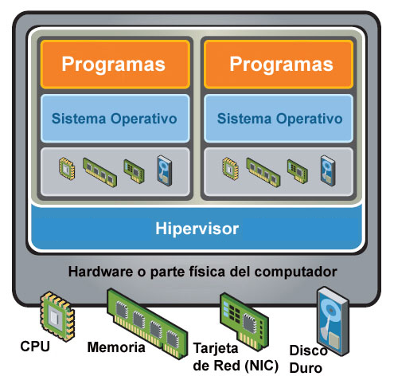

# Virtualización

## Definición
La **virtualización** es una tecnología que divide a una computadora en diversas máquinas independientes que pueden soportar diferentes sistemas operativos y aplicaciones siendo ejecutados concurrentemente [1].

La virtualización puede tener diferentes objetivos: mejorar el desempeño, escalabilidad, disponibilidad, confiabilidad, agilidad de las operaciones, seguridad, etc. [2].

## Historia

### IBM CP/CMS
Uno de los primeros sistemas que implementaron la virtualización de hardware desarrollado en la década de 1960 por IBM para sus **mainframes** System/360 y System/370 [3].

### IBM VM/370
Introducido en 1972, es una evolución de CP/CMS y fue uno de los más influyentes [4].

### VAX VMM 
Desarrollado por **Digital** durante la década de 1980, su objetivo era ejecutar múltiples instancias de VAX y ULTRIX sobre un mismo hardware [5].

### Xen
Desarrollado por la Universidad de Cambridge y lanzado en 2003, ha sido muy utilizado en entornos de nube [6].

### VMware ESX/ESXi
Lanzado por VMware en 2001 (ESX) y 2007 (ESXi), es un hypervisor de tipo 1 que proporciona una plataforma robusta y escalable para la virtualización de servidores [7].

### Microsoft Hyper-V
Lanzado por Microsoft en 2008 como parte de Windows Server 2008, Hyper-V es un hypervisor de tipo 1 que permite la creación y gestión de máquinas virtuales en sistemas Windows [8].

### KVM (Kernel-based Virtual Machine)
Integrado en el kernel de Linux en 2007, KVM es un hypervisor de tipo 2 que convierte el kernel de Linux en un hypervisor, permitiendo la ejecución de múltiples máquinas virtuales [9].

### Oracle VM VirtualBox
Originalmente desarrollado por Innotek GmbH y adquirido por Oracle en 2010, VirtualBox es un hypervisor de tipo 2 conocido por su facilidad de uso y soporte para una amplia gama de sistemas operativos [10].

## Referencias
1. Smith, J. E., & Nair, R. (2005). The Architecture of Virtual Machines. Computer, 38(5), 32-38.
2. Rosenblum, M., & Garfinkel, T. (2005). Virtual Machine Monitors: Current Technology and Future Trends. Computer, 38(5), 39-47.
3. Creasy, R. J. (1981). The Origin of the VM/370 Time-sharing System. IBM Journal of Research and Development, 25(5), 483-490.
4. Seawright, L. H., & MacKinnon, R. A. (1979). VM/370 - A Study of Multiplicity and Usefulness. IBM Systems Journal, 18(1), 4-17.
5. Levy, H. M., & Lipman, P. H. (1982). Virtual Memory Management in the VAX/VMS Operating System. Computer, 15(3), 35-41.
6. Barham, P., Dragovic, B., Fraser, K., Hand, S., Harris, T., Ho, A., ... & Warfield, A. (2003). Xen and the Art of Virtualization. ACM SIGOPS Operating Systems Review, 37(5), 164-177.
7. Sugerman, J., Venkitachalam, G., & Lim, B. H. (2001). Virtualizing I/O Devices on VMware Workstation's Hosted Virtual Machine Monitor. USENIX Annual Technical Conference, 2001.
8. Microsoft. (2008). Introduction to Hyper-V. Retrieved from https://docs.microsoft.com/en-us/virtualization/hyper-v-on-windows/about/
9. Kivity, A., Kamay, Y., Laor, D., Lublin, U., & Liguori, A. (2007). kvm: the Linux Virtual Machine Monitor. Proceedings of the Linux Symposium, 2007.
10. Oracle. (2010). Oracle VM VirtualBox. Retrieved from https://www.virtualbox.org/

## Componentes de la virtualización

La virtualización se compone de varios componentes clave que trabajan juntos para crear y gestionar entornos virtualizados. Estos componentes incluyen:

### Hypervisor
El hypervisor es el componente central de la virtualización. Es el software que permite la creación y gestión de máquinas virtuales (VMs) al abstraer los recursos físicos del hardware subyacente. Existen dos tipos principales de hypervisores:
- **Tipo I (Bare Metal)**: Se ejecutan directamente sobre el hardware físico, proporcionando una capa de virtualización eficiente y de alto rendimiento. Ejemplos: VMware ESXi, Microsoft Hyper-V, Proxmox VE [1].
- **Tipo II (Hosted)**: Se ejecutan sobre un sistema operativo anfitrión, lo que los hace más fáciles de instalar y usar, pero con un rendimiento ligeramente inferior. Ejemplos: VMware Workstation Player, Oracle VirtualBox [2].

### Máquinas Virtuales (VMs)
Las máquinas virtuales son entornos virtualizados que emulan un sistema informático completo, incluyendo el sistema operativo, aplicaciones y recursos de hardware. Cada VM opera de manera independiente y aislada, permitiendo la ejecución de múltiples sistemas operativos en un solo hardware físico [3].

### Almacenamiento Virtualizado
El almacenamiento virtualizado abstrae los recursos de almacenamiento físico y los presenta como almacenamiento lógico a las VMs. Esto facilita la gestión, escalabilidad y flexibilidad del almacenamiento. Ejemplos: VMware vSAN, Microsoft Storage Spaces Direct, Red Hat Ceph Storage [4].

### Redes Virtualizadas
La virtualización de red permite la creación de redes virtuales que abstraen los recursos de red físicos. Esto mejora la flexibilidad, escalabilidad y seguridad de la infraestructura de red. Ejemplos: VMware NSX, Cisco ACI, Microsoft Azure Virtual Network [5].

### Gestión y Orquestación
Las herramientas de gestión y orquestación son esenciales para administrar y automatizar los entornos virtualizados. Estas herramientas proporcionan interfaces para crear, configurar, monitorizar y gestionar VMs y otros recursos virtualizados. Ejemplos: VMware vCenter, Microsoft System Center, OpenStack [6].

### Seguridad
La seguridad en entornos virtualizados es crucial para proteger los datos y las aplicaciones. Las soluciones de seguridad incluyen firewalls virtuales, sistemas de detección de intrusiones y herramientas de gestión de identidades y accesos. Ejemplos: VMware NSX Distributed Firewall, Cisco Secure Workload, Microsoft Azure Security Center [7].

### Backup y Recuperación
Las soluciones de backup y recuperación aseguran que los datos y las VMs puedan ser restaurados en caso de fallos o desastres. Estas soluciones permiten la creación de copias de seguridad y la recuperación rápida de sistemas virtualizados. Ejemplos: Veeam Backup & Replication, Commvault, Acronis Cyber Backup [8].

Estos componentes trabajan juntos para proporcionar una infraestructura virtualizada robusta, eficiente y segura, permitiendo a las organizaciones optimizar el uso de sus recursos y mejorar la flexibilidad y escalabilidad de sus operaciones.

## Referencias
1. Sugerman, J., Venkitachalam, G., & Lim, B. H. (2001). Virtualizing I/O Devices on VMware Workstation's Hosted Virtual Machine Monitor. USENIX Annual Technical Conference, 2001.
2. Oracle. (2010). Oracle VM VirtualBox. Retrieved from https://www.virtualbox.org/
3. Rosenblum, M., & Garfinkel, T. (2005). Virtual Machine Monitors: Current Technology and Future Trends. Computer, 38(5), 39-47.
4. VMware. (2021). VMware vSAN. Retrieved from https://www.vmware.com/products/vsan.html
5. Cisco. (2021). Cisco Application Centric Infrastructure (ACI). Retrieved from https://www.cisco.com/c/en/us/solutions/data-center-virtualization/application-centric-infrastructure/index.html
6. OpenStack Foundation. (2021). OpenStack: The Open Source Cloud Operating System. Retrieved from https://www.openstack.org/
7. VMware. (2021). VMware NSX Distributed Firewall. Retrieved from https://www.vmware.com/products/nsx.html
8. Veeam. (2021). Veeam Backup & Replication. Retrieved from https://www.veeam.com/backup-replication.html

## Tipos de virtualización
La virtualización se divide en diferentes tipos:
- Emulación
- Virtualización Nativa
- Paravirtualización
- Virtualización de Sistema Operativo 
- Virtualización de Aplicación

### Emulación
Imitación de una plataforma o de un programa en otra plataforma.

El emulador crea para sí mismo una capa extra entre una plataforma y el hardware subyacente, permitiendo que el software diseñado para una plataforma específica se ejecute en una plataforma diferente. Esto es útil para ejecutar software antiguo en hardware moderno o para desarrollar y probar software en diferentes entornos sin necesidad de hardware adicional [1].

**Ejemplos**
- Los emuladores de videojuegos como Project64 y MAME
- Los emuladores de las calculadoras de Texas Instruments y Casio

### Virtualización Nativa 
Virtualización del hardware real que permite que los entornos de software, incluido un sistema operativo invitado y sus aplicaciones, se ejecuten sin modificaciones.

La virtualización completa o nativa requiere que cada característica destacada del hardware se refleje en una de varias máquinas virtuales, incluido el conjunto completo de instrucciones, las operaciones de entrada/salida, las interrupciones, el acceso a la memoria y cualquier otro elemento que utilice el software que se ejecuta en la máquina base y que está destinado a ejecutarse en una máquina virtual [2].

**Ejemplos:**

- VMware vSphere
- Microsoft Hyper-V
- KVM (Kernel-based Virtual Machine)
- Oracle VM Server
- Citrix Hypervisor (anteriormente XenServer)
- Proxmox VE
- Red Hat Virtualization (RHV)
- Nutanix AHV

### Paravirtualización
La paravirtualización es una técnica de virtualización que presenta una interfaz de software a las máquinas virtuales que es similar, aunque no idéntica, a la interfaz de hardware y software subyacente. La paravirtualización mejora el rendimiento y la eficiencia, en comparación con la virtualización completa, al permitir que el sistema operativo invitado se comunique con el hipervisor. Al permitir que el sistema operativo invitado indique su intención al hipervisor, ambos pueden cooperar para obtener un mejor rendimiento cuando se ejecutan en una máquina virtual. Los programas invitados deben **modificarse específicamente** para ejecutarse en este entorno [3].

**Ejemplos:**

- Xen
- VMware ESXi (en sus primeras versiones)
- L4 microkernel
- Denali
- User-mode Linux (UML)
- IBM z/VM
- Parallels Desktop para Mac (en sus primeras versiones)
- Virtuozzo

### Virtualización de Sistema Operativo

Permite una alta seguridad para la ejecución de servidores virtuales compartiendo el mismo sistema operativo en forma aislada, sin que uno interfiera en la ejecución de aplicaciones del otro [4].

**Ejemplos:**
- Docker
- LXC (Linux Containers)
- OpenVZ
- Solaris Containers
- Windows Containers
- Podman
- Kata Containers
- Rkt (Rocket)
- Singularity
- Virtuozzo

## Referencias
1. Smith, J. E., & Nair, R. (2005). The Architecture of Virtual Machines. Computer, 38(5), 32-38.
2. Rosenblum, M., & Garfinkel, T. (2005). Virtual Machine Monitors: Current Technology and Future Trends. Computer, 38(5), 39-47.
3. Barham, P., Dragovic, B., Fraser, K., Hand, S., Harris, T., Ho, A., ... & Warfield, A. (2003). Xen and the Art of Virtualization. ACM SIGOPS Operating Systems Review, 37(5), 164-177.
4. Soltesz, S., Pötzl, H., Fiuczynski, M. E., Bavier, A., & Peterson, L. (2007). Container-based Operating System Virtualization: A Scalable, High-performance Alternative to Hypervisors. ACM SIGOPS Operating Systems Review, 41(3), 275-287.
 
## Capas de virtualización

### Virtualización de acceso
La virtualización de acceso permite a los usuarios acceder a aplicaciones y datos desde cualquier dispositivo y ubicación, proporcionando una experiencia de usuario consistente y segura. Esta tecnología abstrae la capa de acceso, permitiendo que los recursos sean gestionados y distribuidos de manera centralizada [1].

**Ejemplos:**
- Microsoft Remote Desktop Services (RDS)
- AnyDesk
- TeamViewer
- VNC (Virtual Network Computing)
- LogMeIn

Esta capa de virtualización es crucial para entornos de trabajo remoto y para la administración de recursos en la nube, mejorando la flexibilidad y la productividad de los usuarios.

### Virtualización de Aplicación
La virtualización de aplicaciones permite que una aplicación se ejecute en un entorno aislado del sistema operativo subyacente. Esto facilita la ejecución de aplicaciones en diferentes sistemas operativos y versiones sin conflictos. La virtualización de aplicaciones encapsula la aplicación y sus dependencias en un paquete que puede ser ejecutado en cualquier entorno compatible [2].

**Ejemplos:**
- VMware ThinApp
- Microsoft App-V
- Citrix XenApp

Esta tecnología es útil para la distribución de software, pruebas y desarrollo, y para mejorar la seguridad y la gestión de aplicaciones en entornos empresariales.

### Virtualización de procesamiento
La capa de procesamiento agrega tecnologías de hardware y software que ocultan configuraciones físicas de hardware, de servicios de sistema, sistemas operativos y aplicaciones.

La tecnología comprende la habilidad de presentar un sistema físico a diversos recursos o viceversa. Es utilizada, principalmente, en la consolidación de múltiples entornos en un único sistema de alta disponibilidad [3].

**Ejemplos:**
- **OpenMPI**: Una implementación de la interfaz de paso de mensajes (MPI) que permite la ejecución de aplicaciones paralelas en entornos virtualizados.
- **HPC (High-Performance Computing)**: La virtualización de procesamiento se utiliza en entornos de computación de alto rendimiento para ejecutar aplicaciones científicas y de ingeniería que requieren grandes cantidades de recursos de procesamiento.

### Virtualización de Almacenamiento
Comprende las tecnologías de software y hardware que ocultan el tipo de almacenamiento que soporta las aplicaciones y los datos. La virtualización de almacenamiento permite abstraer los recursos de almacenamiento físico y presentarlos como recursos de almacenamiento lógico. Esto facilita la gestión, escalabilidad y flexibilidad del almacenamiento, permitiendo a los administradores de sistemas optimizar el uso de los recursos y mejorar el rendimiento [4].

**Ejemplos:**
- **VMware vSAN**: Solución de almacenamiento definido por software que agrupa discos de servidores en un clúster para crear un almacenamiento compartido.
- **Microsoft Storage Spaces Direct (S2D)**: Tecnología de almacenamiento definida por software que permite crear volúmenes de almacenamiento altamente disponibles y escalables.
- **Red Hat Ceph Storage**: Plataforma de almacenamiento distribuido que proporciona almacenamiento unificado para objetos, bloques y archivos.
- **NetApp ONTAP**: Sistema operativo de almacenamiento que proporciona gestión de datos y almacenamiento unificado.
- **Dell EMC VxRail**: Solución de infraestructura hiperconvergente que integra almacenamiento, computación y virtualización en un solo dispositivo.

Estas tecnologías permiten a las organizaciones gestionar de manera eficiente grandes volúmenes de datos, mejorar la disponibilidad y la recuperación ante desastres, y reducir los costos operativos asociados con la gestión del almacenamiento físico.

**Ventajas de la virtualización de Almacenamiento:**
- Eficiencia: Utilización efectiva de los recursos de almacenamiento
- Escalabilidad: Permite a las organizaciones adaptarse a las necesidades cambiantes sin interrupciones
- Protección de datos: Respaldos automatizados y capacidad de *instantáneas* mejoran la protección de datos y la recuperación en caso de desastres.

**Desventajas de la virtualización de Almacenamiento:**
- **Complejidad de gestión**: La administración de entornos de almacenamiento virtualizados puede ser más compleja y requerir habilidades especializadas.
- **Rendimiento**: La capa adicional de abstracción puede introducir latencia y afectar el rendimiento del almacenamiento.
- **Costos**: Las soluciones de virtualización de almacenamiento pueden tener costos de licenciamiento y hardware adicionales.
- **Seguridad**: La virtualización de almacenamiento puede introducir nuevos vectores de ataque que deben ser gestionados adecuadamente.

### Virtualización de Red
La virtualización de red, según el autor Gonzalez Rio, es una tecnología que permite abstraer los recursos de red físicos y presentarlos como recursos de red lógicos. Esta abstracción facilita la gestión, escalabilidad y flexibilidad de la infraestructura de red, permitiendo a los administradores de sistemas optimizar el uso de los recursos y mejorar el rendimiento de la red [5].

**Beneficios de la Virtualización de Red:**
- **Flexibilidad y Escalabilidad**: Permite crear y gestionar redes virtuales de manera dinámica, adaptándose rápidamente a las necesidades cambiantes del negocio.
- **Optimización de Recursos**: Mejora la utilización de los recursos de red al permitir la consolidación y el uso compartido de los mismos.
- **Seguridad Mejorada**: Facilita la implementación de políticas de seguridad y segmentación de red, mejorando la protección contra amenazas.
- **Simplificación de la Gestión**: Con SDN se centraliza la gestión de la red, reduciendo la complejidad, los costos operativos haciéndola más ágil.

**Ejemplos de Tecnologías de Virtualización de Red:**
- **VMware NSX**: Plataforma de virtualización de red que permite la creación de redes virtuales completas, incluyendo conmutación, enrutamiento, firewall y balanceo de carga.
- **Cisco ACI (Application Centric Infrastructure)**: Solución de red definida por software que proporciona una infraestructura de red automatizada y centrada en aplicaciones.
- **Microsoft Azure Virtual Network**: Servicio de red en la nube que permite crear redes virtuales en Azure, conectando recursos de manera segura y escalable.
- **OpenStack Neutron**: Componente de OpenStack que proporciona redes como servicio, permitiendo la creación y gestión de redes virtuales en entornos de nube privada y pública.

Estas tecnologías permiten a las organizaciones gestionar de manera eficiente sus infraestructuras de red, mejorar la disponibilidad y la recuperación ante desastres, y reducir los costos operativos asociados con la gestión de la red física.

## Referencias
1. Microsoft. (2021). Remote Desktop Services. Retrieved from https://docs.microsoft.com/en-us/windows-server/remote/remote-desktop-services/welcome-to-rds
2. Rosenblum, M., & Garfinkel, T. (2005). Virtual Machine Monitors: Current Technology and Future Trends. Computer, 38(5), 39-47.
3. Kivity, A., Kamay, Y., Laor, D., Lublin, U., & Liguori, A. (2007). kvm: the Linux Virtual Machine Monitor. Proceedings of the Linux Symposium, 2007.
4. VMware. (2021). VMware vSAN. Retrieved from https://www.vmware.com/products/vsan.html
5. Gonzalez Rio, J. (2020). Network Virtualization: Concepts and Applications. Journal of Network and Systems Management, 28(3), 1-15.

## Ventajas y desventajas de la Virtualización

### Ventajas

- **Eficiencia en el uso de recursos**: Permite utilizar de manera más eficiente los recursos de hardware, consolidando múltiples máquinas virtuales en un solo servidor físico [1].
- **Reducción de costos**: Disminuye los costos operativos y de hardware al reducir la necesidad de múltiples servidores físicos [2].
- **Flexibilidad y escalabilidad**: Facilita la creación y eliminación de máquinas virtuales según las necesidades del negocio, permitiendo una rápida adaptación a cambios [3].
- **Mejora en la recuperación ante desastres**: Simplifica la creación de copias de seguridad y la recuperación de sistemas, mejorando la continuidad del negocio [4].
- **Aislamiento de aplicaciones**: Permite ejecutar aplicaciones en entornos aislados, reduciendo el riesgo de conflictos y mejorando la seguridad [5].
- **Facilita el desarrollo y pruebas**: Proporciona entornos de prueba y desarrollo que pueden ser fácilmente replicados y gestionados [6].
- **Optimización del espacio físico**: Reduce la cantidad de espacio físico necesario para alojar servidores, disminuyendo también los costos de energía y refrigeración [7].

### Desventajas

- **Rendimiento**: Las máquinas virtuales pueden tener un rendimiento inferior al de los sistemas operativos que se ejecutan directamente en el hardware [8].
- **Complejidad de gestión**: La administración de entornos virtualizados puede ser más compleja y requerir habilidades especializadas [9].
- **Costos de licenciamiento**: Algunas soluciones de virtualización pueden tener costos de licenciamiento elevados [10].
- **Dependencia del hardware**: La virtualización puede estar limitada por las capacidades del hardware subyacente [11].
- **Seguridad**: Aunque la virtualización puede mejorar la seguridad, también introduce nuevos vectores de ataque que deben ser gestionados adecuadamente [12].
- **Problemas de compatibilidad**: Algunas aplicaciones pueden no ser totalmente compatibles con entornos virtualizados, lo que puede requerir ajustes adicionales [13].

## Referencias
1. Barham, P., Dragovic, B., Fraser, K., Hand, S., Harris, T., Ho, A., ... & Warfield, A. (2003). Xen and the Art of Virtualization. ACM SIGOPS Operating Systems Review, 37(5), 164-177.
2. Rosenblum, M., & Garfinkel, T. (2005). Virtual Machine Monitors: Current Technology and Future Trends. Computer, 38(5), 39-47.
3. VMware. (2021). VMware vSphere. Retrieved from https://www.vmware.com/products/vsphere.html
4. Veeam. (2021). Veeam Backup & Replication. Retrieved from https://www.veeam.com/backup-replication.html
5. Soltesz, S., Pötzl, H., Fiuczynski, M. E., Bavier, A., & Peterson, L. (2007). Container-based Operating System Virtualization: A Scalable, High-performance Alternative to Hypervisors. ACM SIGOPS Operating Systems Review, 41(3), 275-287.
6. Microsoft. (2021). Introduction to Hyper-V. Retrieved from https://docs.microsoft.com/en-us/virtualization/hyper-v-on-windows/about/
7. VMware. (2021). VMware vSAN. Retrieved from https://www.vmware.com/products/vsan.html
8. Kivity, A., Kamay, Y., Laor, D., Lublin, U., & Liguori, A. (2007). kvm: the Linux Virtual Machine Monitor. Proceedings of the Linux Symposium, 2007.
9. Proxmox. (2021). Proxmox VE. Retrieved from https://www.proxmox.com/en/proxmox-ve
10. Oracle. (2010). Oracle VM VirtualBox. Retrieved from https://www.virtualbox.org/
11. Nutanix. (2021). Nutanix AHV. Retrieved from https://www.nutanix.com/products/ahv
12. Gonzalez Rio, J. (2020). Network Virtualization: Concepts and Applications. Journal of Network and Systems Management, 28(3), 1-15.
13. Heiser, G., & Leslie, B. (2010). The OKL4 Microvisor: Convergence of Microkernels and Hypervisors. Proceedings of the First ACM Asia-Pacific Workshop on Workshop on Systems, 19-24.  

## VPS

### Definición
Un **Servidor Privado Virtual (VPS)** es un servicio de alojamiento que utiliza la tecnología de virtualización para proporcionar recursos dedicados en un servidor con múltiples usuarios. A diferencia del alojamiento compartido, donde los recursos se comparten entre todos los usuarios, un VPS ofrece una porción dedicada de los recursos del servidor, lo que proporciona mayor control, rendimiento y estabilidad.

### Historia
La tecnología VPS se desarrolló como una evolución del alojamiento compartido y los servidores dedicados. A medida que la demanda de recursos dedicados y la flexibilidad aumentaba, los proveedores de servicios de alojamiento comenzaron a utilizar la virtualización para dividir un solo servidor físico en múltiples servidores virtuales. Esto permitió a los usuarios tener acceso a recursos dedicados sin el costo asociado con un servidor físico completo.

### Usos
Los VPS son utilizados en una variedad de escenarios, incluyendo:

- **Alojamiento de sitios web**: Proporciona un entorno más estable y seguro para sitios web con tráfico moderado a alto.
- **Desarrollo y pruebas**: Permite a los desarrolladores crear entornos de prueba aislados para desarrollar y probar aplicaciones.
- **Aplicaciones empresariales**: Hospeda aplicaciones empresariales que requieren recursos dedicados y mayor control.
- **Servidores de juegos**: Utilizado para alojar servidores de juegos que requieren un rendimiento constante y baja latencia.
- **Servidores de correo electrónico**: Proporciona un entorno seguro y controlado para gestionar correos electrónicos empresariales.
- **VPN (Red Privada Virtual)**: Utilizado para crear conexiones seguras y privadas a través de Internet.

### Ejemplos
Algunos ejemplos de proveedores de VPS populares incluyen:

- **DigitalOcean**: Ofrece VPS escalables y fáciles de usar con una amplia gama de configuraciones.
- **Linode**: Proporciona VPS de alto rendimiento con opciones de almacenamiento y red avanzadas.
- **Amazon Lightsail**: Parte de AWS, ofrece VPS con integración fácil con otros servicios de Amazon.
- **Vultr**: Conocido por su rendimiento y precios competitivos, ofrece VPS en múltiples ubicaciones globales.
- **Google Cloud Compute Engine**: Proporciona VPS con la infraestructura de Google Cloud, ideal para aplicaciones de alto rendimiento.
- **Microsoft Azure Virtual Machines**: Ofrece VPS con integración completa con el ecosistema de servicios de Microsoft Azure.

Los VPS son una solución versátil y rentable para una amplia gama de necesidades de alojamiento, proporcionando un equilibrio entre el costo y el rendimiento.

