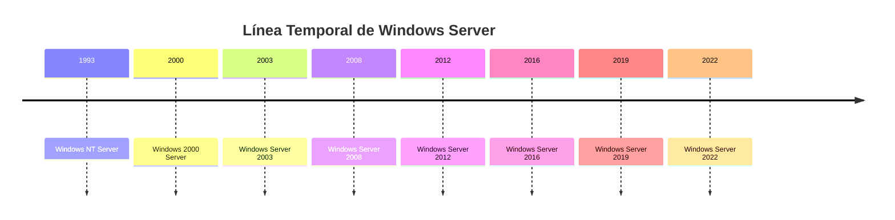

# 2.1 Características y Análisis de los Sistemas Operativos Propietarios

Un sistema operativo propietario es aquel cuyo código fuente no está disponible públicamente y está controlado por una empresa o entidad específica. Estos sistemas operativos suelen ofrecer características avanzadas, soporte técnico y actualizaciones regulares, pero a menudo con restricciones en su uso y distribución.

**Antecedentes**

**Unix**
Un sistema operativo desarrollado en los años 60 y 70 en los laboratorios Bell de AT&T. Unix se caracteriza por su diseño modular, portabilidad y uso de una interfaz de línea de comandos. Ha influido en muchos sistemas operativos modernos, incluyendo Linux y macOS.

**Netware**
Un sistema operativo de red desarrollado por Novell en los años 80 y 90. Netware se centró en la gestión de redes y recursos compartidos, ofreciendo servicios como impresión y archivos compartidos. Aunque ha perdido popularidad frente a sistemas más modernos, sentó las bases para la administración de redes.

**Windows**
Un sistema operativo desarrollado por Microsoft, que ha evolucionado desde sus primeras versiones en los años 80 hasta convertirse en uno de los sistemas operativos más utilizados en el mundo. Windows se caracteriza por su interfaz gráfica de usuario, compatibilidad con una amplia gama de hardware y software, y su integración con servicios en la nube.

**Características**
- **Licencia**: Los sistemas operativos propietarios requieren una licencia para su uso, lo que limita la distribución y modificación del software.
- **Soporte Técnico**: Suelen ofrecer soporte técnico oficial, actualizaciones de seguridad y nuevas características a través de un modelo de suscripción o compra.
- **Interfaz de Usuario**: Generalmente cuentan con interfaces gráficas de usuario (GUI) intuitivas, facilitando su uso para usuarios no técnicos.
- **Compatibilidad**: Suelen ser compatibles con una amplia gama de hardware y software, lo que los hace versátiles para diferentes entornos.
- **Escalabilidad**: Muchos sistemas operativos propietarios están diseñados para escalar desde empresas o cargas de trabajo pequeñas hasta grandes centros de datos, ofreciendo características como virtualización y gestión de recursos.
- **Seguridad**: Implementan medidas de seguridad avanzadas, como cifrado de datos, autenticación multifactor y actualizaciones regulares para proteger contra vulnerabilidades.
- **Integración con Servicios en la Nube**: Muchos sistemas operativos propietarios ofrecen integración con servicios en la nube, permitiendo el almacenamiento y gestión de datos de manera eficiente y segura.    

## 2.1.1 Características de Windows Server

### Línea Temporal


#### **Windows NT Server (1993)**
- Primera versión verdaderamente empresarial
- Arquitectura híbrida (microkernel modificado)
- Soporte para dominios y Active Directory primitivo

#### **Windows 2000 Server (2000)**
- Introducción de Active Directory completo
- Mejor soporte para redes TCP/IP
- Servicios de directorio basados en LDAP

#### **Windows Server 2003 (2003)**
- Mejoras significativas en seguridad
- Introducción de .NET Framework
- Mejor rendimiento y estabilidad

#### **Windows Server 2008/2008 R2 (2008-2009)**
- Server Core (instalación mínima)
- Hyper-V integrado
- PowerShell como herramienta de administración

#### **Windows Server 2012/2012 R2 (2012-2013)**
- Enfoque en cloud computing
- Hyper-V mejorado significativamente
- Storage Spaces y deduplicación

#### **Windows Server 2016 (2016)**
- Contenedores Windows
- Nano Server
- Windows Subsystem for Linux (WSL)

#### **Windows Server 2019 (2018)**
- Kubernetes support
- Storage Migration Service
- Windows Admin Center

#### **Windows Server 2022 (2021)**
- Secured-core server
- Azure Arc integration
- Enhanced security features

### Filosofía de Diseño

#### **Principios Fundamentales**:
1. **Facilidad de uso**: Interfaz gráfica intuitiva
2. **Compatibilidad**: Backward compatibility con versiones anteriores
3. **Escalabilidad**: Desde pequeñas empresas hasta centros de datos
4. **Seguridad**: Múltiples capas de protección
5. **Integración**: Con ecosistema Microsoft y cloud Azure

### 2. Arquitectura de Windows Server

#### 2.1 Arquitectura del Sistema

##### **Modo Usuario (User Mode)**
- **Aplicaciones**: Software de terceros y aplicaciones del sistema
- **Subsistemas**: Win32, POSIX (histórico), .NET
- **DLLs del sistema**: Bibliotecas de funciones del sistema

##### **Modo Kernel (Kernel Mode)**
- **Executive**: Servicios del sistema (gestión de memoria, I/O, etc.)
- **Kernel**: Scheduling, sincronización, control de hilos
- **HAL (Hardware Abstraction Layer)**: Abstracción del hardware
- **Drivers**: Controladores de dispositivos

#### 2.2 Componentes Principales

##### **Registry**
Base de datos jerárquica que almacena configuración del sistema.

**Hives Principales**:
- `HKEY_LOCAL_MACHINE (HKLM)`: Configuración del sistema
- `HKEY_CURRENT_USER (HKCU)`: Configuración del usuario actual
- `HKEY_CLASSES_ROOT (HKCR)`: Información de tipos de archivo
- `HKEY_USERS (HKU)`: Perfiles de todos los usuarios
- `HKEY_CURRENT_CONFIG (HKCC)`: Configuración de hardware actual

##### **Servicios de Windows**
Programas que se ejecutan en background.

**Características**:
- Inicio automático con el sistema
- Ejecución independiente del login de usuario
- Control través de Services Manager (services.msc)

##### **Gestión de Memoria**
- **Virtual Memory Manager (VMM)**: Gestión de memoria virtual
- **Paging**: Intercambio de páginas con disco
- **Memory pools**: Pools paginados y no-paginados para kernel

#### 2.3 Sistema de Archivos

##### **NTFS (New Technology File System)**
Sistema de archivos predeterminado desde Windows NT.

**Características Avanzadas**:
- **Journaling**: Recuperación rápida tras fallos
- **Compresión**: Compresión transparente de archivos
- **Cifrado**: EFS (Encrypting File System)
- **Cuotas de disco**: Limitación por usuario
- **Puntos de montaje**: Montaje de volúmenes en carpetas
- **Enlaces simbólicos**: Enlaces similares a UNIX
- **Streams alternativos**: Múltiples flujos de datos por archivo

##### **ReFS (Resilient File System)**
Sistema de archivos moderno introducido en Windows Server 2012.

**Ventajas**:
- Auto-reparación de corrupción
- Checksums integrados
- Mejor escalabilidad
- Integración con Storage Spaces

### 3. Ediciones de Windows Server 2022

#### 3.1 Windows Server 2022 Standard

##### **Características**:
- Virtualización limitada (2 VMs)
- Todas las funciones de servidor básicas
- Active Directory Domain Services
- DHCP, DNS, File Services

##### **Casos de Uso Típicos**:
- Pequeñas y medianas empresas
- Servidores de aplicaciones
- Controladores de dominio

#### 3.2 Windows Server 2022 Datacenter

##### **Características**:
- Virtualización ilimitada
- Storage Replica
- Shielded Virtual Machines
- Software Defined Networking

##### **Casos de Uso Típicos**:
- Centros de datos grandes
- Cloud privado
- Infraestructura altamente virtualizada

#### 3.3 Windows Server 2022 Essentials

##### **Características**:
- Limitado a 25 usuarios
- Configuración simplificada
- Backup automático
- Acceso web remoto

##### **Casos de Uso Típicos**:
- Pequeñas empresas (hasta 25 empleados)
- Oficinas remotas

### 4. Roles y Características

#### 4.1 Roles Principales

##### **Active Directory Domain Services (AD DS)**
- Servicio de directorio centralizado
- Autenticación y autorización
- Políticas de grupo (Group Policy)
- Replicación entre controladores de dominio

##### **DNS Server**
- Resolución de nombres de dominio
- Integración con Active Directory
- Zonas primarias, secundarias y de stub
- DNS dinámico

##### **DHCP Server**
- Asignación automática de direcciones IP
- Reservas y exclusiones
- Opciones de configuración (gateway, DNS)
- Failover DHCP

##### **File and Storage Services**
- File Server Resource Manager (FSRM)
- DFS (Distributed File System)
- iSCSI Target
- Storage Spaces

##### **Web Server (IIS)**
- Internet Information Services
- Hosting de sitios web y aplicaciones
- Soporte para ASP.NET, PHP, etc.
- Application Request Routing (ARR)

##### **Hyper-V**
- Plataforma de virtualización
- Live migration
- Replica de VMs
- Contenedores Windows

#### 4.2 Características Adicionales

##### **Windows PowerShell**
- Shell de línea de comandos avanzado
- Scripting y automatización
- Cmdlets para administración
- Remoting para administración remota

##### **Windows Backup**
- Backup y recuperación del sistema
- Soporte para VSS (Volume Shadow Copy Service)
- Backup a disco local, red o Azure

##### **Failover Clustering**
- Alta disponibilidad para servicios críticos
- Shared storage clustering
- Cluster Shared Volumes (CSV)

### 5. Administración y Herramientas

#### 5.1 Herramientas Gráficas

##### **Server Manager**
- Consola centralizada de administración
- Instalación y configuración de roles
- Monitoreo del estado del servidor
- Administración de múltiples servidores

##### **Computer Management (compmgmt.msc)**
- Gestión de usuarios y grupos locales
- Servicios del sistema
- Visor de eventos
- Gestión de discos

##### **Group Policy Management Console (GPMC)**
- Administración de políticas de grupo
- Creación y vinculación de GPOs
- Modeling y resultados de políticas
- Delegación de permisos

#### 5.2 Herramientas de Línea de Comandos

##### **PowerShell Cmdlets Esenciales**:
```powershell
# Gestión de servicios
Get-Service
Start-Service
Stop-Service
Restart-Service

# Gestión de usuarios
Get-ADUser
New-ADUser
Set-ADUser
Remove-ADUser

# Información del sistema
Get-ComputerInfo
Get-Process
Get-EventLog
```

##### **Comandos CMD Tradicionales**:
```cmd
net user           # Gestión de usuarios
net group          # Gestión de grupos
ipconfig           # Configuración de red
ping               # Conectividad de red
nslookup           # Consultas DNS
```

### 6. Seguridad en Windows Server

#### 6.1 Modelos de Seguridad

##### **Grupos de Trabajo (Workgroup)**
- Modelo peer-to-peer
- Autenticación local en cada equipo
- Apropiado para redes pequeñas

##### **Dominio**
- Autenticación centralizada
- Active Directory como base
- Políticas centralizadas
- Escalable para organizaciones grandes

#### 6.2 Autenticación y Autorización

##### **Protocolos de Autenticación**:
- **Kerberos**: Protocolo predeterminado en dominios
- **NTLM**: Protocolo legacy para compatibilidad
- **LDAP**: Para consultas de directorio

##### **Control de Acceso**:
- **SID (Security Identifier)**: Identificador único para cada objeto
- **ACL (Access Control List)**: Lista de permisos para objetos
- **DACL (Discretionary ACL)**: Permisos estándar
- **SACL (System ACL)**: Auditoría de accesos

#### 6.3 Mejores Prácticas de Seguridad

##### **Principio de Menor Privilegio**
- Usuarios con mínimos permisos necesarios
- Separación de cuentas administrativas
- Just Enough Administration (JEA)

##### **Actualizaciones y Parches**
- Windows Update automático
- WSUS (Windows Server Update Services)
- Testing en ambiente de desarrollo

##### **Monitoreo y Auditoría**
- Event Log monitoring
- Security auditing policies
- Alertas de seguridad

### 7. Integración con Cloud y Tecnologías Modernas

#### 7.1 Azure Integration

##### **Azure Arc**
- Administración híbrida de servidores
- Políticas y compliance centralizados
- Monitoreo unificado

##### **Azure Backup**
- Backup del servidor a Azure
- Recuperación granular
- Retención a largo plazo

#### 7.2 Contenedores y Microservicios

##### **Windows Containers**
- Windows Server Core containers
- Nano Server containers
- Kubernetes support

##### **Docker on Windows**
- Docker Engine en Windows Server
- Windows-specific images
- Mixed Linux/Windows clusters

### Referencias

1. Russinovich, M., Solomon, D., & Ionescu, A. (2012). Windows Internals, 6th Edition. Microsoft Press.
2. Minasi, M. (2018). Mastering Windows Server 2016. Sybex.
3. Microsoft. (2022). Windows Server 2022 Documentation. docs.microsoft.com.
4. Stanek, W. R. (2021). Windows Server 2022 Inside Out. Microsoft Press.
5. Warren, A. (2020). Windows Server 2019 Administration Fundamentals. Packt Publishing.