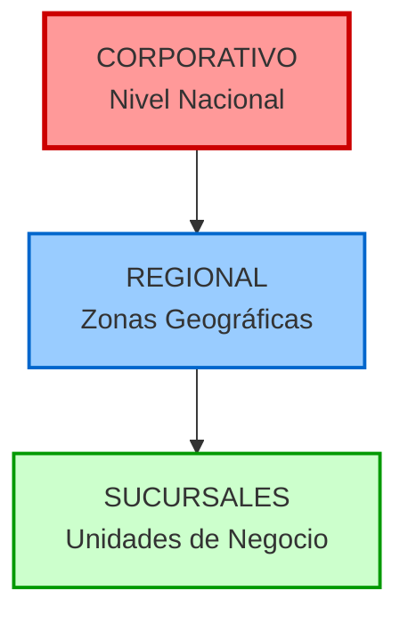
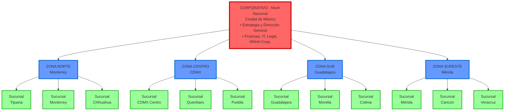
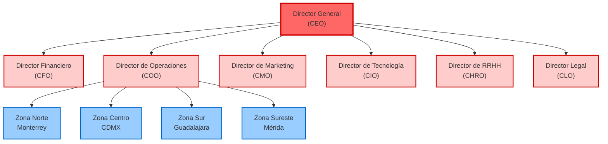
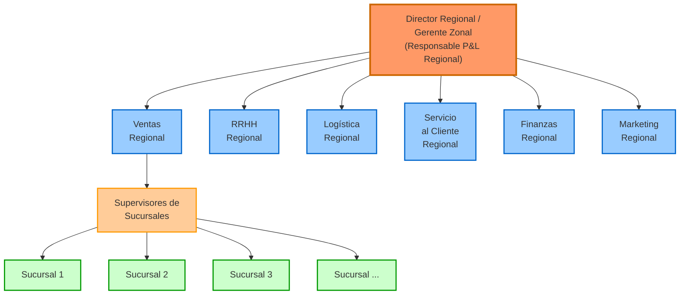
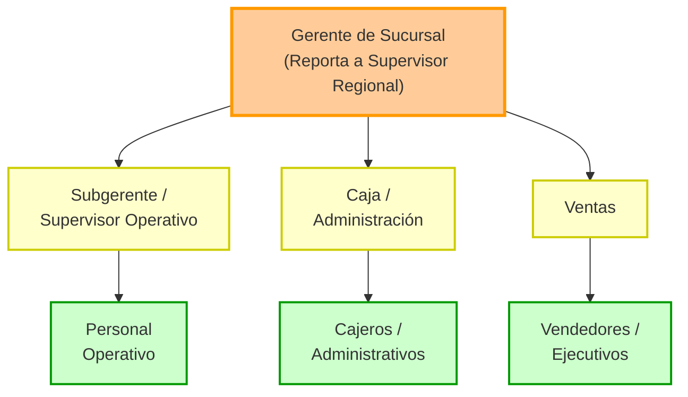

# 🏢 Estructura Organizacional de Corporativos

## Guía de Referencia para Implementación de Unidades Organizacionales en Active Directory

---

## 📋 Introducción

Este documento proporciona una referencia detallada sobre cómo se organizan los corporativos con presencia nacional en México, para ser utilizada como base en la implementación de **Unidades Organizacionales (OU)** en **Active Directory**.

### Objetivo

Comprender la estructura organizacional real de empresas con múltiples sucursales para poder:
- ✅ Diseñar una jerarquía de OUs coherente
- ✅ Aplicar políticas de grupo (GPOs) apropiadas por nivel
- ✅ Implementar delegación de permisos efectiva
- ✅ Organizar usuarios, equipos y recursos lógicamente

### Principios de Organización Corporativa

Un corporativo con presencia nacional debe equilibrar:
1. **Estandarización**: Procesos y políticas uniformes en todo el país
2. **Adaptación local**: Flexibilidad para responder a mercados regionales
3. **Control centralizado**: Decisiones estratégicas en casa matriz
4. **Operación descentralizada**: Ejecución eficiente a nivel local

---

## 🗺️ Modelo de Organización Corporativa

### Estructura Jerárquica de 3 Niveles



### Representación Visual



---

## 🌎 División Geográfica en México

### Modelo por Zonas Geográficas (5-7 Regiones)

| **Zona** | **Estados Cubiertos** | **Sede Regional** | **Población Aprox.** |
|----------|----------------------|-------------------|----------------------|
| **Norte** | Baja California, Sonora, Chihuahua, Coahuila, Nuevo León, Tamaulipas | Monterrey | 25 millones |
| **Noroeste** | Baja California Sur, Sinaloa, Durango | Culiacán | 5 millones |
| **Centro-Occidente** | Jalisco, Nayarit, Colima, Michoacán, Guanajuato | Guadalajara | 18 millones |
| **Centro** | CDMX, Estado de México, Querétaro, Hidalgo, Tlaxcala, Puebla, Morelos | Ciudad de México | 32 millones |
| **Sur** | Guerrero, Oaxaca, Chiapas | Oaxaca | 10 millones |
| **Sureste** | Veracruz, Tabasco, Campeche, Yucatán, Quintana Roo | Mérida | 15 millones |
| **Bajío** | Aguascalientes, Zacatecas, San Luis Potosí | Querétaro | 8 millones |

### Modelo Simplificado (4 Zonas)

**Para corporativos medianos:**

| **Zona** | **Estados** | **Sede** |
|----------|-------------|----------|
| **Norte** | Todo el norte desde Baja California hasta Tamaulipas | Monterrey |
| **Centro** | Del Bajío a CDMX (incluye zona metropolitana) | Ciudad de México |
| **Occidente** | Pacífico centro (Jalisco, Nayarit, Colima, Michoacán) | Guadalajara |
| **Sur-Sureste** | De Guerrero a Quintana Roo | Mérida o Cancún |

---

## 🏢 Organigrama Corporativo Típico

### Nivel 1: Corporativo Nacional



### Áreas Corporativas Centralizadas

#### 🔴 Áreas Estratégicas (100% Centralizadas)

**Estas funciones se manejan EXCLUSIVAMENTE desde casa matriz:**

1. **Dirección General y Planeación Estratégica**
   - Definición de objetivos corporativos
   - Planeación estratégica a 3-5 años
   - Relaciones con accionistas

2. **Finanzas y Contraloría Corporativa**
   - Tesorería nacional
   - Auditoría interna
   - Relaciones con inversionistas
   - Planeación financiera
   - Control presupuestal corporativo

3. **Desarrollo de Productos/Servicios**
   - Investigación y desarrollo (I+D)
   - Innovación
   - Diseño de productos/servicios

4. **Marketing y Marca Nacional**
   - Estrategia de marca corporativa
   - Publicidad nacional
   - Campañas corporativas
   - Posicionamiento de marca

5. **Tecnología de Información (TI/IT)**
   - Infraestructura tecnológica nacional
   - Sistemas corporativos (ERP, CRM, Active Directory)
   - Ciberseguridad
   - Arquitectura de sistemas
   - Políticas de TI

6. **Legal Corporativo**
   - Cumplimiento regulatorio
   - Contratos corporativos
   - Propiedad intelectual
   - Litigios estratégicos

7. **Recursos Humanos Corporativos**
   - Políticas de compensación
   - Desarrollo organizacional
   - Capacitación corporativa
   - Cultura organizacional
   - Relaciones laborales estratégicas

8. **Compras Corporativas**
   - Negociación con proveedores estratégicos
   - Contratos marco
   - Economías de escala

---

## 🔵 Nivel Regional - Estructura Mixta

### Organigrama de Región Típica



### Áreas que SE REPLICAN en Regiones

**Cada zona regional tiene estas áreas (70-80% de funciones):**

#### 1. **Dirección Regional**
- **Director Regional / Gerente Zonal**
  - Responsable de Resultados (P&L) de la región
  - Implementa estrategia nacional con adaptación local
  - Reporta a Director de Operaciones (COO) Corporativo

#### 2. **Ventas y Desarrollo Comercial Regional**
- Equipos de ventas locales
- Supervisores de sucursales (cada uno supervisa 8-15 tiendas)
- Ejecutivos de cuenta corporativos regionales
- Promotores y merchandising regional
- **Reporta a**: CMO Corporativo (matricialmente) y Director Regional

#### 3. **Recursos Humanos Regional**
- Reclutamiento y selección local
- Nómina regional
- Relaciones laborales locales
- Capacitación operativa
- Administración de personal
- **Reporta a**: CHRO Corporativo (matricialmente) y Director Regional

#### 4. **Logística y Distribución Regional**
- Centro de distribución regional (CEDIS)
- Gestión de inventarios regionales
- Transporte y última milla
- Almacenes regionales
- **Reporta a**: COO Corporativo (matricialmente) y Director Regional

#### 5. **Servicio al Cliente Regional**
- Call center regional (en algunos casos)
- Soporte técnico local
- Gestión de quejas y reclamaciones
- **Reporta a**: COO Corporativo (matricialmente) y Director Regional

#### 6. **Finanzas Regional (Parcial)**
- Control de gastos regionales
- Administración de cuentas por cobrar
- Reportes financieros regionales
- Análisis de rentabilidad por sucursal
- **Reporta a**: CFO Corporativo (matricialmente) y Director Regional

#### 7. **Marketing Regional (Parcial)**
- Campañas locales (dentro de lineamientos corporativos)
- Promociones regionales
- Eventos locales
- Relaciones públicas regionales
- **Reporta a**: CMO Corporativo (matricialmente) y Director Regional

#### 8. **TI Regional (Soporte)**
- Soporte técnico local (helpdesk)
- Instalación y mantenimiento de equipos
- Administración de infraestructura regional
- **Reporta a**: CIO Corporativo (matricialmente) y Director Regional

---

## 🟢 Nivel Sucursal - Operación Local

### Organigrama de Sucursal Típica



### Personal Típico por Sucursal

**Estructura básica (varía según tamaño y giro):**

1. **Gerente de Sucursal**
   - Responsable de resultados de la unidad
   - Reporta a Supervisor Regional
   - Ejecuta políticas corporativas y regionales

2. **Subgerente / Supervisor Operativo**
   - Apoyo en operación diaria
   - Cubre ausencias del gerente

3. **Personal de Ventas**
   - Vendedores / Ejecutivos de cuenta
   - Asesores de ventas
   - Promotores

4. **Personal Operativo / Técnico**
   - Operadores
   - Técnicos
   - Personal de producción/servicio
   - (Según el giro del negocio)

5. **Personal Administrativo**
   - Cajeros
   - Recepcionistas
   - Administrativos

6. **Personal de Apoyo**
   - Limpieza (puede ser outsourcing)
   - Mantenimiento (puede ser outsourcing)
   - Seguridad (puede ser outsourcing)

### Funciones que NO Existen a Nivel Sucursal

❌ **Estas áreas NO se replican en sucursales:**

- **Contabilidad**: Se hace en Regional o Corporativo
- **RRHH completo**: Solo ejecución básica (asistencias, incidencias)
- **Marketing estratégico**: Solo ejecución de campañas ya diseñadas
- **Compras estratégicas**: Solo pedidos de reposición
- **IT estratégico**: Solo soporte de primer nivel
- **Legal**: Ninguna función legal
- **Finanzas corporativas**: Solo manejo de caja chica
- **Desarrollo de producto**: Ninguna función de I+D

---

## 📊 Matriz de Decisión: ¿Qué se Centraliza vs. Descentraliza?

### Tabla de Funciones por Nivel

| **Función** | **Nivel** | **Razón Principal** | **% Centralización** |
|-------------|-----------|---------------------|----------------------|
| **Estrategia y Planeación** | 🔴 Corporativo | Visión unificada a largo plazo | 100% |
| **Finanzas y Tesorería** | 🔴 Corporativo | Control financiero y liquidez | 95% |
| **IT e Infraestructura** | 🔴 Corporativo | Estandarización y seguridad | 90% |
| **Marca y Publicidad Nacional** | 🔴 Corporativo | Consistencia de marca | 90% |
| **Compras Corporativas** | 🔴 Corporativo | Economías de escala | 85% |
| **Legal y Compliance** | 🔴 Corporativo | Cumplimiento normativo | 95% |
| **Desarrollo de Producto** | 🔴 Corporativo | Innovación centralizada | 90% |
| **RRHH Estratégico** | 🔴 Corporativo | Cultura y políticas uniformes | 70% |
| **Ventas y Desarrollo Comercial** | 🔵 Regional | Cercanía al cliente | 20% |
| **RRHH Operativo** | 🔵 Regional | Conocimiento del mercado laboral local | 30% |
| **Logística y Distribución** | 🔵 Regional | Eficiencia en última milla | 40% |
| **Marketing Local** | 🔵 Regional | Adaptación al mercado regional | 30% |
| **Servicio al Cliente** | 🔵 Regional | Atención cercana y personalizada | 40% |
| **Finanzas Operativas** | 🔵 Regional | Control de gastos locales | 30% |
| **Operación Diaria** | 🟢 Sucursal | Atención directa al cliente | 5% |
| **Ventas Directas** | 🟢 Sucursal | Contacto cara a cara | 10% |
| **Servicio Local** | 🟢 Sucursal | Ejecución en punto de venta | 10% |

---

## 🏢 Ejemplos de Estructuras Reales en México

### Ejemplo 1: OXXO (Retail - Tiendas de Conveniencia)

#### **Nivel Corporativo (FEMSA Comercio - Monterrey)**
- Dirección General México
- CFO, COO, CMO, CIO Corporativos
- Desarrollo de formato y operación
- Compras centralizadas (negociación con Coca-Cola, Bimbo, etc.)
- TI centralizada (sistema de punto de venta unificado)
- Centro de operaciones nacional

#### **Nivel Regional (7 Zonas Operativas)**

| **Zona** | **Sede** | **Estados Cubiertos** | **Sucursales Aprox.** |
|----------|----------|----------------------|----------------------|
| Norte | Monterrey | NL, Coahuila, Tamaulipas | 2,500 |
| Occidente | Guadalajara | Jalisco, Nayarit, Colima | 2,000 |
| Centro | Ciudad de México | CDMX, EdoMex, Hidalgo | 3,500 |
| Bajío | Querétaro | Guanajuato, Querétaro, SLP | 1,800 |
| Pacífico | Culiacán | Sinaloa, Sonora, BC | 1,500 |
| Sureste | Mérida | Yucatán, Quintana Roo, Campeche | 1,200 |
| Sur | Puebla/Oaxaca | Puebla, Veracruz, Oaxaca, Guerrero | 1,500 |

**Cada Región tiene:**
- Director Regional
- Gerentes de zona (subdivisión por ciudades)
- Supervisores de tienda (cada uno supervisa 8-12 tiendas)
- Centro de distribución regional (CEDIS)
- Equipo de RRHH regional (reclutamiento masivo)

#### **Nivel Sucursal (Más de 21,000 tiendas)**
- 1 Gerente de tienda
- 1 Subgerente
- 4-6 empleados por turno (operación 24/7)
- **NO tienen**: Contador, RRHH, Comprador (todo centralizado)
- **Sistema**: POS (punto de venta) conectado en tiempo real a corporativo

---

### Ejemplo 2: BBVA México (Banca - Sector Regulado)

#### **Nivel Corporativo (Ciudad de México)**

**Áreas Altamente Centralizadas (por regulación CNBV):**
- Dirección General México
- **Cumplimiento y Riesgos** (regulación estricta)
- Tesorería y finanzas corporativas
- Crédito corporativo (aprobaciones centralizadas)
- Innovación y transformación digital
- Seguridad de la información
- Legal y cumplimiento
- Marketing y marca nacional

#### **Nivel Regional (7 Divisiones Territoriales)**

| **División** | **Sede** | **Estados** |
|--------------|----------|-------------|
| Noroeste | Hermosillo | BC, BCS, Sonora, Sinaloa |
| Norte | Monterrey | Coahuila, Nuevo León, Tamaulipas |
| Occidente | Guadalajara | Jalisco, Nayarit, Colima, Michoacán |
| Bajío | León | Guanajuato, Querétaro, Aguascalientes |
| Centro | CDMX | CDMX, EdoMex, Morelos, Hidalgo |
| Centro Sur | Puebla | Puebla, Tlaxcala, Veracruz |
| Sur | Mérida | Yucatán, Quintana Roo, Campeche, Tabasco, Chiapas |

**Cada División Territorial tiene:**
- **Director Territorial** (responsable de P&L regional)
- **Banca de Empresas Regional**: Ejecutivos para clientes corporativos
- **Banca Personal y PYME Regional**: Atención a personas físicas
- **Operaciones y servicios**: Back office regional
- **RRHH Regional**: Reclutamiento local (solo operativo)
- **Centro de atención telefónica** (en algunas regiones)

#### **Nivel Sucursal (Más de 1,800 sucursales)**
- **Gerente de Sucursal** (reporta a Director Territorial)
- **Subgerente**
- **Ejecutivos de cuenta** (banca personal, empresas, PYME)
- **Cajeros y servicio al cliente**
- **Personal de seguridad** (outsourcing)
- **Promotores** (tarjetas, créditos)

**Lo que NO existe en sucursal:**
- ❌ Departamento de crédito (evaluación centralizada en regional/corporativo)
- ❌ RRHH estratégico (solo ejecutan políticas)
- ❌ Contabilidad (100% centralizada)
- ❌ Marketing (solo ejecutan campañas nacionales/regionales)
- ❌ Compliance (centralizado por regulación)

---

### Ejemplo 3: Liverpool (Retail - Departamental)

#### **Nivel Corporativo (Ciudad de México)**
- Dirección General
- Compras centralizadas (negociación con marcas internacionales)
- Marketing y publicidad nacional
- IT corporativo (sistema de inventarios en tiempo real)
- Logística corporativa
- RRHH corporativo
- Finanzas corporativas

#### **Nivel Regional (4 Zonas)**
- **Norte**: Monterrey
- **Centro**: CDMX
- **Occidente**: Guadalajara
- **Sureste**: Mérida

**Cada región:**
- Gerente Regional
- Centro de distribución regional
- Supervisores de tienda
- Equipo de visual merchandising regional

#### **Nivel Tienda (Aprox. 120 tiendas)**
- Gerente de tienda
- Subgerentes por departamento (Moda, Hogar, Electrónica, etc.)
- Jefes de piso
- Vendedores especializados
- Cajeros
- Personal de servicios (empacadores, limpieza)

---

## 🎯 Aplicación a Active Directory

### Diseño de OUs Basado en Estructura Organizacional

#### Opción 1: Organización Geográfica (Recomendada para Corporativos Multi-Sucursal)

```mermaid
graph TB
    ROOT["miempresa.com<br/>(Dominio raíz)"]
    
    CORP["Corporativo (OU)"]
    ZN["Zona_Norte (OU)"]
    ZC["Zona_Centro (OU)"]
    ZS["Zona_Sur (OU)"]
    ZSE["Zona_Sureste (OU)"]
    
    DG["Direccion_General"]
    FIN["Finanzas"]
    RRHH["Recursos_Humanos"]
    TI["Tecnologias_Informacion"]
    MKT["Marketing"]
    LEG["Legal"]
    COM["Compras"]
    
    ZN_ADM["Administracion_Regional"]
    ZN_VEN["Ventas_Regional"]
    ZN_RH["RRHH_Regional"]
    ZN_LOG["Logistica_Regional"]
    ZN_S1["Sucursal_Monterrey"]
    ZN_S2["Sucursal_Tijuana"]
    ZN_S3["Sucursal_Chihuahua"]
    
    ZC_ADM["Administracion_Regional"]
    ZC_VEN["Ventas_Regional"]
    ZC_RH["RRHH_Regional"]
    ZC_LOG["Logistica_Regional"]
    ZC_S1["Sucursal_CDMX_Centro"]
    ZC_S2["Sucursal_CDMX_Sur"]
    ZC_S3["Sucursal_Queretaro"]
    
    ROOT --> CORP
    ROOT --> ZN
    ROOT --> ZC
    ROOT --> ZS
    ROOT --> ZSE
    
    CORP --> DG
    CORP --> FIN
    CORP --> RRHH
    CORP --> TI
    CORP --> MKT
    CORP --> LEG
    CORP --> COM
    
    ZN --> ZN_ADM
    ZN --> ZN_VEN
    ZN --> ZN_RH
    ZN --> ZN_LOG
    ZN --> ZN_S1
    ZN --> ZN_S2
    ZN --> ZN_S3
    
    ZC --> ZC_ADM
    ZC --> ZC_VEN
    ZC --> ZC_RH
    ZC --> ZC_LOG
    ZC --> ZC_S1
    ZC --> ZC_S2
    ZC --> ZC_S3
    
    style ROOT fill:#ff6666,stroke:#cc0000,stroke-width:3px
    style CORP fill:#ffcccc,stroke:#cc0000,stroke-width:2px
    style ZN fill:#99ccff,stroke:#0066cc,stroke-width:2px
    style ZC fill:#99ccff,stroke:#0066cc,stroke-width:2px
    style ZS fill:#99ccff,stroke:#0066cc,stroke-width:2px
    style ZSE fill:#99ccff,stroke:#0066cc,stroke-width:2px
```



**Nota:** Se muestran solo 2 zonas completas (Norte y Centro) para claridad. Sur y Sureste tendrían estructura similar.

#### Opción 2: Organización Funcional (Para Empresas Centralizadas)

```mermaid
graph TB
    ROOT["miempresa.com<br/>(Dominio raíz)"]
    
    FIN["Finanzas (OU)"]
    RRHH["Recursos_Humanos (OU)"]
    VEN["Ventas (OU)"]
    TI["Tecnologia (OU)"]
    OPS["Operaciones (OU)"]
    
    FIN_UC["Usuarios_Finanzas_Corporativo"]
    FIN_UR["Usuarios_Finanzas_Regional"]
    FIN_EQ["Equipos_Finanzas"]
    
    RRHH_UC["Usuarios_RRHH_Corporativo"]
    RRHH_UR["Usuarios_RRHH_Regional"]
    RRHH_EQ["Equipos_RRHH"]
    
    VEN_UC["Usuarios_Ventas_Corporativo"]
    VEN_UR["Usuarios_Ventas_Regional"]
    VEN_US["Usuarios_Ventas_Sucursales"]
    VEN_EQ["Equipos_Ventas"]
    
    TI_ADM["Administradores_TI"]
    TI_SOP["Soporte_Tecnico"]
    TI_SERV["Servidores"]
    TI_EQ["Equipos_TI"]
    
    OPS_U["Usuarios_Operaciones"]
    OPS_E["Equipos_Operaciones"]
    
    ROOT --> FIN
    ROOT --> RRHH
    ROOT --> VEN
    ROOT --> TI
    ROOT --> OPS
    
    FIN --> FIN_UC
    FIN --> FIN_UR
    FIN --> FIN_EQ
    
    RRHH --> RRHH_UC
    RRHH --> RRHH_UR
    RRHH --> RRHH_EQ
    
    VEN --> VEN_UC
    VEN --> VEN_UR
    VEN --> VEN_US
    VEN --> VEN_EQ
    
    TI --> TI_ADM
    TI --> TI_SOP
    TI --> TI_SERV
    TI --> TI_EQ
    
    OPS --> OPS_U
    OPS --> OPS_E
    
    style ROOT fill:#ff6666,stroke:#cc0000,stroke-width:3px
    style FIN fill:#99ccff,stroke:#0066cc,stroke-width:2px
    style RRHH fill:#99ccff,stroke:#0066cc,stroke-width:2px
    style VEN fill:#99ccff,stroke:#0066cc,stroke-width:2px
    style TI fill:#99ccff,stroke:#0066cc,stroke-width:2px
    style OPS fill:#99ccff,stroke:#0066cc,stroke-width:2px
```



#### Opción 3: Organización Híbrida (Más Común)

```mermaid
graph TB
    ROOT["miempresa.com<br/>(Dominio raíz)"]
    
    USR["Usuarios (OU)"]
    EQ["Equipos (OU)"]
    GRP["Grupos (OU)"]
    REC["Recursos_Compartidos (OU)"]
    
    USR_CORP["Corporativo (OU)"]
    USR_ZN["Zona_Norte (OU)"]
    USR_ZC["Zona_Centro (OU)"]
    USR_ZS["Zona_Sur (OU)"]
    
    CORP_EJEC["Ejecutivos"]
    CORP_FIN["Finanzas"]
    CORP_RRHH["RRHH"]
    CORP_TI["Tecnologia"]
    CORP_MKT["Marketing"]
    CORP_LEG["Legal"]
    
    ZN_ADM["Administracion"]
    ZN_VEN["Ventas"]
    ZN_OPS["Operaciones"]
    
    EQ_SERV["Servidores"]
    EQ_EST["Estaciones_Trabajo"]
    EQ_PORT["Portatiles"]
    EQ_MOV["Dispositivos_Moviles"]
    
    EST_CORP["Corporativo"]
    EST_REG["Regional"]
    EST_SUC["Sucursales"]
    
    GRP_SEG["Grupos_Seguridad"]
    GRP_DIST["Grupos_Distribucion"]
    GRP_APP["Grupos_Aplicaciones"]
    
    REC_IMP["Impresoras"]
    REC_CARP["Carpetas_Compartidas"]
    
    ROOT --> USR
    ROOT --> EQ
    ROOT --> GRP
    ROOT --> REC
    
    USR --> USR_CORP
    USR --> USR_ZN
    USR --> USR_ZC
    USR --> USR_ZS
    
    USR_CORP --> CORP_EJEC
    USR_CORP --> CORP_FIN
    USR_CORP --> CORP_RRHH
    USR_CORP --> CORP_TI
    USR_CORP --> CORP_MKT
    USR_CORP --> CORP_LEG
    
    USR_ZN --> ZN_ADM
    USR_ZN --> ZN_VEN
    USR_ZN --> ZN_OPS
    
    EQ --> EQ_SERV
    EQ --> EQ_EST
    EQ --> EQ_PORT
    EQ --> EQ_MOV
    
    EQ_EST --> EST_CORP
    EQ_EST --> EST_REG
    EQ_EST --> EST_SUC
    
    GRP --> GRP_SEG
    GRP --> GRP_DIST
    GRP --> GRP_APP
    
    REC --> REC_IMP
    REC --> REC_CARP
    
    style ROOT fill:#ff6666,stroke:#cc0000,stroke-width:3px
    style USR fill:#ffcc99,stroke:#ff9900,stroke-width:2px
    style EQ fill:#99ff99,stroke:#009900,stroke-width:2px
    style GRP fill:#cc99ff,stroke:#9900cc,stroke-width:2px
    style REC fill:#ffff99,stroke:#cccc00,stroke-width:2px
    style USR_CORP fill:#ffcccc,stroke:#cc0000,stroke-width:2px
    style USR_ZN fill:#99ccff,stroke:#0066cc,stroke-width:2px
    style USR_ZC fill:#99ccff,stroke:#0066cc,stroke-width:2px
    style USR_ZS fill:#99ccff,stroke:#0066cc,stroke-width:2px
```



---

## 📋 Mejores Prácticas para Diseño de OUs

### 1. **Principios de Diseño**

✅ **Diseñar pensando en delegación de permisos**
- Crear OUs que reflejen cómo se delegarán los permisos
- Ejemplo: OU "Zona_Norte" permite delegar administración a equipo de TI regional

✅ **Evitar estructura demasiado profunda**
- Máximo 5-7 niveles de profundidad
- Más niveles = más complejidad en GPOs

✅ **Planear para GPOs**
- Agrupar objetos que necesitarán las mismas políticas
- Ejemplo: Todas las sucursales de una zona pueden compartir GPO de seguridad

✅ **Separar usuarios de equipos**
- Facilita aplicación de GPOs específicas
- Mejora claridad organizacional

### 2. **Convenciones de Nomenclatura**

**Recomendaciones:**
- Usar guiones bajos en lugar de espacios: `Zona_Norte` mejor que `Zona Norte`
- Nombres descriptivos pero concisos: `Finanzas_Regional` mejor que `Departamento_de_Finanzas_de_la_Region`
- Evitar caracteres especiales: áéíóú, ñ, #, @
- Usar prefijos para identificar tipo de OU cuando sea útil

**Ejemplos:**
```
OU_Corporativo
OU_Regional_Norte
OU_Sucursal_MTY
GRP_Ventas_Norte (para grupos de seguridad)
PC_Finanzas_01 (para equipos)
```

### 3. **Delegación de Permisos por Nivel**

| **Nivel** | **Quién administra** | **Permisos delegados** |
|-----------|---------------------|------------------------|
| **Corporativo** | Administradores de dominio | Control total |
| **Regional** | Administrador de TI regional | Crear/eliminar usuarios, resetear contraseñas, unir equipos al dominio |
| **Sucursal** | Gerente de sucursal (limitado) | Solo resetear contraseñas de su sucursal |

### 4. **Políticas de Grupo (GPO) Típicas por Nivel**

#### GPOs Corporativas (aplican a todo el dominio)
- Políticas de contraseñas
- Configuración de firewall de Windows
- Windows Update (WSUS)
- Antivirus corporativo
- Configuración de escritorio base

#### GPOs Regionales
- Impresoras regionales
- Servidores de archivos regionales
- Scripts de mapeo de unidades
- Configuraciones de proxy regional

#### GPOs de Sucursal
- Impresoras locales
- Carpetas compartidas locales
- Configuraciones específicas de punto de venta

---

## 🎓 Ejercicios Prácticos para Alumnos

### Ejercicio 1: Diseño de Estructura de OUs

**Escenario:**
Una cadena de farmacias tiene:
- Casa matriz en Guadalajara
- 3 regiones: Occidente (10 sucursales), Centro (15 sucursales), Norte (8 sucursales)
- Departamentos corporativos: Finanzas, RRHH, IT, Compras
- Cada sucursal tiene: 1 gerente, 2 farmacéuticos, 3 cajeros

**Tarea:**
Diseñar la estructura completa de OUs en Active Directory

---

### Ejercicio 2: Aplicación de GPOs

**Escenario:**
Usando la estructura del Ejercicio 1, definir:
- 3 GPOs corporativas
- 2 GPOs por región
- 1 GPO por sucursal tipo

**Tarea:**
Documentar qué configuraciones incluiría cada GPO y a qué OUs se aplicarían

---

### Ejercicio 3: Delegación de Permisos

**Escenario:**
En la estructura del Ejercicio 1:
- Administrador corporativo de TI
- 3 Técnicos de TI regionales (1 por región)
- Gerentes de sucursal

**Tarea:**
Definir qué permisos delegaría a cada rol y sobre qué OUs

---

## 📊 Resumen: Checklist de Implementación

### ✅ Planificación

- [ ] Identificar niveles organizacionales (Corporativo, Regional, Sucursal)
- [ ] Mapear departamentos y áreas funcionales
- [ ] Definir zonas geográficas
- [ ] Listar todas las sucursales por zona
- [ ] Identificar requisitos de delegación de permisos
- [ ] Planear GPOs necesarias por nivel

### ✅ Diseño de OUs

- [ ] Crear diagrama de estructura de OUs
- [ ] Validar profundidad (máx. 5-7 niveles)
- [ ] Definir convenciones de nomenclatura
- [ ] Separar usuarios, equipos y grupos
- [ ] Documentar propósito de cada OU

### ✅ Implementación en AD

- [ ] Crear OUs de nivel superior primero
- [ ] Implementar OUs de forma jerárquica
- [ ] Configurar delegación de permisos
- [ ] Crear y aplicar GPOs
- [ ] Probar delegación de permisos
- [ ] Documentar cambios realizados

### ✅ Validación

- [ ] Verificar que GPOs se aplican correctamente
- [ ] Comprobar delegación de permisos funciona
- [ ] Realizar pruebas de creación de usuarios en cada nivel
- [ ] Validar que estructura es escalable
- [ ] Obtener retroalimentación de usuarios

---

## 📚 Referencias y Recursos Adicionales

### Documentación de Microsoft
- [Diseño de unidades organizativas de Active Directory](https://docs.microsoft.com/es-es/windows-server/identity/ad-ds/plan/creating-an-organizational-unit-design)
- [Delegación de administración en Active Directory](https://docs.microsoft.com/es-es/windows-server/identity/ad-ds/plan/delegating-administration)
- [Directivas de grupo (GPO)](https://docs.microsoft.com/es-es/windows-server/identity/ad-ds/manage/group-policy/group-policy-overview)

### Mejores Prácticas
- No más de 5-7 niveles de profundidad en OUs
- Diseñar pensando en delegación, no en organigrama exacto
- Usar grupos de seguridad para permisos, OUs para GPOs
- Documentar toda la estructura y cambios
- Revisar y optimizar periódicamente

---

**Última actualización:** Octubre 2025  
**Documento creado para:** Taller de Sistemas Operativos - Windows Server  
**Tema:** Implementación de Active Directory y Unidades Organizacionales
