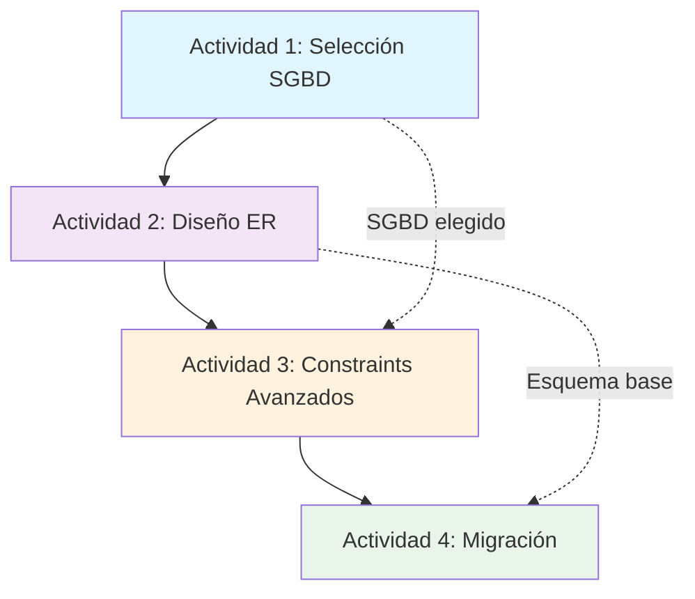

# Índice de Actividades de Enseñanza - Unidad 1: DDL

## 🎯 Visión General de las Actividades

Esta unidad incluye **4 actividades de enseñanza progresivas** que desarrollan competencias desde la **selección tecnológica** hasta la **gestión avanzada de esquemas** en entornos productivos.

---

## 📚 Actividades Implementadas

### [Actividad 1: Criterios de Selección de SGBD](./Actividad-01-Criterios-Seleccion-SGBD.md)
**⏱️ Duración**: 2 horas | **👥 Modalidad**: Individual + Grupal | **🎯 Enfoque**: Análisis Comparativo

**Objetivo**: Analizar y comparar diferentes SGBD aplicando criterios técnicos y empresariales para tomar decisiones fundamentadas.

**Metodología Activa**: **Estudio de Casos** con análisis multi-criterio
- Investigación dirigida con matriz comparativa
- 3 escenarios empresariales (Startup, Hospital, Banco)
- Presentación y debate de recomendaciones

**Competencias Desarrolladas**:
- ✅ Evaluación de características técnicas de SGBD
- ✅ Análisis de factores empresariales en decisiones tecnológicas
- ✅ Justificación de selecciones con criterios objetivos

**Indicadores de Impacto**: A(25%), B(30%), D(30%), E(15%)

---

### [Actividad 2: Diseño de Esquemas con Modelado ER](./Actividad-02-Diseño-Esquemas-ER.md)
**⏱️ Duración**: 3 horas | **👥 Modalidad**: Equipos 2-3 | **🎯 Enfoque**: Diseño Técnico

**Objetivo**: Diseñar esquemas completos aplicando modelado ER y transformando modelos conceptuales a implementaciones DDL.

**Metodología Activa**: **Aprendizaje Basado en Problemas (ABP)** - Sistema de Biblioteca Digital
- Análisis de requerimientos → Modelo ER → Normalización → DDL
- 4 fases metodológicas con validación continua
- Testing con datos reales y consultas de validación

**Competencias Desarrolladas**:
- ✅ Aplicación de técnicas de modelado ER
- ✅ Transformación conceptual → lógico → físico
- ✅ Normalización hasta 3FN
- ✅ Implementación de constraints de integridad

**Indicadores de Impacto**: A(30%), B(25%), C(25%), D(20%)

---

### [Actividad 3: Implementación Práctica de Constraints Avanzados](./Actividad-03-Constraints-Avanzados.md)
**⏱️ Duración**: 2.5 horas | **👥 Modalidad**: Individual | **🎯 Enfoque**: Implementación Avanzada

**Objetivo**: Implementar constraints complejos utilizando características específicas de SGBD para garantizar integridad empresarial.

**Metodología Activa**: **Retos Técnicos** - Sistema de E-commerce Global
- CHECK constraints complejos para reglas de negocio
- Triggers para validaciones automáticas
- Testing exhaustivo con casos edge
- Análisis de impacto en rendimiento

**Competencias Desarrolladas**:
- ✅ Implementación de constraints complejos
- ✅ Desarrollo de triggers para automatización
- ✅ Validación de reglas de negocio técnicas
- ✅ Análisis de trade-offs rendimiento vs integridad

**Indicadores de Impacto**: A(35%), C(25%), D(25%), F(15%)

---

### [Actividad 4: Migración y Versionado de Esquemas](./Actividad-04-Migracion-Versionado.md)
**⏱️ Duración**: 3 horas | **👥 Modalidad**: Pair Programming | **🎯 Enfoque**: Gestión Productiva

**Objetivo**: Aplicar técnicas de migración y versionado para gestionar evolución de BD en entornos 24/7 sin downtime.

**Metodología Activa**: **Simulación Empresarial** - Modernización Sistema Retail
- Migración v1.0 → v2.0 con zero downtime
- 4 migraciones incrementales con rollback
- Automatización completa con scripting
- Testing de rendimiento y validación integral

**Competencias Desarrolladas**:
- ✅ Gestión de cambios en entornos productivos
- ✅ Estrategias de migración sin interrupciones
- ✅ Control de versiones de esquemas
- ✅ Planificación y ejecución de rollbacks seguros

**Indicadores de Impacto**: A(40%), C(20%), D(25%), F(15%)

---

## 🎯 Progresión de Competencias

### Nivel 1: Fundamentos (Actividades 1-2)
- **Selección tecnológica** con criterios empresariales
- **Diseño conceptual** con metodologías estructuradas
- **Implementación básica** de esquemas normalizados

### Nivel 2: Implementación Avanzada (Actividad 3)
- **Constraints complejos** para reglas de negocio
- **Automatización** con triggers y validaciones
- **Optimización** considerando rendimiento

### Nivel 3: Gestión Empresarial (Actividad 4)
- **Migración controlada** en entornos críticos
- **Versionado profesional** con rollback strategies
- **Automatización completa** del ciclo de vida

---

## 🔄 Integración entre Actividades

**Flujo de Aprendizaje**:
1. **Fundamentos** → Selección informada de tecnología
2. **Diseño** → Aplicación de metodologías estructuradas  
3. **Implementación** → Características avanzadas del SGBD
4. **Gestión** → Operación en entornos empresariales

---

## 📊 Distribución de Metodologías Activas

| Metodología | Actividades | Peso Total | Características |
|-------------|-------------|------------|-----------------|
| **Estudio de Casos** | Actividad 1 | 20% | Análisis comparativo, escenarios reales |
| **ABP** | Actividad 2 | 30% | Problema complejo, solución integral |
| **Retos Técnicos** | Actividad 3 | 25% | Implementación avanzada, testing |
| **Simulación** | Actividad 4 | 25% | Ambiente empresarial, pair programming |

---

## 🎓 Competencias Transversales Desarrolladas

### **Técnicas**:
- Diseño y modelado de bases de datos
- Implementación avanzada de SGBD
- Gestión de cambios y versionado
- Testing y validación sistemática

### **Metodológicas**:
- Análisis sistemático multi-criterio
- Resolución de problemas complejos
- Planificación de proyectos técnicos
- Documentación técnica profesional

### **Sociales**:
- Trabajo colaborativo en equipos técnicos
- Comunicación de decisiones técnicas
- Presentación a diferentes audiencias
- Pair programming y code review

---

## 🔗 Conexión con Siguientes Unidades

### **→ Unidad 2 (DML)**:
- Esquemas creados servirán para consultas complejas
- Datos poblados en estructuras diseñadas
- Constraints validarán operaciones DML

### **→ Unidad 3 (Seguridad)**:
- Usuarios y permisos sobre objetos creados
- Políticas de seguridad en esquemas empresariales
- Auditoría de cambios de estructura

### **→ Unidades Posteriores**:
- Base técnica para todas las unidades avanzadas
- Esquemas como laboratorio para testing
- Metodologías aplicables a todas las fases

---

## 📈 Métricas de Éxito

### **Indicadores Cuantitativos**:
- ✅ 100% de estudiantes completan diseño ER funcional
- ✅ 85% implementa constraints avanzados correctamente  
- ✅ 75% ejecuta migración completa sin errores
- ✅ 90% documenta decisiones técnicas adecuadamente

### **Indicadores Cualitativos**:
- 🎯 **Adaptación a contextos complejos** (Indicador A): 32% promedio
- 🤝 **Contribuciones académicas** (Indicador B): 27% promedio  
- 💡 **Soluciones innovadoras** (Indicador C): 18% promedio
- 🧠 **Pensamiento crítico** (Indicador D): 25% promedio

---

*Las actividades están diseñadas para construir competencias progresivamente, desde fundamentos conceptuales hasta gestión avanzada de bases de datos en contextos empresariales reales.*
