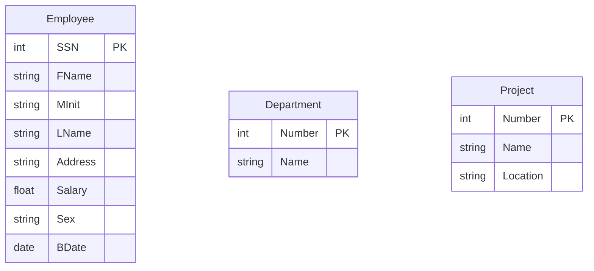
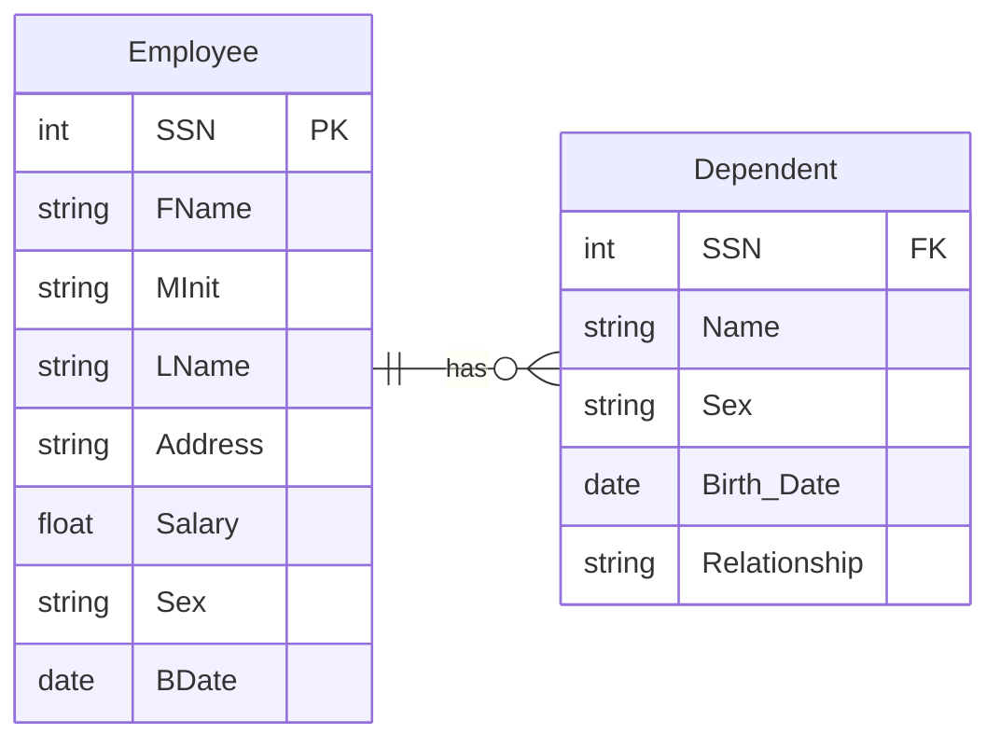
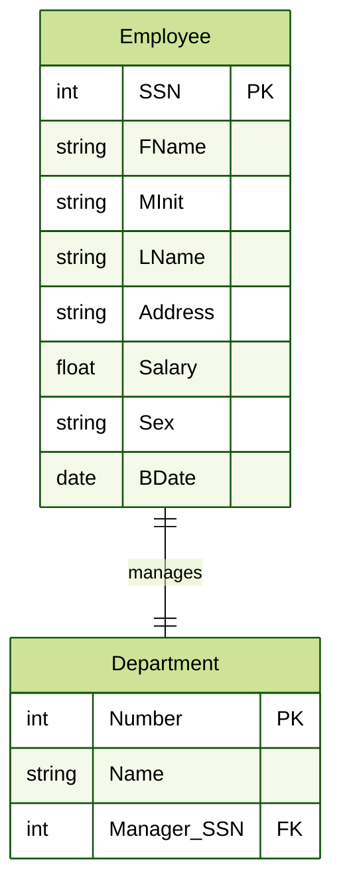
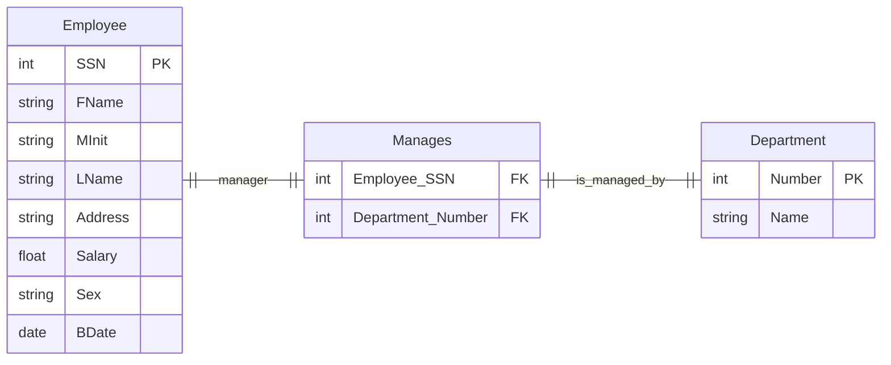
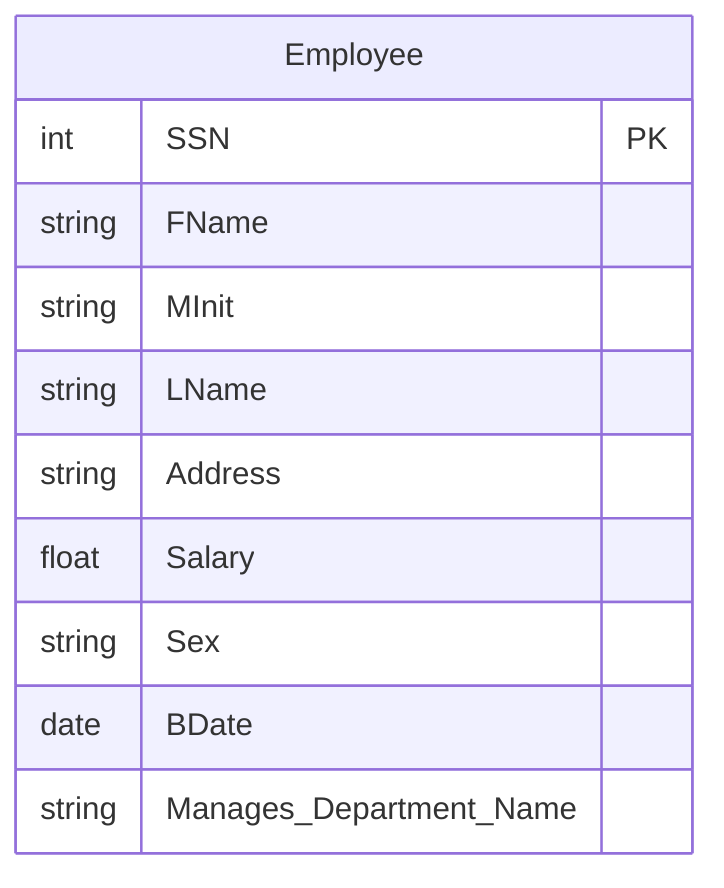
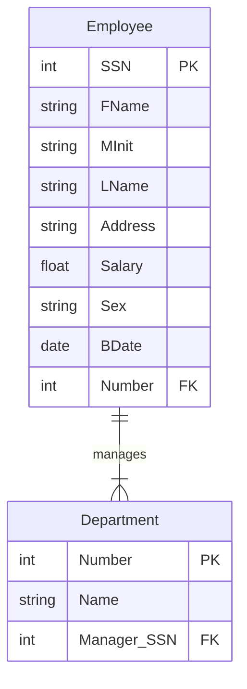
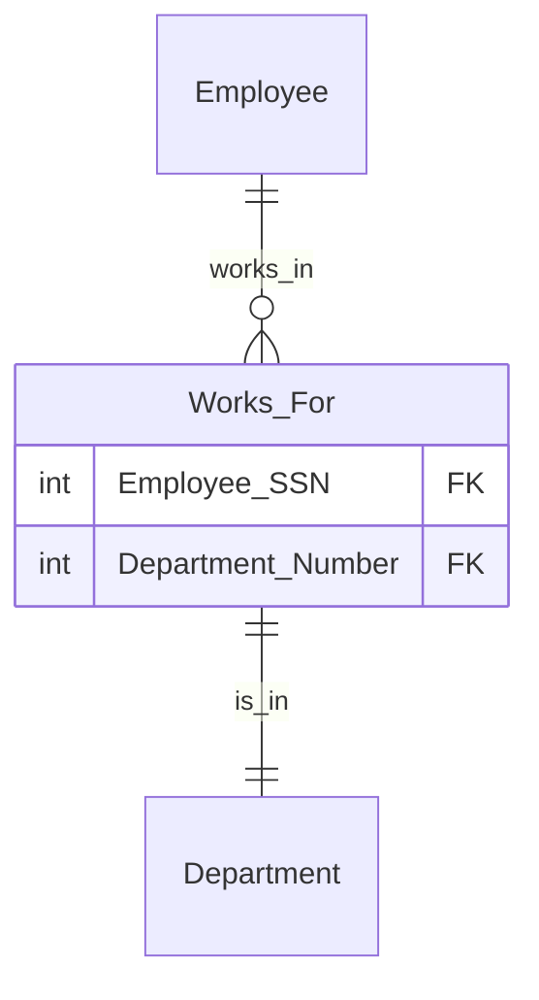
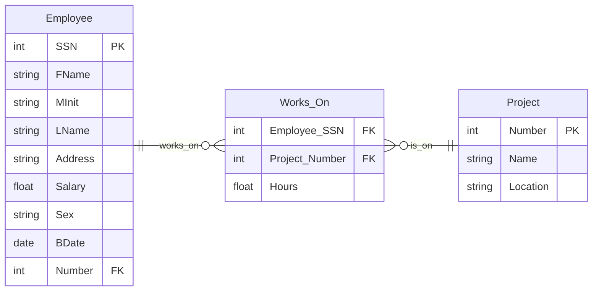
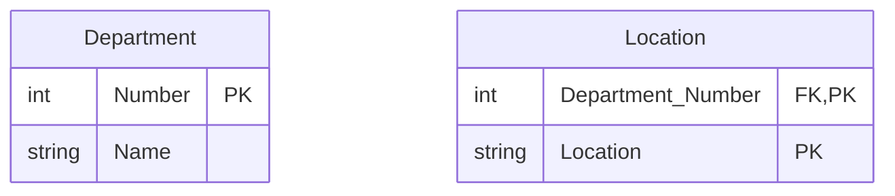
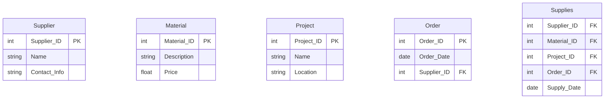

# 1.2 Lenguaje de definición de datos

EL Lenguaje de definición de datos (DDL) es un componente fundamental en la gestión de bases de datos, ya que permite definir y modificar la estructura de las bases de datos. En esta unidad, exploraremos los conceptos clave del DDL, su sintaxis y cómo se aplica en la creación y modificación de esquemas de bases de datos.

Pero antes un repaso de los conceptos básicos de bases de datos que se vieron en el curso anterior, Fundamentos de Bases de Datos.

El proceso de diseño de una base de datos tiene tres fases principales:
1. **Diseño conceptual**: Se define el modelo entidad-relación (ER) que describe las entidades, atributos y relaciones entre ellas.
2. **Diseño lógico**: Se transforma el modelo ER en un esquema lógico, que incluye la definición de tablas, claves primarias y foráneas, y restricciones de integridad.
3. **Diseño físico**: Se implementa el esquema lógico en un sistema de gestión de bases de datos (SGBD) específico, optimizando el almacenamiento y el rendimiento.

El diseño conceptual se abordó en el curso anterior, Fundamentos de Bases de Datos, donde se aprendió a crear un modelo entidad-relación. En esta unidad, nos enfocaremos en el diseño lógico y físico, específicamente en la creación del esquema de la base de datos. Por lo tanto partiremos del modelo ER ya diseñado y nos centraremos en cómo traducirlo a un esquema de base de datos relacional.

Una vez que se tiene este modelo se aplica el algoritmo de mapeo de ER a tablas, que incluye los siguientes pasos:
1. **Mapeo de entidades regulares**: Para cada entidad regular crear una tabla que incluya todos los atributos simples de la entidad. En el caso de los atributos compuestos, se crean columnas separadas para cada atributo simple.

2. **Mapeo de entidades débiles**: Para cada entidad débil, crear una tabla que incluya todos los atributos simples de la entidad y una clave foránea que haga referencia a la entidad fuerte a la que está asociada.

3. **Mapeo de relaciones 1:1**: Para cada relación 1:1, identificar las entidades que participan en la relación. Se tienen diferentes opciones:
   - Incluir la clave primaria de una de las entidades como clave foránea en la otra entidad, de preferencia la que tenga participación total 

>Nota: En una relación 1:1, cualquiera de las dos entidades puede contener la clave foránea que referencia a la otra. La elección depende de factores como la participación. Por ejemplo, si una entidad tiene una participación total en la relación, es lógico que contenga la clave foránea. Si ambas entidades tienen participación total, se puede elegir cualquiera de las dos.

   - Crear una tabla intermedia que contenga las claves primarias de ambas entidades. Es dificil garantizar la participación total de las entidades en la relación.

   - Integrar en una de las entidades a la otra, añadiendo los atributos de la relación como columnas en la tabla de esa entidad. Si ambas entidades participan en otras relaciones, esta opción no es recomendable.

>Nota: Úsela solo cuando la entidad asimilada no tenga otras relaciones, de no ser así esta opción puede llevar a redundancia y problemas de integridad si no se maneja cuidadosamente.

1. **Mapeo de relaciones 1:N**: Para cada relación 1:N, identificar las entidades que participan en la relación. Se debe incluir la clave primaria de la entidad del lado "N" como clave foránea en la entidad del lado "1". Incluya los atributos de la relación como columnas en la tabla de la entidad del lado "N". 
   Enfoque alternativo: Crear una tabla intermedia que contenga las claves primarias de ambas entidades. Esta opción es útil si la relación tiene atributos adicionales.

2. **Mapeo de relaciones N:M**: Para cada relación N:M, crear una tabla que contenga las claves primarias de ambas entidades como claves foráneas. Esta tabla puede incluir también atributos adicionales de la relación.

3. **Mapeo de atributos multivaluados**: Para cada atributo multivaluado, crear una tabla separada que contenga la clave primaria de la entidad a la que pertenece y los valores del atributo multivaluado. Esta tabla debe tener una clave primaria compuesta por la clave foránea de la entidad y el valor del atributo multivaluado.

  
4. **Mapeo de relaciones n-arias**: Para cada relación n-aria, crear una tabla que contenga las claves primarias de todas las entidades involucradas como claves foráneas. Esta tabla puede incluir también atributos adicionales de la relación. Como nuestro modelo no contiene relaciones n-arias, usaremos otro ejemplo. Suponga que un proveedor surte cierto material para un proyecto específico según una orden de compra. Por simplicidad no consideraremos atributos adicionales en las entidades.

En algunas ocasiones, una relación n-aria puede ser descompuesta en múltiples relaciones binarias si esto simplifica el diseño y no se pierden restricciones de integridad importantes. Sin embargo, esta descomposición debe hacerse con cuidado para evitar la pérdida de información o la introducción de redundancias.

5. **Opciones para mapeo de generalización/especialización**: 
   - **Opción 8A**: Multiples tablas, para la superclase y una para cada subclase. Cada tabla de especialización incluye una clave foránea que hace referencia a la entidad general. 
     - Para cualquier tipo de especialización
   - **Opción 8B**: Multiples tablas, solo se crean tablas  para cada subclase. La tabla de la superclase no se crea,    
     - Las subclases son totales
     - Las subclases son disjuntas
   - **Opción 8C**: Una sola tabla, que incluye todos los atributos de la superclase y las subclases. Se utiliza un atributo discriminador para identificar a qué subclase pertenece cada registro.
     - Las subclases son disjuntas
     - Potencial de generar muchos `null` si las subclases tienen muchos atributos especificos
   - **Opción 8D**: Una sola tabla, que incluye todos los atributos de la superclase y las subclases. Se utilizan multiples atributos `tipo`  para identificar a qué subclases pertenece cada registro. 
     - Las subclases se traslapan
     - También funciona cuando las subclases son disjuntas
  
