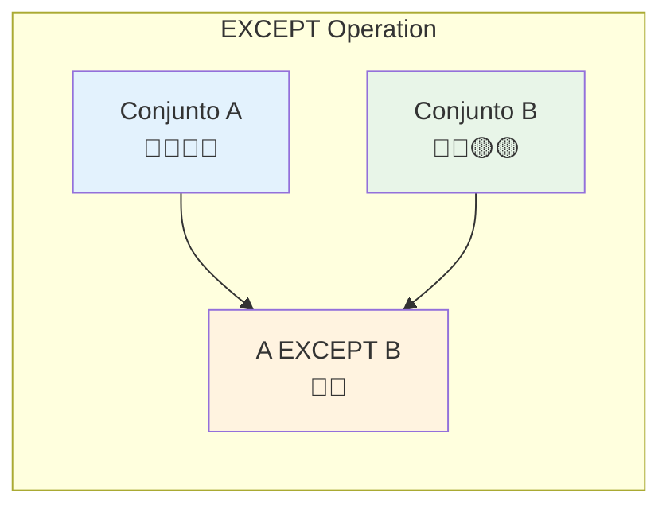
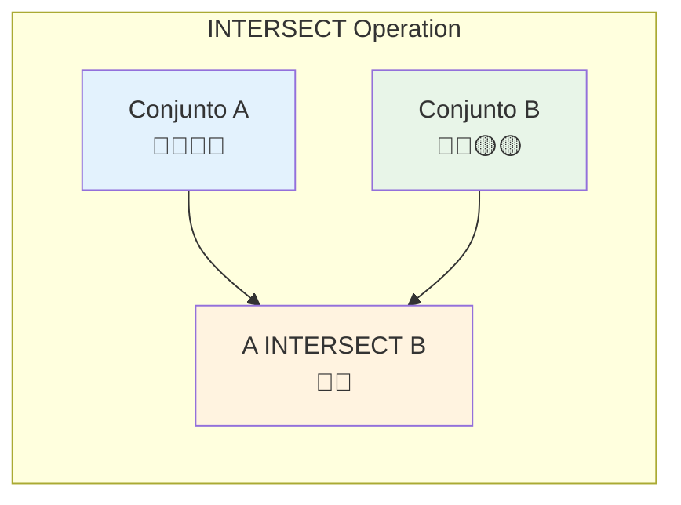
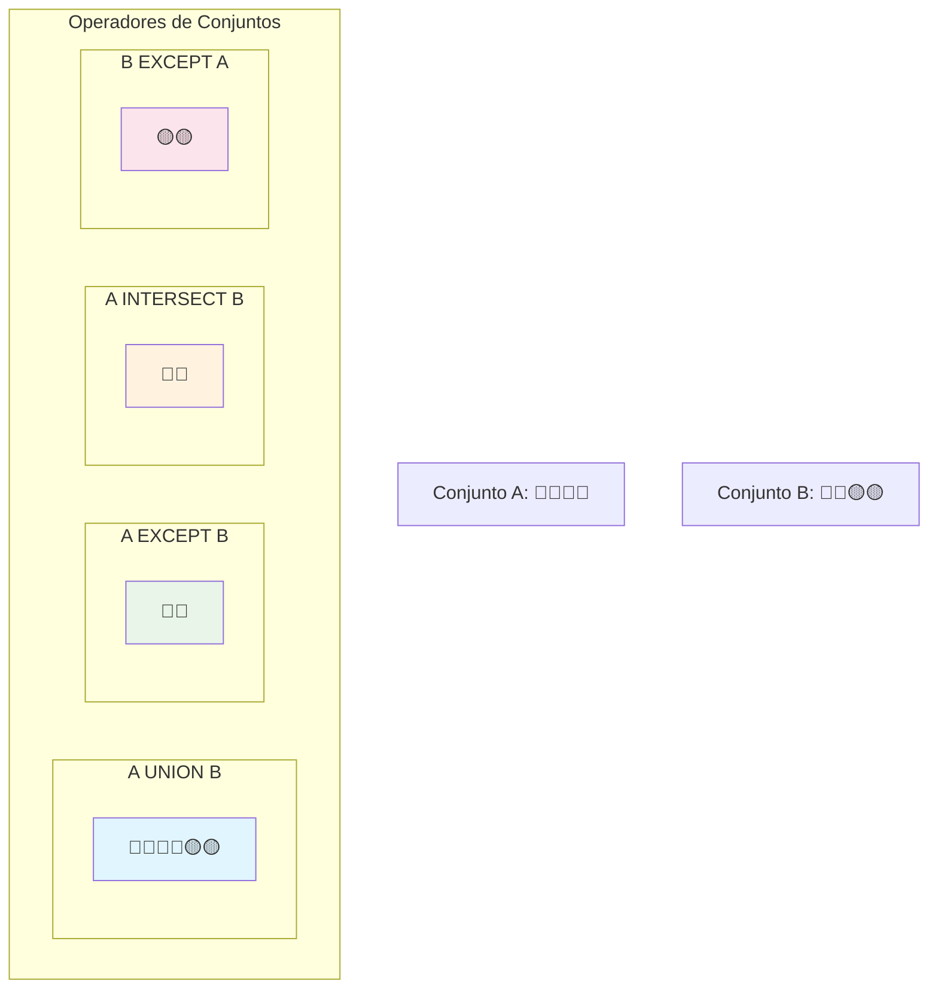

# Operadodes de conjuntos

## Introducción
En SQL, los operadores de conjuntos permiten combinar y comparar resultados de múltiples consultas SELECT siguiendo la lógica de los conjuntos matemáticos. En este tema se abordan:

- UNION y UNION ALL: combinan resultados; UNION elimina duplicados, UNION ALL los conserva.
- EXCEPT: devuelve filas presentes en el primer conjunto que no están en el segundo.
- INTERSECT: devuelve solo las filas comunes a ambos conjuntos.

Requisitos clave para utilizarlos correctamente:
- Mismo número y orden de columnas en cada SELECT.
- Tipos de datos compatibles por posición.
- Un único ORDER BY al final del conjunto (si se requiere).

La elección del operador afecta unicidad, rendimiento y claridad del análisis (auditorías, validación cruzada, segmentación). A continuación se presentan reglas, ejemplos y buenas prácticas para su uso efectivo.

## Operadores UNION

### UNION vs UNION ALL

#### UNION
- **Combina resultados** de múltiples consultas
- **Elimina duplicados** automáticamente
- Requiere mismo número y tipo de columnas

#### UNION ALL
- **Combina resultados** de múltiples consultas
- **Mantiene todos los registros**, incluyendo duplicados
- Mejor rendimiento que UNION

### Ejemplo UNION

```sql
USE northwind;
SELECT firstname + ' ' + lastname AS name, 
       city, 
       postalcode
FROM employees
UNION
SELECT companyname, 
       city, 
       postalcode
FROM customers;
```

### Reglas para UNION

1. **Mismo número de columnas** en cada SELECT
2. **Tipos de datos compatibles** en columnas correspondientes
3. **Mismo orden** de columnas
4. Solo un **ORDER BY** al final (opcional)

### Cuándo Usar Cada Uno

| Escenario | Usar |
|-----------|------|
| Necesitas eliminar duplicados | UNION |
| Quieres todos los registros | UNION ALL |
| Reportes de rendimiento crítico | UNION ALL |
| Análisis de datos únicos | UNION |

---

## Operador EXCEPT

### Concepto

El operador **EXCEPT** devuelve las filas del primer conjunto de resultados que **no están presentes** en el segundo conjunto de resultados. Es equivalente a la operación de **diferencia** en teoría de conjuntos.

### Características

- **Elimina duplicados** automáticamente (como UNION)
- Devuelve solo las filas únicas del primer SELECT
- El orden de las consultas **importa**: `A EXCEPT B ≠ B EXCEPT A`
- Sigue las mismas reglas de compatibilidad que UNION

### Sintaxis

```sql
SELECT columnas FROM tabla1
EXCEPT
SELECT columnas FROM tabla2;
```

### Ejemplo Práctico

Supongamos que queremos encontrar empleados que **no son** gerentes:

```sql
USE northwind;

-- Todos los empleados
SELECT firstname + ' ' + lastname AS empleado
FROM employees
EXCEPT
-- Empleados que son gerentes (tienen subordinados)
SELECT DISTINCT m.firstname + ' ' + m.lastname
FROM employees e 
INNER JOIN employees m ON e.reportsto = m.employeeid;
```

### Otro Ejemplo: Productos sin Ventas

```sql
-- Productos que nunca se han vendido
SELECT productname
FROM products
EXCEPT
SELECT p.productname
FROM products p
INNER JOIN orderdetails od ON p.productid = od.productid;
```

### Diagrama Conceptual



### Casos de Uso Comunes

- **Auditoría**: Encontrar registros faltantes entre sistemas
- **Análisis de diferencias**: Comparar estados antes/después
- **Limpieza de datos**: Identificar registros huérfanos
- **Reportes de excepciones**: Elementos que no cumplen criterios

---

## Operador INTERSECT

### Concepto

El operador **INTERSECT** devuelve solo las filas que **están presentes en ambos** conjuntos de resultados. Es equivalente a la operación de **intersección** en teoría de conjuntos.

### Características

- **Elimina duplicados** automáticamente
- Devuelve solo las filas comunes entre ambos SELECT
- El orden de las consultas **no importa**: `A INTERSECT B = B INTERSECT A`
- Sigue las mismas reglas de compatibilidad que UNION

### Sintaxis

```sql
SELECT columnas FROM tabla1
INTERSECT
SELECT columnas FROM tabla2;
```

### Ejemplo Práctico

Encontrar ciudades que tienen tanto empleados como clientes:

```sql
USE northwind;

-- Ciudades con empleados
SELECT city FROM employees
INTERSECT
-- Ciudades con clientes
SELECT city FROM customers;
```

### Ejemplo: Productos Populares

```sql
-- Productos que aparecen tanto en pedidos grandes como pequeños
SELECT p.productname
FROM products p
INNER JOIN orderdetails od ON p.productid = od.productid
WHERE od.quantity > 50  -- Pedidos grandes
INTERSECT
SELECT p.productname
FROM products p
INNER JOIN orderdetails od ON p.productid = od.productid
WHERE od.quantity < 10;  -- Pedidos pequeños
```

### Diagrama Conceptual



### Casos de Uso Comunes

- **Análisis de coincidencias**: Elementos comunes entre conjuntos
- **Validación cruzada**: Datos que existen en múltiples fuentes
- **Segmentación**: Clientes que cumplen múltiples criterios
- **Reportes de intersección**: Análisis de overlapping

---

## Comparación de Operadores de Conjuntos

### Tabla Comparativa

| Operador | Descripción | Elimina Duplicados | Orden Importa |
|----------|-------------|-------------------|---------------|
| **UNION** | A ∪ B (Unión) | ✅ Sí | ❌ No |
| **UNION ALL** | A + B (Concatenación) | ❌ No | ❌ No |
| **EXCEPT** | A - B (Diferencia) | ✅ Sí | ✅ Sí |
| **INTERSECT** | A ∩ B (Intersección) | ✅ Sí | ❌ No |

### Diagrama de Venn



### Ejemplo Completo Comparativo

```sql
-- Datos de ejemplo
WITH empleados AS (
    SELECT 'Juan' as nombre, 'Ventas' as depto
    UNION ALL SELECT 'María', 'IT'
    UNION ALL SELECT 'Pedro', 'Ventas'
    UNION ALL SELECT 'Ana', 'RRHH'
),
managers AS (
    SELECT 'Juan' as nombre, 'Ventas' as depto
    UNION ALL SELECT 'Carlos', 'IT'
    UNION ALL SELECT 'Ana', 'RRHH'
)

-- UNION: Todos los nombres únicos
SELECT nombre FROM empleados
UNION
SELECT nombre FROM managers;
-- Resultado: Juan, María, Pedro, Ana, Carlos

-- EXCEPT: Empleados que no son managers
SELECT nombre FROM empleados
EXCEPT
SELECT nombre FROM managers;
-- Resultado: María, Pedro

-- INTERSECT: Personas que son tanto empleados como managers
SELECT nombre FROM empleados
INTERSECT
SELECT nombre FROM managers;
-- Resultado: Juan, Ana
```

---

## Reglas Generales para Operadores de Conjuntos

### Requisitos de Compatibilidad

1. **Número de columnas**: Debe ser **idéntico** en todas las consultas
2. **Tipos de datos**: Deben ser **compatibles** en cada posición
3. **Orden de columnas**: Debe **coincidir** en todas las consultas
4. **Nombres de columnas**: Se toman del **primer SELECT**

### Ejemplo de Incompatibilidad

```sql
-- ❌ ERROR: Diferente número de columnas
SELECT firstname, lastname FROM employees
UNION
SELECT city FROM customers;

-- ❌ ERROR: Tipos incompatibles
SELECT employeeid FROM employees  -- int
UNION
SELECT customername FROM customers;  -- varchar

-- ✅ CORRECTO: Estructura compatible
SELECT firstname + ' ' + lastname as nombre, city
FROM employees
UNION
SELECT contactname, city
FROM customers;
```

### Consideraciones de Rendimiento

| Operador | Rendimiento | Uso de Índices | Recomendación |
|----------|-------------|----------------|---------------|
| **UNION ALL** | ⚡ Más rápido | ✅ Aprovecha | Usar cuando no necesites eliminar duplicados |
| **UNION** | 🐌 Más lento | ✅ Aprovecha | Usar cuando necesites datos únicos |
| **EXCEPT** | 🐌 Medio | ⚠️ Parcial | Optimizar con índices en columnas de comparación |
| **INTERSECT** | 🐌 Medio | ⚠️ Parcial | Considerar INNER JOIN como alternativa |

---

## Ejercicios Prácticos

### Ejercicio 1: UNION
Crear una lista unificada de nombres de empleados y nombres de contacto de clientes.

```sql
-- Tu código aquí
```

### Ejercicio 2: EXCEPT
Encontrar productos que no han sido pedidos nunca.

```sql
-- Tu código aquí
```

### Ejercicio 3: INTERSECT
Encontrar ciudades que tienen tanto empleados como clientes.

```sql
-- Tu código aquí
```

### Ejercicio 4: Combinado
Usando los tres operadores, crear un reporte que muestre:
- Empleados que no son gerentes
- Ciudades comunes entre empleados y clientes
- Lista unificada de países de empleados y clientes

```sql
-- Tu código aquí
```

## Soluciones

<details>
<summary>Ver Soluciones</summary>

### Solución 1: UNION
```sql
SELECT firstname + ' ' + lastname AS nombre, 'Empleado' as tipo
FROM employees
UNION
SELECT contactname, 'Cliente'
FROM customers
ORDER BY nombre;
```

### Solución 2: EXCEPT
```sql
SELECT productname
FROM products
EXCEPT
SELECT DISTINCT p.productname
FROM products p
INNER JOIN orderdetails od ON p.productid = od.productid;
```

### Solución 3: INTERSECT
```sql
SELECT city
FROM employees
INTERSECT
SELECT city
FROM customers;
```

### Solución 4: Combinado
```sql
-- Empleados que no son gerentes
SELECT firstname + ' ' + lastname AS empleado_no_gerente
FROM employees
EXCEPT
SELECT DISTINCT m.firstname + ' ' + m.lastname
FROM employees e 
INNER JOIN employees m ON e.reportsto = m.employeeid;

-- Ciudades comunes
SELECT city AS ciudad_comun
FROM employees
INTERSECT
SELECT city
FROM customers;

-- Países unificados
SELECT country AS pais, 'Empleado' as fuente
FROM employees
UNION
SELECT country, 'Cliente'
FROM customers
ORDER BY pais;
```

</details>

---

## Resumen y Mejores Prácticas

### Conceptos Clave

1. **UNION**: Combina y elimina duplicados
2. **UNION ALL**: Combina manteniendo duplicados (más rápido)
3. **EXCEPT**: Diferencia entre conjuntos (A - B)
4. **INTERSECT**: Intersección entre conjuntos (A ∩ B)

### Cuándo Usar Cada Operador

- **UNION**: Cuando necesites una lista unificada sin duplicados
- **UNION ALL**: Para concatenación simple y rápida
- **EXCEPT**: Para encontrar elementos faltantes o diferencias
- **INTERSECT**: Para encontrar elementos comunes

### Optimización

1. **Usa UNION ALL** cuando no necesites eliminar duplicados
2. **Crea índices** en columnas utilizadas en comparaciones
3. **Filtra datos** antes de aplicar operadores de conjuntos
4. **Considera alternativas** como JOIN cuando sea más eficiente

### Errores Comunes

- ❌ Diferente número de columnas entre consultas
- ❌ Tipos de datos incompatibles
- ❌ Usar UNION cuando UNION ALL es suficiente
- ❌ No considerar el orden en EXCEPT
- ❌ Olvidar que todos eliminan duplicados excepto UNION ALL

---

*📚 Siguiente tema: Subconsultas y Expresiones de Tabla Común (CTEs)*