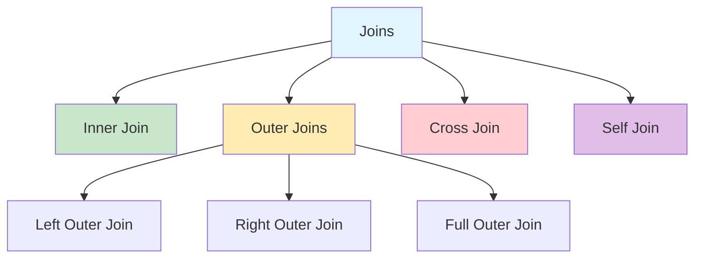
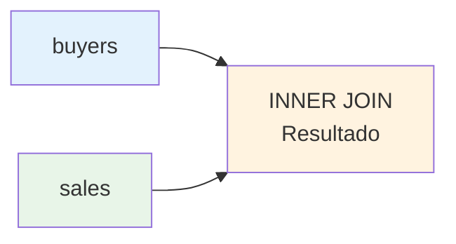
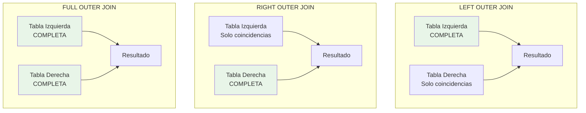
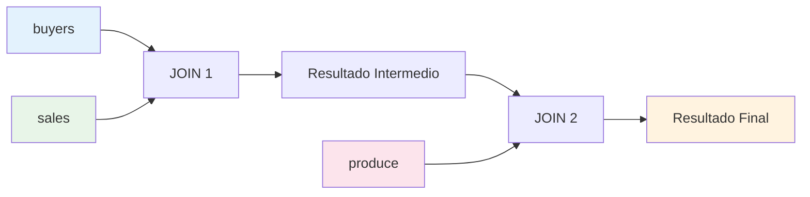

# Consultando Múltiples Tablas - Joins en SQL

## Índice
1. [Introducción a los Joins](#introducción-a-los-joins)
2. [Inner Joins](#inner-joins)
3. [Outer Joins](#outer-joins)
4. [Cross Joins](#cross-joins)
5. [Joins con Múltiples Tablas](#joins-con-múltiples-tablas)
6. [Self Joins](#self-joins)
7. [Operadores UNION](#operadores-union)
8. [Creación de Tablas desde Resultados](#creación-de-tablas-desde-resultados)
9. [Ejercicios Prácticos](#ejercicios-prácticos)

---

## Introducción a los Joins

### ¿Qué es un Join?

Un **Join** es una operación que permite **combinar datos de múltiples tablas** en una sola consulta, basándose en una relación entre las columnas de dichas tablas.

### Componentes de un Join

```sql
SELECT columnas
FROM tabla1 JOIN tabla2
ON condición_de_unión
```

- **SELECT**: Especifica las columnas de múltiples tablas que queremos mostrar
- **JOIN**: Especifica qué tablas participan en la consulta
- **ON**: Define la condición que relaciona las tablas (normalmente usando llaves primarias y foráneas)

### Tipos de Joins



### Base de Datos de Ejemplo

Para los ejemplos utilizaremos la base de datos `joindb` con las siguientes tablas:

#### Tabla: buyers
| buyer_id | buyer_name  |
|----------|-------------|
| 1        | Adam Barr   |
| 2        | Sean Chai   |
| 3        | Eva Corets  |
| 4        | Erin O'Melia|

#### Tabla: sales
| buyer_id | prod_id | qty  |
|----------|---------|------|
| 1        | 1       | 4    |
| 3        | 2       | 3    |
| 1        | 5       | 15   |
| 5        | 37      | 11   |
| 4        | 2       | 1003 |

#### Tabla: produce
| prod_id | prod_name |
|---------|-----------|
| 1       | Apples    |
| 2       | Pears     |
| 3       | Oranges   |
| 4       | Bananas   |
| 5       | Peaches   |

---

## Inner Joins

### Concepto

El **INNER JOIN** devuelve únicamente los registros que tienen **coincidencias en ambas tablas**. Es el tipo de join más común y restrictivo.

### Sintaxis

```sql
SELECT columnas
FROM tabla1 INNER JOIN tabla2
ON tabla1.columna = tabla2.columna
```

### Ejemplo Práctico

```sql
USE joindb;
SELECT buyer_name, sales.buyer_id, qty
FROM buyers INNER JOIN sales
ON buyers.buyer_id = sales.buyer_id;
```

### Resultado del Inner Join

| buyer_name   | buyer_id | qty  |
|--------------|----------|------|
| Adam Barr    | 1        | 4    |
| Adam Barr    | 1        | 15   |
| Eva Corets   | 3        | 3    |
| Erin O'Melia | 4        | 1003 |

### Diagrama Conceptual



**Nota importante:** El buyer_id 2 (Sean Chai) no aparece en el resultado porque no tiene ventas registradas. El buyer_id 5 en sales no aparece porque no existe en la tabla buyers.

---

## Outer Joins

### Concepto

Los **OUTER JOINS** incluyen registros que **no tienen coincidencias** en una o ambas tablas, rellenando con valores NULL donde no hay datos.

SQL Server soporta tres tipos de outer joins:

1. **LEFT OUTER JOIN**
2. **RIGHT OUTER JOIN** 
3. **FULL OUTER JOIN**

### Left Outer Join

#### Definición
Incluye **todos los registros de la tabla izquierda** y solo los registros coincidentes de la tabla derecha.

#### Ejemplo

```sql
USE joindb;
SELECT buyer_name, sales.buyer_id, qty
FROM buyers LEFT OUTER JOIN sales
ON buyers.buyer_id = sales.buyer_id;
```

#### Resultado

| buyer_name   | buyer_id | qty  |
|--------------|----------|------|
| Adam Barr    | 1        | 4    |
| Adam Barr    | 1        | 15   |
| Sean Chai    | NULL     | NULL |
| Eva Corets   | 3        | 3    |
| Erin O'Melia | 4        | 1003 |

**Observación:** Sean Chai aparece con valores NULL porque no tiene ventas registradas.

### Right Outer Join

#### Definición
Incluye **todos los registros de la tabla derecha** y solo los registros coincidentes de la tabla izquierda.

#### Ejemplo

```sql
USE joindb;
SELECT buyer_name, sales.buyer_id, qty
FROM buyers RIGHT OUTER JOIN sales
ON buyers.buyer_id = sales.buyer_id;
```

### Full Outer Join

#### Definición
Incluye **todos los registros de ambas tablas**, mostrando NULL donde no hay coincidencias.

#### Ejemplo

```sql
USE joindb;
SELECT buyer_name, sales.buyer_id, qty
FROM buyers FULL OUTER JOIN sales
ON buyers.buyer_id = sales.buyer_id;
```

### Diagrama Comparativo de Outer Joins



---

## Cross Joins

### Concepto

El **CROSS JOIN** produce el **producto cartesiano** de dos tablas, combinando cada fila de la primera tabla con cada fila de la segunda tabla.

### Sintaxis

```sql
SELECT columnas
FROM tabla1 CROSS JOIN tabla2
```

### Ejemplo

```sql
USE joindb;
SELECT buyer_name, qty
FROM buyers CROSS JOIN sales;
```

### Resultado (Muestra parcial)

| buyer_name   | qty  |
|--------------|------|
| Adam Barr    | 4    |
| Adam Barr    | 3    |
| Adam Barr    | 15   |
| Adam Barr    | 11   |
| Adam Barr    | 1003 |
| Sean Chai    | 4    |
| Sean Chai    | 3    |
| Sean Chai    | 15   |
| ...          | ...  |

### Cálculo del Resultado

- **Tabla buyers**: 4 filas
- **Tabla sales**: 5 filas
- **Resultado**: 4 × 5 = **20 filas**

### ⚠️ Precaución

Los CROSS JOINS pueden generar **resultados muy grandes**. Una tabla de 1000 filas con otra de 1000 filas producirá 1,000,000 de filas.

---

## Joins con Múltiples Tablas

### Concepto

Puedes combinar **más de dos tablas** en una sola consulta encadenando múltiples operaciones JOIN.

### Ejemplo con Tres Tablas

```sql
SELECT buyer_name, prod_name, qty
FROM buyers 
    JOIN sales ON buyers.buyer_id = sales.buyer_id
    JOIN produce ON sales.prod_id = produce.prod_id;
```

### Resultado

| buyer_name   | prod_name | qty  |
|--------------|-----------|------|
| Adam Barr    | Apples    | 4    |
| Adam Barr    | Peaches   | 15   |
| Eva Corets   | Pears     | 3    |
| Erin O'Melia | Pears     | 1003 |

### Diagrama de Flujo del Join Múltiple



### Mejores Prácticas

1. **Orden de las tablas**: Coloca primero las tablas con menos registros
2. **Índices**: Asegúrate de tener índices en las columnas de join
3. **Filros WHERE**: Aplica filtros lo más pronto posible para reducir el conjunto de datos

---

## Self Joins

### Concepto

Un **Self Join** es una operación donde una tabla se une **consigo misma**. Es útil para encontrar relaciones dentro de la misma tabla.

### Ejemplo: Compradores que Compran el Mismo Producto

```sql
USE joindb;
SELECT a.buyer_id AS buyer1, 
       a.prod_id,
       b.buyer_id AS buyer2
FROM sales a JOIN sales b
ON a.prod_id = b.prod_id
WHERE a.buyer_id > b.buyer_id;
```

### Resultado

| buyer1 | prod_id | buyer2 |
|--------|---------|--------|
| 4      | 2       | 3      |

### Explicación del Self Join

1. **Alias obligatorios**: Se usan `a` y `b` para diferenciar las instancias de la tabla
2. **Condición ON**: `a.prod_id = b.prod_id` encuentra productos comprados por múltiples buyers
3. **Condición WHERE**: `a.buyer_id > b.buyer_id` evita duplicados y pares consigo mismo

### Casos de Uso Comunes

- Encontrar empleados que reportan al mismo jefe
- Identificar productos en la misma categoría
- Comparar precios históricos
- Detectar relaciones jerárquicas

---


## Creación de Tablas desde Resultados

### SELECT INTO

La instrucción **SELECT INTO** permite crear una nueva tabla basada en el resultado de una consulta.

### Sintaxis

```sql
SELECT columnas
INTO nueva_tabla
FROM tablas_origen
WHERE condiciones;
```

### Ejemplo

```sql
USE northwind;
SELECT productname AS products,
       unitprice AS price,
       (unitprice * 1.1) AS tax
INTO #pricetable
FROM products;
```

### Tipos de Tablas

| Prefijo | Tipo | Alcance | Permanencia |
|---------|------|---------|-------------|
| # | Temporal local | Sesión actual | Automática eliminación |
| ## | Temporal global | Todas las sesiones | Manual o automática |
| Ninguno | Permanente | Base de datos | Manual |

### Consideraciones

- **Nombres únicos**: La tabla destino no debe existir
- **Permisos**: Se requieren permisos de creación
- **Índices**: No se copian los índices originales
- **Restricciones**: No se copian las restricciones

---

## Ejercicios Prácticos

### Ejercicio 1: Inner Join Básico
Obtener el nombre del comprador y la cantidad total de productos comprados por cada uno.

```sql
-- Tu código aquí
```

### Ejercicio 2: Left Outer Join
Mostrar todos los compradores, incluyendo aquellos que no han realizado compras.

```sql
-- Tu código aquí
```

### Ejercicio 3: Múltiples Joins
Crear un reporte que muestre: nombre del comprador, nombre del producto y cantidad comprada.

```sql
-- Tu código aquí
```

### Ejercicio 4: Self Join
Encontrar parejas de compradores que han comprado el mismo producto.

```sql
-- Tu código aquí
```

### Ejercicio 5: UNION
Combinar información de empleados y clientes mostrando nombre y ciudad.

```sql
-- Tu código aquí
```

## Soluciones

<details>
<summary>Ver Soluciones</summary>

### Solución 1
```sql
SELECT buyer_name, SUM(qty) as total_qty
FROM buyers INNER JOIN sales
ON buyers.buyer_id = sales.buyer_id
GROUP BY buyer_name;
```

### Solución 2
```sql
SELECT buyer_name, ISNULL(qty, 0) as qty
FROM buyers LEFT OUTER JOIN sales
ON buyers.buyer_id = sales.buyer_id;
```

### Solución 3
```sql
SELECT buyer_name, prod_name, qty
FROM buyers 
    INNER JOIN sales ON buyers.buyer_id = sales.buyer_id
    INNER JOIN produce ON sales.prod_id = produce.prod_id;
```

### Solución 4
```sql
SELECT DISTINCT a.buyer_id, b.buyer_id, a.prod_id
FROM sales a JOIN sales b
ON a.prod_id = b.prod_id
WHERE a.buyer_id < b.buyer_id;
```

### Solución 5
```sql
SELECT firstname + ' ' + lastname AS name, city
FROM employees
UNION
SELECT companyname, city
FROM customers;
```

</details>

---

## Resumen y Conceptos Clave

### Puntos Importantes a Recordar

1. **INNER JOIN**: Solo coincidencias exactas
2. **LEFT/RIGHT JOIN**: Incluye todos de una tabla + coincidencias
3. **FULL JOIN**: Incluye todos de ambas tablas
4. **CROSS JOIN**: Producto cartesiano (usar con precaución)
5. **Self JOIN**: Tabla consigo misma (requiere alias)
6. **UNION**: Combina resultados eliminando duplicados
7. **UNION ALL**: Combina resultados manteniendo duplicados

### Optimización de Rendimiento

- Usa **índices** en columnas de join
- Aplica **filtros WHERE** temprano
- Considera el **orden de las tablas**
- Evita **CROSS JOINS** innecesarios
- Usa **UNION ALL** cuando no necesites eliminar duplicados

### Errores Comunes

- ❌ Olvidar la condición ON en joins
- ❌ No usar alias en self joins
- ❌ Mezclar tipos de datos incompatibles en UNION
- ❌ Usar CROSS JOIN cuando necesitas INNER JOIN
- ❌ No considerar valores NULL en outer joins

---

*📚 Siguiente tema: Subconsultas y Expresiones de Tabla Común (CTEs)*
