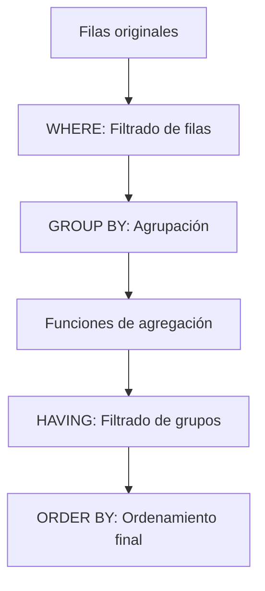

# Consultas de Agregación en SQL

## Índice
1. [¿Qué es la agregación?](#qué-es-la-agregación)
2. [Sintaxis general de consultas de agregación](#sintaxis-general-de-consultas-de-agregación)
3. [Funciones de agregación](#funciones-de-agregación)
4. [Uso de GROUP BY](#uso-de-group-by)
5. [Uso de HAVING](#uso-de-having)
6. [Ejemplos prácticos](#ejemplos-prácticos)
7. [Errores comunes](#errores-comunes)
8. [Resumen visual](#resumen-visual)

---

## ¿Qué es la agregación?

La **agregación** en SQL permite resumir, contar, promediar o calcular valores sobre grupos de datos en una tabla. Es fundamental para reportes, análisis y toma de decisiones.

---

## Sintaxis general de consultas de agregación

```sql
SELECT select_list
FROM table_source
[WHERE search_condition]
[GROUP BY group_by_expression]
[HAVING search_condition]
[ORDER BY order_expression [ASC | DESC]]
```

- **SELECT**: Columnas y funciones de agregación
- **FROM**: Tabla(s) origen
- **WHERE**: Filtro de filas antes de agrupar
- **GROUP BY**: Agrupa filas por una o más columnas
- **HAVING**: Filtro de grupos después de agrupar
- **ORDER BY**: Ordena el resultado final

---

## Funciones de agregación

Las funciones de agregación permiten resumir una columna de resultados:

| Función | Descripción |
|---------|-------------|
| **AVG(expr)** | Promedio de valores (ignora nulos) |
| **COUNT(expr)** | Número de valores no nulos (ignora nulos) |
| **COUNT(*)** | Número total de filas (incluye nulos) |
| **MAX(expr)** | Valor máximo (numérico, texto, fecha) |
| **MIN(expr)** | Valor mínimo (numérico, texto, fecha) |
| **SUM(expr)** | Suma de valores (solo numéricos, ignora nulos) |

**Notas:**
- `DISTINCT` puede usarse con AVG, COUNT, SUM para considerar solo valores únicos.
- MAX y MIN funcionan con texto y fechas, además de números.

---

## Uso de GROUP BY

El **GROUP BY** agrupa filas que tienen el mismo valor en una o más columnas, permitiendo aplicar funciones de agregación a cada grupo.

### Ejemplo básico

Supongamos la tabla `employees`:

| employeeid | lastname   | ciudad      | sueldo |
|------------|------------|-------------|--------|
| 1          | Davolio    | Navolato    | 1000   |
| 2          | Fuller     | Navolato    | 2000   |
| 3          | Leverling  | Navolato    | 500    |
| 4          | Peacock    | Culiacán    | 2000   |
| 5          | Buchanan   | Culiacán    | 700    |
| 6          | Suyama     | Culiacán    | 1000   |
| 7          | King       | Los mochis  | 1500   |
| 8          | Callahan   | Los mochis  | 1500   |
| 9          | Dodsworth  | Los mochis  | 2000   |

#### Sumar sueldos por ciudad

```sql
SELECT ciudad, SUM(sueldo) AS total_sueldos
FROM employees
GROUP BY ciudad;
```

| ciudad     | total_sueldos |
|------------|---------------|
| Navolato   | 3500          |
| Culiacán   | 3700          |
| Los mochis | 5000          |

#### Máximo sueldo por ciudad

```sql
SELECT ciudad, MAX(sueldo) AS mayor_sueldo
FROM employees
GROUP BY ciudad;
```

| ciudad     | mayor_sueldo |
|------------|--------------|
| Navolato   | 2000         |
| Culiacán   | 2000         |
| Los mochis | 2000         |

#### Agrupando por múltiples columnas

```sql
SELECT type, pub_id, AVG(price) AS promedio, SUM(price) AS total
FROM titles
WHERE type IN ('negocios', 'computacion')
GROUP BY type, pub_id;
```

---

## Uso de HAVING

El **HAVING** filtra los grupos generados por GROUP BY, permitiendo mostrar solo aquellos que cumplen una condición sobre la agregación.

### Ejemplo: Filtrar ciudades con suma de sueldos mayor a 4000

```sql
SELECT ciudad, SUM(sueldo) AS total_sueldos
FROM employees
GROUP BY ciudad
HAVING SUM(sueldo) > 4000;
```

| ciudad     | total_sueldos |
|------------|---------------|
| Los mochis | 5000          |

### Ejemplo: Filtrar ciudades con sueldo máximo mayor a 1500

```sql
SELECT ciudad, MAX(sueldo) AS mayor_sueldo
FROM employees
GROUP BY ciudad
HAVING MAX(sueldo) > 1500;
```

| ciudad     | mayor_sueldo |
|------------|--------------|
| Navolato   | 2000         |
| Culiacán   | 2000         |
| Los mochis | 2000         |

---

## Ejemplos prácticos

### Sumar, contar y promediar por grupo

```sql
SELECT ciudad,
       COUNT(*) AS empleados,
       SUM(sueldo) AS total_sueldos,
       AVG(sueldo) AS promedio_sueldo
FROM employees
GROUP BY ciudad;
```

### Agrupación y filtrado avanzado

```sql
SELECT type, pub_id, AVG(price) AS promedio, SUM(price) AS total
FROM titles
WHERE type IN ('negocios', 'computacion')
GROUP BY type, pub_id
HAVING AVG(price) > 300;
```

---

## Errores comunes

- ❌ No incluir todas las columnas no agregadas en el GROUP BY
- ❌ Usar funciones de agregación en WHERE (debe ser en HAVING)
- ❌ GROUP BY con columnas ambiguas o no existentes
- ❌ Olvidar que HAVING filtra grupos, no filas individuales

---

## Resumen visual

### Diagrama de flujo de agregación



---

## Conceptos clave

1. **GROUP BY** agrupa filas para aplicar funciones de agregación
2. **HAVING** filtra los grupos generados
3. Las funciones de agregación resumen datos: SUM, AVG, COUNT, MAX, MIN
4. Es fundamental para reportes y análisis de datos

---

*📚 Siguiente tema: Subconsultas y Operadores de Conjuntos*