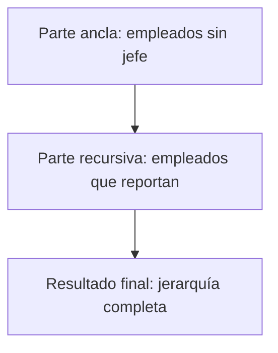
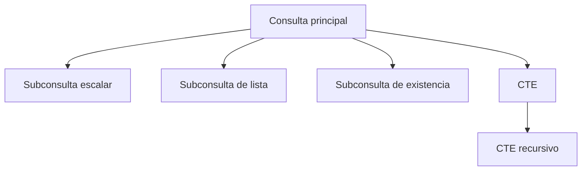

# Subconsultas y Expresiones de Tabla Común (CTE) en SQL

## Índice
1. [¿Qué es una subconsulta?](#qué-es-una-subconsulta)
2. [Tipos de subconsultas](#tipos-de-subconsultas)
3. [Sintaxis y ejemplos](#sintaxis-y-ejemplos)
4. [Subconsultas en instrucciones DML](#subconsultas-en-instrucciones-dml)
5. [Errores y mejores prácticas](#errores-y-mejores-prácticas)
6. [Expresiones de Tabla Común (CTE)](#expresiones-de-tabla-común-cte)
7. [CTE recursivos](#cte-recursivos)
8. [Resumen visual](#resumen-visual)

---

## ¿Qué es una subconsulta?

Una **subconsulta** es una consulta anidada dentro de otra consulta principal. Permite descomponer problemas complejos y obtener resultados que dependen de otros resultados.

**¿Por qué usar subconsultas?**
- Para dividir consultas complejas en partes más simples
- Para obtener valores dinámicos en condiciones
- Para filtrar, insertar, actualizar o borrar datos basados en resultados de otras consultas

**¿Cuándo preferir JOIN sobre subconsulta?**
- Los JOIN suelen ser más eficientes en SQL Server y otros motores modernos
- Subconsultas son útiles cuando la lógica requiere resultados intermedios

---

## Tipos de subconsultas

1. **Subconsulta escalar**: Devuelve un solo valor
2. **Subconsulta de lista**: Devuelve una lista de valores
3. **Subconsulta de existencia**: Verifica si existen filas que cumplen una condición

### Sintaxis general

```sql
-- Subconsulta escalar
SELECT ... WHERE columna = (SELECT ...)

-- Subconsulta de lista
SELECT ... WHERE columna IN (SELECT ...)

-- Subconsulta de existencia
SELECT ... WHERE EXISTS (SELECT ...)
```

---

## Sintaxis y ejemplos

### Subconsulta escalar

```sql
USE northwind;
SELECT orderid, customerid
FROM orders
WHERE orderdate = (SELECT MAX(orderdate) FROM orders);
```

**Explicación:** Devuelve los pedidos realizados en la fecha más reciente.

### Subconsulta de lista

```sql
USE northwind;
SELECT companyname
FROM customers
WHERE customerid IN (
    SELECT customerid
    FROM orders
    WHERE orderdate > '1995-01-01'
);
```

**Explicación:** Devuelve los clientes que han hecho pedidos después de 1995.

### Subconsulta de existencia

```sql
USE pubs;
SELECT pub_name
FROM publishers p
WHERE EXISTS (
    SELECT *
    FROM titles t
    WHERE t.pubid = p.pub_id AND type = 'computacion'
);
```

**Explicación:** Devuelve los nombres de editoriales que tienen títulos de tipo 'computacion'.

---

## Subconsultas en instrucciones DML

Las subconsultas pueden usarse en instrucciones **INSERT**, **DELETE** y **UPDATE** para modificar datos basados en otras tablas.

### INSERT ... SELECT

```sql
INSERT INTO customers
SELECT SUBSTRING(firstname, 1, 3) + SUBSTRING(lastname, 1, 2),
       lastname, firstname, title, address, city, region, postalcode,
       country, homephone, NULL
FROM employees;
```

**Notas:**
- La tabla destino debe existir
- Los tipos de datos deben ser compatibles
- Considera valores por DEFAULT y NULL

### DELETE con subconsulta

```sql
DELETE FROM sales
WHERE title_id IN (
    SELECT title_id
    FROM titles
    WHERE type = 'business'
);
```

### UPDATE con subconsulta

```sql
UPDATE titles
SET price = price * 2
WHERE pub_id IN (
    SELECT pub_id
    FROM publishers
    WHERE pub_name = 'New Moon Books'
);
```

---

## Errores y mejores prácticas

- ❌ Usar subconsultas sobre campos tipo text o image (no permitido)
- ❌ No verificar compatibilidad de tipos de datos
- ❌ No considerar valores por DEFAULT o NULL
- ✅ Encierra siempre la subconsulta entre paréntesis
- ✅ Usa alias para claridad en subconsultas complejas
- ✅ Prefiere JOIN cuando la lógica lo permite para mejor rendimiento

---

## Expresiones de Tabla Común (CTE)

Una **CTE (Common Table Expression)** es una consulta temporal con nombre, definida al inicio de una instrucción SELECT, INSERT, UPDATE o DELETE. Permite estructurar consultas complejas de forma más legible y reutilizable.

### Sintaxis básica

```sql
WITH nombre_cte AS (
    SELECT ...
    FROM ...
    WHERE ...
)
SELECT * FROM nombre_cte;
```

### Ejemplo básico

```sql
WITH empleados_navolato AS (
    SELECT employeeid, lastname, ciudad, sueldo
    FROM employees
    WHERE ciudad = 'Navolato'
)
SELECT * FROM empleados_navolato;
```

**Ventajas de CTE:**
- Mejora la legibilidad de consultas complejas
- Permite reutilizar resultados intermedios
- Facilita la escritura de consultas recursivas

---

## CTE recursivos

Un **CTE recursivo** permite realizar operaciones repetitivas, como recorrer jerarquías o calcular sumas acumulativas.

### Sintaxis general

```sql
WITH cte_recursivo AS (
    -- Parte ancla
    SELECT ...
    FROM ...
    WHERE ...
    UNION ALL
    -- Parte recursiva
    SELECT ...
    FROM ... JOIN cte_recursivo ON ...
)
SELECT * FROM cte_recursivo;
```

### Ejemplo: Jerarquía de empleados

Supongamos la tabla `employees` con los campos `employeeid`, `lastname`, `reportsto` (jefe directo):

```sql
WITH jerarquia AS (
    -- Parte ancla: empleados sin jefe
    SELECT employeeid, lastname, reportsto, 0 AS nivel
    FROM employees
    WHERE reportsto IS NULL
    UNION ALL
    -- Parte recursiva: empleados que reportan a otros
    SELECT e.employeeid, e.lastname, e.reportsto, j.nivel + 1
    FROM employees e
    INNER JOIN jerarquia j ON e.reportsto = j.employeeid
)
SELECT * FROM jerarquia ORDER BY nivel, employeeid;
```

**Explicación:**
- La parte ancla selecciona empleados sin jefe
- La parte recursiva agrega empleados que reportan a los anteriores
- El resultado es una lista jerárquica con niveles

### Diagrama Mermaid de flujo recursivo



---

## Resumen visual

### Diagrama de uso de subconsultas y CTE



---

## Conceptos clave

1. Las subconsultas permiten descomponer problemas complejos
2. Los JOIN suelen ser más eficientes, pero las subconsultas son útiles para lógica dependiente
3. Las CTE mejoran la legibilidad y permiten recursividad
4. Los CTE recursivos son ideales para jerarquías y cálculos acumulativos

---

*📚 Siguiente tema: Operadores de conjuntos y funciones de ventana*