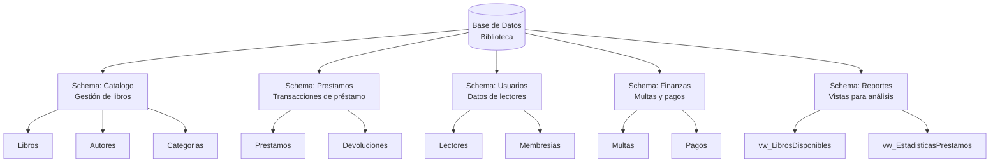

# Proyecto Integrador - Parte 4: Seguridad en Bases de Datos

**Taller de Base de Datos - Unidad 3: Seguridad en Bases de Datos**

---

## Objetivo

Implementar un esquema de seguridad integral en la base de datos del proyecto, aplicando los principios de control de acceso, mínimo privilegio y segregación de funciones mediante la definición de roles, usuarios, schemas y permisos específicos.

**Valor:** 25% de la calificación del proyecto integrador

**Fecha de entrega:** [Definir según calendario]

**Formato de entrega:** Documento PDF + Script SQL

---

## Introducción

La **seguridad de bases de datos** es un aspecto crítico en la administración de sistemas de información. Esta tercera entrega del proyecto se enfoca en **quién tiene acceso a qué datos** y **qué operaciones puede realizar** cada usuario del sistema.

Un esquema de seguridad bien diseñado debe:

- **Proteger la confidencialidad** de datos sensibles
- **Garantizar la integridad** de la información mediante controles de acceso
- **Implementar el principio de mínimo privilegio** (cada usuario solo tiene los permisos estrictamente necesarios)
- **Facilitar la auditoría** de accesos y operaciones realizadas
- **Segregar responsabilidades** para prevenir conflictos de interés

---

## Contexto del Proyecto

Retome el proyecto que ha venido desarrollando en las entregas anteriores:

- **Parte 1:** Modelo Entidad-Relación y normalización (DDL)
- **Parte 2:** Implementación física con DDL y DML (carga de datos)
- **Parte 3:** Consultas SQL de diferentes niveles de complejidad

En esta cuarta parte, agregará la **capa de seguridad** que controlará el acceso a los datos de su sistema.

---

## Actividades a Realizar

### Actividad 1: Análisis de Actores y Casos de Uso (No entregable - Análisis previo)

Antes de implementar la seguridad, debe realizar un análisis completo del sistema:

#### 1.1 Identificación de Actores

Aplicando conceptos de Ingeniería de Software, identifique **todos los actores** que interactúan con su sistema.

**Ejemplo para un Sistema de Biblioteca:**

- **Bibliotecario:** Registra préstamos, devoluciones, multas
- **Usuario/Lector:** Consulta catálogo, reserva libros
- **Administrador de Sistema:** Gestiona usuarios, configuración general
- **Contador:** Genera reportes financieros, audita multas
- **Director:** Consulta estadísticas, reportes ejecutivos

#### 1.2 Definición de Casos de Uso

Para cada actor, documente sus **casos de uso principales**:

**Ejemplo - Actor: Bibliotecario**

- Registrar nuevo préstamo
- Procesar devolución de libro
- Aplicar multa por retraso
- Consultar historial de préstamos de un usuario
- Actualizar datos de libros (estado, ubicación)

**Ejemplo - Actor: Usuario/Lector**

- Consultar catálogo de libros disponibles
- Ver historial personal de préstamos
- Reservar un libro

**Nota:** Este análisis es **interno** y no se entrega, pero es fundamental para las siguientes actividades.

---

### Actividad 2: Mapeo de Actores a Roles de Base de Datos ✓ ENTREGABLE

#### 2.1 Creación de Roles

Transforme los **actores identificados** en **roles de base de datos**.

**Lineamientos:**

- Un rol agrupa permisos relacionados con una función específica
- Los roles deben ser **descriptivos** y seguir una convención de nombres
- Considere crear roles tanto **funcionales** (basados en tareas) como **jerárquicos** (basados en niveles de autoridad)

**Tabla de Mapeo Actores → Roles:**

| Actor | Rol en Base de Datos | Justificación |
|-------|----------------------|---------------|
| Bibliotecario | `bibliotecario` | Operaciones CRUD sobre préstamos, multas, inventario |
| Usuario/Lector | `lector` | Solo lectura de catálogo y datos personales |
| Administrador | `admin_sistema` | Control total sobre usuarios y configuración |
| Contador | `contador` | Lectura de transacciones financieras, generación de reportes |
| Director | `director` | Lectura de todas las tablas para reportes ejecutivos |

#### 2.2 Script SQL de Creación de Roles

**Sintaxis SQL Server:**

```sql
-- Crear roles personalizados
CREATE ROLE bibliotecario;
CREATE ROLE lector;
CREATE ROLE admin_sistema;
CREATE ROLE contador;
CREATE ROLE director;
GO
```

**ENTREGABLE:**

- Tabla completa de mapeo Actores → Roles
- Script SQL con todos los comandos `CREATE ROLE`

---

### Actividad 3: Organización por Schemas (Áreas Funcionales) ✓ ENTREGABLE

#### 3.1 Definición de Áreas Funcionales

Identifique las **áreas funcionales** de su sistema y organice las tablas en **schemas** lógicos.

**¿Qué es un Schema?**

Un schema es un contenedor lógico que agrupa objetos de base de datos (tablas, vistas, procedimientos) relacionados funcionalmente. Facilita:

- Organización lógica de objetos
- Gestión de permisos granular
- Separación de responsabilidades
- Mejor mantenibilidad

**Ejemplo de Schemas para Sistema de Biblioteca:**



#### 3.2 Tabla de Asignación de Objetos a Schemas

| Schema | Objetos incluidos | Descripción |
|--------|-------------------|-------------|
| `Catalogo` | Libros, Autores, Categorias, Editoriales | Gestión del catálogo bibliográfico |
| `Prestamos` | Prestamos, Devoluciones, Reservas | Transacciones de préstamo y devolución |
| `Usuarios` | Lectores, Membresias, Direcciones | Datos de usuarios del sistema |
| `Finanzas` | Multas, Pagos, HistorialFinanciero | Gestión económica |
| `Reportes` | vw_LibrosDisponibles, vw_ReporteMensual | Vistas para consultas y análisis |

#### 3.3 Script SQL de Creación de Schemas

**Sintaxis SQL Server:**

```sql
-- Crear schemas por área funcional
CREATE SCHEMA Catalogo AUTHORIZATION dbo;
CREATE SCHEMA Prestamos AUTHORIZATION dbo;
CREATE SCHEMA Usuarios AUTHORIZATION dbo;
CREATE SCHEMA Finanzas AUTHORIZATION dbo;
CREATE SCHEMA Reportes AUTHORIZATION dbo;
GO

-- Ejemplo de asignación de tabla existente a schema
-- (si las tablas ya existen en dbo)
ALTER SCHEMA Catalogo TRANSFER dbo.Libros;
ALTER SCHEMA Catalogo TRANSFER dbo.Autores;
ALTER SCHEMA Prestamos TRANSFER dbo.Prestamos;
-- ... continuar para todas las tablas
GO
```

**ENTREGABLE:**

- Tabla completa de asignación de objetos a schemas
- Diagrama de organización por schemas
- Script SQL con comandos `CREATE SCHEMA` y `ALTER SCHEMA TRANSFER`

---

### Actividad 4: Asignación de Permisos (Principio de Mínimo Privilegio) ✓ ENTREGABLE

#### 4.1 Matriz de Permisos

Defina **qué permisos** tiene cada rol sobre cada objeto de base de datos.

**Principio de Mínimo Privilegio:**

> Cada rol debe tener **únicamente los permisos estrictamente necesarios** para cumplir sus funciones, ni más ni menos.

**Tabla de Permisos por Rol y Schema:**

| Rol | Schema Catalogo | Schema Prestamos | Schema Usuarios | Schema Finanzas | Schema Reportes |
|-----|-----------------|------------------|-----------------|-----------------|-----------------|
| `bibliotecario` | SELECT, UPDATE | SELECT, INSERT, UPDATE, DELETE | SELECT | SELECT, INSERT, UPDATE | SELECT |
| `lector` | SELECT | SELECT (solo sus préstamos) | SELECT (solo sus datos) | SELECT (solo sus multas) | - |
| `admin_sistema` | CONTROL | CONTROL | CONTROL | CONTROL | CONTROL |
| `contador` | SELECT | SELECT | - | SELECT, INSERT, UPDATE | SELECT |
| `director` | SELECT | SELECT | SELECT | SELECT | SELECT |

**Leyenda de permisos:**

- **SELECT:** Consultar datos
- **INSERT:** Insertar nuevos registros
- **UPDATE:** Modificar registros existentes
- **DELETE:** Eliminar registros
- **CONTROL:** Control total (incluye todos los anteriores + permisos sobre estructura)

#### 4.2 Permisos Específicos por Objeto

Para mayor granularidad, puede definir permisos a nivel de **tablas o vistas individuales**:

**Ejemplo detallado - bibliotecario:**

| Objeto | Permiso | Justificación |
|--------|---------|---------------|
| `Catalogo.Libros` | SELECT, UPDATE | Puede consultar y actualizar estado/ubicación |
| `Prestamos.Prestamos` | SELECT, INSERT, UPDATE | Registra préstamos, pero no puede eliminarlos |
| `Prestamos.Devoluciones` | SELECT, INSERT | Registra devoluciones |
| `Finanzas.Multas` | SELECT, INSERT, UPDATE | Aplica multas, consulta estado |
| `Usuarios.Lectores` | SELECT | Solo consulta datos de lectores |

**Ejemplo detallado - lector:**

| Objeto | Permiso | Restricción |
|--------|---------|-------------|
| `Reportes.vw_LibrosDisponibles` | SELECT | Vista pública de catálogo |
| `Prestamos.Prestamos` | SELECT | Solo registros propios (filtrado por UserID) |
| `Usuarios.Lectores` | SELECT | Solo su propio registro |

#### 4.3 Script SQL de Asignación de Permisos

**Sintaxis SQL Server:**

```sql
-- Permisos para bibliotecario

-- Permisos sobre schema Catalogo
GRANT SELECT, UPDATE ON SCHEMA::Catalogo TO bibliotecario;

-- Permisos sobre schema Prestamos
GRANT SELECT, INSERT, UPDATE, DELETE ON SCHEMA::Prestamos TO bibliotecario;

-- Permisos sobre schema Usuarios (solo lectura)
GRANT SELECT ON SCHEMA::Usuarios TO bibliotecario;

-- Permisos sobre schema Finanzas
GRANT SELECT, INSERT, UPDATE ON SCHEMA::Finanzas TO bibliotecario;

-- Permisos sobre schema Reportes
GRANT SELECT ON SCHEMA::Reportes TO bibliotecario;
GO

-- Permisos para lector (muy restringidos)

-- Solo lectura de catálogo a través de vista pública
GRANT SELECT ON Reportes.vw_LibrosDisponibles TO lector;

-- Lectura de sus propios préstamos (se implementa con vistas filtradas o RLS)
GRANT SELECT ON Reportes.vw_MisPrestamos TO lector;

-- Lectura de sus propios datos
GRANT SELECT ON Reportes.vw_MiPerfil TO lector;
GO

-- Permisos para admin_sistema (control total)
GRANT CONTROL ON DATABASE::Biblioteca TO admin_sistema;
GO

-- Permisos para contador
GRANT SELECT ON SCHEMA::Finanzas TO contador;
GRANT SELECT ON SCHEMA::Prestamos TO contador;
GRANT SELECT ON SCHEMA::Reportes TO contador;
GO

-- Permisos para director (solo lectura ejecutiva)
GRANT SELECT ON SCHEMA::Catalogo TO director;
GRANT SELECT ON SCHEMA::Prestamos TO director;
GRANT SELECT ON SCHEMA::Usuarios TO director;
GRANT SELECT ON SCHEMA::Finanzas TO director;
GRANT SELECT ON SCHEMA::Reportes TO director;
GO
```

**ENTREGABLE:**

- Matriz completa de permisos por rol y schema
- Tabla detallada de permisos específicos por objeto
- Script SQL completo con todos los comandos `GRANT` y `DENY`

---

### Actividad 5: Creación de Usuarios y Asignación a Roles ✓ ENTREGABLE

#### 5.1 Creación de Usuarios

Cree **usuarios concretos** de base de datos y asígnelos a los roles correspondientes.

**Lineamientos:**

- Un usuario puede tener **múltiples roles**
- Use nombres descriptivos para usuarios
- Considere el escenario real de su sistema

**Tabla de Usuarios:**

| Usuario | Login SQL | Roles asignados | Descripción |
|---------|-----------|-----------------|-------------|
| `usr_maria_garcia` | `maria.garcia` | `bibliotecario` | Bibliotecaria turno matutino |
| `usr_juan_lopez` | `juan.lopez` | `bibliotecario` | Bibliotecario turno vespertino |
| `usr_pedro_martinez` | `pedro.martinez` | `lector` | Usuario regular |
| `usr_ana_rodriguez` | `ana.rodriguez` | `lector` | Usuario estudiante |
| `usr_carlos_admin` | `carlos.admin` | `admin_sistema` | Administrador TI |
| `usr_lucia_contador` | `lucia.contador` | `contador` | Contadora general |
| `usr_roberto_director` | `roberto.director` | `director`, `contador` | Director (múltiples roles) |

#### 5.2 Script SQL de Creación de Usuarios

**Sintaxis SQL Server:**

```sql
-- Crear logins (autenticación SQL Server)
CREATE LOGIN maria_garcia WITH PASSWORD = 'P@ssw0rd123!';
CREATE LOGIN juan_lopez WITH PASSWORD = 'P@ssw0rd123!';
CREATE LOGIN pedro_martinez WITH PASSWORD = 'P@ssw0rd123!';
CREATE LOGIN ana_rodriguez WITH PASSWORD = 'P@ssw0rd123!';
CREATE LOGIN carlos_admin WITH PASSWORD = 'P@ssw0rd123!';
CREATE LOGIN lucia_contador WITH PASSWORD = 'P@ssw0rd123!';
CREATE LOGIN roberto_director WITH PASSWORD = 'P@ssw0rd123!';
GO

-- Crear usuarios en la base de datos Biblioteca
USE Biblioteca;
GO

CREATE USER usr_maria_garcia FOR LOGIN maria_garcia;
CREATE USER usr_juan_lopez FOR LOGIN juan_lopez;
CREATE USER usr_pedro_martinez FOR LOGIN pedro_martinez;
CREATE USER usr_ana_rodriguez FOR LOGIN ana_rodriguez;
CREATE USER usr_carlos_admin FOR LOGIN carlos_admin;
CREATE USER usr_lucia_contador FOR LOGIN lucia_contador;
CREATE USER usr_roberto_director FOR LOGIN roberto_director;
GO

-- Asignar usuarios a roles
ALTER ROLE bibliotecario ADD MEMBER usr_maria_garcia;
ALTER ROLE bibliotecario ADD MEMBER usr_juan_lopez;

ALTER ROLE lector ADD MEMBER usr_pedro_martinez;
ALTER ROLE lector ADD MEMBER usr_ana_rodriguez;

ALTER ROLE admin_sistema ADD MEMBER usr_carlos_admin;

ALTER ROLE contador ADD MEMBER usr_lucia_contador;

-- Usuario con múltiples roles
ALTER ROLE director ADD MEMBER usr_roberto_director;
ALTER ROLE contador ADD MEMBER usr_roberto_director;
GO
```

**ENTREGABLE:**

- Tabla completa de usuarios con roles asignados
- Script SQL con comandos `CREATE LOGIN`, `CREATE USER` y `ALTER ROLE ADD MEMBER`
- Justificación de por qué ciertos usuarios tienen múltiples roles

---

### Actividad 6: Pruebas de Validación del Esquema de Seguridad ✓ ENTREGABLE

#### 6.1 Diseño de Casos de Prueba

Diseñe pruebas que **demuestren** que su esquema de seguridad funciona correctamente.

**Tipos de pruebas a realizar:**

1. **Pruebas positivas:** Verificar que usuarios autorizados SÍ pueden realizar operaciones permitidas
2. **Pruebas negativas:** Verificar que usuarios NO autorizados NO pueden realizar operaciones prohibidas
3. **Pruebas de segregación:** Verificar que cada rol solo accede a sus datos autorizados

#### 6.2 Casos de Prueba Sugeridos

**Caso 1: Bibliotecario puede registrar un préstamo**

```sql
-- Conectarse como usr_maria_garcia (bibliotecario)
EXECUTE AS USER = 'usr_maria_garcia';

-- Operación permitida: INSERT en Prestamos
INSERT INTO Prestamos.Prestamos (LectorID, LibroID, FechaPrestamo, FechaDevolucionEsperada)
VALUES (101, 250, GETDATE(), DATEADD(DAY, 15, GETDATE()));

-- Verificar
SELECT * FROM Prestamos.Prestamos WHERE PrestamoID = SCOPE_IDENTITY();

REVERT; -- Volver al contexto original
GO
```

**Resultado esperado:** ✓ Éxito - La operación se completa sin errores.

---

**Caso 2: Lector NO puede insertar préstamos**

```sql
-- Conectarse como usr_pedro_martinez (lector)
EXECUTE AS USER = 'usr_pedro_martinez';

-- Operación NO permitida: INSERT en Prestamos
INSERT INTO Prestamos.Prestamos (LectorID, LibroID, FechaPrestamo, FechaDevolucionEsperada)
VALUES (102, 251, GETDATE(), DATEADD(DAY, 15, GETDATE()));

REVERT;
GO
```

**Resultado esperado:** ✗ Error - "The INSERT permission was denied on the object 'Prestamos'..."

---

**Caso 3: Lector puede consultar catálogo**

```sql
-- Conectarse como usr_pedro_martinez (lector)
EXECUTE AS USER = 'usr_pedro_martinez';

-- Operación permitida: SELECT en vista pública
SELECT * FROM Reportes.vw_LibrosDisponibles;

REVERT;
GO
```

**Resultado esperado:** ✓ Éxito - Puede ver el catálogo.

---

**Caso 4: Lector NO puede ver tabla de multas de otros**

```sql
-- Conectarse como usr_pedro_martinez (lector)
EXECUTE AS USER = 'usr_pedro_martinez';

-- Operación NO permitida: SELECT directo en Finanzas.Multas
SELECT * FROM Finanzas.Multas;

REVERT;
GO
```

**Resultado esperado:** ✗ Error - "The SELECT permission was denied on the object 'Multas'..."

---

**Caso 5: Contador puede consultar finanzas pero NO modificar**

```sql
-- Conectarse como usr_lucia_contador (contador)
EXECUTE AS USER = 'usr_lucia_contador';

-- Operación permitida: SELECT
SELECT SUM(Monto) AS TotalMultas FROM Finanzas.Multas;

-- Operación NO permitida: DELETE
DELETE FROM Finanzas.Multas WHERE MultaID = 10;

REVERT;
GO
```

**Resultado esperado:** 
- SELECT ✓ Éxito
- DELETE ✗ Error - "The DELETE permission was denied..."

---

**Caso 6: Director puede ver todo pero NO modificar**

```sql
-- Conectarse como usr_roberto_director (director)
EXECUTE AS USER = 'usr_roberto_director';

-- Operación permitida: SELECT en cualquier schema
SELECT COUNT(*) AS TotalLibros FROM Catalogo.Libros;
SELECT COUNT(*) AS TotalPrestamos FROM Prestamos.Prestamos;
SELECT SUM(Monto) AS TotalMultas FROM Finanzas.Multas;

-- Operación NO permitida: UPDATE
UPDATE Catalogo.Libros SET Disponible = 0 WHERE LibroID = 1;

REVERT;
GO
```

**Resultado esperado:**
- SELECT ✓ Éxito en todos
- UPDATE ✗ Error - "The UPDATE permission was denied..."

---

**Caso 7: Administrador tiene control total**

```sql
-- Conectarse como usr_carlos_admin (admin_sistema)
EXECUTE AS USER = 'usr_carlos_admin';

-- Operaciones permitidas: CRUD completo
INSERT INTO Usuarios.Lectores (Nombre, Email) VALUES ('Test User', 'test@test.com');
UPDATE Usuarios.Lectores SET Email = 'nuevo@test.com' WHERE LectorID = SCOPE_IDENTITY();
DELETE FROM Usuarios.Lectores WHERE Email = 'nuevo@test.com';

REVERT;
GO
```

**Resultado esperado:** ✓ Éxito - Todas las operaciones se completan.

#### 6.3 Tabla Resumen de Pruebas

| # | Usuario | Rol | Operación | Objeto | Resultado Esperado | Resultado Real |
|---|---------|-----|-----------|--------|-------------------|----------------|
| 1 | usr_maria_garcia | Bibliotecario | INSERT | Prestamos.Prestamos | ✓ Éxito | [Captura] |
| 2 | usr_pedro_martinez | Lector | INSERT | Prestamos.Prestamos | ✗ Error | [Captura] |
| 3 | usr_pedro_martinez | Lector | SELECT | Reportes.vw_LibrosDisponibles | ✓ Éxito | [Captura] |
| 4 | usr_pedro_martinez | Lector | SELECT | Finanzas.Multas | ✗ Error | [Captura] |
| 5 | usr_lucia_contador | Contador | SELECT | Finanzas.Multas | ✓ Éxito | [Captura] |
| 6 | usr_lucia_contador | Contador | DELETE | Finanzas.Multas | ✗ Error | [Captura] |
| 7 | usr_roberto_director | Director | SELECT | Todas las tablas | ✓ Éxito | [Captura] |
| 8 | usr_roberto_director | Director | UPDATE | Catalogo.Libros | ✗ Error | [Captura] |
| 9 | usr_carlos_admin | Admin | INSERT/UPDATE/DELETE | Cualquier tabla | ✓ Éxito | [Captura] |

**ENTREGABLE:**

- Script SQL completo con **todos los casos de prueba**
- Screenshots de la ejecución de cada prueba (mostrando éxitos y errores)
- Tabla resumen con resultados esperados vs reales
- Análisis de cualquier discrepancia encontrada

---

## Estructura del Documento a Entregar

Su entrega debe consistir en:

### 1. Documento PDF (formato profesional)

**Portada:**
- Nombre del proyecto
- Nombre del alumno / equipo
- Matrícula(s)
- Fecha de entrega
- Materia: Taller de Base de Datos

**Índice**

**Sección 1: Introducción**
- Descripción breve del sistema
- Objetivos de seguridad implementados

**Sección 2: Diseño de Seguridad**
- Tabla de mapeo Actores → Roles (Actividad 2)
- Diagrama de organización por schemas (Actividad 3)
- Tabla de asignación de objetos a schemas (Actividad 3)

**Sección 3: Matriz de Permisos**
- Matriz de permisos por rol y schema (Actividad 4)
- Tabla detallada de permisos por objeto (Actividad 4)
- Justificación de permisos críticos

**Sección 4: Usuarios y Roles**
- Tabla completa de usuarios (Actividad 5)
- Justificación de usuarios con múltiples roles

**Sección 5: Pruebas de Validación**
- Tabla resumen de casos de prueba (Actividad 6)
- Screenshots de ejecución de pruebas
- Análisis de resultados

**Sección 6: Conclusiones**
- Lecciones aprendidas sobre seguridad en BD
- Dificultades encontradas y soluciones
- Mejoras futuras sugeridas

**Sección 7: Referencias**
- Microsoft. (2024). *SQL Server Security Documentation*. https://learn.microsoft.com/en-us/sql/relational-databases/security/
- Otras fuentes consultadas

---

### 2. Script SQL Completo

**Archivo:** `Proyecto_Seguridad_Apellido.sql`

El script debe estar **completamente funcional** y ejecutarse sin errores. Debe incluir:

```sql
-- =============================================
-- PROYECTO INTEGRADOR - PARTE 4: SEGURIDAD
-- Nombre: [Su nombre]
-- Matrícula: [Su matrícula]
-- Fecha: [Fecha]
-- =============================================

USE Biblioteca; -- Ajustar al nombre de su BD
GO

-- =============================================
-- SECCIÓN 1: CREACIÓN DE SCHEMAS
-- =============================================

-- [Aquí van todos los CREATE SCHEMA]

-- =============================================
-- SECCIÓN 2: MIGRACIÓN DE TABLAS A SCHEMAS
-- =============================================

-- [Aquí van todos los ALTER SCHEMA TRANSFER]

-- =============================================
-- SECCIÓN 3: CREACIÓN DE ROLES
-- =============================================

-- [Aquí van todos los CREATE ROLE]

-- =============================================
-- SECCIÓN 4: ASIGNACIÓN DE PERMISOS A ROLES
-- =============================================

-- [Aquí van todos los GRANT y DENY]

-- =============================================
-- SECCIÓN 5: CREACIÓN DE LOGINS Y USUARIOS
-- =============================================

-- [Aquí van todos los CREATE LOGIN y CREATE USER]

-- =============================================
-- SECCIÓN 6: ASIGNACIÓN DE USUARIOS A ROLES
-- =============================================

-- [Aquí van todos los ALTER ROLE ADD MEMBER]

-- =============================================
-- SECCIÓN 7: CREACIÓN DE VISTAS PARA SEGURIDAD
-- (Si aplica - vistas filtradas para roles específicos)
-- =============================================

-- [Vistas como vw_MisPrestamos, vw_MiPerfil, etc.]

-- =============================================
-- SECCIÓN 8: PRUEBAS DE VALIDACIÓN
-- =============================================

-- [Todos los casos de prueba con EXECUTE AS]

-- =============================================
-- FIN DEL SCRIPT
-- =============================================
```

**Requisitos del script:**

- Comentarios claros en cada sección
- Código indentado y formateado profesionalmente
- Uso de `GO` para separar lotes
- Manejo de errores con `TRY...CATCH` donde sea apropiado
- Script idempotente (puede ejecutarse múltiples veces sin errores)

---

## Criterios de Evaluación

### Rúbrica de Evaluación

| Criterio | Excelente (10 pts) | Satisfactorio (7 pts) | Insuficiente (4 pts) | Puntos |
|----------|-------------------|----------------------|---------------------|--------|
| **Diseño de Roles** | Roles bien definidos, mapeo lógico de actores, coherente con casos de uso del sistema | Roles presentes pero mapeo incompleto o poco claro | Roles genéricos o incorrectos, sin justificación | __/10 |
| **Organización por Schemas** | Schemas lógicos, agrupación coherente de objetos, diagrama claro | Schemas creados pero agrupación mejorable | Schemas mal diseñados o ausentes | __/10 |
| **Matriz de Permisos** | Permisos detallados por rol/objeto, aplica principio de mínimo privilegio consistentemente | Permisos presentes pero con excesos o deficiencias | Permisos incorrectos o demasiado permisivos | __/15 |
| **Implementación SQL** | Script completo, funcional, bien documentado, ejecuta sin errores | Script funcional con errores menores o documentación insuficiente | Script incompleto, con errores graves o no ejecuta | __/20 |
| **Pruebas de Validación** | Al menos 8 casos de prueba variados, screenshots claros, análisis de resultados | Pruebas básicas (4-7 casos), screenshots presentes | Pruebas insuficientes (<4) o sin evidencia | __/20 |
| **Documentación** | PDF profesional, completo, redacción clara, diagramas de calidad | Documento aceptable, algunas secciones superficiales | Documento desorganizado o incompleto | __/15 |
| **Análisis y Reflexión** | Conclusiones profundas, identifica lecciones aprendidas, propone mejoras | Conclusiones básicas pero adecuadas | Conclusiones ausentes o triviales | __/10 |

**Total:** 100 puntos

---

## Recomendaciones Finales

### Buenas Prácticas de Seguridad

1. **Nunca otorgue permisos de más** - Es más fácil agregar permisos después que quitarlos
2. **Use vistas para filtrado** - Las vistas permiten exponer solo datos autorizados (ej: un usuario solo ve sus propios registros)
3. **Documente todo** - Explique por qué cada rol tiene cada permiso
4. **Pruebe exhaustivamente** - No asuma que la seguridad funciona, compruébelo
5. **Considere Row-Level Security** - Para filtrado automático a nivel de fila en SQL Server 2016+

### Errores Comunes a Evitar

- ❌ Otorgar permisos directamente a usuarios (use roles)
- ❌ Usar el rol `db_owner` indiscriminadamente
- ❌ No probar las restricciones (solo probar accesos permitidos)
- ❌ Contraseñas débiles o genéricas
- ❌ No documentar el esquema de seguridad
- ❌ Crear schemas sin propósito claro

### Recursos Adicionales

**Documentación oficial:**
- Microsoft. (2024). *SQL Server Security Best Practices*. https://learn.microsoft.com/en-us/sql/relational-databases/security/security-center-for-sql-server-database-engine-and-azure-sql-database

**Lecturas recomendadas:**
- Date, C. J. (2012). *Database Design and Relational Theory*. O'Reilly Media.

---

## Fechas Importantes

| Actividad | Fecha |
|-----------|-------|
| Publicación de especificaciones | [Fecha] |
| Entrega del proyecto | [Fecha] |
| Presentación y defensa (si aplica) | [Fecha] |
| Retroalimentación | [Fecha] |

---

## Preguntas Frecuentes

**P: ¿Puedo usar autenticación de Windows en lugar de SQL?**

R: Sí, puede usar Windows Authentication. En ese caso, los logins se crean con `CREATE LOGIN [DOMINIO\Usuario] FROM WINDOWS;`. Sin embargo, si desarrolla en Linux, es más práctico usar autenticación SQL Server con `CREATE LOGIN`. Ambas opciones son válidas para este proyecto.


**P: ¿Es obligatorio usar schemas?**

R: Sí, la organización por schemas es un requisito de esta entrega para demostrar segregación lógica de datos.

**P: ¿Cuántos usuarios debo crear?**

R: Mínimo 5 usuarios que cubran todos los roles definidos. Debe haber al menos un usuario por rol.

**P: ¿Qué pasa si mi sistema es muy simple y solo tiene 2 roles?**

R: Aun sistemas simples deben tener al menos 3 roles: administrador, usuario operativo, y usuario de solo lectura/consulta.

**P: ¿Puedo usar Row-Level Security (RLS)?**

R: Sí, es una excelente práctica avanzada. Si lo implementa, documéntelo claramente en su entrega.

---

**¡Éxito en su proyecto!**


